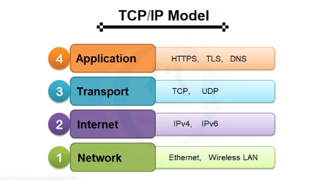
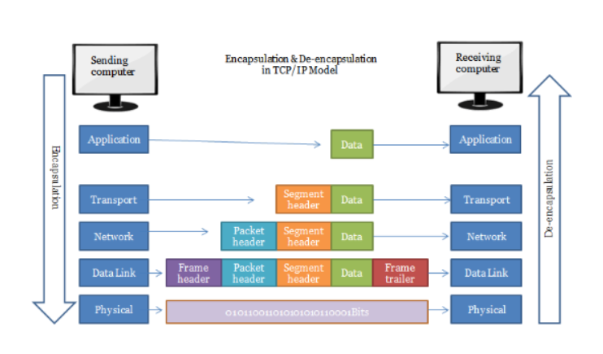
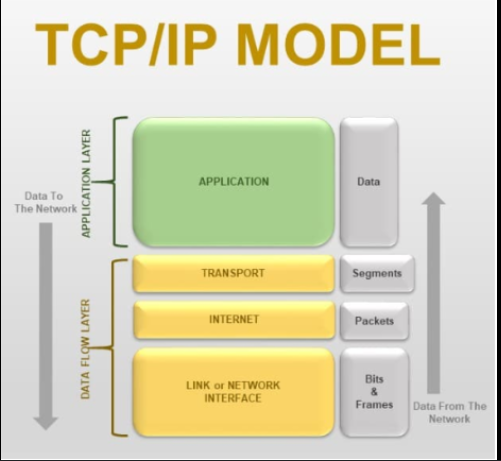
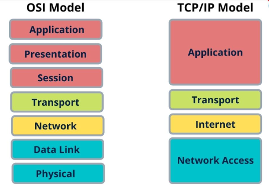
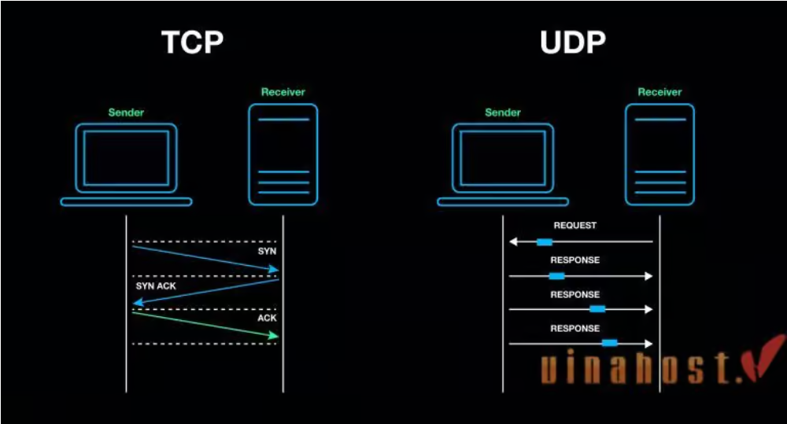

# TCP/IP docs

## TCP/IP là gì?

**Mô hình TCP/IP** (Transmission Control Protocol/Internet Protocol) là một mô hình mạng được thiết kế để mô tả cách các thiết bị giao tiếp trên mạng internet và các máy tính khác. Đây là mô hình chuẩn và phổ biến trong các hệ thống mạng hiện nay.

**Mô hình TCP/IP** được xây dựng dựa trên thực tế hoạt động của các giao thức, khác với mô hình OSI mang tính lý thuyết hơn.

**Cấu trúc:** Mô hình TCP/IP có 4 tầng chính, mỗi tầng đảm nhận một vai trò cụ thể trong quá trình truyền và nhận dữ liệu.

| Tầng (TCP/IP) | Vai trò | Tương ứng tầng OSI |
|-----------|-------------|---------|
| 1. Network Access (Liên kết mạng) | Xử lý giao tiếp vật lý và truyền dữ liệu qua phương tiện truyền dẫn. | Tầng 1 (Physical) + Tầng 2 (Data Link) |
| 2. Internet (Internet) | Định tuyến và truyền dữ liệu qua các mạng trung gian dựa trên địa chỉ IP. | Tầng 3 (Network) |
| Transport (Vận chuyển) | Đảm bảo truyền dữ liệu đáng tin cậy giữa hai thiết bị đầu cuối, quản lý phân đoạn dữ liệu. | Tầng 4 (Transport) |
| Application (Ứng dụng) | Cung cấp giao diện cho người dùng và ứng dụng để giao tiếp qua mạng. | Tầng 5 (Session) + Tầng 6 (Presentation) + Tầng 7 (Application) |

**Cách thức hoạt động**: TCP/IP áp dụng  mô hình giao tiếp client-server, trong đó máy khách (client) nhận các dịch vụ (như truy cập trang web) từ một máy chủ (server) trong mạng. TCP/IP là sự kết hợp của hai giao thức như tên gọi. Trong đó, IP chịu trách nhiệm chuyển các gói tin đến địa chỉ đã được xác định. Quy trình hoạt động của IP là thêm các thông tin chỉ đường vào các gói tin để chúng đến được đích quy định. TCP kiểm tra và đảm bảo an toàn cho từng gói tin khi chúng đi qua mỗi trạm. Khi TCP nhận thấy gói tin bị lỗi trong quá trình truyền vận, một tín hiệu sẽ được phát ra và yêu cầu hệ thống máy chủ gửi lại một gói tin khác.

## Các layers của TCP/IP

### 1. Tầng Application (Ứng dụng)

**Khái niệm:** là nơi các ứng dụng và người dùng tương tác trực tiếp với hệ thống mạng. Tầng này cung cấp các giao thức hỗ trợ việc trao đổi dữ liệu giữa ứng dụng và mạng.

**Đặc điểm:**

- Kết hợp chức năng của 3 tầng trong mô hình OSI: Application, Presentation, và Session.
- Không quan tâm đến cách dữ liệu được truyền tải mà chỉ tập trung vào giao tiếp giữa ứng dụng.

**Chức năng:**

- Định dạng dữ liệu từ ứng dụng phù hợp với giao thức sử dụng, Tạo các yêu cầu hoặc phản hồi theo định dạng của giao thức.
- Chọn giao thức thích hợp để truyền dữ liệu dựa trên yêu cầu của người dùng hoặc ứng dụng.
- Cung cấp các dịch vụ như duyệt web, gửi email, truyền file, phân giải tên miền, kết nối từ xa, v.v.
- Gửi dữ liệu đã chuẩn bị xuống tầng Transport để xử lý và truyền đi qua mạng.

**Ví dụ giao thức:**

- *HTTP/HTTPS:* Truy cập web.
- *SMTP/POP3/IMAP:* Gửi và nhận email.
- *FTP:* Truyền tệp tin.
- *DNS:* Chuyển đổi tên miền thành địa chỉ IP.

### 2. Tầng Transport (Vận chuyển)

**Khái niệm:** Tầng Transport chịu trách nhiệm quản lý luồng dữ liệu giữa hai thiết bị đầu cuối, đảm bảo truyền dữ liệu đáng tin cậy.

**Đặc điểm:**

- Chia nhỏ dữ liệu thành các phân đoạn (segments) để gửi đi.
- Sử dụng các cơ chế kiểm soát lỗi, kiểm soát lưu lượng, và sắp xếp thứ tự dữ liệu.
- Gồm 2 giao thức cốt lõi là TCP và UDP. Trong đó, TCP đảm bảo chất lượng gói tin nhưng tiêu tốn thời gian khá lâu để kiểm tra đầy đủ thông tin từ thứ tự dữ liệu cho đến việc kiểm soát vấn đề tắc nghẽn lưu lượng dữ liệu. Ngược lại, UDP có tốc độ truyền tải nhanh hơn những lại không đảm bảo được chất lượng dữ liệu được gửi đi.

**Chức năng:**

- Phân mảnh dữ liệu: Chia nhỏ dữ liệu tầng Application thành các phân đoạn (segments) để truyền qua mạng và tái hợp thành dữ liệu gốc khi đến đích.
- Truyền tải đáng tin cậy: Sử dụng TCP để đảm bảo dữ liệu đầy đủ, đúng thứ tự.
- Truyền tải nhanh chóng: Sử dụng UDP cho các ứng dụng yêu cầu tốc độ cao và độ trễ thấp.
- Kiểm soát lưu lượng: Điều chỉnh tốc độ truyền dữ liệu để tránh tắc nghẽn.

**Ví dụ giao thức:**

- *TCP:* Duyệt web (HTTP/HTTPS), gửi email (SMTP), tải tệp (FTP).
- *UDP:* Streaming video, VoIP, DNS.

### 3. Tầng Internet

**Khái niệm:** Tầng Internet chịu trách nhiệm định tuyến dữ liệu qua nhiều mạng để đến đích cuối cùng.

**Đặc điểm:**

- Chỉ tập trung vào việc đưa gói tin đến đúng địa chỉ IP.
- Không đảm bảo tính tin cậy của dữ liệu (Không kiểm tra lỗi hoặc thứ tự).

**Chức năng**:

- Định tuyến: Tìm đường đi tối ưu qua mạng để dữ liệu đến đích.
- Địa chỉ hóa: Sử dụng địa chỉ IP để xác định nguồn và đích.
- Phân mảnh: Chia gói tin lớn thành các gói nhỏ phù hợp với kích thước mạng trung gian.

**Ví dụ giao thức:**

- *IP (Internet Protocol):* Giao thức chính, đảm bảo truyền gói tin đến đúng địa chỉ IP.
- *ICMP:* Phát hiện lỗi và báo cáo sự cố (dụng trong lệnh ping).
- *ARP:* Chuyển đổi địa chỉ IP thành địa chỉ MAC.
- *RARP:* Chuyển đổi địa chỉ MAC thành địa chỉ IP.

### 4. Tầng Network Access (Liên kết mạng)

**Khái niệm:** Tầng Network Access là tầng thấp nhất trong mô hình TCP/IP, chịu trách nhiệm truyền dữ liệu qua phương tiện truyền dẫn vật lý.

**Đặc điểm:**

- Kết hợp chức năng của tầng Physical và Data Link trong mô hình OSI.
- Phụ thuộc vào loại mạng cụ thể (Ethernet, Wifi, cáp quang, v.v.).

**Chức năng:**

- Truyền dữ liệu: Chuyển đổi dữ liệu thành tín hiệu vật lý(điện, quang, hoặc vô tuyến) để truyền đi.
- Địa chỉ hóa vật lý: Sử dụng địa chỉ MAC để định danh thiết bị trên mạng cục bộ.
- Phát hiện và sửa lỗi: Kiểm tra lỗi trong quá trình truyền dữ liệu qua mạng vật lý.

**Ví dụ giao thức và công nghệ:** Ethernet, Wifi(802.11), PPP, Token Ring.

## Ưu/Nhược điểm của TCP/IP

`Ưu điểm`

- Kết nối giữa các loại máy tính khác nhau.
- Hoạt động mà không phụ thuộc vào hệ điều hành.
- Hỗ trợ nhiều giao thức định tuyến.
- Kiến trúc client-server, khả năng mở rộng cao.
- Có thể hoạt động độc lập.
- Hỗ trợ nhiều giao thức định tuyến.
- Nhẹ, không gây nhiêu áp lực với máy tính hay mạng.

`Nhược điểm`

- Việc cài đặt phức tạp.
- Tầng transport không đảm bảo đối với việc phân phối các gói tin.
- Các giao thức trong TCP/IP không dễ để có thể thay thế.
- Không tách biệt rõ ràng đối với các khái niệm về dịch vụ, giao diện và giao thức.
- Dễ bị tấn công SYN - tấn công từ chối dịch vụ.

## So sánh mô hình TCP/IP với mô hình OSI

`Điểm giống`

- Đều là mô hình tham chiếu được thiết kế để mô tả cách truyền dữ liệu qua mạng.
- Đều sử dụng kiến trúc phân tầng, mỗi tầng thực hiện các chức năng riêng biệt.
- Hỗ trợ giao thức ở các tầng tương ứng để đảm bảo việc truyền tải dữ liệu.
- Dựa trên nguyên tắc *end-to-end communication* để truyền tải dữ liệu giữa 2 thiết bị đầu cuối.

`Điểm khác`

| | Mô hình TCP/IP | Mô hình OSI |
|-----------|-------------|---------|
| Đv nghiên cứu và phát triển | ARPANET | ISO  |
| Số tầng | 4 tầng | 7 tầng |
| Thiết kế | Các giao thức được thiết kế sau đó phát triển mô hình | Phát triển mô hình trước sau đó sẽ phát triển giao thức |
| Phương pháp tiếp cận | Tiếp cận theo chiều ngang | Tiếp cận theo chiều dọc |
| Tính phụ thuộc | Phụ thuộc vào giao thức | Giao thức độc lập |
| truyền thông | Hỗ trợ truyền thông không kết nối từ hạ tầng mạng | Hỗ trợ cả kết nối định tuyến và không dây |
| Phổ biến | Được nhiều người sử dụng | Ít được sử dụng hơn |
| Cách giao tiếp ở các tầng | Kết hợp để thực hiện nhiệm vụ | Mỗi tầng 1 nhiệm vụ riêng biệt |

## Workflow của mô hình TCP/IP

### A (Gửi dữ liệu)

- Tầng Application: Chuẩn bị dữ liệu và chọn giao thức ứng dụng (HTTP, SMTP).
- Tầng Transport: Phân chia dữ liệu, chọn giao thức (TCP/UDP).
- Tầng Internet: Gắn địa chỉ IP, định tuyến dữ liệu.
- Tầng Network Access: Truyền dữ liệu qua mạng vật lý.

### B (Nhận dữ liệu)

- Tầng Network Access: Nhận frame từ mạng.
- Tầng Internet: Kiểm tra IP, định tuyến đến tầng trên.
- Tầng Transport: Kiểm tra lỗi, kết hợp dữ liệu.
- Tầng Application: Hiển thị dữ liệu cho người dùng.

## Giao thức TCP và UDP

### 1. TCP (Transmission Control Protocol)

**Kết nối ba bước (3-way handshake):** Thiết lập kết nối trước khi truyền dữ liệu bằng ba bước: SYN -> SYN-ACK -> ACK.

**Đảm bảo dữ liệu:**

- Cơ chế xác nhận (ACK): Mỗi gói tin sẽ nhận từ thiết bị nhận.
- Tự động phát hiện và gửi lại gói tin nếu phát hiện mất dữ liệu.

**Ứng dụng:** sử dụng trong các tình huống cần truyền tải chính xác dữ liệu, chẳng hạn: tải file, duyệt web, gửi email.

### 2. UDP (User Datagram Protocol)

**Không cần thiết lập kết nối:** Gửi dữ liệu trực tiếp mà không cần bước thiết lập ban đầu, giúp tiết kiệm thời gian và tăng tốc độ.

**Không đảm bảo dữ liệu:**

- Không có cơ chế phát hiện mất dữ liệu hoặc gửi lại gói tin.
- Gói tin có thể đến đích không đúng thứ tự hoặc bị mất mà không thông báo.

**Ứng dụng:** Sử dụng trong các tình huống ưu tiên tốc độ hơn độ tin cậy, chẳng hạn: truyền video trực tuyến, gọi VoIP, game online.

### 3. Khác nhau giữa giao thức TCP và UDP

| Tiêu chí | TCP | UDP |
|-----------|-------------|---------|
| Kêt nối | Hướng kết nối (Connection-oriented): Cần thiết lập kết nối trước khi truyền dữ liệu (3-way handshake). | Không hướng kết nối (Connectionless): Không cần thiết lập kết nối trước khi truyền dữ liệu |
| Độ tin cậy | Đáng tin cậy: Đảm bảo dữ liệu được gửi đầy đủ và đúng thứ tự, có cơ chế phát hiện và gửi lại dữ liệu bị mất | Không đáng tin cậy: Không đảm bảo dữ liệu đến đúng thứ tự hoặc đầy đủ |
| Kiểm soát luồng | Có kiểm soát luồng và tắc nghẽn để điều chỉnh tốc độ truyền dữ liệu giữa các thiết bị | Không có cơ chế kiểm soát luồng |
| Phân đoạn và ghép nối | Dữ liệu được phân đoạn (segmentation) và ghép nối (reassembly) theo thứ tự | Không có cơ chế ghép nối, dữ liệu được gửi đi dưới dạng các gói riêng lẻ |
| Hiệu suất | Tốc độ chậm hơn do phải thực hiện các kiểm tra, xác nhận và cơ chế đảm bảo. | Tốc độ nhanh hơn do không có các bước kiểm tra, xác nhận |
| Header | Lớn hơn (20-60 byte) | Nhỏ hơn (8 byte) |
