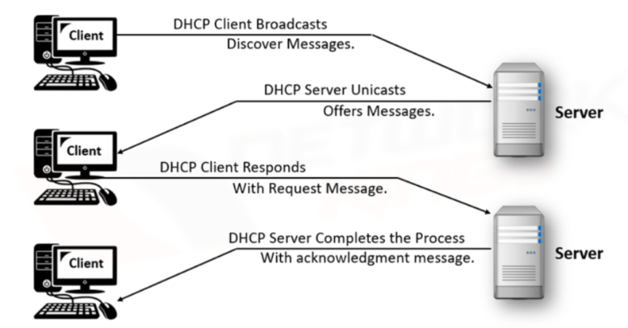
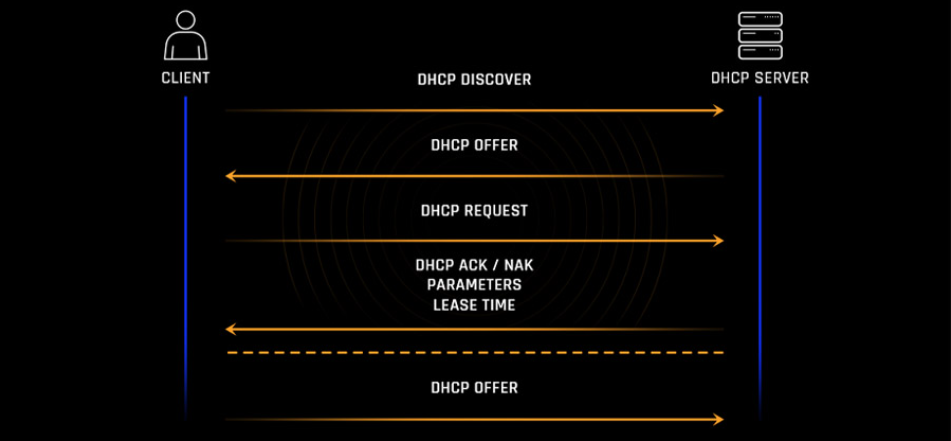

# Tìm hiểu về DHCP

## DHCP là gì?

### 1. Khái niệm DHCP

**DHCP (Dynamic Host Configuration Protocol)** là một giao thức mạng cho phép tự động cấp phát địa chỉ IP và các thông số mạng khác (như subnet mask, default gateway, DNS server...) cho các thiết bị trong mạng một cách tự động thay vì cấu hình thủ công.

### 2. DHCP để làm gì?

- **Tự động gán IP** cho thiết bị khi thiết bị kết nối vào mạng.
- **Tránh xung đột IP**, vì DHCP server quản lý các địa chỉ IP đã cấp.
- **Quản lý địa chỉ IP tập trung:** Cho phép quản trị viên mạng dễ dàng theo dõi và quản lý việc sử dụng địa chỉ IP trong toàn bộ mạng.
- **Linh hoạt và dễ dàng thay đổi cấu hình:** Khi có sự thay đổi về cấu trúc mạng hoặc các thông số cấu hình, chỉ cần thực hiện thay đổi trên máy chủ DHCP, các thiết bị sẽ tự động nhận cấu hình mới khi chúng kết nối lại mạng.

## Kiến trúc của DHCP

### 1. DHCP Server

DHCP Server là máy chủ hoặc thiết bị chịu trách nhiệm cấp phát địa chỉ IP và thông số mạng cho các DHCP Client. Nó lưu trữ một dải địa chỉ IP để phân phối, đồng thời quản lý thông tin thuê địa chỉ IP (DHCP Lease). Ngoài ra, DHCP Server cung cấp các thông tin mạng quan trọng như Subnet Mask, Gateway, và DNS Server, đảm bảo các thiết bị trong mạng có thể kết nối và giao tiếp một cách hiệu quả.

### 2. DHCP Client

DHCP Client là thiết bị yêu cầu và nhận thông tin cấu hình mạng từ DHCP Server. Các thiết bị như máy tính, điện thoại, hoặc máy in đóng vai trò làm DHCP Client khi cần kết nối mạng. Chúng gửi yêu cầu để nhận địa chỉ IP và các thông số mạng như Subnet Mask, Gateway, và DNS Server. Sau khi nhận được thông tin từ DHCP Server, DHCP Client sử dụng các thông số này để kết nối và giao tiếp trong mạng.

### 3. DHCP relay agents

DHCP Relay Agents là các thiết bị trung gian, đảm nhiệm vai trò chuyển tiếp gói tin DHCP giữa Client và Server khi chúng không nằm trong cùng một mạng (khác Subnet). Relay Agent nhận các gói tin từ DHCP Client trong mạng con và chuyển tiếp chúng đến DHCP Server. Sau khi Server phản hồi, Relay Agent gửi lại thông tin cho Client. Thành phần này rất hữu ích trong các hệ thống mạng lớn, nơi DHCP Server không được triển khai trong từng mạng con.

Hoạt động:

- Lắng nghe các gói tin DHCP broadcast từ client trong subnet của nó.
- Thêm thông tin về subnet của client vào gói tin.
- Chuyển tiếp các gói tin DHCP (Discover, Request) dưới dạng unicast đến DHCP server.
- Chuyển tiếp các gói tin phản hồi từ DHCP server (Offer, ACK) dưới dạng broadcast đến subnet của client.

### 4. DHCP Lease

DHCP Lease là khoảng thời gian mà DHCP Server cấp phát địa chỉ IP cho một thiết bị cụ thể. Thời gian thuê này được quản lý để tối ưu hóa việc sử dụng tài nguyên địa chỉ IP trong mạng. Khi thời gian thuê sắp hết, DHCP Client có thể yêu cầu gia hạn để tiếp tục sử dụng địa chỉ IP đó. Nếu không có yêu cầu gia hạn, địa chỉ IP sẽ được giải phóng và tái sử dụng cho thiết bị khác, giúp đảm bảo việc quản lý IP hiệu quả.

### 5. DHCP Binding

DHCP Binding là bản ghi lưu trữ trong DHCP Server, chứa thông tin ánh xạ giữa địa chỉ IP được cấp và địa chỉ MAC của thiết bị nhận. Đây là cơ chế giúp DHCP Server ghi lại các thông tin cấp phát, đảm bảo tính nhất quán và minh bạch trong quản lý mạng. Ngoài ra, DHCP Binding cũng hỗ trợ cấp phát địa chỉ IP cố định (Reservation) dựa trên địa chỉ MAC của thiết bị, rất hữu ích cho các thiết bị cần sử dụng một IP cụ thể, chẳng hạn như máy in hoặc máy chủ trong mạng.

## Cách hoạt động của DHCP

### Bước 1: Discovery (Tìm kiếm máy chủ DHCP)

Khi một thiết bị (Client) kết nối vào mạng lần đầu, nó không có địa chỉ IP. Client sẽ gửi một gói tin DHCPDISCOVER dưới dạng broadcast (phát tán toàn mạng) để tìm kiếm DHCP Server. Gói tin này chứa:

- **Địa chỉ nguồn (Source Address)** là `0.0.0.0`.
- **Địa chỉ đích (Destination Address)** là `255.255.255.255`.

Mục đích là để thông báo cho tất cả các thiết bị trong mạng rằng nó cần một địa chỉ IP.

### Bước 2: Offer (Đề nghị cấp phát địa chỉ IP)

Khi DHCP Server nhận được gói DHCPDISCOVER, nó sẽ phản hồi bằng một gói tin DHCPOFFER. Gói tin DHCPOFFER được gửi đến địa chỉ MAC của Client. Gói tin này bao gồm:

- Địa chỉ IP tạm thời được đề nghị cho Client.
- Thông tin mạng như Subnet Mask, Default Gateway, DNS Server, và thời gian thuê địa chỉ IP (Lease Time).

### Bước 3: Request (Yêu cầu sử dụng địa chỉ IP)

Sau khi nhận được gói tin DHCPOFFER, Client sẽ gửi một gói tin DHCPREQUEST để chấp nhận địa chỉ IP mà DHCP Server đề nghị. Gói tin này xác nhận rằng Client muốn sử dụng địa chỉ IP được cấp. Đồng thời, Client cũng gửi yêu cầu xác nhận các thông tin khác như Subnet Mask, Gateway, DNS.

### Bước 4: Acknowledgement (Xác nhận)

DHCP Server gửi gói tin DHCPACK để xác nhận rằng địa chỉ IP đã được cấp phát thành công cho Client. Gói tin này cũng bao gồm thời gian thuê địa chỉ IP (Lease Time) và các thông tin cấu hình mạng. Sau khi nhận được DHCPACK, Client cấu hình địa chỉ IP trên giao diện mạng của nó và bắt đầu sử dụng.

## Các thông điệp của giao thức DHCP

### 1. DHCP Discover

- **Mục đích:** Đây là thông điệp đầu tiên được gửi bởi một DHCP client khi nó khởi động hoặc kết nối vào mạng và chưa có địa chỉ IP. Mục đích là để tìm kiếm các máy chủ DHCP có sẵn trên mạng.
- **Nguồn:** DHCP client (địa chỉ IP nguồn là 0.0.0.0).
- **Đích:** Địa chỉ broadcast (255.255.255.255) hoặc địa chỉ broadcast của subnet.

### 2. DHCP Offer

- **Mục đích:** Thông điệp này được gửi bởi DHCP server để phản hồi lại gói tin DHCP Discover từ client. Nó chứa một địa chỉ IP mà server sẵn sàng cấp phát, cùng với các thông số cấu hình mạng khác (subnet mask, default gateway, DNS server) và thời gian thuê (lease time).
- **Nguồn:** DHCP server (địa chỉ IP của server).
- **Đích:** Địa chỉ broadcast (255.255.255.255) hoặc địa chỉ broadcast của subnet.

### 3. DHCP Request

- **Mục đích:** Thông điệp này được gửi bởi DHCP client trong hai trường hợp chính:
  - **Chấp nhận Offer:** Sau khi nhận được một hoặc nhiều gói tin DHCP Offer, client sẽ chọn một (thường là gói đầu tiên) và gửi DHCP Request để thông báo cho server đã chọn biết rằng nó chấp nhận địa chỉ IP và các thông số cấu hình đã được đề nghị.
  - **Gia hạn Lease:** Khi còn một nửa thời gian thuê, client sẽ gửi DHCP Request trực tiếp đến server đã cấp phát địa chỉ IP để yêu cầu gia hạn.
- **Nguồn:** DHCP client (địa chỉ IP nguồn có thể là 0.0.0.0 nếu là yêu cầu sau Discover, hoặc địa chỉ IP đã được cấp phát nếu là yêu cầu gia hạn).
- **Đích:** Địa chỉ broadcast (255.255.255.255) hoặc địa chỉ unicast đến DHCP server (nếu là yêu cầu gia hạn).

### 4. DHCP Acknowledge (DHCP ACK)

- **Mục đích:** Thông điệp này được gửi bởi DHCP server để xác nhận rằng địa chỉ IP và các thông số cấu hình đã được cấp phát (hoặc gia hạn) thành công cho client.
- **Nguồn:** DHCP server (địa chỉ IP của server).
- **Đích:** Địa chỉ unicast đến DHCP client.

### 5. DHCP Negative Acknowledge (DHCP NAK)

- **Mục đích:** Thông điệp này được gửi bởi DHCP server để thông báo cho client rằng yêu cầu của nó không được chấp nhận. Điều này có thể xảy ra nếu địa chỉ IP mà client yêu cầu không còn hợp lệ (ví dụ: đã được cấp phát cho máy khác) hoặc nếu có lỗi trong quá trình gia hạn. Client sẽ yêu cầu lại IP mới.
- **Nguồn:** DHCP server (địa chỉ IP của server).
- **Đích:** Địa chỉ unicast đến DHCP client.

### 6. DHCP Release – Giải phóng IP

- **Mục đích:** Thông điệp này được gửi bởi DHCP client để thông báo cho server biết rằng nó không còn sử dụng địa chỉ IP đã được cấp phát nữa. Điều này thường xảy ra khi client tắt máy hoặc ngắt kết nối mạng.
- **Nguồn:** DHCP client (địa chỉ IP đã được cấp phát).
- **Đích:** Địa chỉ unicast đến DHCP server.

### 7. DHCP Inform

- **Mục đích:** Thông điệp này được gửi bởi DHCP client để yêu cầu thêm các thông số cấu hình mạng từ server mà không cần cấp phát địa chỉ IP mới. Client có thể đã được cấu hình địa chỉ IP tĩnh hoặc nhận địa chỉ IP theo cách khác.
- **Nguồn:** DHCP client (địa chỉ IP đã được cấu hình).
- **Đích:** Địa chỉ unicast đến DHCP server.

## Ưu/Nhược điểm DHCP

### 1. Ưu điểm

- Tạo sự nhanh chóng trong kết nối mạng cho các thiết bị như máy tính, laptop, điện thoại, máy tính bảng…
- Quản lý địa chỉ IP một cách hiệu quả, tránh trường hợp trùng lặp địa chỉ IP trên nhiều thiết bị, đồng thời cung cấp cấu hình tự động cho mọi thiết bị kết nối mạng.
- Quản lý các tham số **TCP/IP** qua các trạm và IP dễ dàng.
- Cho phép nhà quản trị mạng thay đổi cấu hình và thông số IP để nâng cấp cơ sở hạ tầng mạng.
- Thiết bị có thể di chuyển tự do từ một mạng này sang mạng khác và tự động nhận địa chỉ IP mới.

### 2. Nhược điểm

- IP động của Dynamic Host Configuration Protocol không phù hợp với các thiết bị cố định và cần duy trì kết nối liên tục như máy in, máy chủ tập tin (file server).
- Giao thức này thường chỉ được sử dụng trong các hộ gia đình hoặc mô hình mạng nhỏ.
