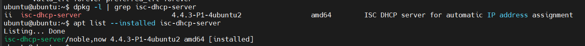
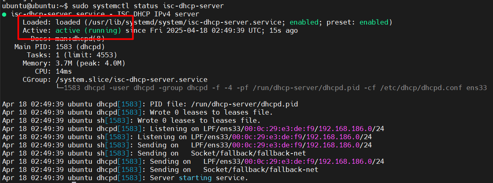
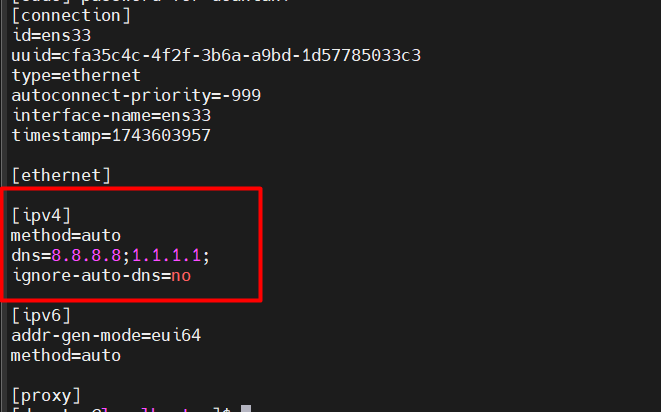
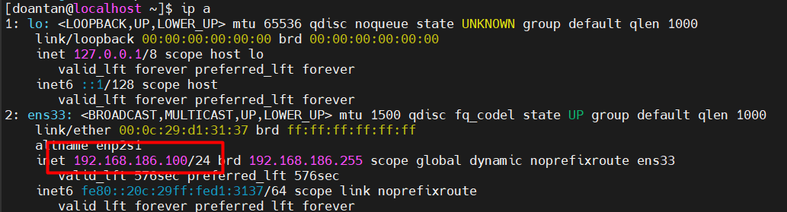
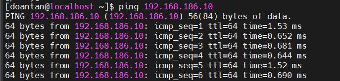
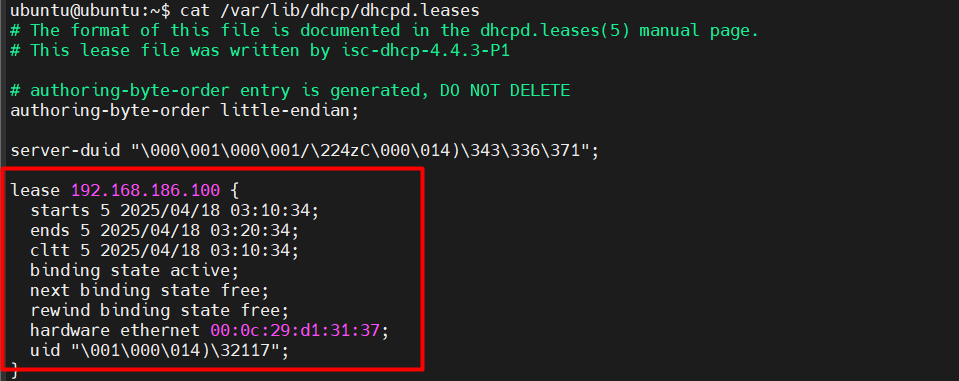

# Lab DHCP

## Vai trò

- **Ubuntu:** DHCP server
- **CentOS:** DHCP client

## Cấu hình

### Bước 1: Cài đặt DHCP Server trên Ubuntu

Cập nhật và cài gói DHCP:

```plaintext
sudo apt update
sudo apt install isc-dhcp-server -y
```

- `isc-dhcp-server`: gói phần mềm máy chủ DHCP của ISC.

Kiểm tra interface mạng:

```plaintext
ip a
```

- Nếu thấy interface là `ens33` hoặc `enp03` (tùy môi trường).

Hoặc kiểm tra với câu lệnh:

```plaintext
apt list --installed isc-dhcp-server

hoặc

dpkg -l | grep isc-dhcp-server
```

Kết quả thành công:



### Bước 2: Đặt IP tĩnh cho ubuntu

Sửa file netplan:

```plaintext
sudo vim /etc/netplan/50-cloud-init.yaml
```

Sửa thành:

```plaintext
network:
  version: 2
  ethernets:
    ens33:
      addresses:
        - 192.168.186.10/24
      routes:
        - to: 0.0.0.0/0
          via: 192.168.186.1
      nameservers:
        addresses: [8.8.8.8, 1.1.1.1]
      dhcp4: false
```

Áp dụng:

```plaintext
sudo netplan apply
```

### Bước 3: Cấu hình DHCP Server trên ubuntu

Sửa file cấu hình `/etc/dhcp/dhcpd.conf`:

```plaintext
sudo vim /etc/dhcp/dhcpd.conf
```

Thêm cấu hình sau:

```plaintext
default-lease-time 600;
max-lease-time 7200;
authoritative;

subnet 192.168.186.0 netmask 255.255.255.0 {
  range 192.168.186.100 192.168.186.150;
  option routers 192.168.186.1;
  option subnet-mask 255.255.255.0;
  option domain-name-servers 8.8.8.8, 1.1.1.1;
}
```

- `default-lease-time 600`: Thiết lập thời gian thuê mặc định (default lease time) cho các địa chỉ IP được cấp phát bởi DHCP server là 600 giây (10 phút).
- `max-lease-time 7200`: Thiết lập thời gian thuê tối đa mà DHCP server sẽ cấp phát cho một client là 7200 giây (2 giờ). Khi client yêu cầu thời gian thuê dài hơn, server sẽ không cấp phát quá thời gian này.
- `authoritative`: Khai báo rằng DHCP server này là có thẩm quyền (authoritative) cho các subnet được cấu hình trong file này. Server sẽ phản hồi các yêu cầu DHCP ngay cả khi nó không chắc chắn về cấu hình mạng.
- `subnet 192.168.186.0 netmask 255.255.255.0 { ... }`:
  - `subnet 192.168.186.0`: Xác định địa chỉ mạng của subnet là `192.168.186.0`.
  - `netmask 255.255.255.0`: Xác định subnet mask cho subnet này là `255.255.255.0`.
  - `range 192.168.186.100 192.168.186.150`: Dải địa chỉ DCP có thể cấp phát.
  - `option routers 192.168.186.1`: `192.168.186.1` là địa chỉ IP của router (cổng mặc định - default gateway) mà các client sẽ sử dụng để truy cập các mạng khác bên ngoài subnet này.
  - `option domain-name-servers 8.8.8.8, 1.1.1.1`: Thiết lập tùy chọn `domain-name-servers` cho các client trong subnet. Các client sẽ sử dụng các địa chỉ IP `8.8.8.8` (máy chủ DNS của Google) và `1.1.1.1` (máy chủ DNS của Cloudflare) này để phân giải tên miền thành địa chỉ IP.

Chỉ định interface để DHCP lắng nghe, sửa file:

```plaintext
sudo vim /etc/default/isc-dhcp-server
```

Tìm dòng:

```plaintext
INTERFACESv4=""
```

Thay bằng:

```plaintext
INTERFACESv4="ens33"  # Hoặc interface kiểm tra được ở bước trên
```

Khởi động DHCP Server:

```plaintext
sudo systemctl restart isc-dhcp-server
sudo systemctl status isc-dhcp-server
```

Kết quả DHCP đang chạy:



### Bước 3: Cấu hình CentOS làm DHCP Client

Kiểm tra interface mạng:

```plaintext
ip a
```

- Cấu hình thường là `ens33`, `eth0`, hoặc `enpXsY`.

### Bước 4: Cấu hình mạng trên centos dùng dhcp

Sửa file:

```plaintext
sudo vim /etc/NetworkManager/system-connections/ens33.nmconnection
```

Sửa thành:



Khởi động lại NetworkManager để áp dụng:

```plaintext
sudo systemctl restart NetworkManager
```

Kiểm tra IP:

```plaintext
ip a
```

Kết quả:



- `192.168.86.100` nằm trong dải địa chỉ mạng DHCP server cấp phát.

### Bước 5: Kiểm tra kết nối với DHCP server

```plaintext
ping 192.168.186.10    # IP máy Ubuntu DHCP Server
```

Ping thành công:



### Bước 6: Kiểm tra cấp phát trên DHCP server (ubuntu)

Sử dụng lệnh:

```plaintext
cat /var/lib/dhcp/dhcpd.leases
```



- IP: `192.168.186.100` đã được cấp.
- `starts`: Thời điểm bắt đầu lease – nghĩa là thời điểm client nhận được IP.
- `ends`: Thời điểm kết thúc lease – sau đó client cần gia hạn (renew) hoặc lấy IP mới.
- `cltt` (Client Last Transaction Time): Thời điểm cuối cùng client thực hiện giao dịch với DHCP server (giống starts nếu là lần đầu).
- `binding state active`:  Trạng thái binding hiện tại là active → IP này đang được sử dụng.
- `next binding state free`: Khi lease hết hạn, trạng thái tiếp theo sẽ là free → IP này sẽ sẵn sàng để cấp phát lại.
- `rewind binding state free`: Khi thực hiện "rewind" (quay lui cấu hình trước khi server restart), IP này cũng sẽ trở lại trạng thái free.
- `00:0c:29:d1:31:37`: Địa chỉ MAC address của client được cấp phát IP.
- `uid "\001\000\014)\32117"`: UID của client (Unique Identifier), thường được DHCP client tạo ra để phân biệt trong các môi trường không có MAC cố định (VD: DHCP relay, VPN...).
