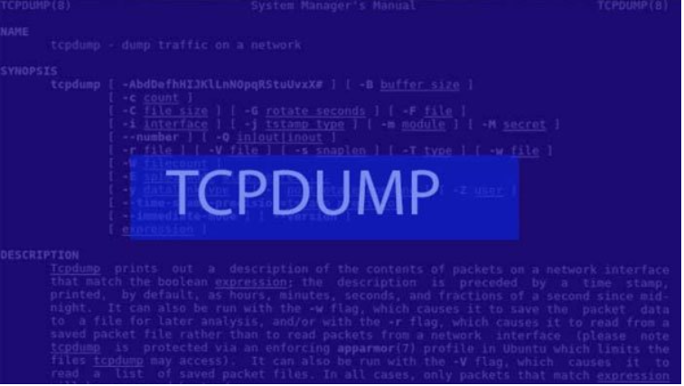
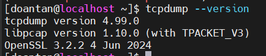
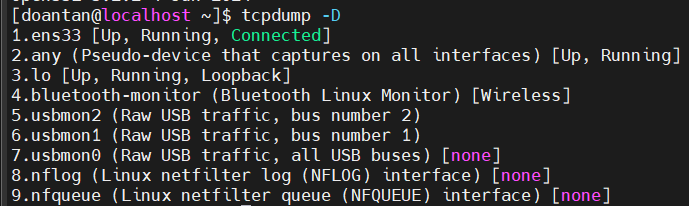
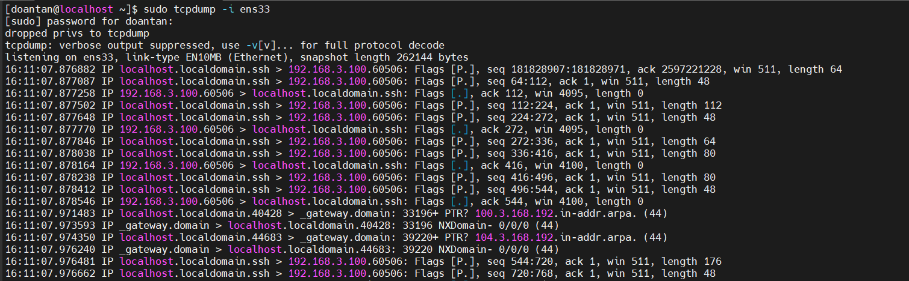
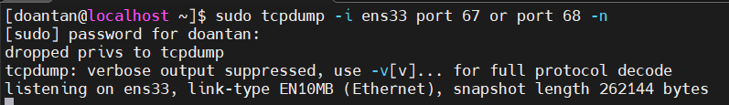

# TCPdump trên CentOS

## Tổng quan về TCPdump

### 1. TCPdump là gì?



**Tcpdump** là một công cụ phân tích gói tin (packet analyzer) mạng dựa trên dòng lệnh (command-line). Nó là một trong những công cụ phổ biến nhất và mạnh mẽ nhất để theo dõi và ghi lại lưu lượng mạng trên các hệ thống giống Unix (như Linux, macOS, BSD).

### 2. TCPdump tồn tại ở hình thức nào?

Để lựa chọn gói tin phù hợp với biểu thức logic mà khách hàng nhập vào, tcmpdump sẽ xuất ra màn hình một gói tin chạy trên card mạng mà máy chủ đang lắng nghe.

Tùy vào các lựa chọn khác nhau khách hàng có thể xuất mô tả này ra một gói tin thành một file “pcap” để phân tích và có thể đọc nội dung “pcap” đó với option - r của lệnh tcpdump, hoặc sử dụng các phần mềm khác như là: Wireshark.

Đối với những trường hợp không có tùy chọn, lệnh tcpdump sẽ được chạy cho đến khi nhận được một tín hiệu ngắt từ khách hàng. Sau khi kết thúc việc bắt các gói tin, tcmpdump sẽ báo cáo các cột sau:

- **Packet capture:** số lượng gói tin bắt được và xử lý.
- **Packet received by filter:** số lượng gói tin được nhận bởi bộ lọc.
- **Packet dropped by kernel:** số lượng packet đã bị dropped bởi cơ chế bắt gói tin của hệ điều hành.

### 3. Định dạng chung của một dòng giao thức TCPdump

Định dạng chung của một dòng giao thức tcmpdump cụ thể là:

```plaintext
time-stamp src > dst:  flags  data-seqno  ack  window urgent options
```

- **Time-stamp**: hiển thị thời gian gói tin được capture.
- **Src và dst**: hiển thị địa IP của người gửi và người nhận.

- **Cờ Flags sẽ bao gồm các giá trị cơ bản đó là:**
  - `S (SYN)`: Được sử dụng trong quá trình bắt tay của giao thức TCP.
  - `.(ACK)`: Được sử dụng để thông báo cho bên gửi biết là gói tin đã nhận được dữ liệu thành công.
  - `F(FIN)`: Được sử dụng để đóng kết nối TCP.
  - `P(PUSH)`: Thường được đặt ở cuối để đánh dấu việc truyền dữ liệu.
  - `R(RST)`: Được sử dụng khi muốn thiết lập lại đường truyền.
  - `Data-sqeno`: Số sequence number của gói dữ liệu hiện tại.
  - `ACK`: Mô tả số sequence number tiếp theo được truyền đến của gói tin mà bên gửi mong muốn nhận được.
  - `Window`: Đây là vùng nhớ đệm có sẵn trên kết nối theo một hướng khác.
  - `Urgent`: Giá trị này cho người dùng biết được các gói dữ liệu khẩn cấp có trong gói tin.

## Cài đặt và sử dụng TCPdump

### Cài đặt TCPdump

Cài đặt tcpdump với câu lệnh:

```plaintext
sudo dnf install tcpdump -y
```

Kiểm tra phiên bản:

```plaintext
tcpdump -version
```



Kiểm tra danh sách giao diện mạng:

```plaintext
ip a
```

- Trước khi dùng **TCPdump**, cần biết tên interface (ví dụ `ens33` hoặc `eth0`, `enp0s3`, ...)

Hoặc

```plaintext
tcpdump -D
```

- Sẽ liệt kê các interface mà **TCPdump** có thể sử dụng.



### Sử dụng TCPdump

**Bắt tất cả các gói tin trên interface ens33:**

```plaintext
sudo tcpdump -i ens33
```

- Bấm `Ctrl+C` để dừng.



**Bắt gói tin DHCP (cổng 67 và 68):**

```plaintext
sudo tcpdump -i ens33 port 67 or port 68 -n
```

- Rất hữu ích khi kiểm tra quá trình cấp phát IP từ DHCP server.
- `-n`: Flag này yêu cầu **tcpdump** không thực hiện việc phân giải tên (name resolution).



**Bắt gói tin đến/đi từ một IP cụ thể:**

```plaintext
sudo tcpdump -i ens33 host 192.168.3.104
```

**Bắt gói tin giao thức cụ thể (VD: ICMP - ping):**

```plaintext
sudo tcpdump -i ens33 icmp
```

**Lưu lại gói tin để xem bằng Wireshark sau này:**

```plaintext
sudo tcpdump -i ens33 -w dhcp_traffic.pcap
```

- Dùng lệnh Ctrl + C để dừng ghi, và mở file .pcap đó bằng Wireshark trên máy thật.

## Tổng hợp một số lệnh

### 1. Cơ bản

| Lệnh | Mô tả |
|-----------|-------------|
| `sudo tcpdump -i ens33` | Bắt gói tin trên interface `ens33` |
| `sudo tcpdump -i any` | Bắt trên tất cả interface cùng lúc |
| `sudo tcpdump -c 10` | Bắt đúng 10 gói tin rồi dừng |
| `sudo tcpdump -nn` | Không resolve IP và port (hiển thị số IP và port rõ ràng) |

### 2. Bắt gói giao thức cụ thể

| Lệnh | Giao thức |
|-----------|-------------|
| `sudo tcpdump icmp` | **Ping (ICMP)** |
| `sudo tcpdump port 80` | **HTTP (port 80)** |
| `sudo tcpdump port 53` | **DNS (port 53)** |
| `sudo tcpdump port 67 or port 68` | **DHCP (port 67, 68)** |

### 3. Bắt gói theo IP

| Lệnh | Mô tả |
|-----------|-------------|
| `sudo tcpdump host 192.168.3.100` | Gói từ / đến IP này |
| `sudo tcpdump src host 192.168.3.100` | Gói có nguồn là IP này |
| `sudo tcpdump dst host 192.168.3.100` | Gói có đích là IP này |

### 4. Bắt theo port

| Lệnh | Mô tả |
|-----------|-------------|
| `sudo tcpdump port 22` | Gói liên quan SSH |
| `sudo tcpdump tcp port 80` | Gói TCP cổng 80 (HTTP) |

### 5. Bắt gói theo giao thức TCP/UDP

| Lệnh | Mô tả |
|-----------|-------------|
| `sudo tcpdump tcp` | Chỉ gói TCP |
| `sudo tcpdump udp` | Chỉ gói UDP |

### 6. Ghi vào file để xem sau bằng wireshark

`sudo tcpdump -i ens33 -w output.pcap`

- Ghi toàn bộ lưu lượng vào file `output.pcap`.
- Mở file bằng **Wireshark** trên máy **Windows**

### 7. Đọc lại file pcap

`tcpdump -r output.pcap`: Đọc file `.pcap` đã lưu (không cần `sudo`)

### 8. Kết hợp bộ lọc nâng cao

```plaintext
sudo tcpdump -i ens33 'tcp and port 80 and src host 192.168.3.10'
```

- Chỉ bắt các gói **TCP** có `port 80` từ IP `192.168.3.10`.
