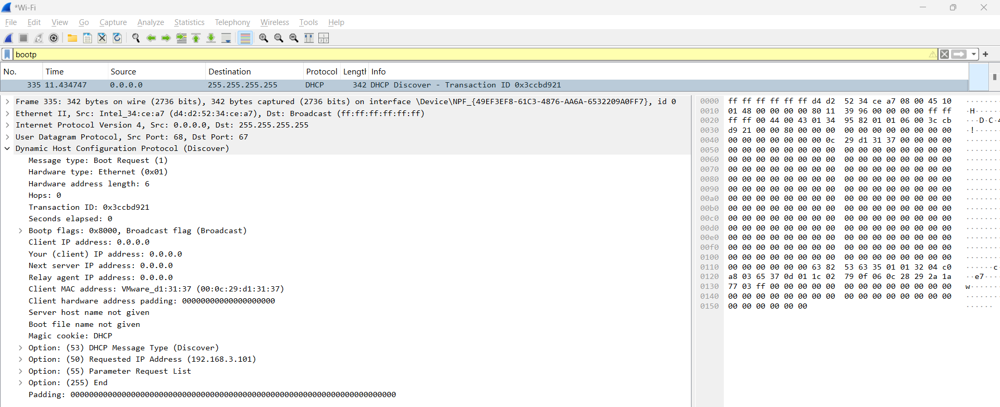
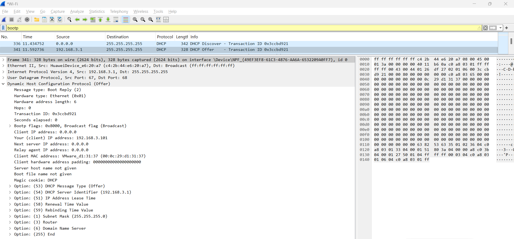
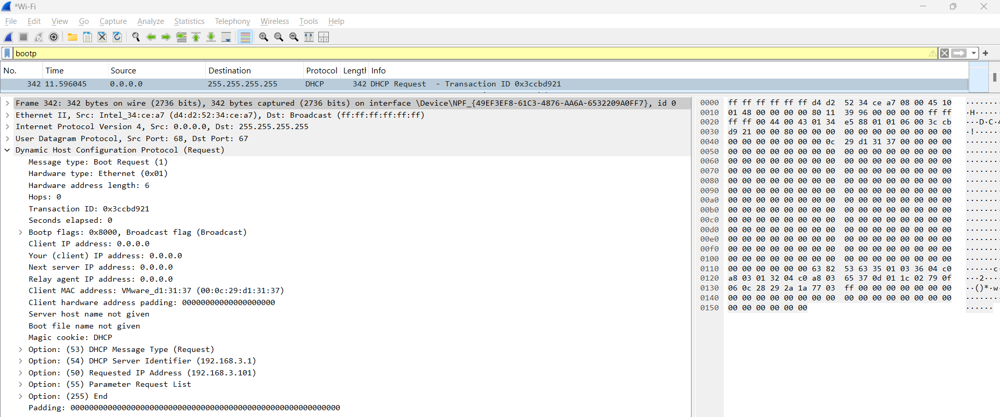
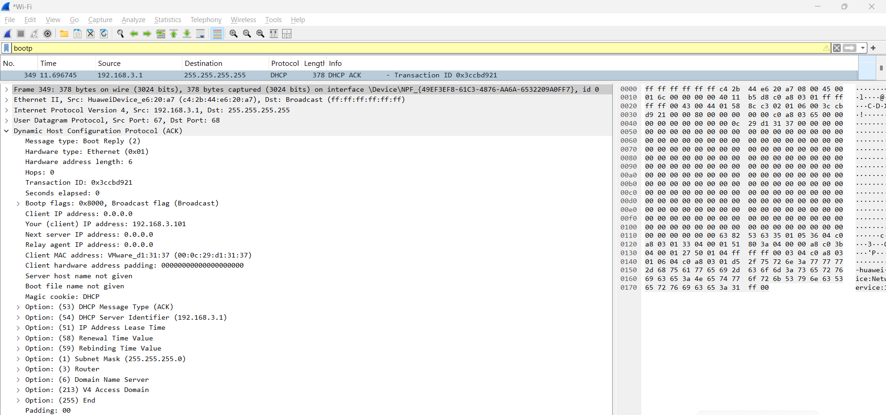
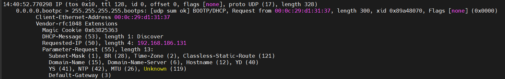
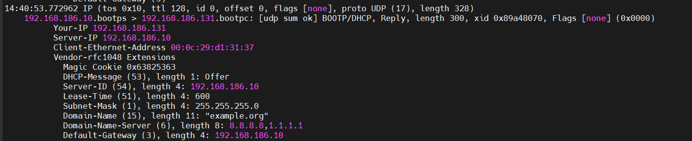
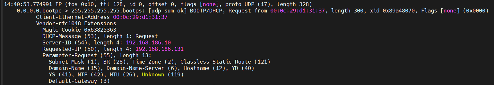
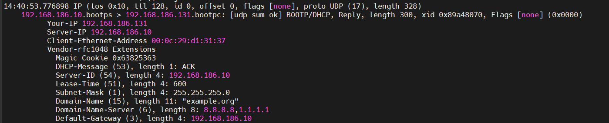

# Phân tích gói tin sử dụng WireShark (windows) và TCPdump (centos)

## TCPdump (centos)

## WireShark (Windows)

### Bước 1. Xin cấp phát lại IP trên CentOS

```plaintext
# Gỡ IP hiện tại
sudo dhclient -r ens33

# Xin cấp IP mới
sudp dhclient -v ens33
```

Kiểm tra xem IP mới được cấp:

```plaintext
ip a
```

### Bước 2. Kiểm tra gói tin trên WireShark

`DHCP Discover - Client broadcast yêu cầu IP`:



**Tầng 2 – Ethernet II:**

- Src (Nguồn): `Intel_34:ce:a7` (MAC của máy Client - máy đang xin cấp IP).
- Dst (Đích): `Broadcast (ff:ff:ff:ff:ff:ff)`.
  - Đây là broadcast toàn mạng LAN → gửi đến tất cả các thiết bị.

**Tầng 3 – Internet Protocol Version 4 (IPv4):**

- Src IP (Nguồn): `0.0.0.0` (Do client chưa có IP, nên địa chỉ nguồn là `0.0.0.0`).
- Dst IP (Đích): `255.255.255.255` (Broadcast toàn mạng → để tìm DHCP server)

**Tầng 4 – UDP (User Datagram Protocol):**

- Source Port: `68` (Cổng của DHCP Client).
- Destination Port: `67` (Cổng của DHCP Server).

**Tầng ứng dụng – DHCP (Dynamic Host Configuration Protocol):**

- Message Type: `Discover` -> Đây là gói đầu tiên trong quá trình DORA, client đang tìm kiếm DHCP server.
- Đây là broadcast không có IP, chỉ có MAC -> DHCP server sẽ phản hồi bằng gói **Offer**.

`DHCP Offer - Server trả lời đề xuất cấp IP`:



**Tầng 2 – Ethernet II:**

- Src (Nguồn): `HuaweiDevice_e6:20:a7 (c4:2b:44:e6:20:a7)` (Đây là địa chỉ MAC của thiết bị DHCP server).
- Dst (Đích): `Broadcast (ff:ff:ff:ff:ff:ff)`.
  - Gửi broadcast để đảm bảo DHCP client nhận được dù chưa có IP.

**Tầng 3 – Internet Protocol Version 4 (IPv4):**

- Src IP (Nguồn): `192.168.3.1` (Đây là địa chỉ IP của DHCP Server).
- Dst IP (Đích): `255.255.255.255` (Vẫn là broadcast vì client chưa có IP để gửi trực tiếp)

**Tầng 4 – UDP (User Datagram Protocol):**

- Source Port: `67` (cổng của DHCP Server).
- Destination Port: `68` (cổng của DHCP Client).

**Tầng ứng dụng – DHCP (Dynamic Host Configuration Protocol):**

- Message Type: `Offer` -> Đây là phản hồi từ DHCP Server sau khi nhận được gói **Discover**.
- Trong gói này, server đề xuất một địa chỉ IP cho client.

**Gói này sẽ chứa các trường:**

- `yiaddr`: IP mà server đề nghị cấ`p cho client (192.168.3.101)
- `lease time`: thời gian thuê IP
- `subnet mask`, `router`, `dns`,...

`DHCP Request - Client xác nhận muốn dùng IP được offer`:



**Tầng 2 – Ethernet II:**

- Src (Nguồn): `Intel_34:ce:a7 (d4:d2:52:34:ce:a7)` (MAC của máy Client - máy đang xin cấp IP).
- Dst (Đích): `Broadcast (ff:ff:ff:ff:ff:ff)`.
  - Vì client vẫn chưa có IP hợp lệ nên tiếp tục gửi broadcast để server nghe được

**Tầng 3 – Internet Protocol Version 4 (IPv4):**

- Src IP (Nguồn): `0.0.0.0` (Do client chưa có IP, nên địa chỉ nguồn là `0.0.0.0`).
- Dst IP (Đích): `255.255.255.255` (Broadcast toàn mạng → để tìm DHCP server).

**Tầng 4 – UDP (User Datagram Protocol):**

- Source Port: `68` (Cổng của DHCP Client).
- Destination Port: `67` (Cổng của DHCP Server).

**Tầng ứng dụng – DHCP (Dynamic Host Configuration Protocol):**

- Message Type: `Request` -> DHCP Client chọn một Offer từ server (gói thứ 2) và gửi lại yêu cầu xác nhận sử dụng IP đó.

**Gói này chứa các thông tin quan trọng:**

- `requested IP address`: IP mà client muốn nhận (được offer từ gói trước).
- `server identifier`: IP của DHCP server mà client đang gửi yêu cầu.
- `parameter request list`: Các tùy chọn client muốn (DNS, Gateway, Lease time...).

`DHCP ACK - Server xác nhận cấp IP`:



**Tầng 2 – Ethernet II:**

- Src (Nguồn): `HuaweiDevice_e6:20:a7 (c4:2b:44:e6:20:a7)` (Đây là địa chỉ MAC của thiết bị DHCP server).
- Dst (Đích): `Broadcast (ff:ff:ff:ff:ff:ff)`.
  - Gửi broadcast để đảm bảo DHCP client chưa hoàn toàn thiết lập IP.

**Tầng 3 – Internet Protocol Version 4 (IPv4):**

- Src IP (Nguồn): `192.168.3.1` (IP của DHCP Server).
- Dst IP (Đích): `255.255.255.255` (Broadcast toàn mạng để đảm bảo client nhận ACK).

**Tầng 4 – UDP (User Datagram Protocol):**

- Source Port: `67` (cổng của DHCP Server).
- Destination Port: `68` (cổng của DHCP Client).

**Tầng ứng dụng – DHCP (Dynamic Host Configuration Protocol):**

- Message Type: `ACK` -> DHCP server xác nhận và chính thức cấp phát IP được client chọn trong gói Request.
- Gói này cũng chứa các tùy chọn như:
  - IP lease time.
  - Default gateway.
  - DNS servers.
  - Subnet mask.

## TCPdump (CentOS)

### 1. Câu lệnh DHCP dùng để bắt gói DHCP

```plaintext
sudo tcpdump -i ens33 port 67 or port 68 -n -vv
```

- `port 67 or port 68`: Cổng dùng bởi DHCP Server (67) và Client (68).
- `-n`: Không phân giải tên domain.
- `-vv`: Mức độ chi tiết cao hơn.

### 2. Thực hiện xin cấp phát IP (Gây ra DORA)

```plaintext
# Giải phóng IP
sudo dhclient -r ens33

# Gửi yêu cầu cấp phát IP
sudo dhclient -v ens33
```

### 3. Phân tích các gói tin

Khi yêu cầu cấp phát IP, sẽ thấy lần lượt 4 gói tin:

**DHCP Discover:**



- Nguồn IP: `0.0.0.0` (chưa có IP).
- Đích IP: `255.255.255.255` (broadcast)
- Port: UDP 68 → 67
- MAC Client: `00:0c:29:d1:31:37`
- Nội dung: Client thông báo muốn xin IP, gợi ý địa chỉ cũ `192.168.186.131`, yêu cầu các thông tin như subnet mask, gateway, DNS...

**DHCP Offer:**



- Nguồn IP: `192.168.186.10` (DHCP Server)
- Đích IP: `192.168.186.131` (địa chỉ đề xuất cho client)
- Port: UDP 67 → 68
- Your-IP: `192.168.186.131` (IP mà server đề xuất cấp phát)
- Server-ID: `192.168.186.10`
- Lease Time: `600s` (10 phút)
- Thông tin cấp phát:
  - Subnet Mask: `255.255.255.0`
  - Gateway: `192.168.186.10`
  - DNS: `8.8.8.8, 1.1.1.1`
  - Domain: `example.org`

**DHCP Request:**



- Nguồn IP: `0.0.0.0` (Client chưa có IP)
- Đích IP: `255.255.255.255` (broadcast)
- Port: UDP 68 → 67
- MAC Client: `00:0c:29:d1:31:37`
- Requested-IP: `192.168.186.131` (Client chọn IP vừa được Offer)
- Server-ID: `192.168.186.10` (Client chỉ định server đã Offer)
- Parameter Request List: Client tiếp tục yêu cầu các thông số cấu hình như:
  - Subnet mask, DNS, Gateway, Domain name...

**DHCP ACK:**



- Nguồn IP: `192.168.186.10` (DHCP Server)
- Đích IP: `192.168.186.131` (Client được cấp IP)
- Port: UDP 67 → 68
- MAC Client: `00:0c:29:d1:31:37`
- Your-IP: `192.168.186.131` (IP chính thức được cấp)
- Server-ID: `192.168.186.10`
- Lease Time: `600s` (10 phút)
- Cấu hình đi kèm:
  - Subnet Mask: `255.255.255.0`
  - DNS: `8.8.8.8`, `1.1.1.1`
  - Domain Name: `"example.org"`
  - Default Gateway: `192.168.186.10`
