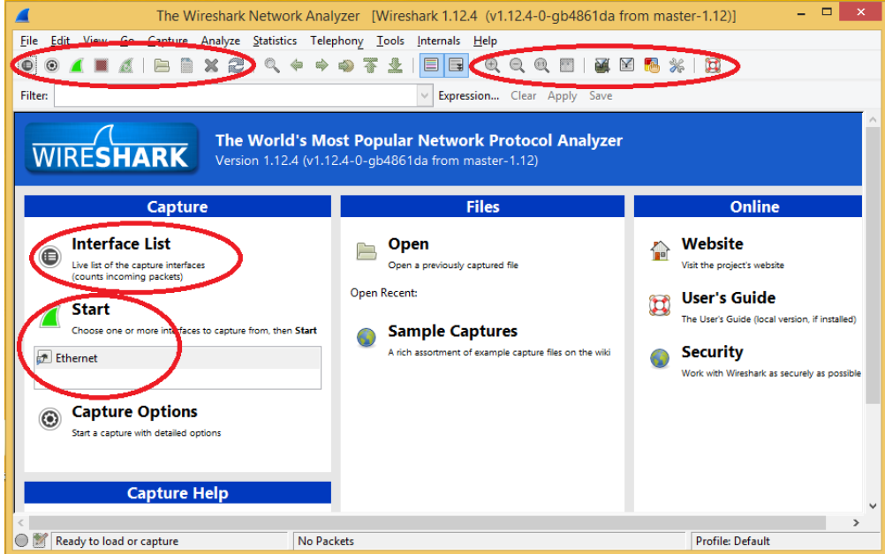
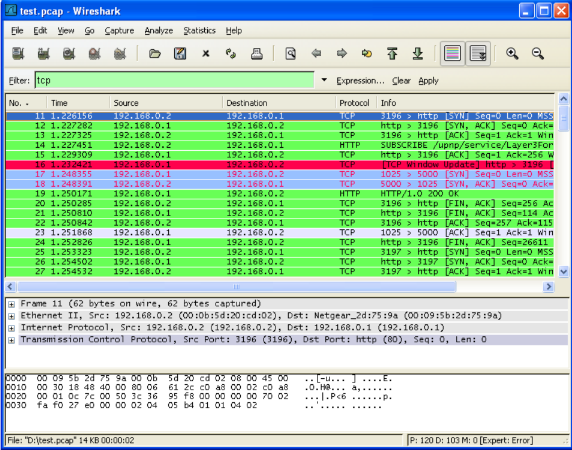
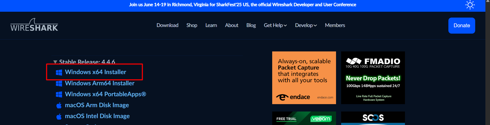
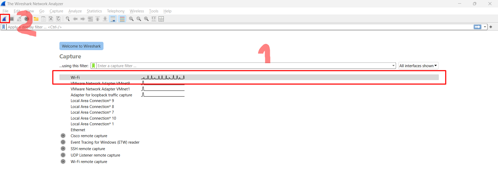
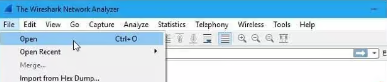
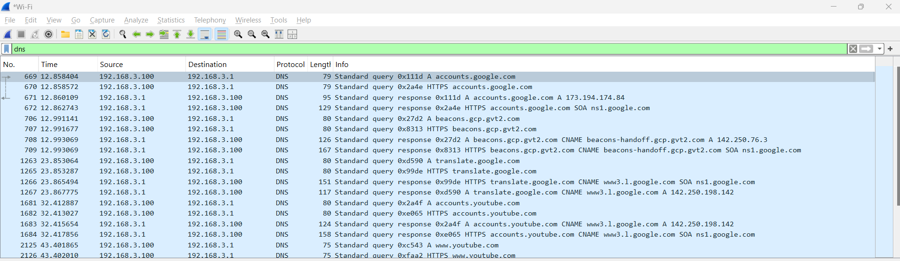
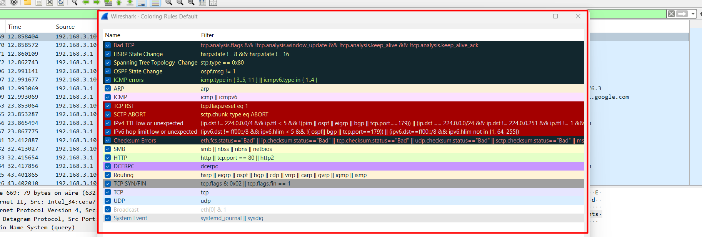
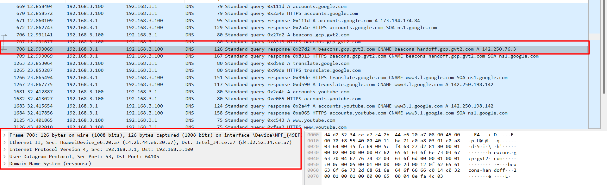

# WireShark trên Windows

## Tổng quan về phần mềm WireShark

### 1. Phần mềm WireShark là gì?

**Wireshark** là một công cụ phân tích mạng và ghi lại giao thức mạng. Nó cho phép người dùng theo dõi và phân tích các gói tin mạng trong thời gian thực. Wireshark có khả năng xem và phân tích dữ liệu trong các giao thức mạng phổ biến như TCP, UDP, IP, HTTP và nhiều giao thức khác.

Với **Wireshark**, người dùng có thể xem các gói tin mạng được truyền qua mạng, xác định nguồn gốc và đích của các gói tin, kiểm tra nội dung và cấu trúc của các giao thức, và phân tích lưu lượng mạng để tìm hiểu về hiệu suất và vấn đề liên quan đến mạng.

### 2. Phần mềm WireShark dùng để làm gì?

- **Phân tích và gỡ lỗi mạng:** cho phép người dùng xem và phân tích các gói tin mạng để xác định nguyên nhân gây ra sự cố mạng, như kết nối chậm, lỗi giao thức, mất dữ liệu và các vấn đề khác. Điều này giúp kỹ thuật viên mạng tìm ra và giải quyết các vấn đề mạng một cách hiệu quả.
- **Kiểm tra bảo mật mạng:** Wireshark có khả năng phân tích và hiển thị dữ liệu trong các gói tin mạng, cho phép người dùng kiểm tra bảo mật mạng bằng cách phát hiện và theo dõi các hoạt động không mong muốn, tấn công mạng, hoặc các thông tin nhạy cảm đang được truyền qua mạng.
- **Phân tích hiệu suất mạng:** cung cấp các công cụ phân tích mạnh mẽ để đo lường và đánh giá hiệu suất mạng, bao gồm độ trễ, tốc độ truyền dữ liệu, thời gian đáp ứng và các tham số khác. Điều này giúp người dùng xác định và cải thiện hiệu suất mạng để đảm bảo hoạt động mạng tối ưu.
- **Giảng dạy và nghiên cứu:** Wireshark là công cụ quan trọng trong việc giảng dạy và nghiên cứu về mạng máy tính. Nó cho phép người dùng tìm hiểu về các giao thức mạng, quá trình truyền thông, cấu trúc gói tin và các khía cạnh kỹ thuật khác liên quan đến mạng.

### 3. Phần mềm WireShark hoạt động thế nào?

**Wireshark** hoạt động ngay khi được cài đặt trên thiết bị nhưng bạn cần cài đặt mạng phù hợp với hệ thống mạng đang dùng. **Wireshark** thực hiện thu thập tất cả các địa chỉ IP đã được kết nối với hệ thống mạng. Mỗi khi có thiết bị sử dụng mạng được kết nối, chúng sẽ được cập nhật trong các gói dữ liệu mà **Wireshark** thu thập được.

Các bước hoạt động cơ bản:

- **Bắt gói tin:** Phần mềm này cho phép chọn giao diện mạng để bắt gói tin như **Ethernet**, **Wi-Fi** hoặc **bất kỳ giao diện mạng nào khác** trên hệ thống.
- **Lưu trữ và hiển thị gói tin:**
  - Wireshark lưu trữ các gói tin mạng được bắt vào bộ nhớ và hiển thị chúng trên giao diện người dùng.
  - Mỗi gói tin được hiển thị với các chi tiết như địa chỉ nguồn, địa chỉ đích, giao thức, thông tin dữ liệu và nhiều thông tin khác.
- **Phân tích gói tin:** Phần mềm có thể phân tích các trường dữ liệu trong gói tin, xác định các giao thức được sử dụng, xem thông tin về kết nối mạng và nhiều tính năng khác.
- **Lọc và tìm kiếm:**  Wireshark cung cấp khả năng lọc và tìm kiếm dựa trên các tiêu chí như địa chỉ IP, cổng, giao thức, dữ liệu và nhiều tiêu chí khác.
- **Xuất và chia sẻ dữ liệu:** Phần mềm cho phép xuất dữ liệu phân tích thành các định dạng như CSV, XML hoặc JSON để tạo báo cáo hoặc chia sẻ thông tin với người khác.

*Ví dụ:* Sau khi các dữ liệu mạng được thu thập, chúng sẽ được tổng hợp và hiển thị rất chi tiết trong Wireshark. Công cụ này phân chia dải địa chỉ IP theo các màu sắc khác nhau, tương ứng với từng trạng thái.

- **Màu xanh lá cây:** Là IP của TCP
- **Màu xanh da trời:** Là tổng hợp IP của UDP.
- **Màu tím nhạt:** Tổng hợp IP thuộc DNS.
- **Màu nền đen chữ cam:** Cho biết dữ liệu mạng gói TCP đang có vấn đề.

### 4. Các tính năng nổi bật

- **Wireshark** cung cấp giao diện người dùng (GUI) thân thiện, dễ sử dụng và trực quan.
- Hỗ trợ nhiều giao thức mạng phổ biến, bao gồm Ethernet, TCP/IP, UDP, HTTP, DNS, FTP, SSL và nhiều giao thức khác.
- **Wireshark** cho phép người dùng áp dụng các bộ lọc để tìm kiếm và tập trung vào các gói tin quan trọng hoặc thông tin cụ thể.
- Hiển thị chi tiết của từng gói tin mạng, bao gồm các trường dữ liệu, giao thức, địa chỉ nguồn và đích, thời gian và nhiều thông tin khác.
- Cung cấp các tính năng phân tích mạng mạnh mẽ như phân tích luồng, thống kê, biểu đồ, phân tích bảo mật và nhiều khả năng mở rộng khác.

## Sử dụng phần mềm

### 1. Cài đặt phần mềm

`Bước 1`: Truy cập trang web chính thức của Wireshark tại địa chỉ: <https://www.wireshark.org/>

`Bước 2`:Trong mục Downloads, chọn phiên bản phù hợp với hệ điều hành Windows và kiến trúc máy tính của bạn (32-bit hoặc 64-bit). Nhấp vào liên kết tải về để tải gói cài đặt (.exe) của Wireshark.

`Bước 3:` Sau khi download hoàn thành, bạn khởi chạy file install và tiếp tục làm theo hướng dẫn trên để hoàn thành cài đặt.

### 2. Cách sử dụng

**Cách chụp các gói tin bằng ứng dụng Wireshark:**

- Mở ứng dụng Wireshark trên máy tính.
- Chọn một giao diện mạng để chụp gói tin từ danh sách giao diện có sẵn.
- Để dùng Wireshark bắt gói tin, nhấp vào nút “Start” hoặc “Capture” để bắt đầu chụp gói tin trên giao diện đã chọn.
- Wireshark sẽ bắt đầu chụp các gói tin trên giao diện và hiển thị chúng trong cửa sổ chính.

**Cách mở và lưu gói tin trên ứng dụng Wireshark:**

- Chọn **File > Open** hoặc nhấn **Ctrl+O** để mở một tệp tin gói tin đã được lưu trữ trước đó.
- Tìm và chọn tệp tin gói tin muốn mở.
- Gói tin sẽ được hiển thị trong cửa sổ chính của Wireshark.

**Cách lọc các gói tin trên Wireshark (Wireshark Filter):**

- Sử dụng thanh **Filter** hoặc nhấn **Ctrl+F** để mở cửa sổ Wireshark Filter.
- Nhập các biểu thức lọc vào ô tìm kiếm để lọc các gói tin dựa trên các tiêu chí như địa chỉ IP, giao thức, cổng, v.v.
- Nhấn **Enter** hoặc nhấp vào nút **Apply** để áp dụng bộ lọc và chỉ hiển thị các gói tin phù hợp.

**Cách Color Coding trong phần mềm Wireshark:**

- Wireshark sử dụng color coding để tô màu các gói tin dựa trên giao thức, trạng thái và các thuộc tính khác.
- Mỗi màu đại diện cho một giao thức cụ thể hoặc loại gói tin.
- Có thể xem thông tin chi tiết về màu sắc và giao thức tương ứng trong phần **Coloring Rules** hoặc **Coloring Options** của công cụ này.

**Cách kiểm tra gói tin bằng Wireshark:**

- Xem danh sách các gói tin trong cửa sổ chính của Wireshark.
- Nhấp vào một gói tin để xem các thông tin chi tiết như địa chỉ nguồn, đích, giao thức, dữ liệu,..
- Có thể sử dụng các tính năng của Wireshark như Follow TCP Stream để xem nội dung truyền qua một kết nối TCP cụ thể.
