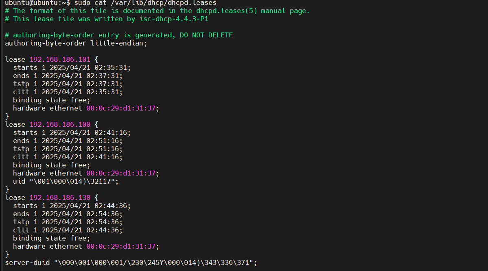

# File logs DHCP

## DHCP server

### 1. Danh sách địa chỉ IP đã cấp phát bởi DHCP

Mở file `dhcpd.leases`:

```plaintext
sudo cat /var/lib/dhcp/dhcpd.leases
```

Kết quả:



### 2. Xem log DHCP server

```plaintext
sudo journalctl -u isc-dhcp-server
```

Kết quả:


## DHCP client

Trên DHCP client (centos) xem file log với lệnh:

```plaintext
sudo grep dhclient /var/log/messages
```

Kết quả lọc file `/var/log/messages`:


