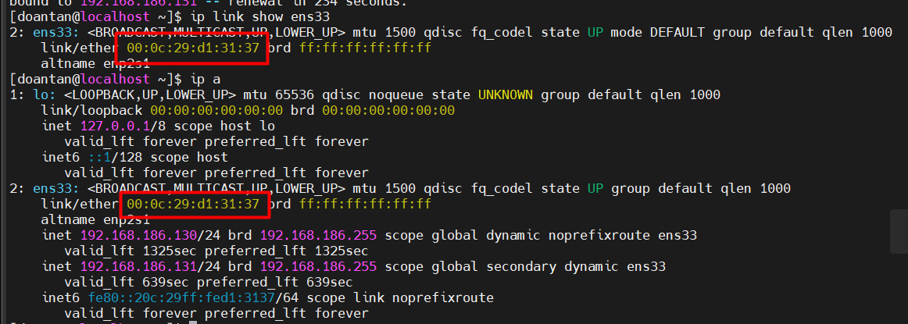
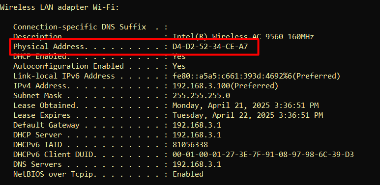
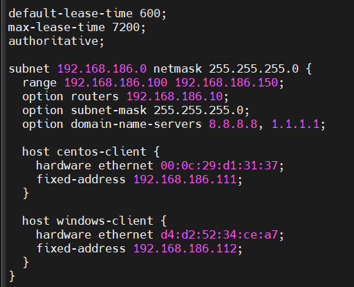

# Cấp phát IP theo địa chỉ MAC

## CentOS và Windows

### Bước 1. Xác định MAC của client

Chạy lệnh sau để lấy địa chỉ MAC:

**CentOS:**

```plaintext
ip link show ens33
hoặc
ip a
```

Kết quả: `link/ether`



**Windows:**

```plaintext
ifconfig /all
```

Tìm đến adapter mạng đang dùng (thường là Ethernet hoặc Wi-Fi) và ghi lại dòng:



- Chuyển dấu `-` thành `:` và có thể viết thường.
- `d4:d2:52:34:ce:a7`

### Bước 2. Chỉnh sửa file cấu hình DHCP server

Mở file cấu hình:

```plaintext
sudo vim /etc/dhcp/dhcpd.conf
```

Tìm đến phần khai báo subnet, thêm một đoạn cấu hình dạng sau vào bên trong hoặc ngay sau subnet:

```plaintext
# Cho centos
host centos-client {
  hardware ethernet 00:0c:29:d1:31:37;
  fixed-address 192.168.186.111;
}

# Cho windows
host windows-client {
  hardware ethernet d4:d2:52:34:ce:a7;
  fixed-address 192.168.186.112;
}
```

- `host centos-client`: tên định danh tuỳ chọn
- `hardware ethernet`: địa chỉ MAC của client
- `fixed-address`: IP muốn gán cố định

Ví dụ cấu hình đầy đủ subnet:



### Bước 3. Khởi động lại DHCP server

```plaintext
sudo systemctl restart isc-dhcp-server
```

### Bước 4: Xin cấp phát lại IP trên máy client

**CentOS:**

```plaintext
# Giải phóng IP cũ
sudo dhclient -r ens33

# Yêu cầu cấp phát IP mới
sudo dhclient -v ens33
```

**Windows:**

```plaintext
# Giải phóng IP cũ
ipconfig /release

# Yêu cầu cấp phát IP mới
ipconfig /renew
```

### Bước 5: Kiểm tra DHCP leases

```plaintext
cat /var/lib/dhcp/dhcpd.leases
```
