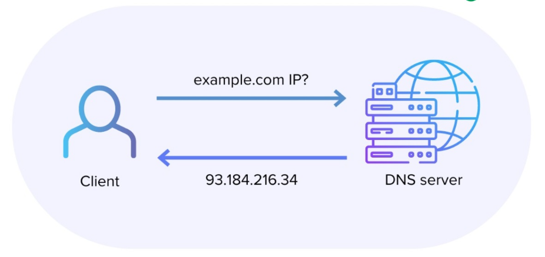
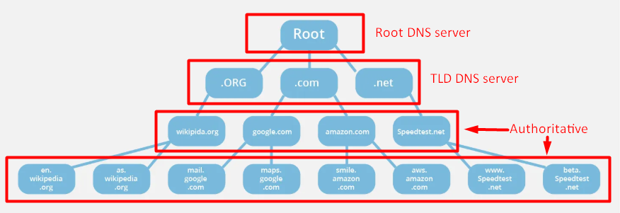
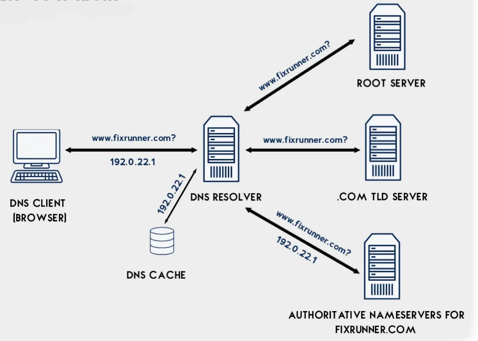

# Tổng quan về DNS

## DNS là gì?



### 1. Khái niệm DNS

**DNS - Domain Name System** là một hệ thống quan trọng giúp chuyển đổi tên miền sang địa chỉ IP, giúp các thiết bị có thể giao tiếp và kết nối với nhau trên internet.

**DNS** về căn bản là một hệ thống giúp cho việc chuyển đổi các tên miền mà con người dễ ghi nhớ (dạng ký tự, ví dụ: `www.example.com`) sang địa chỉ IP vật lý (dạng số, ví dụ `123.11.5.19`) tương ứng của tên miền đó.

### 2. Chức năng của DNS

- **Phân giải tên miền thành địa chỉ IP:** Chức năng cốt lõi và quan trọng nhất. Giúp con người dễ nhớ tên miền (như `google.com`) thay vì nhớ địa chỉ IP (`142.250.196.100`).
- **Phân giải ngược (Reverse DNS Lookup):** Chuyển địa chỉ IP → tên miền.
  - VD: Dùng trong bảo mật, kiểm tra log, gửi email (mail server kiểm tra xem IP có ứng với domain không).
- **Cân bằng tải (Load balancing):** Một tên miền có thể trỏ đến nhiều địa chỉ IP khác nhau để phân phối lưu lượng truy cập. DNS có thể trả về IP khác nhau theo vùng địa lý, giảm tải, tăng tốc độ.
  - VD: `youtube.com` có thể trả về IP khác nhau nếu bạn ở Mỹ hay Việt Nam.
- **Quản lý sự thay đổi địa chỉ IP:**  Nếu một máy chủ web thay đổi địa chỉ IP, chỉ cần cập nhật bản ghi DNS cho tên miền đó. Người dùng vẫn tiếp tục sử dụng tên miền cũ mà không cần biết về sự thay đổi IP.
- **Bảo mật và Xác minh:** DNS lưu trữ nhiều loại bản ghi được sử dụng cho mục đích xác minh quyền sở hữu tên miền, chống spam email, và các tính năng bảo mật khác.

## Các loại bản ghi trên DNS Server


### 1. A Record (Address Record)

- **Chức năng:** ánh xạ tên miền → địa chỉ IPv4

  ```pgsql
  example.com     IN  A    93.184.216.34
  ```

- Khi gõ `example.com`, trình duyệt sẽ dùng IP `93.184.216.34` để kết nối.

### 2. AAAA Record (IPv6 Address Record)

- **Chức năng:** giống A record, nhưng dùng cho địa chỉ IPv6.

  ```pgsql
  example.com     IN  AAAA    2606:2800:220:1:248:1893:25c8:1946
  ```

### 3. CNAME Record (Canonical Name Record)

- **Chức năng:** tạo bí danh (alias) cho một tên miền khác.

  ```pgsql
  www.example.com     IN  CNAME   blog.example.com  
  ```

- `www.example.com`, trỏ về IP thật qua bản ghi A. Để `blog.example.com` cũng trỏ về cùng chỗ với `www.example.com`:

### 4. MX Record (Mail Exchange Record)

- **Chức năng:** xác định máy chủ email nhận thư cho tên miền.

  ```pgsql
  example.com     IN  MX   10 mail1.example.com.
  example.com     IN  MX   20 mail2.example.com.
  ```

- Số “10”, “20” là **priority** – Giúp phân cấp các máy chủ email: máy chủ nào sẽ được thử đầu tiên, và nếu máy đó không hoạt động, hệ thống sẽ thử máy tiếp theo. Giá trị càng nhỏ, độ ưu tiên càng cao.

### 5. TXT Record (Text Record)

- **Chức năng:** chứa dữ liệu dạng văn bản, dùng cho:
  - Xác thực email (SPF, DKIM, DMARC).
  - Chứng minh quyền sở hữu tên miền.
  - Thông tin tùy ý.

  ```pgsql
  example.com     IN  TXT   "v=spf1 include:_spf.google.com ~all"
  ```

### 6. CAA Record (Certification Authority Authorization)

- **Chức năng:** chỉ định tổ chức cấp chứng chỉ SSL/TLS cho tên miền, giúp bảo vệ chống chứng chỉ SSL giả mạo.

  ```pgsql
  example.com     IN  CAA  0 issue "letsencrypt.org"
  ```

- Chỉ **Let's Encrypt** được phép cấp SSL cho example.com.
- `0` = Không bắt buộc: Cho phép Certification Authority (CA) giải thích hoặc bỏ qua bản ghi nếu nó không hiểu.
- `1` = Critical (quan trọng): Nếu một CA không hiểu bản ghi CAA có flag = 1, nó phải từ chối cấp chứng chỉ.

### 7. NS Record (Name Server Record)

- **Chức năng:** chỉ định DNS Server nào quản lý bản ghi của tên miền.

  ```pgsql
  example.com     IN  NS   ns1.cloudflare.com.
  example.com     IN  NS   ns2.cloudflare.com.
  ```

- Dùng để trỏ về nhà cung cấp DNS đang dùng (Cloudflare, GoDaddy, v.v.).

### 8. SRV Record (Service Record)

- **Chức năng:** dùng để định tuyến đến dịch vụ cụ thể, ví dụ: VoIP (SIP), IM (XMPP), LDAP, v.v. SRV Record này chứa thông tin về **hostname**, **cổng (port)**, **độ ưu tiên**.

```pgsql
_sip._tcp.example.com   IN  SRV  10  60  5060  sipserver.example.com.
```

- Dùng để trỏ về nhà cung cấp DNS đang dùng (Cloudflare, GoDaddy, v.v.).
- `_sip` → tên dịch vụ (SIP – Session Initiation Protocol, dùng trong VoIP, gọi điện qua internet).
- `_tcp` → giao thức sử dụng (TCP)
- `10` (Priority – mức ưu tiên): càng nhỏ càng ưu tiên.
- `60` (Weight – trọng số): nếu có cùng `priority`, `weight` quyết định tỉ lệ chia tải. `weight` cao hơn sẽ có xác suất được chọn nhiều hơn cao hơn.
- `5060` (Port – cổng).

## Phân loại DNS Server



### 1. Recursive DNS Server (DNS đệ quy)

- Là trung gian giữa người dùng và hệ thống phân giải tên miền toàn cầu.
- Nhận yêu cầu từ client (máy tính, điện thoại…) và đi lần lượt đến **Root** → **TLD** → **Authoritative DNS** để lấy IP.
- Lưu trữ kết quả tra cứu vào bộ nhớ cache để phục vụ các yêu cầu tiếp theo nhanh hơn.
- ví dụ:
  - `8.8.8.8` (Google)
  - `1.1.1.1` (Cloudflare)
  - DNS của nhà mạng như: VNPT, Viettel, FPT…

### 2. Root DNS Server (Máy chủ gốc)

- Đứng đầu chuỗi truy vấn DNS. Nó không chứa thông tin chi tiết về các tên miền cụ thể, nhưng nó biết địa chỉ của các máy chủ TLD (Top-Level Domain).
- Khi Recursive Resolver cần tra cứu một tên miền mà không có trong cache, nó sẽ hỏi Root Server để biết địa chỉ của TLD Server tương ứng.
- Được quản lý bởi các tổ chức toàn cầu (ví dụ: Verisign, ICANN) vận hành. Có 13 hệ thống máy chủ gốc được định danh từ A đến M, phân tán trên toàn cầu.

### 3. TLD DNS Server (Top-Level Domain)

- Quản lý các đuôi miền cấp cao như `.com`, `.vn`, `.edu`, `.org`...
- Chuyển tiếp truy vấn đến **authoritative DNS server** cụ thể của tên miền.
- Ví dụ:
  - `.com` → được quản lý bởi **Verisign**.
  - `.vn` → được quản lý bởi **VNNIC**.

### 4. Authoritative DNS Server (DNS có thẩm quyền)

- Là nguồn dữ liệu chính thức, chứa các bản ghi DNS: `A`, `AAAA`, `MX`, `CNAME`, `TXT`, `SRV`,...
- Trả về câu trả lời cuối cùng cho truy vấn tên miền.
- Loại:
  - **Primary server (master)**: nơi lưu trữ dữ liệu gốc, có thể chỉnh sửa.
  - **Secondary server (slave)**: bản sao của master, dùng để tăng độ ổn định và phân tải.
- Ví dụ:
  - Nếu dùng Cloudflare, thì ns1.cloudflare.com chính là authoritative server.
  - Nếu người dùng dùng VPS riêng + BIND9, người dùng tự chạy authoritative server cho domain.

### 5. Caching DNS Server (Bộ nhớ đệm DNS)

- Lưu kết quả truy vấn DNS đã từng thực hiện để tăng tốc độ các lần truy cập tiếp theo.
- Giảm tải hệ thống DNS toàn cầu.
- Đặc điểm:
  - Có thể là một phần của **recursive server**.
  - Mỗi bản ghi được cache trong một khoảng thời gian gọi là TTL (Time-To-Live).

## Cách hoạt động của DNS



**`Bước 1`: Truy vấn từ Client → Recursive DNS Server**

- Người dùng mở trình duyệt và nhập `www.example.com`.
- Hệ điều hành kiểm tra:
  - File hosts cục bộ (nếu có).
  - Cache DNS cục bộ (nếu có).
  - Nếu không có → gửi truy vấn đến Recursive DNS Server.

**`Bước 2`: Recursive DNS Server xử lý truy vấn**

Recursive DNS sẽ thực hiện các bước sau nếu không có cache:

1. **Hỏi Root DNS Server:**
    - Hỏi: “IP của `www.example.com` lầ gì?”.
    - Root DNS: “Hãy hỏi `.com` TLD Server”.
2. **Hỏi TLD DNS Server (.com):**
    - Hỏi: “IP của `www.example.com` là gì?”.
    - `.com` server: “domain `example.com` được quản lý bởi DNS server tại `ns1.exampledns.com` (authoritative)”.
3. **Hỏi Authoritative DNS Server:**
    - Truy vấn đến `ns1.exampledns.com`: “IP của `www.example.com` là gì?”.
    - Server này trả lời: “IP là `217.64.213.12`” (A record).

**`Bước 3`: Trả kết quả về Client**

- Recursive DNS server lưu kết quả vào cache (để lần sau trả lời nhanh hơn).
- Trả IP `217.64.213.12` về cho máy người dùng.

**`Bước 4`: Client kết nối đến web server**

- Trình duyệt dùng địa chỉ IP để kết nối đến 217.64.213.12 (qua HTTP/HTTPS).
- Gửi request và tải nội dung web.
