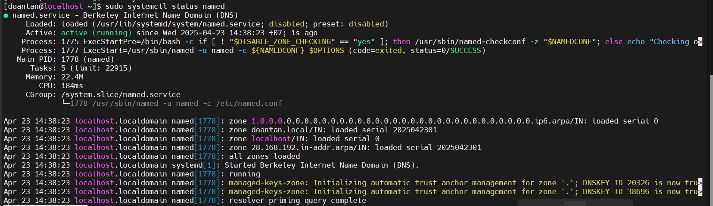

# Triển khai mô hình DNS server trên CentOS

## Mục tiêu

- Triển khai một DNS server nội bộ với domain: `doantan.local`.
- Máy chủ DNS có IP: `192.168.3.105`.
- Có thể phân giải tên `www.example.local` thành `192.168.3.112`.
- Hỗ trợ cả phân giải thuận (A record) và phân giải ngược (PTR record)

## Thành phần chính của hệ thống

| Thành phần | Vai trò |
|-----------|------|
| **BIND (named)** | Phần mềm DNS server |
| `named.conf` | File cấu hình chính của BIND |
| **Zone file** | Chứa bản ghi DNS cho tên miền |
| **Reverse Zone** | Chứa bản ghi phân giải ngược |

## Triển khai

### Bước 1: Cài đặt BIND

```plaintext
sudo dnf install bind bind-utils -y
```

- `bind` (Berkeley Internet Name Domain): Phần mềm DNS server.
- `bind-utils`: Công cụ hỗ trợ kiểm tra DNS như `dig`, `nslookup`.

### Bước 2: Cấu hình tường lửa (firewall)

DNS sử dụng `cổng 53` trên cả hai giao thức UDP (cho các truy vấn thông thường) và TCP (cho zone transfers hoặc các truy vấn lớn).

```plaintext
sudo firewall-cmd --permanent --add-service=dns
sudo firewall-cmd --reload
```

- Lệnh này sẽ mở cổng 53 UDP/TCP cho dịch vụ `dns` mặc định trong firewalld.

### Bước 3: Cấu hình tệp chính `named.conf`

Tệp cấu hình chính của BIND là `/etc/named.conf`. Mở tệp bằng trình soạn thảo văn bản:

```plaintext
sudo vim /etc/named.conf
```

- `options { ... };`: Phần này chứa các cài đặt chung cho BIND.
- `logging { ... };`: Cấu hình ghi log.
- `zone "." IN { ... };`: Định nghĩa zone gốc (Root Zone). Không cần thay đổi phần này.
- `include "/etc/named.rfc1912.zones";`: Tệp này chứa các định nghĩa zone mặc định cho mạng nội bộ (localhost, reverse localhost). Có thể giữ nguyên hoặc chỉnh sửa nếu cần.

Tìm và sửa các dòng sau:

```plaintext
listen-on port 53 { any; };         # Lắng nghe trên mọi địa chỉ IP
allow-query     { any; };           # Cho phép mọi máy truy vấn
recursion yes;                      # Bật chế độ truy vấn đệ quy
```

- Mặc định `named` chỉ cho phép truy cập từ localhost, cần chỉnh sửa để cho phép các client trong LAN.

Thêm **Zone** mới vào `named.conf`, thêm các dòng sau vào cuối file:

```plaintext
zone "doantan.local" IN {
    type master;
    file "/var/named/doantan.local.db";
    allow-update { none; };
};

zone "3.168.192.in-addr.arpa" IN {
    type master;
    file "/var/named/192.168.3.rev";
    allow-update { none; };
};
```

- `doantan.local` là tên miền được tạo.
- `3.168.192.in-addr.arpa` là dạng viết ngược của mạng `192.168.3.0/24` để dùng cho **PTR record**.

Kiểm tra cú pháp cấu hình sau khi lưu tệp:

```plaintext
sudo named-checkconf
```

- Nếu không trả về gì -> cú pháp ổn.
- Nếu cú pháp sai -> hiển thị lỗi.

### Bước 4: Tạo zone file cho tên miền

```plaintext
sudo vim /var/named/doantan.local.db
```

Nội dung file:

```plaintext
$TTL 86400
@   IN  SOA     ns1.doantan.local. admin.doantan.local. (
            2025042301 ; Serial number (yyyyMMddxx)
            3600       ; Refresh
            1800       ; Retry
            604800     ; Expire
            86400 )    ; Minimum TTL

    IN  NS      ns1.doantan.local.
ns1 IN  A       192.168.3.105
www IN  A       192.168.3.110
```

- `SOA`: Start of Authority – thông tin quản lý zone.
- `NS`: khai báo máy chủ DNS chính cho zone.
- `A`: bản ghi ánh xạ tên thành địa chỉ IP.

### Bước 5: Tạo file phân giải ngược

```plaintext
sudo vim /var/named/192.168.3.rev
```

```plaintext
$TTL 86400
@   IN  SOA     ns1.doantan.local. admin.doantan.local. (
            2025042301 ; Serial
            3600       ; Refresh
            1800       ; Retry
            604800     ; Expire
            86400 )    ; Minimum TTL

    IN  NS      ns1.doantan.local.
105 IN  PTR     ns1.doantan.local.
112 IN  PTR     www.doantan.local.
```

- `PTR` là bản ghi phân giải IP ngược lại tên.

### Bước 6: Phân quyền và bảo mật file

```plaitext
sudo chown root:named /var/named/doantan.local.db
sudo chown root:named /var/named/192.168.3.rev
sudo restorecon -v /var/named/*
sudo systemctl restart named
```

- `restorecon` đảm bảo SELinux cấp quyền đúng cho file

### Bước 7: Khởi động và bật dịch vụ BIND

```plaintext
# Khởi động và cho phép chạy sau khi khởi động
sudo systemctl enable --now named

# Kiểm tra trạng thái
sudo systemctl status named
```

Kết quả thành công:



### Bước 8: Kiểm tra hoạt động

**Trên máy chủ:**

```plaintext
dig @localhost www.doantan.local
dig -x 192.168.28.20
```


