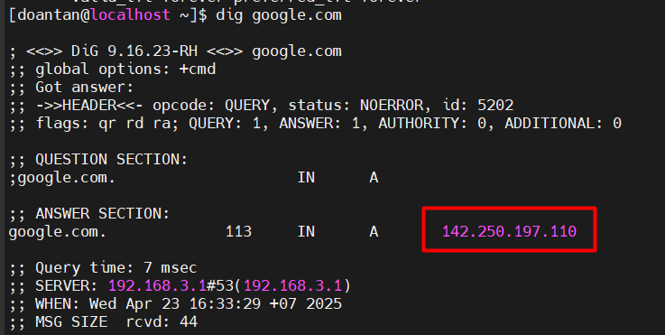
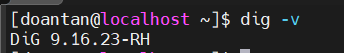
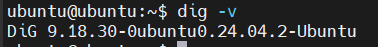
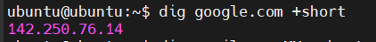
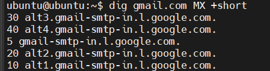
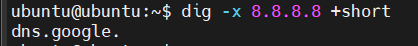
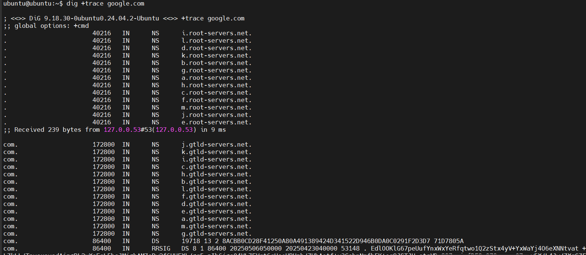

# Tìm hiểu lệnh `dig`

## `dig` là gì?

### 1. Khái niệm


`dig` (Domain Information Groper) là công cụ dòng lệnh có sẵn của Linux sử dụng với mục đích quản trị mạng, tra cứu thông tin về hệ thống tên miền DNS.

`dig` cho phép gửi truy vấn DNS đến một máy chủ cụ thể và hiển thị kết quả chi tiết - bao gồm các bản ghi như **A**, **AAAA**, **MX**, **NS**, **CNAME**, **PTR**...

### 2. Chức năng chính

- **Tra cứu địa chỉ IP của tên miền:** Chức năng phổ biến nhất là tìm địa chỉ IPv4 (bản ghi A) và IPv6 (bản ghi AAAA) liên kết với một tên miền.
  - VD: `dig google.com`để xem dns của google.

  

- **Lấy thông tin chi tiết về các bản ghi DNS:** dig có thể truy vấn các loại bản ghi DNS khác nhau như: MX, NS, CNAME,...

- **Kiểm tra một máy chủ DNS cụ thể:** Bạn có thể chỉ định dig gửi truy vấn đến một máy chủ DNS cụ thể thay vì máy chủ DNS mặc định của hệ thống. Điều này cực kỳ hữu ích khi bạn muốn kiểm tra máy chủ DNS của riêng mình hoặc chẩn đoán sự cố với một máy chủ cụ thể.
  - Cú pháp: `dig @<địa_chỉ_máy_chủ_dns> <tên_miền>`
  - Ví dụ: `dig @8.8.8.8 google.com`

- **Chẩn đoán và khắc phục sự cố DNS:** Nhờ khả năng hiển thị chi tiết quá trình truy vấn và phản hồi (bao gồm máy chủ trả lời, thời gian truy vấn, TTL, các cờ - flags), dig là công cụ không thể thiếu để xác định vấn đề khi một tên miền không phân giải đúng cách hoặc khi cấu hình DNS có lỗi.

## Cài đặt `dig` trên Linux

### 1. Trên CentOS

```cmd
sudo dnf install bind-utils -y
```

Kiểm tra kết quả cài đặt với lệnh `dig -v`:



### 2. Trên Ubuntu

```cmd
sudo apt install dnsutils -y
```

Kiểm tra kết quả cài đặt với lệnh `dig -v`:



## Cú pháp cơ bản

### 1. Thành phần cú pháp

```cmd
dig [domain] [record-type] @[DNS-server] [options]
```

| Thành phần | Ý nghĩa |
|-----------|-------------|
| `domain` | Tên miền cần truy vấn |
| `record-type` | Loại bản ghi DNS (A, MX, NS, PTR, etc) |
| `DNS-server` | DNS server để hỏi (mặc định là server hệ thống) |
| `[options]` | Tuỳ chọn hiển thị hoặc hành vi |

Ví dụ:

```cmd
dig example.com A
```

- Truy vấn bản ghi A (địa chỉ IPv4) của `example.com`.

```cmd
dig google.com MX @8.8.8.8
```

- Hỏi DNS Google (8.8.8.8) bản ghi MX của `google.com`.

### 2. Giải thích kết quả

Ví dụ truy vấn:

```cmd
dig google.com A
hoặc
dig google.com
```


| Phần | ý nghĩa |
|-----------|-------------|
| `HEADER` | Trạng thái truy vấn: NOERROR nghĩa là OK |
| `QUESTION SECTION` | Hiển thị nội dung câu hỏi DNS |
| `ANSWER SECTION` | Trả về kết quả: IP của domain |
| `AUTHORITY SECTION` | Máy chủ DNS có thẩm quyền (nếu có) |
| `ADDITIONAL SECTION` | Thông tin bổ sung (IP của DNS server…) |
| `Query time` | Thời gian thực hiện truy vấn |
| `SERVER` | DNS server được hỏi |
| `WHEN` | Thời gian truy vấn |

## Tùy chọn hữu ích

### 1. Các tùy chọn

| Tùy chọn | Chức năng |
|-----------|-------------|
| `+short` | Hiển thị kết quả ngắn gọn (IP hoặc giá trị duy nhất) |
| `+noall +answer` | Chỉ hiển thị phần "ANSWER SECTION" |
| `+trace` | Truy vết toàn bộ từ Root → DNS cuối cùng |
| `+multiline` | Hiển thị đẹp và dễ đọc hơn |
| `+nocomments` | Ẩn chú thích (các dòng bắt đầu bằng ;;) |
| `-x IP` | Phân giải ngược IP (PTR record) |

### 2. Ví dụ

Trả về địa chỉ IPv4 của domain

```cmd
dig google.com A +short
```



Danh sách máy chủ nhận email của Gmail.

```cmd
dig gmail.com MX +short
```



Phân giải ngược, trả về domain ứng với IP 8.8.8.8 (nếu có cấu hình PTR):

```cmd
dig -x 8.8.8.8 +short
```



Xem quá trình phân giải từ DNS gốc → đến DNS authoritative:

```cmd
dig +trace www.example.com
```


