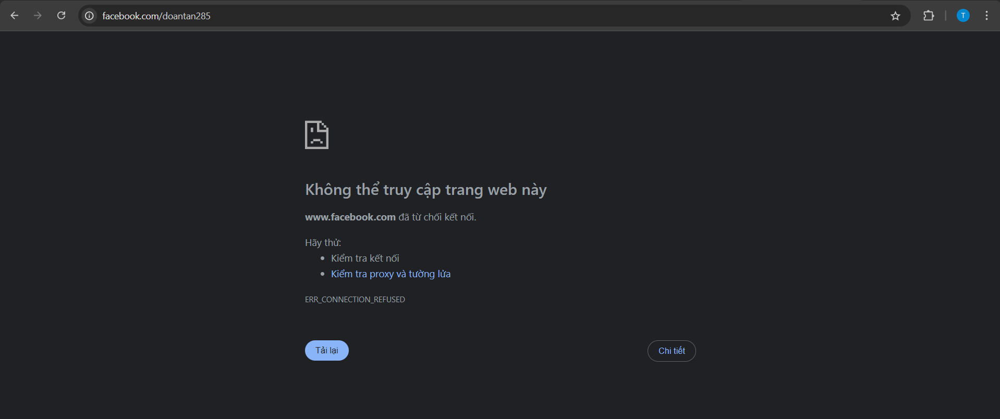

# Sử dụng file `hosts`

## File `hosts` là gì?

File `hosts` là một tệp ánh xạ thủ công giữa tên miền (hostname) và địa chỉ IP. Nó là một trong những cách phân giải tên miền → IP mà không cần hỏi DNS server.

*Hệ thống sẽ tra cứu file hosts trước, nếu có khớp thì không cần hỏi DNS nữa.*

## Vị trí file `hosts`

| Hệ điều hành | Đường dẫn |
|-----------|-------------|
| **Linux** | `/etc/hosts` |
| **Windows** | `C:\Windows\System32\drivers\etc\hosts` |
| **macOS** | `/etc/hosts` |

## Cấu trúc file host

```text
<IP address>    <hostname>    [aliases...]
```

Ví dụ:

```text
127.0.0.1       localhost
192.168.3.105   dnsserver.doantan.local
192.168.3.112   www.example.local www.doantan.local
```

- Mỗi dòng: 1 IP -> nhiều tên (Cách nhau bởi 1 dấu tab hoặc dấu cách)

File hosts trên máy ảo CentOS Stream 9:


- `localhost`: Tên mặc định trỏ về chính máy
- `localhost.localdomain`: Dạng đầy đủ (FQDN) cho localhost
- `localhost4`, `localhost4.localdomain4`: Cũng là localhost nhưng nhấn mạnh dùng với IPv4

## Chỉnh sửa file hosts (trên ubuntu hoặc centos)

Mở bằng `vim`:

```cmd
sudo vim /etc/hosts
```

Thêm dòng lệnh ánh xạ:

```cmd
192.168.3.105   doantan.com
```

- `192.168.3.105`: IP của website
- `doantan.com`: tên ánh xạ

## Ứng dụng thực tế của file `hosts`

| Tình huống | Lý do dùng file `hosts` |
|-----------|-------------|
| Test website nội bộ | Trỏ tên miền tới IP trong mạng LAN |
| Chặn truy cập trang web độc hại | Trỏ tên về `127.0.0.1` |
| Test trước khi cập nhật DNS thật | Kiểm tra phản hồi website bằng IP mới |
| Phân giải tên miền khi chưa có DNS server | Dùng trong lab/test hoặc mô hình nội bộ |

Ví dụ chặn web:

```file
127.0.0.1   facebook.com
127.0.0.1   www.facebook.com
```

- Khi người dùng vào `facebook.com` sẽ bị chuyển về `localhost` → không vào được.

Kết quả:



## Lưu ý

- Không dùng `#` ở đầu dòng trừ khi muốn ghi chú (comment).
- Không dùng nhiều khoảng trắng lộn xộn, nên dùng tab hoặc 1 khoảng trắng.
- Sau khi chỉnh, không cần khởi động lại hệ thống.
- Trên Windows, phải mở **Notepad** bằng quyền **Administrator** để chỉnh sửa `hosts`.
