# Cài đặt Rocky Linux 9 trên VMware

## I. Chuẩn bị

- Tải file ISO của Rocky Linux 9 từ trang chủ: <https://rockylinux.org/download>
- Cài đặt VMware Workstation trên máy tính.
- Tạo một thư mục để lưu trữ các file của máy ảo.

## II. Tiến hành cài đặt

### 1. Tạo Máy ảo (Virtual Machine) mới

Vào File > New Virtual Machine... (hoặc nhấn Ctrl + N):

Hoặc:

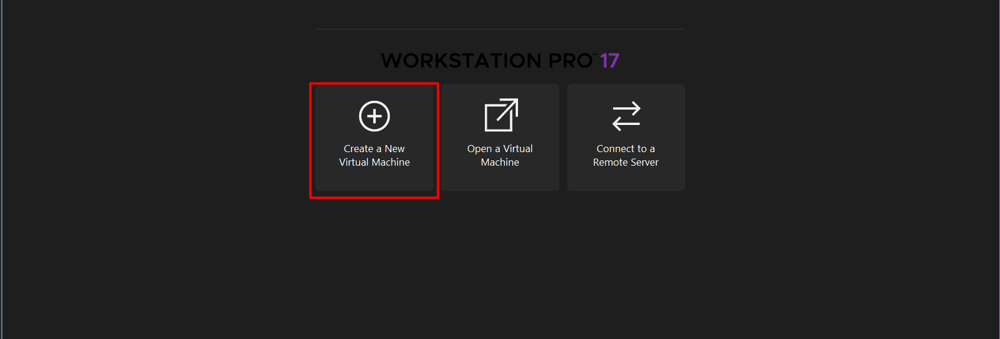

Chọn Typical (recommended) > Next:

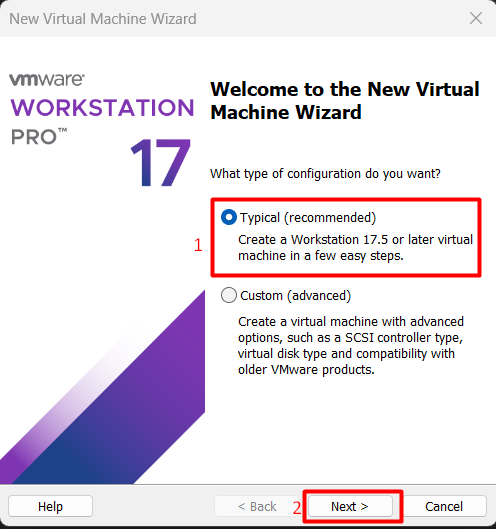

Tại màn hình Installer disc image file (iso):

- Chọn **Installer disc image file (iso)**:
- Nhấn **Browse**... và tìm đến file ISO của Rocky Linux 9 mà bạn đã tải về.
- VMware có thể hiện thông báo "Could not detect which operating system is on this disc image." Nếu vậy, chọn **I will install the operating system later**. và nhấn Next.

Tại màn hình Name the Virtual Machine:

- **Virtual machine name:** Đặt tên cho máy ảo.
- **Location:** Chọn nơi lưu trữ file máy ảo.
- Nhấn **Next**.

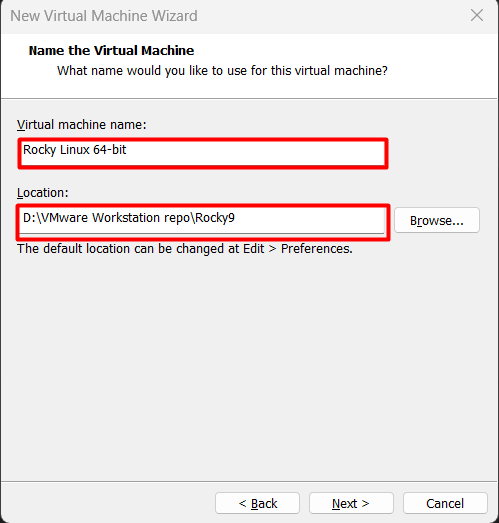

Tại màn hình Specify Disk Capacity:

- **Maximum disk size:** Đặt dung lượng ổ đĩa (ví dụ: 20 GB là đủ cho cài đặt cơ bản).
- Chọn **Split virtual disk into multiple files** (khuyến nghị) hoặc **Store virtual disk as a single file**.
  - **Split virtual disk into multiple files:** Chia đĩa ảo thành nhiều file (thường 2GB/file). Ưu: Dễ sao lưu/chuyển file lớn trên filesystem giới hạn (như FAT32), dễ copy nếu lỗi. Nhược: Hiệu suất thấp hơn, quản lý nhiều file.
  - **Store virtual disk as a single file:** Lưu thành một file duy nhất (monolithic). Ưu: Hiệu suất cao hơn, dễ quản lý. Nhược: Khó sao lưu file lớn (>2GB), có thể gặp hạn chế filesystem cũ.
- Nhấn **Next**.

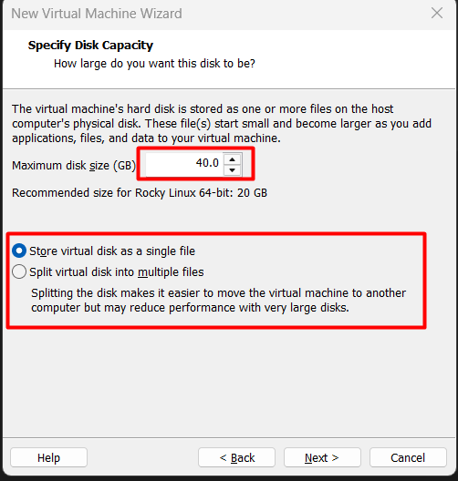

Tại màn hình **Ready to Create Virtual Machine:**

- Nhấn **Customize Hardware**... để điều chỉnh cấu hình trước khi tạo.
  - **Memory:** Tăng bộ nhớ RAM (Ví dụ: 4096 MB hoặc hơn).
  - **Processors:** Tăng số lượng nhân CPU (Ví dụ: 2).
  - **Network Adapter:** Đảm bảo chọn NAT (để truy cập Internet) hoặc Bridged (tùy vào nhu cầu mạng của bạn).
- Nhấn **Close**, sau đó nhấn **Finish** để tạo máy ảo.

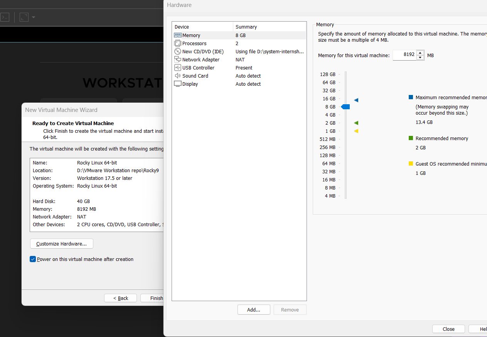

### 2. Bắt đầu Cài đặt Rocky Linux 9

1. Trong danh sách máy ảo của VMware Workstation, chọn máy ảo **Rocky Linux 9** vừa tạo.
2. Nhấn **Power on this virtual machine**.
3. Máy ảo sẽ khởi động và hiển thị màn hình menu đầu tiên:
   - Sử dụng phím mũi tên để chọn **Install Rocky Linux 9**.
   - Nhấn **Enter**.

### 3. Hoàn tất Quá trình Cài đặt (Anaconda Installer)

#### 3.1. Chọn Ngôn ngữ và Bàn phím

- **Language:** Chọn ngôn ngữ bạn muốn sử dụng trong quá trình cài đặt (ví dụ: English (United States)).
- Nhấn **Continue**.

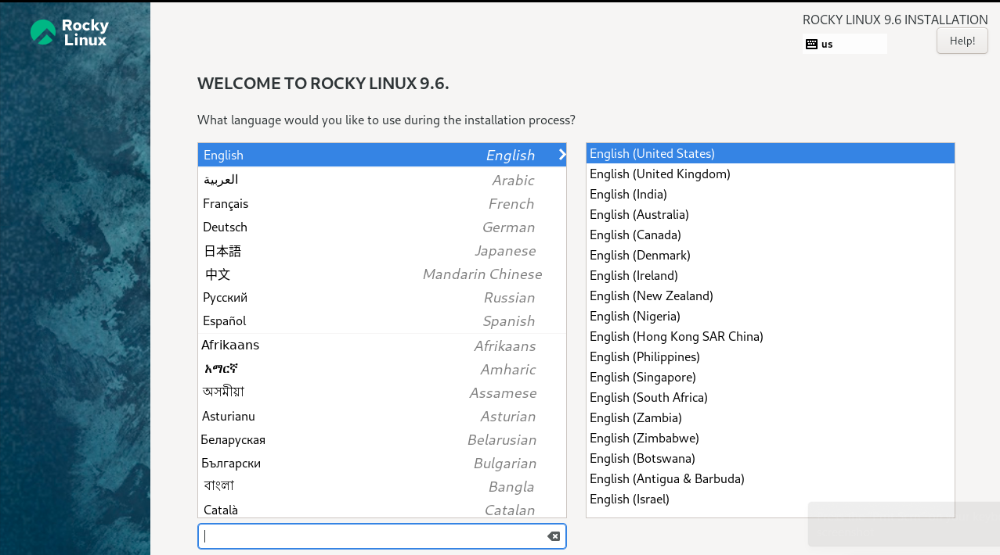

#### 3.2. Màn hình Tóm tắt Cài đặt (Installation Summary)

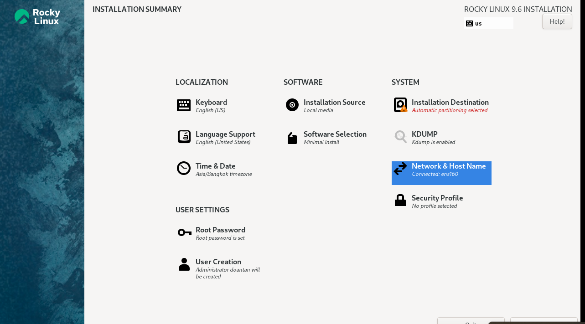

Thiết lập Mạng và Tên máy (Network & Host Name):

Nhấp vào **Time & Date**.

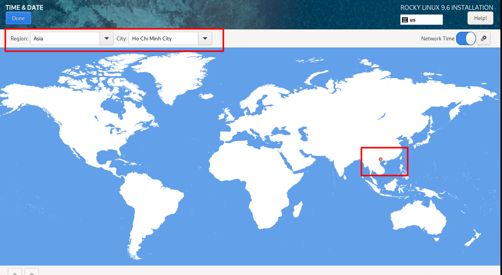

- Chọn khu vực thời gian (ví dụ: Asia/Ho_Chi_Minh).
- Nhấp vào **Done** (góc trên bên trái).

Nhấp vào **Network & Host Name**.

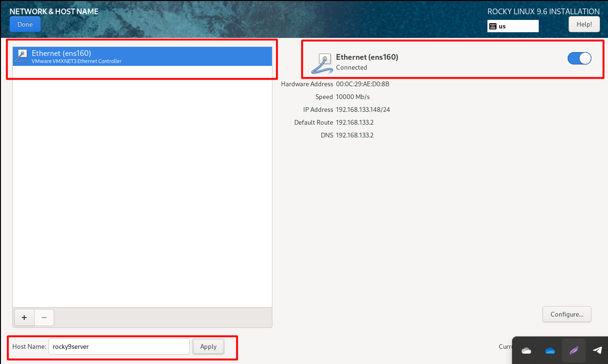

- Bên phải, chuyển nút gạt của card mạng (thường là `ensXXX`) sang trạng thái **ON**.
- Đảm bảo máy ảo nhận được địa chỉ IP (nếu dùng NAT/Bridged) hoặc thiết lập IP tĩnh.
- Thiết lập **Host name** (Ví dụ: `rocky9server`).
- Nhấn **Done**.

Nhấp vào **Installation Destination** để chọn vị trí cài đặt.

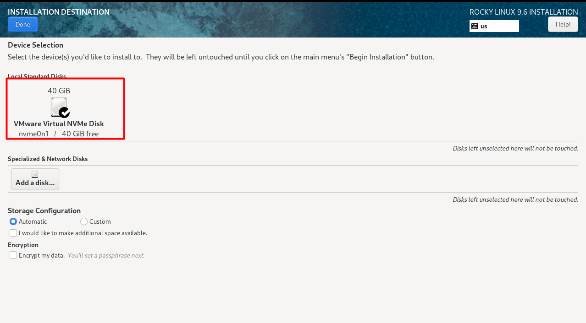

- **Local Standard Disks:** Đảm bảo ổ đĩa ảo của bạn đã được chọn.
- **Storage Configuration:**
  - Chọn **Automatic** (đơn giản nhất) để trình cài đặt tự động phân vùng.
  - Nếu bạn cần phân vùng thủ công, chọn **Custom** và nhấn **Done** để mở công cụ phân vùng.
- Nhấn **Done**.

Custom phân vùng (nếu chọn Custom):

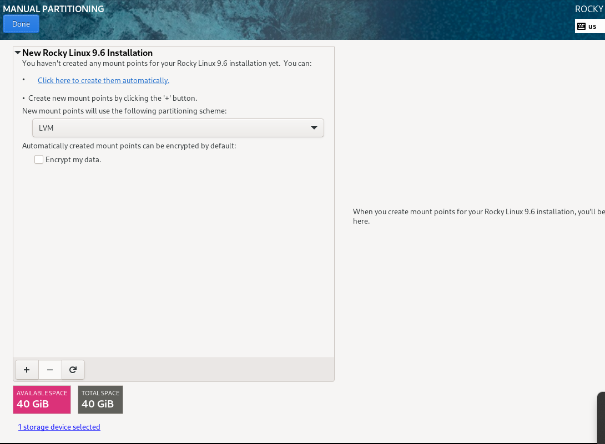

- Trong dropdown menu, chọn **Standard Partition** làm kiểu phân vùng.
- Nhấp vào **+** để thêm phân vùng mới.
  - **/boot:** 1 GB.
  - **/swap:** 8 GB.
  - **/** (root): Để trống (Chiếm dung lượng còn lại).
- Khi hoàn tất, nhấp vào **Done** để thoát khỏi trình quản lý phân vùng.
- Một cửa sổ sẽ xuất hiện hiển thị tóm tắt các thay đổi sẽ được ghi vào đĩa

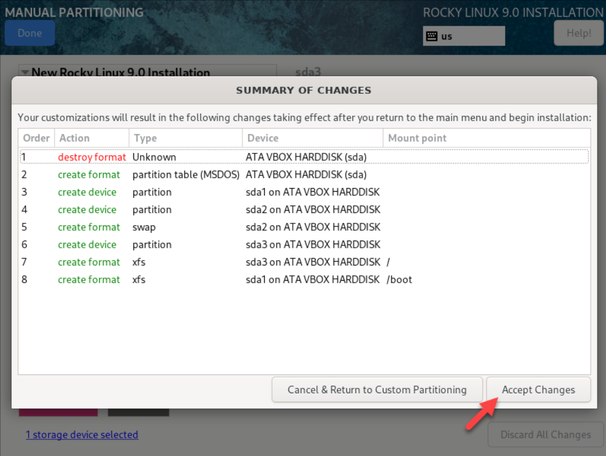

Nhấp vào **Software Selection** để chọn phần mềm.

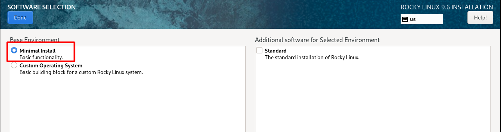

- **Base Environment:**
  - Chọn **Server** hoặc **Minimal Install** (nếu bạn muốn một hệ thống nhẹ, không có GUI).
  - Nếu bạn muốn giao diện đồ họa, chọn **Server with GUI**.
- **Add-ons for Selected Environment:** Chọn các gói bổ sung nếu cần.
- Nhấn **Done**.

Tạo Tài khoản Người dùng (User Settings):

- **Root Password:** Nhấp vào Root Password, nhập mật khẩu cho tài khoản root và xác nhận.
- **User Creation:** Nhấp vào User Creation, điền Full name và Username, nhập mật khẩu và xác nhận. Tùy chọn đánh dấu Make this user administrator để cấp quyền sudo.

#### 3.3 Bắt đầu Cài đặt

1. Sau khi tất cả các mục đã được cấu hình, nhấp vào Begin Installation.
2. Trình cài đặt sẽ bắt đầu sao chép file và cài đặt hệ thống.
3. Khi quá trình hoàn tất, nhấp vào Reboot System.
