# Cài đặt, sử dụng VMware

## Phân biệt 3 chế độ network trong VMware: NAT, Bridge, Host-only

### So sánh nhanh

| Tính năng | NAT | Bridge | Host-Only |
|-----------|-------------|---------|---------|
| Kết nối Internet | Có (thông qua máy chủ host) | Có (nếu host có mạng) | Không (trừ khi cấu hình thêm) |
| Giao tiếp với máy host | Có | Có | Có |
| Giao tiếp với máy thật khác | Không (bị ẩn sau host) | Có (như mọt máy tính thật trong mạng) | Không (chỉ liên lạc được với host và VM khác) |
| Cách cấp IP | Máy ảo lấy IP từ VMware DHCP | Máy ảo lấy IP từ router của mạng LAN | Máy ảo lấy IP từ VMware riêng biệt |
| Bảo mật | Cao (máy ảo ẩn khỏi mạng bên ngoài) | Thấp (máy ảo lộ trực tiếp ra ngoài mạng) | Rất cao (máy ảo hoàn toàn cách ly) |
| Tính ứng dụng | Truy cập internet mà không lộ IP thật | Test mạng như máy thật, cần IP tĩnh | Môi trường cô lập, thử nghiệm nội bộ |

### Chi tiết từng chế độ

**1. NAT (Network Address Translation):**

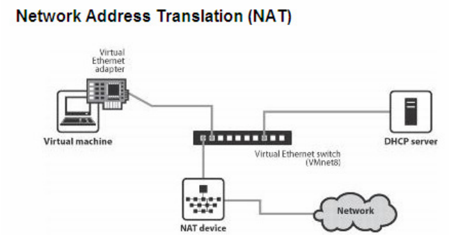

Máy ảo được cấu hình NAT sẽ sử dụng IP của máy thật để giao tiếp với mạng ngoài. Các máy ảo được cấp địa chỉ IP nhờ một DHCP ảo của VMware. Lúc này, các máy ảo sẽ kết nối với máy thật qua switch ảo VMnet8, và máy thật sẽ đóng vai trò NAT server cho các máy ảo.

- **Cách hoạt động:** Máy ảo (VM) sử dụng địa chỉ IP nội bộ do VMware cung cấp, chia sẻ kết nối mạng với máy chủ vật lý (host) thông qua cơ chế NAT.
- **IP của VM:** Do VMware DHCP cấp, thuộc dải riêng biệt (ví dụ: 192.168.x.x).
- **Truy cập internet:** Có thể truy cập internet qua máy host.
- **Khả năng giao tiếp:**
  - Máy ảo <-> Internet: **Có**
  - Máy ảo <-> Máy chủ (host): **Có**
  - Máy ảo <-> Máy ảo (cùng NAT): **Có**
  - Máy ảo <-> Mạng LAN bên ngoài: Không thể truy cập trực tiếp
- **Ứng dụng:** Phù hợp khi cần truy cập internet từ VM mà không muốn VM hiển thị trực tiếp trên mạng LAN.

**2. Bridge:**

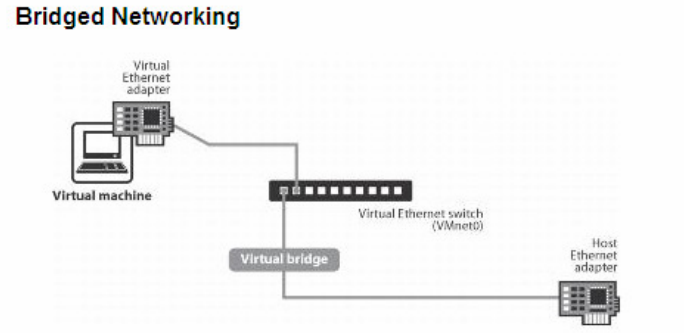

Card mạng của máy ảo sẽ được gắn trực tiếp với card mạng của máy thật (sử dụng switch ảo VMnet0). Lúc này, máy ảo sẽ đóng vai trò như một máy trong mạng thật, có thể nhận DHCP từ mạng ngoài, hoặc đặt IP tĩnh cùng dải với mạng ngoài để giao tiếp với các máy ngoài mạng hoặc lên Internet.

- **Cách hoạt động:** Máy ảo kết nối trực tiếp với mạng vật lý (giống như một máy tính độc lập trong mạng LAN).
- **IP của VM:** Do router/modem mạng LAN cấp (giống máy thật).
- **Truy cập internet:** Có, thông qua mạng LAN giống như máy host.
- **Khả năng giao tiếp:**
  - Máy ảo <-> Internet: **Có**
  - Máy ảo <-> Máy chủ (host): **Có**
  - Máy ảo <-> Máy ảo (cùng Bridge): **Có**
  - Máy ảo <-> Mạng LAN bên ngoài: **Có**
- **Ứng dụng:** Phù hợp khi cần kiểm tra, cấu hình hệ thống mạng thực hoặc cần máy ảo xuất hiện như một thiết bị độc lập trên mạng.

**3. Host-only:**

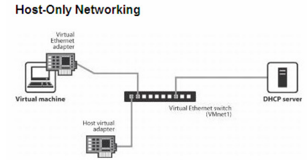

Khi cấu hình máy ảo sử dụng host-only networking, máy ảo sẽ được kết nối với máy thật trong một mạng riêng thông qua Switch ảo VMnet1. Địa chỉ của máy ảo và máy thật trong mạng host-only có thể được cấp bởi DHCP ảo gắn liền với Switch ảo Vmnet1 hoặc có thể đặt địa chỉ IP tĩnh cùng dải để kết nối với nhau.

- **Cách hoạt động:** Máy ảo chỉ có thể kết nối với máy chủ (host) và các máy ảo khác trong cùng chế độ này.
- **IP của VM:**  Do VMware DHCP cấp, thuộc mạng riêng biệt không liên quan đến mạng LAN.
- **Truy cập internet:** Không.
- **Khả năng giao tiếp:**
  - Máy ảo <-> Internet: **Không**
  - Máy ảo <-> Máy chủ (host): **Có**
  - Máy ảo <-> Máy ảo (cùng Host-Only): **Có**
  - Máy ảo <-> Mạng LAN bên ngoài: **Không**
- **Ứng dụng:** Phù hợp khi cần kiểm tra, cấu hình hệ thống mạng thực hoặc cần máy ảo xuất hiện như một thiết bị độc lập trên mạng.

## Sử dụng chế độ mạng NAT để truy cập Internet

### `Bước 1:` Cấu hình NAT trên VMware Workstation

1. Tắt máy ảo CentOS 7 nếu đang chạy.
2. Chọn máy ảo CentOS 7 trong VMware Workstation.
3. Nhấp vào Edit virtual machine settings.
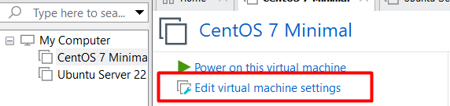
4. Chọn Network Adapter → Chọn NAT (Share the host’s IP address).
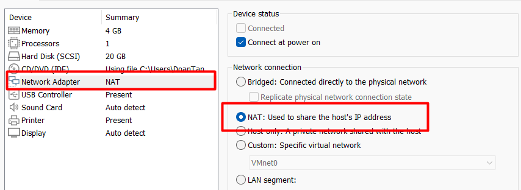
5. Nhấn OK để lưu lại cấu hình.

### `Bước 2:` Kiểm tra và kết nối internet

1. Ping kiểm tra kết nối internet

```plaintext
ping google.com
```

Nếu nhận được phản hồi, máy ảo đã kết nối internet thành công.


## Sử dụng chế độ card Host-only để 2 máy ảo kết nối với nhau

### `Bước 1:` Cấu hình card mạng Host-Only trên VMware

1. Chọn CentOS 7 → Edit virtual machine settings → Chọn Network Adapter → Tích chọn Host-Only → OK để lưu cấu hình.
2. Lặp lại các bước trên Unbuntu Server.

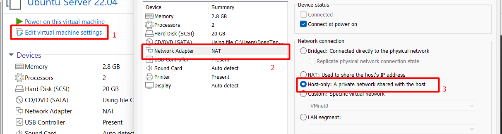

Kiểm tra cấu hình card mạng Host-Only:

- Vào Edit → Virtual Network Editor.
- Đảm bảo có một VMnet1 đã được thiết lập cho Host-Only.


Nếu chưa có:

- Chọn Add Network → VMnet1 → Host-Only.
- Đặt dải IP (ví dụ: 192.168.186.0/24).

### `Bước 2:` Cấu hình IP tĩnh cho mỗi máy ảo

**Trên máy ảo CentOS 7:**

- Chỉnh sửa file cấu hình card mạng:

```plaintext
sudo vi /etc/sysconfig/network-scripts/ifcfg-ens33
```

Cập nhật thêm thông tin nội dung như sau:

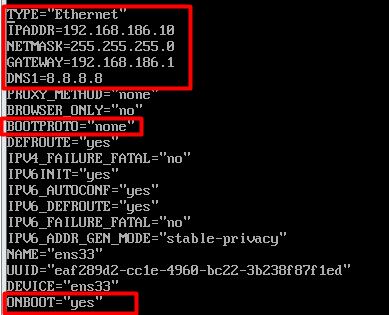

Lưu và khởi động lại card mạng:

```plaintext
sudo systemctl restart network
```

kiểm tra lại địa chỉ IP:

```plaintext
ip addr
```


**Trên máy ảo Ubuntu Server:**

- Chỉnh sửa file cấu hình card mạng:

```plaintext
sudo vi /etc/netplan/50-cloud-init.yaml
```

Cập nhật thêm thông tin nội dung như sau:

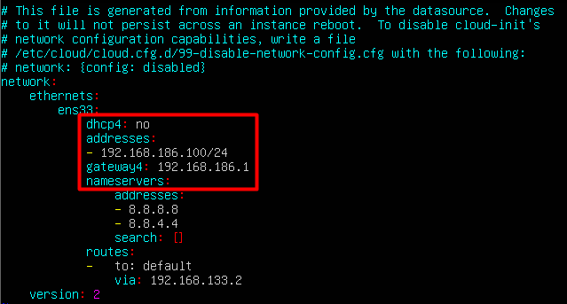

Áp dụng cấu hình mới:

```plaintext
sudo netplan apply
```

kiểm tra lại địa chỉ IP:

```plaintext
ip addr
```

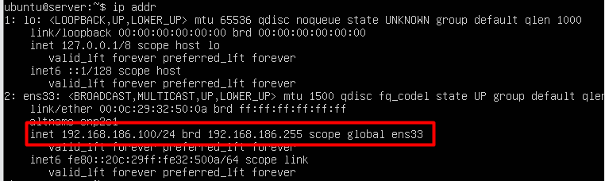

**Kiểm tra kết nối giữa 2 máy ảo:**

Từ CentOS 7 ping tới Ubuntu Server:

```plaintext
ping 192.168.186.100
```

kết quả ping thành công:


Từ Ubuntu Server ping tới CentOS 7:

```plaintext
ping 192.168.186.10
```

Kết quả ping thành công:

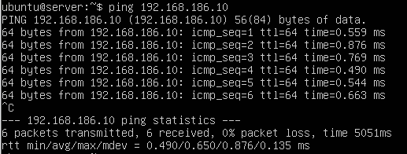

## Sử dụng 1 card Bridge để từ máy ảo ping ra máy laptop cá nhân

### `Bước 1:` Cài đặt card mạng ở chế độ Bridge

1. Tắt máy ảo (Nếu đang chạy).
2. Chọn máy ảo (CentOS 7 hoặc Ubuntu Server) → Edit virtual machine settings.
3. Chọn Network Adapter: Chọn Bridged (Directly connect to the physical network) → OK
4. Tùy chọn nâng cao (nếu cần thiết):Advanced → Bridged to để chọn card mạng vật lý (Wi-Fi hoặc Ethernet) → Chọn đúng card mạng mà máy laptop của bạn đang kết nối internet.

### `Bước 2:` Kiểm tra cấu hình mạng

Trên laptop cá nhân, kiểm tra địa chỉ IP trong mạng LAN:

- Trên Window, mở CMD và nhập lệnh:

```plaintext
ipconfig
```

Nếu laptop kết nối có dây, sử dụng địa chỉ trong *Ethernet adapter Ethernet*. Nếu kết nối không dây, sử dụng địa chỉ trong *Wireless LAN adapter Wi-Fi*.

### `Bước 3:` Cấu hình IP cho máy ảo

Cách 1: Sử dụng DHCP (IP động):

**CentOS 7:** Nhập lệnh `sudo dhclient ens33` sau đó nhập `ip addr` để kiểm tra ip được cấp.

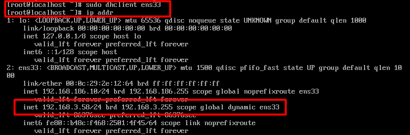

**Ubuntu Server:** Nhập lệnh `sudo dhclient` sau đó nhập `ip addr` để kiểm tra ip được cấp.

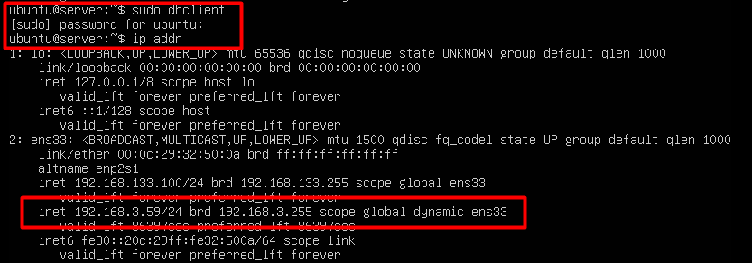

Cách 2: Cài đặt IP tĩnh (Nếu không muốn dùng DHCP): Chọn địa chỉ IP chưa sử dụng và cùng dải với laptop.

**CentOS 7:**

Mở cấu hình mạng:

```plaintext
sudo vi /etc/sysconfig/network-scripts/ifcfg-ens33
```

Cập nhật nội dung:

```plaintext
TYPE="Ethernet"
BOOTPROTO="none"
ONBOOT="yes"
IPADDR=192.168.1.50
NETMASK=255.255.255.0
GATEWAY=192.168.1.1
DNS1=8.8.8.8
```

Trong đó `IPADDR` là địa chỉ cùng dải mạng và khác host với IP của laptop. `GATEWAY` trùng với `Default Gateway` của laptop để truy cập mạng.

Lưu file và khởi động lại mạng:

```plaintext
sudo systemctl restart network
```

**Ubuntu Server:**

Mở cấu hình mạng:

```plaintext
sudo vi /etc/netplan/50-cloud-init.yaml
```

Cập nhật nội dung:

```plaintext
network:
  ethernets:
    ens33:
      dhcp4: no
      addresses:
        - 192.168.1.50/24
      gateway4: 192.168.1.1
      nameservers:
        addresses: [8.8.8.8, 8.8.4.4]
  version: 2

```

Trong đó `addresses:` là địa chỉ cùng dải mạng và khác host với IP của laptop. `gateway4` trùng với `Default Gateway` của laptop để truy cập mạng.

Lưu file và khởi động lại mạng:

```plaintext
sudo netplan apply
```

### `Bước 4:` Kiểm tra kết nối

**Từ laptop ping tới máy ảo:** Trên window (CMD)

```plaintext
ping 192.168.3.58
```

Kết quả ping thành công:

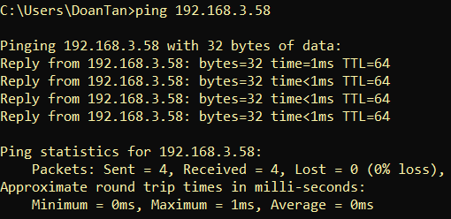

**từ máy ảo ping tới laptop:** thực hiện tương tự
