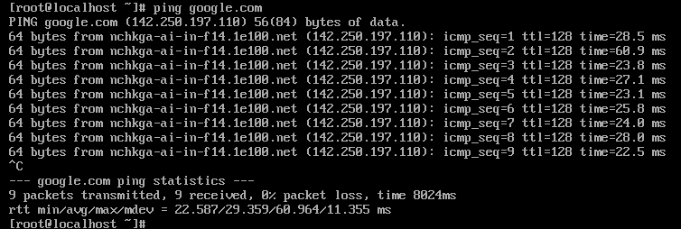
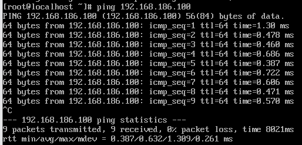

# Cài đặt, sử dụng VMware

## Phân biệt 3 chế độ network trong VMware: NAT, Bridged, Host-only

### So sánh nhanh

| Tính năng | NAT | Bridged | Host-Only |
|-----------|-------------|---------|---------|
| Kết nối Internet | Có (thông qua máy chủ host) | Có (nếu host có mạng) | Không (trừ khi cấu hình thêm) |
| Giao tiếp với máy host | Có | Có | Có |
| Giao tiếp với máy thật khác | Không (bị ẩn sau host) | Có (như mọt máy tính thật trong mạng) | Không (chỉ liên lạc được với host và VM khác) |
| Cách cấp IP | Máy ảo lấy IP từ VMware DHCP | Máy ảo lấy IP từ router của mạng LAN | Máy ảo lấy IP từ VMware riêng biệt |
| Bảo mật | Cao (máy ảo ẩn khỏi mạng bên ngoài) | Thấp (máy ảo lộ trực tiếp ra ngoài mạng) | Rất cao (máy ảo hoàn toàn cách ly) |
| Tính ứng dụng | Truy cập internet mà không lộ IP thật | Test mạng như máy thật, cần IP tĩnh | Môi trường cô lập, thử nghiệm nội bộ |

### Chi tiết từng chế độ

Khi tạo các VMnet, trên máy thật sẽ tạo ra các card mạng ảo tương ứng với VMnet đó, dùng để kết nối Virtual Switch với máy tính thật, giúp máy ảo và máy thật có thể liên lạc được với nhau.

Riêng VMnet0 kết nối trực tiếp với card mạng vật lý thông qua cơ chế bắc cầu (bridged) nên không tạo ra card VMnet. VMnet8 mặc định sẽ sử dụng cơ chế NAT. Các VMnet khác khi thêm vào sẽ là Host-Only.

**1. NAT (Network Address Translation):**


Máy ảo được cấu hình NAT sẽ sử dụng IP của máy thật để giao tiếp với mạng ngoài. Các máy ảo được cấp địa chỉ IP nhờ một DHCP ảo của VMware. Lúc này, các máy ảo sẽ kết nối với máy thật qua switch ảo VMnet8, và máy thật sẽ đóng vai trò NAT server cho các máy ảo.

**Cách hoạt động:**

1. **Máy ảo (VM) gửi yêu cầu truy cập mạng:** Khi máy ảo muốn truy cập một địa chỉ trên mạng (ví dụ: một trang web), nó sẽ gửi một gói tin đi. Gói tin này sẽ có địa chỉ IP nguồn là địa chỉ IP riêng (private IP) của máy ảo.
2. **Máy thật (Host) thực hiện NAT lần 1:** Máy thật đóng vai trò là NAT device cho máy ảo. Khi gói tin từ máy ảo đến, máy thật sẽ thực hiện các bước sau:
    - Thay đổi địa chỉ IP nguồn trong gói tin từ địa chỉ IP riêng của máy ảo thành địa chỉ IP riêng của chính máy thật
    - Ghi lại thông tin về kết nối này (địa chỉ IP và port của máy ảo, địa chỉ IP và port mới của máy thật) vào bảng NAT của nó. Thông tin này sẽ được dùng để theo dõi các phản hồi sau này.
3. **Router thực hiện NAT lần 2:** Gói tin sau khi đã được NAT bởi máy thật sẽ tiếp tục được gửi đến router. Router, là thiết bị kết nối mạng nội bộ với internet, sẽ thực hiện NAT lần thứ hai:
    - Thay đổi địa chỉ IP nguồn trong gói tin từ địa chỉ IP riêng của máy thật thành địa chỉ IP công cộng (public IP) được cấp bởi nhà cung cấp dịch vụ internet (ISP).
    - Tương tự, router cũng sẽ ghi lại thông tin về kết nối này vào bảng NAT của nó (địa chỉ IP và port của máy thật, địa chỉ IP và port mới sau khi NAT ra IP public).
4. **Phản hồi từ internet:** Khi máy chủ web hoặc dịch vụ mà máy ảo đang cố gắng truy cập gửi phản hồi, gói tin sẽ có địa chỉ IP đích là địa chỉ IP công cộng của router.
5. **Router chuyển phản hồi về máy thật:** Router sẽ xem xét bảng NAT của nó và xác định rằng gói tin này là phản hồi cho một kết nối đã được khởi tạo từ địa chỉ IP riêng của máy thật. Do đó, router sẽ thay đổi địa chỉ IP đích trong gói tin từ địa chỉ IP công cộng trở lại địa chỉ IP riêng của máy thật và gửi gói tin này về máy thật.
6. **Máy thật chuyển phản hồi về máy ảo:** Khi máy thật nhận được gói tin phản hồi, nó sẽ xem xét bảng NAT của mình và xác định rằng gói tin này là phản hồi cho một kết nối đã được khởi tạo từ địa chỉ IP riêng của máy ảo. Do đó, máy thật sẽ thay đổi địa chỉ IP đích trong gói tin từ địa chỉ IP riêng của chính nó trở lại địa chỉ IP riêng của máy ảo và gửi gói tin này đến máy ảo.

**Khả năng giao tiếp:**

- Máy ảo -> Internet: **Có**
- Máy ảo <- Internet: cần cấu hình Port Forwarding
- Máy ảo <-> Máy chủ (host): **Có**
- Máy ảo <-> Máy ảo (cùng NAT): có thể bị hạn chế và cần cấu hình
- Máy ảo <-> Mạng LAN bên ngoài: Không thể truy cập trực tiếp

**2. Bridged:**


Card mạng của máy ảo sẽ được gắn trực tiếp với card mạng của máy thật (sử dụng switch ảo VMnet0). Lúc này, máy ảo sẽ đóng vai trò như một máy trong mạng thật, có thể nhận DHCP từ mạng ngoài, hoặc đặt IP tĩnh cùng dải với mạng ngoài để giao tiếp với các máy ngoài mạng hoặc lên Internet.

**Cách hoạt động:**

1. Máy ảo kết nối trực tiếp vào mạng LAN thông qua card mạng vật lý của máy host.
    - VMware tạo một Virtual Bridge (cầu nối ảo) giữa adapter Ethernet/Wi-Fi của máy host và VMnet0 (cầu nối ảo).
    - Máy ảo hoạt động như một thiết bị độc lập trong mạng LAN, giống như một máy tính thật.
    - Máy ảo có thể lấy IP từ DHCP trong mạng LAN, giống như máy host và các thiết bị khác trong mạng.
2. Luồng dữ liệu khi máy ảo giao tiếp với mạng:
    - Khi máy ảo gửi gói tin, nó đi qua Virtual Ethernet Adapter → VMnet0 → card mạng vật lý của máy host → mạng LAN.
    - Khi máy ảo nhận gói tin, dữ liệu từ mạng LAN đi vào card mạng vật lý của máy host → VMnet0 → máy ảo.

**Khả năng giao tiếp:**

- Máy ảo <-> Internet: **Có**
- Máy ảo <-> Máy chủ (host): **Có**
- Máy ảo <-> Máy ảo (cùng Bridged): **Có**
- Máy ảo <-> Mạng LAN bên ngoài: **Có**

**3. Host-only:**


Khi cấu hình máy ảo sử dụng host-only networking, máy ảo sẽ được kết nối với máy thật trong một mạng riêng thông qua Switch ảo VMnet1. Địa chỉ của máy ảo và máy thật trong mạng host-only có thể được cấp bởi DHCP ảo gắn liền với Switch ảo Vmnet1 hoặc có thể đặt địa chỉ IP tĩnh cùng dải để kết nối với nhau.

**Lấy IP tự động từ DHCP:**

**Cách hoạt động:**

1. VMware tạo một mạng ảo riêng biệt (VMnet1)
    - VMnet1 là một mạng nội bộ chỉ có giữa máy host và các máy ảo host-only.
    - Máy host có một Host Virtual Adapter để giao tiếp với mạng VMnet1.
    - Không có kết nối với card mạng vật lý của máy host, nên máy ảo không thể ra Internet hoặc truy cập mạng LAN bên ngoài.
2. Luồng dữ liệu khi máy ảo giao tiếp:
    - Khi máy ảo gửi gói tin, nó đi qua Virtual Ethernet Adapter → VMnet1 → máy host hoặc máy ảo khác trong cùng VMnet1.
    - Nếu máy host chạy một dịch vụ (VD: SSH, HTTP), máy ảo có thể kết nối đến dịch vụ đó thông qua IP của Host Virtual Adapter.

**Khả năng giao tiếp:**

- Máy ảo <-> Internet: **Không**
- Máy ảo <-> Máy chủ (host): **Có** (tắt tường lửa ở máy chủ)
- Máy ảo <-> Máy ảo (cùng Host-Only): **Có**
- Máy ảo <-> Mạng LAN bên ngoài: **Không**

## Sử dụng chế độ mạng NAT để truy cập Internet

### `Bước 1:` Cấu hình NAT trên VMware Workstation

1. Tắt máy ảo CentOS 7 nếu đang chạy.
2. Chọn máy ảo CentOS 7 trong VMware Workstation.
3. Nhấp vào Edit virtual machine settings.

4. Chọn Network Adapter → Chọn NAT (Share the host’s IP address).

5. Nhấn OK để lưu lại cấu hình.

### `Bước 2:` Kiểm tra và kết nối internet

1. Ping kiểm tra kết nối internet

```plaintext
ping google.com
```

Nếu nhận được phản hồi, máy ảo đã kết nối internet thành công.



## Sử dụng chế độ card Host-only để 2 máy ảo kết nối với nhau

### `Bước 1:` Cấu hình card mạng Host-Only trên VMware

1. Chọn CentOS 7 → Edit virtual machine settings → Chọn Network Adapter → Tích chọn Host-Only → OK để lưu cấu hình.
2. Lặp lại các bước trên Unbuntu Server.


Kiểm tra cấu hình card mạng Host-Only:

- Vào Edit → Virtual Network Editor.
- Đảm bảo có một VMnet1 đã được thiết lập cho Host-Only.


Nếu chưa có:

- Chọn Add Network → VMnet1 → Host-Only.
- Đặt dải IP (ví dụ: 192.168.186.0/24).

### `Bước 2:` Cấu hình IP tĩnh cho mỗi máy ảo

**Trên máy ảo CentOS 7:**

- Chỉnh sửa file cấu hình card mạng:

```plaintext
sudo vi /etc/sysconfig/network-scripts/ifcfg-ens33
```

Cập nhật thêm thông tin nội dung như sau:


Lưu và khởi động lại card mạng:

```plaintext
sudo systemctl restart network
```

kiểm tra lại địa chỉ IP:

```plaintext
ip addr
```


**Trên máy ảo Ubuntu Server:**

- Chỉnh sửa file cấu hình card mạng:

```plaintext
sudo vi /etc/netplan/50-cloud-init.yaml
```

Cập nhật thêm thông tin nội dung như sau:


Áp dụng cấu hình mới:

```plaintext
sudo netplan apply
```

kiểm tra lại địa chỉ IP:

```plaintext
ip addr
```


**Kiểm tra kết nối giữa 2 máy ảo:**

Từ CentOS 7 ping tới Ubuntu Server:

```plaintext
ping 192.168.186.100
```

kết quả ping thành công:



Từ Ubuntu Server ping tới CentOS 7:

```plaintext
ping 192.168.186.10
```

Kết quả ping thành công:


## Sử dụng 1 card Bridged để từ máy ảo ping ra máy laptop cá nhân

### `Bước 1:` Cài đặt card mạng ở chế độ Bridged

1. Tắt máy ảo (Nếu đang chạy).
2. Chọn máy ảo (CentOS 7 hoặc Ubuntu Server) → Edit virtual machine settings.
3. Chọn Network Adapter: Chọn Bridged (Directly connect to the physical network) → OK
4. Tùy chọn nâng cao (nếu cần thiết):Advanced → Bridged to để chọn card mạng vật lý (Wi-Fi hoặc Ethernet) → Chọn đúng card mạng mà máy laptop của bạn đang kết nối internet.

### `Bước 2:` Kiểm tra cấu hình mạng

Trên laptop cá nhân, kiểm tra địa chỉ IP trong mạng LAN:

- Trên Window, mở CMD và nhập lệnh:

```plaintext
ipconfig
```

Nếu laptop kết nối có dây, sử dụng địa chỉ trong *Ethernet adapter Ethernet*. Nếu kết nối không dây, sử dụng địa chỉ trong *Wireless LAN adapter Wi-Fi*.

### `Bước 3:` Cấu hình IP cho máy ảo

Cách 1: Sử dụng DHCP (IP động):

**CentOS 7:** Nhập lệnh `sudo dhclient ens33` sau đó nhập `ip addr` để kiểm tra ip được cấp.


**Ubuntu Server:** Nhập lệnh `sudo dhclient` sau đó nhập `ip addr` để kiểm tra ip được cấp.


Cách 2: Cài đặt IP tĩnh (Nếu không muốn dùng DHCP): Chọn địa chỉ IP chưa sử dụng và cùng dải với laptop.

**CentOS 7:**

Mở cấu hình mạng:

```plaintext
sudo vi /etc/sysconfig/network-scripts/ifcfg-ens33
```

Cập nhật nội dung:

```plaintext
TYPE="Ethernet"
BOOTPROTO="none"
ONBOOT="yes"
IPADDR=192.168.1.50
NETMASK=255.255.255.0
GATEWAY=192.168.1.1
DNS1=8.8.8.8
```

Trong đó `IPADDR` là địa chỉ cùng dải mạng và khác host với IP của laptop. `GATEWAY` trùng với `Default Gateway` của laptop để truy cập mạng.

Lưu file và khởi động lại mạng:

```plaintext
sudo systemctl restart network
```

**Ubuntu Server:**

Mở cấu hình mạng:

```plaintext
sudo vi /etc/netplan/50-cloud-init.yaml
```

Cập nhật nội dung:

```plaintext
network:
  ethernets:
    ens33:
      dhcp4: no
      addresses:
        - 192.168.1.50/24
      gateway4: 192.168.1.1
      nameservers:
        addresses: [8.8.8.8, 8.8.4.4]
  version: 2

```

Trong đó `addresses:` là địa chỉ cùng dải mạng và khác host với IP của laptop. `gateway4` trùng với `Default Gateway` của laptop để truy cập mạng.

Lưu file và khởi động lại mạng:

```plaintext
sudo netplan apply
```

### `Bước 4:` Kiểm tra kết nối

**Từ laptop ping tới máy ảo:** Trên window (CMD)

```plaintext
ping 192.168.3.58
```

Kết quả ping thành công:


**từ máy ảo ping tới laptop:** thực hiện tương tự
