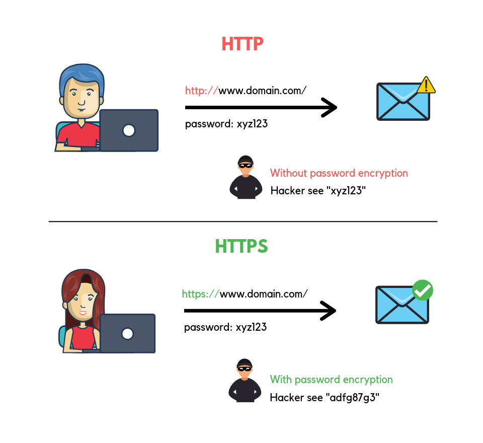
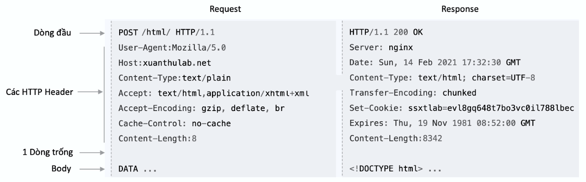
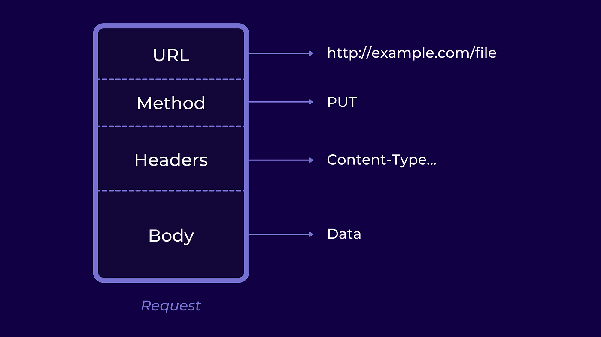
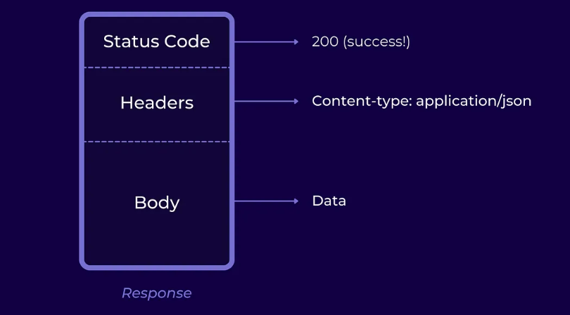
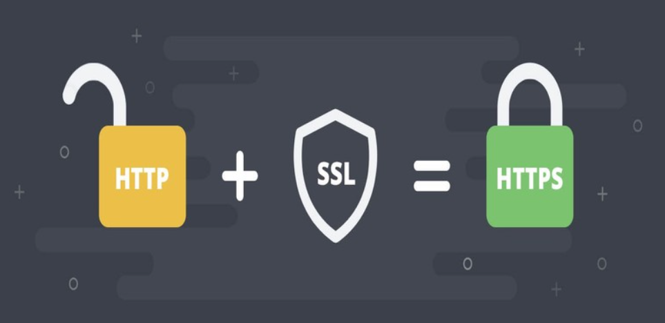
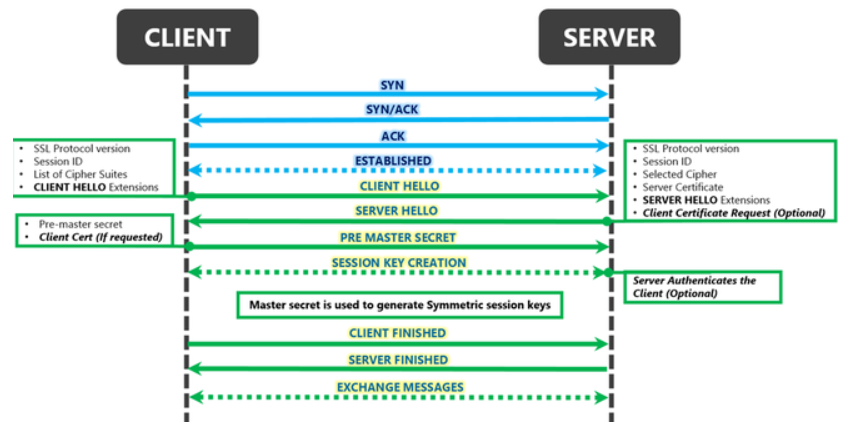

# Tìm hiểu HTTP/HTTPS

HTTP (Hypertext Transfer Protocol) và HTTPS (Hypertext Transfer Protocol Secure) là hai giao thức nền tảng cho việc truyền tải dữ liệu trên World Wide Web (WWW).



## HTTP

### 1. Khái niệm HTTP

HTTP (HyperText Transfer Protocol) là giao thức truyền tải siêu văn bản, là một giao thức lớp ứng dụng trong mô hình OSI (Open Systems Interconnection). HTTP được sử dụng để trao đổi thông tin giữa trình duyệt web (client) và máy chủ web (server). Đây là nền tảng của World Wide Web (WWW), cho phép người dùng truy cập các trang web thông qua các trình duyệt như Brave, Chrome, Edge,...

*Ví dụ: Khi bạn nhập một URL (ví dụ: <http://example.com>), trình duyệt sẽ gửi yêu cầu HTTP tới máy chủ, và máy chủ sẽ phản hồi lại nội dung trang web.*

### 2. Các thành phần chính của HTTP



- **Máy khách (Client):**
  - Thường là trình duyệt web (ví dụ: Brave, Chrome).
  - Gửi yêu cầu HTTP đến máy chủ để truy xuất tài nguyên (vd: truy cập 1 website).
- **Máy chủ (Server):**
  - Lưu trữ các tài nguyên web.
  - Nhận yêu cầu HTTP từ Client và phản rồi HTTP chứa tài nguyên được yêu cầu.
- **Yêu cầu (Request):**
  - Thông điệp được gửi từ Client đến Server.
  - Chứa thông tin về tài nguyên được yêu cầu và phương thức yêu cầu (vd: POST, GET).
- **Phản hồi (Response):**
  - Thông điệp phản hồi từ Server tới Client.
  - Chứa tài nguyên được yêu cầu và mã trạng thái. (vd: 200 OK, 404 Not Found).

### 3. Cách hoạt động của HTTP

`Bước 1: Người dùng nhập URL`

- URL: Là địa chỉ duy nhất của một tài nguyên trên web.
- Cấu trúc URL:

```plaintext
http://example.com:80/path/to/page?query=value#section
```
  
- *http:* Giao thức sử dụng.
- *example.com:* Tên miền (hostname) của máy chủ.
- *80:* Cổng giao tiếp (HTTP sử dụng cổng mặc định là 80, HTTPS dùng 443).
- */path/to/page:* Đường dẫn tài nguyên.
- *?query=value:* Chuỗi truy vấn (Query Parameters).
- *#section:* Định vị (Fragment) – chỉ định vị trí cụ thể trên trang.

`Bước 2: Trình duyệt gửi yêu cầu HTTP (HTTP Request)`

Trình duyệt sẽ phân giải tên miền (DNS Lookup) thành địa chỉ IP của máy chủ và mở kết nối thông qua TCP/IP.



Nội dung của một HTTP Request bao gồm:

- **Request Line:** Dòng lệnh chính (phương thức, tài nguyên, phiên bản HTTP). (vd: `GET /index.html HTTP/1.1`)
  - GET: Phương thức HTTP.
  - /index.html: Đường dẫn tài nguyên.
  - HTTP/1.1: Phiên bản HTTP.
- **Request Headers:** Các thông tin bổ sung
  - Host: Tên miền của máy chủ (vd: *example.com*).
  - User-Agent: Thông tin về trình duyệt, hệ điều hành của client (vd: *Mozilla/5.0*).
  - Accept: Các loại dữ liệu mà client có thể xử lý (HTML, JSON, XML,...) (vd: text/html).
  - Content-Type: Loại dữ liệu gửi đi (ví dụ: JSON, XML).
- **Request Body (tuỳ chọn):** Dữ liệu gửi lên (thường gặp trong POST, PUT).

VD: Yêu cầu GET:

```plaintext
GET /index.html HTTP/1.1
Host: example.com
User-Agent: Mozilla/5.0
Accept: text/html
```

`Bước 3: Máy chủ xử lý yêu cầu`

- **Nhận yêu cầu:** Máy chủ nhận và đọc nội dung HTTP Request.
- **Xử lý yêu cầu:**
  - Kiểm tra tính hợp lệ của yêu cầu.
  - Tìm tài nguyên (file HTML, hình ảnh, API,...).
  - Kiểm tra quyền truy cập (nếu cần).
- **Phản hồi yêu cầu (Response):** Máy chủ tạo và gửi lại HTTP Response cho Client

`Bước 4: Máy chủ gửi phản hồi (HTTP Response)`



Phản hồi của máy chủ gồm 3 phần chính:

- **Status Line:** Trạng thái của phản hồi. (vd: *HTTP/1.1 200 OK*).
- **Response Headers:** Thông tin về phản hồi.
- **Response Body:** Nội dung tài nguyên

Ví dụ phản hồi 200 OK:

```php-template
HTTP/1.1 200 OK
Content-Type: text/html
Content-Length: 512

<html>
  <body>
    <h1>Hello, World!</h1>
  </body>
</html>
```

- **Status Line:**
  - *HTTP/1.1:* Phiên bản HTTP.
  - *200:* Mã trạng thái (status code). Mô tả OK.
- **Response Headers:**
  - Content-Type: Loại dữ liệu
  - Content-Length: Kích thước nội dung phản hồi (tính bằng byte).
  - Date: Thời gian phản hồi.
- **Response Body:** Nội dung HTML.

### 4. Các phương phương thức (Methods) chính trong HTTP

| Phương thức | Chức năng |
|-----------|-------------|
| GET | Lấy dữ liệu từ máy chủ. |
| POST | Gửi dữ liệu lên máy chủ (ví dụ: form đăng ký). |
| PUT | Cập nhật toàn bộ dữ liệu tài nguyên. |
| PATH | Cập nhật một phần dữ liệu tài nguyên. |
| DELETE | Xóa tài nguyên trên máy chủ. |
| HEAD | Giống GET nhưng chỉ trả về phần header. |
| OPTIONS | Kiểm tra các phương thức được hỗ trợ. |

### 5. Các mã trạng thái HTTP

Các mã trạng thái cho biết kết quả xử lý yêu cầu của máy chủ:

- **1xx (Thông tin):** Yêu cầu đang được tiếp tục xử lý.
  - `100 Continue`: Máy chủ chấp nhận yêu cầu sơ bộ.
- **2xx (Thành công):** Yêu cầu đã được xử lý thành công.
  - `200 OK`: Yêu cầu thành công.
  - `201 Created`: Tài nguyên đã được tạo thành công.
- **3xx (Chuyển hướng):** Yêu cầu cần chuyển hướng tới URL khác.
  - `301 Moved Permanently`: URL đã chuyển vĩnh viễn.
  - `302 Found`: Chuyển hướng tạm thời.
- **4xx (Lỗi client):** Có lỗi từ phía người dùng.
  - `400 Bad Request`: Yêu cầu không hợp lệ.
  - `401 Unauthorized`: Không có quyền truy cập.
  - `404 Not Found`: Không tìm thấy tài nguyên.
- **5xx (Lỗi server):** Có lỗi từ phía máy chủ.
  - `500 Internal Server Error`: Lỗi máy chủ.
  - `502 Bad Gateway`: Máy chủ phản hồi không hợp lệ.

### 6. Các loại kết nối trong HTTP

**Kết nối không duy trì (Stateless):**

- Mỗi yêu cầu là độc lập, không lưu trạng thái của các lần trao đổi trước.
- Ví dụ: Mỗi lần tải trang sẽ tạo một kết nối mới.

**Persistent Connection (HTTP/1.1 trở lên):**

- Kết nối được giữ mở cho nhiều yêu cầu (giảm chi phí thiết lập kết nối lại).
- Được kích hoạt bằng header:

  ```plaintext
  Connection: keep-alive
  ```

### 7. Phiên bản HTTP

- **HTTP/1.0:** Phiên bản đầu tiên, mỗi yêu cầu tạo một kết nối riêng biệt.
- **HTTP/1.1:** Hỗ trợ kết nối keep-alive (giữ kết nối mở cho nhiều yêu cầu).
- **HTTP/2:** Tối ưu hóa tốc độ với multiplexing (gửi nhiều yêu cầu cùng lúc qua một kết nối).
- **HTTP/3:** Sử dụng QUIC thay vì TCP, cải thiện tốc độ và bảo mật.

## HTTPS

### 1. Khái niệm HTTPS



Giao thức HTTPS (HyperText Transfer Protocol Secure) là phiên bản bảo mật của giao thức HTTP, thiết kế để bảo vệ dữ liệu khi truyền qua internet bằng cách mã hóa thông tin. HTTPS thêm một lớp bảo mật bằng cách kết hợp HTTP với công nghệ mã hóa SSL (Secure Sockets Layer) và TLS (Transport Layer Security).

### 2. Cách hoạt động của HTTPS

HTTPS hoạt động bằng cách mã hóa dữ liệu truyền tải giữa client (trình duyệt) và server (máy chủ web), sử dụng giao thức TLS (Transport Layer Security) hoặc SSL (Secure Sockets Layer).



**Quy trình thiết lập kết nối HTTPS (TLS/SSL Handshake)** gồm 5 bước: Client Hello -> Server Hello -> Xác thực chứng chỉ -> Trao đổi khóa -> Mã hóa kết nối

`Bước 1`: **Client Hello**

Khi người dùng truy cập một trang web sử dụng HTTPS, trình duyệt (client) gửi một yêu cầu tới máy chủ (server). Yêu cầu bao gồm:

- **Phiên bản TLS/SSL:** Các phiên bản giao thức mà trình duyệt hỗ trợ (ví dụ: TLS 1.2, TLS 1.3).
- **Danh sách các thuật toán mã hóa (Cipher Suites):** Các phương pháp mã hóa mà trình duyệt có thể sử dụng (ví dụ: AES, RSA, ECDSA).
- **Random Number (Số ngẫu nhiên):** Một số ngẫu nhiên dùng để tạo khóa phiên (session key) sau này.

Ví dụ dữ liệu Client gửi đi:

```plaintext
Client Hello:
    TLS Version: TLS 1.3
    Cipher Suites: AES_256_GCM, CHACHA20_POLY1305
    Random Number: 12345abc
```

`Bước 2`: **Server Hello**

Máy chủ phản hồi lại trình duyệt với các thông tin sau:

- **Phiên bản TLS/SSL:** Máy chủ chọn phiên bản giao thức phù hợp nhất.
- **Thuật toán mã hóa (Cipher Suite):** Máy chủ chọn thuật toán mã hóa tốt nhất mà cả hai bên đều hỗ trợ.
- **Random Number:** Một số ngẫu nhiên do máy chủ tạo ra.
- **Chứng chỉ số (SSL/TLS Certificate):** Chứng minh danh tính của máy chủ.

```plaintext
Server Hello:
    TLS Version: TLS 1.3
    Chosen Cipher Suite: AES_256_GCM
    Random Number: xyz789
    Certificate: example.com (Đã được xác thực)
```

`Bước 3`: **Xác thực chứng chỉ SSL/TLS**

Khi nhận được tin "server hello" từ server, client sẽ lấy SSL certificate trong tin nhắn đó và gửi yêu cầu tới CA (là nơi cấp SSL certificate cho server) để xác thực xem mình có đang nhận tin từ chính chủ hay không:

- **Tính hợp pháp:** Chứng chỉ được cấp bởi tổ chức chứng thực đáng tin cậy (CA – Certificate Authority).
- **Hạn sử dụng:** Chứng chỉ có còn hợp lệ không (thời gian bắt đầu và kết thúc).
- **Tên miền khớp:** Tên miền trên chứng chỉ phải khớp với tên miền truy cập.

*Nếu chứng chỉ không hợp lệ, trình duyệt sẽ cảnh báo: "Kết nối không an toàn" (Your connection is not private).*

`Bước 4`: **Trao đổi khóa phiên (Session Key Exchange)**

Nếu chứng chỉ hợp lệ, trình duyệt và máy chủ sẽ tạo một khóa phiên bí mật (Session Key) để mã hóa dữ liệu. 2 phương pháp chính để tạo khóa phiên:

- **RSA (Rivest–Shamir–Adleman)** – Cũ hơn:
  - Máy chủ gửi Public Key (khóa công khai) cho trình duyệt.
  - Trình duyệt tạo Session Key và mã hóa nó bằng Public Key.
  - Máy chủ giải mã bằng Private Key (khóa riêng).
- **ECDHE (Elliptic Curve Diffie-Hellman Ephemeral)** – Hiện đại:
  - Cả hai bên sử dụng thuật toán Diffie-Hellman để tạo khóa phiên chung mà không cần gửi khóa qua mạng.
  - An toàn hơn vì không cần truyền khóa trực tiếp.

`Bước 5`: **Hoàn tất Handshake & Bắt đầu mã hóa**

Sau khi chia sẻ khóa thành công, kết nối an toàn được thiết lập. Tất cả dữ liệu tiếp theo sẽ được mã hóa bằng khóa phiên.

Các phương thức mã hóa phổ biến:

| Phương thức | Mô tả |
|-----------|-------------|
| AES-256-GCM | Mã hóa đối xứng, nhanh và an toàn. |
| CHACHA20-POLY1305 | Tối ưu cho thiết bị di động. |

`Bước 6`: **Truyền dữ liệu an toàn**

Mọi thông tin truyền đi (yêu cầu, phản hồi) đều được mã hóa:

- Dữ liệu nhạy cảm (mật khẩu, thẻ tín dụng).
- Cookie phiên làm việc (Session Cookies).

Ví dụ yêu cầu HTTPS mã hóa:

```plaintext
GET /account HTTP/1.1
Host: example.com
Cookie: session_id=abcd1234
```

## Khác nhau giữa HTTP và HTTPS

| Tiêu chí | HTTP | HTTPS |
|-----------|-------------|---------|
| Bảo mật | Không mã hóa – Dữ liệu truyền tải có thể bị đánh cắp hoặc thay đổi. | Mã hóa – Dữ liệu được bảo vệ khỏi nghe lén, sửa đổi hoặc giả mạo. |
| Chứng chỉ SSL/TLS | Không sử dụng chứng chỉ bảo mật. | Có sử dụng chứng chỉ SSL/TLS để xác thực và mã hóa. |
| Cổng (Port) | 80 (Mặc định) | 443 (Mặc định) |
| Xác thực máy chủ | Không có xác thực, dễ bị tấn công giả mạo. | Có xác thực, đảm bảo kết nối với máy chủ đáng tin cậy. |
| Tốc độ | Nhanh hơn do không có quá trình mã hóa. | Chậm hơn một chút vì cần mã hóa dữ liệu. |
| An toàn dữ liệu | Dễ bị tấn công: - Man-in-the-Middle (MITM) - Eavesdropping (nghe lén). | An toàn hơn: Dữ liệu được mã hóa end-to-end. |
| Ứng dụng | Phù hợp với các trang công khai, không cần bảo mật (ví dụ: blog, diễn đàn mở). | Bắt buộc với các trang cần bảo mật như: - Giao dịch ngân hàng. - Đăng nhập tài khoản. - Thương mại điện tử. |
