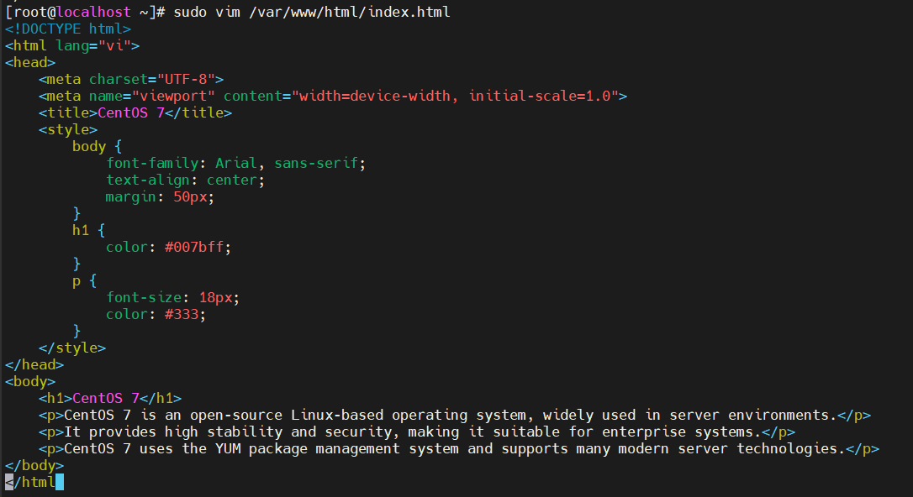
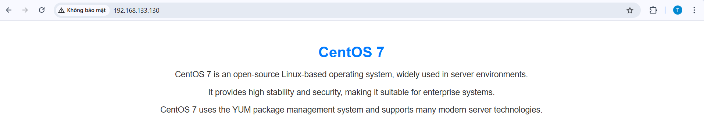

# Cấu hình một web tĩnh với Apache

Mặc định, Apache sử dụng thư mục `/var/www/html/` để lưu trữ website. Có thể tạo một trang web tĩnh trong thư mục này hoặc cấu hình thư mục riêng.

Thông thường, website sẽ ưu tiên chạy vào file có trên index (ví dụ: index.html, index.css, index.js)

VD: Trong folder html có 3 file html như: dashboard.html, card.html, index.html thì khi đứng tại thư mục dashboard trên trình duyệt, file index.html sẽ được hiển thị.

## Cấu hình một web tĩnh

### 1. Tạo file

Tạo file trắng với câu lệnh `touch`:

Nếu đứng ở thư mục gốc, sử dụng lệnh:

```plaintext
sudo touch /var/www/html/index.html
```

Nếu đứng ở thư mục `/var/www/html/` thì chỉ cần sử dụng câu lệnh:

```plaintext
sudo touch index.html
```

### 2. Chỉnh sửa nộ dung file

sử dụng câu lệnh `vim` (cần tải `vim` trước) để chỉnh sửa:

```plaintext
sudo vim index.html

hoặc

sudo vim /var/www/html/index.html
```

Sau khi màn hỉnh hiển thị nội dung của file index.html (nếu file trắng sẽ không có nội dung gì), nhấn `i` để chỉnh sửa nội dung bên trong.

VD: chỉnh sửa thêm nội dung vào file /var/www/html/index.html

`Bước 1: Tạo file index.html (nếu chưa có)`:

```plaintext
sudo touch /var/www/html/index.html
```

`Bước 2: Chỉnh sửa file index.html`:

```plaintext
sudo vim /var/www/html/index.html
```

Sau đi vào trong file index.html và bấm `i` để chỉnh sửa, thêm nội dung như ảnh dưới đây:



Chỉnh sửa xong, nhấn `ESC` và gõ `:wq` + `Enter` để lưu và thoát.

`Bước 3: Kiểm tra kết quả`:

Trên trình duyệt, vào địa chỉ `http://<IP-server>`:



### 3. Tạo folder

Để tạo folder, sử dụng câu lệnh `mkdir`.

Ví dụ tạo folder card trong file /var/www/html/

```plaintext
sudo vim /var/www/html/card
```

Sử dụng câu lệnh `ls` để kiểm tra folder card đã tồn tại chưa:

```plaintext
sudo ls /var/www/html
```

Nếu trong kết quả có folder card, tạo thành công.

*Lưu ý:*

Trong một folder có các file như `index.html`, `dashboard.html`, `card.html`. Khi yêu cầu URL trên trình duyệt, nếu truy cập file `index.html`, có thể truy cập bằng cách:

```plaintext
http://<IP-server>/index.html

hoặc

http://<IP-server>/
```

những file còn lại bắt buộc phải đầy đủ file như

```plaintext
http://<IP-server>/dashboard.html
http://<IP-server>/card.html
```

Bởi vì mặc định của website, nếu không có file cụ thể, sẽ mặc định chạy vào `index.html`
