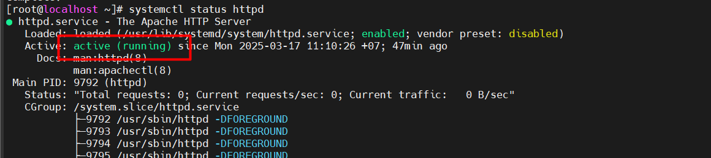

# Apache HTTP Server

## Apache là gì?

Apache HTTP Server (thường gọi là Apache) là một phần mềm máy chủ web (web server) mã nguồn mở, miễn phí, được phát triển và duy trì bởi Apache Software Foundation. Apache đóng vai trò chính trong việc nhận các yêu cầu từ trình duyệt (client) và phản hồi nội dung web (HTML, CSS, JS, hình ảnh,…) về trình duyệt.

### Kiến trúc tổng quan của Apache

- Apache hoạt động dựa trên mô hình client-server.
- Khi một trình duyệt web (client) gửi yêu cầu HTTP đến máy chủ Apache, máy chủ sẽ xử lý yêu cầu và gửi phản hồi HTTP chứa nội dung yêu cầu (ví dụ: trang web, hình ảnh, video) về cho trình duyệt.
- Kiến trúc của Apache được thiết kế theo dạng mô-đun (module-based), cho phép người dùng linh hoạt tùy chỉnh và mở rộng chức năng của máy chủ bằng cách thêm hoặc xóa các mô-đun.

### Các thành phần chính của Apache

**Core (Lõi):** Đây là thành phần cốt lõi của Apache, chịu trách nhiệm xử lý các yêu cầu HTTP cơ bản, quản lý tiến trình và luồng, và cung cấp các dịch vụ cơ bản khác.

**Modules (Mô-đun):** Apache hỗ trợ một loạt các mô-đun có thể được tải và cấu hình để mở rộng chức năng của máy chủ.

| Module | Chức năng |
|-----------|-------------|
| `mod_ssl` | Hỗ trợ kết nối an toàn qua HTTPS. |
| `mod_rewrite` | Viết lại URL (URL Rewriting). |
| `mod_php` | Chạy mã PHP (tạo nội dung động). |
| `mod_proxy` | Cấu hình Proxy và cân bằng tải. |
| `mod_security` | Tăng cường bảo mật (chống tấn công XSS). |
| `mod_cache` | Bộ nhớ đệm (Caching). |

**File cấu hình chính:**

- /etc/httpd/httpd.conf (Linux).
- C:\Program Files\Apache Group\Apache2\conf\httpd.conf (Windows).

## Cài đặt Apache

### Ubuntu Server

`Bước 1: Cập nhật hệ thống`

Trước khi cài đặt Apache, hãy cập nhật danh sách gói và hệ thống để đảm bảo mọi thứ đều mới nhất:

```plaintext
sudo apt update && sudo apt upgrade - y
```

- `sudo` – Chạy lệnh với quyền quản trị (superuser).
- `apt update` – Cập nhật danh sách gói phần mềm từ kho lưu trữ.
- `apt upgrade -y` – Nâng cấp tất cả các gói đã cài đặt lên phiên bản mới nhất (-y đồng ý tự động mà không cần xác nhận).

`Bước 2: Cài đặt Apache`

Chạy lệnh sau để cài đặt Apache:

```plaintext
sudo apt install apache2 -y
```

- `apt install apache2` – Yêu cầu cài đặt gói phần mềm Apache.

`Bước 3: Kiểm tra trạng thái của Apache`

Để kiểm tra xem Apache chạy chưa, sử dụng lệnh:

```plaintext
sudo systemctl status apache2
```

- `systemctl` – Công cụ quản lý dịch vụ trong Linux.
- `status apache2` – Kiểm tra trạng thái hiện tại của Apache.

Nếu Apache đang chạy, bạn sẽ thấy đầu ra hiển thị `active (running)`.


`Bước 4: Truy cập web mặc định của Apache`

Mở trình duyệt và nhập địa chỉ IP của máy chủ ubuntu để kiểm tra:

```plaintext
http://<Địa chỉ IP máy chủ ubuntu>
```

Kết quả:


### CentOS 7 minimal

`Bước 1: Cập nhật hệ thống`

Trước khi cập nhật, đảm bảo hệ thống được cập nhật:

```plaintext
sudo yum update -y
```

`Bước 2: Cài đặt Apache (httpd)`

Dùng câu lệnh sau để cài đặt Apache:

```plaintext
sudo yum install httpd -y
```

- `yum install httpd` → Cài đặt gói Apache (httpd).
- `-Y` → Tự động đồng ý với các xác nhận cài đặt.

`Bước 3: Khởi động và kích hoạt Apache`

Sau khi cài đặt, cần khởi động Apache và cấu hình để nó tự động chạy khi máy khởi động:

```plaintext
sudo systemctl start httpd
sudo systemctl enable httpd
```

- `systemctl start httpd` → Khởi động Apache.
- `systemctl enable httpd` → Cấu hình để Apache tự động chạy sau khi reboot.

Kiểm tra trạng thái Apache:

```plaintext
sudo systemctl status httpd
```

Nếu Apache đang chạy, sẽ thấy dòng `Active: active (running)`:



`Bước 4: Truy cập web mặc định của Apache`

Mở trình duyệt và nhập địa chỉ IP của máy chủ CentOS để kiểm tra:

```plaintext
http://<Địa chỉ IP máy chủ CentOS>
```

Kết quả:


## Đổi port mặc định chạy service của Apache

`Bước 1:` Kiểm tra xem Appache đang lắng nghe trên những cổng nào.

**CentOS 7:**

```plaintext
sudo ss -tulnp | grep httpd
```

- `ss -tulnp`: Hiển thị danh sách các cổng đang mở.
- `grep httpd`: Lọc ra kết quả liên quan đến Apache (httpd).

**Ubuntu:**

```plaintext
sudo ss -tulnp | grep apache2
```

Kết quả:


Cổng đang lắng nghe trên cổng 80.

`Bước 2`: Chỉnh sửa file cấu hình Apache

Mở file cấu hình để sửa cổng

**CentOS 7:**

```plaintext
sudo vi /etc/httpd/conf/httpd.conf
```

Tại dòng có `Listen 80`, đổi thành `Listen 8080` và lưu lại

**Ubuntu:**

```plaintext
sudo vi /etc/apache2/ports.conf
```

Tương tự đổi cổng 80 thành 8080.

`Bước 3`: Chỉnh sửa tường lửa (nếu cần)

Sử dụng câu lệnh:

```plaintext
sudo vi firewall-cmd --permanent --add-port=8080/tcp
sudo vi firewall-cmd --reload
```

Sau khi thay đổi, kiểm tra lại kết quả:

```plaintext
sudo firewall-cmd --list-ports
```


Kết quả: cổng 8080 đã được thêm.

`Bước 4`: sử dụng địa chỉ port trên trình duyệt

```plaintext
http://<IP-server>:8080
```


