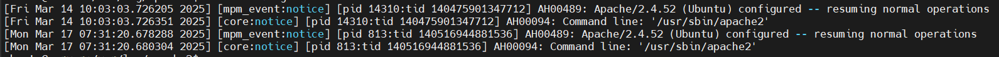

# Cấu trúc file log Apache

## Khái niệm

Apache logs là ghi lại các sự kiện được xử lý bởi Apache webserver, bao gồm các yêu cầu từ máy tính khác, các phản hồi được gửi bởi Apache và các hành động trên Apache webserver.

Apache có 2 loại file log chính:

1. **Access log (Nhật ký truy cập):** Ghi lại mọi yêu cầu từ client (người dùng).
2. **Error log (Nhật ký lỗi):** Ghi lại lỗi và thông tin gỡ lỗi của Apache.

## Vị trí đặt file log

**CentOS 7:**

- Access log: `/var/log/httpd/access_log`
- Error log: `/var/log/httpd/error_log`

**Ubuntu Server:**

- Access log: `/var/log/apache2/access.log`
- Error log: `/var/log/apache2/error.log`

## Cấu trúc file log

### 1. Access log

Mặc định, mỗi dòng trong file access.log (hoặc access_log) có định dạng như sau:


- `192.168.133.1`: Địa chỉ IP của client. Trong trường hợp này, máy tính có IP 192.168.133.1 đã truy cập Apache.
- `- -`: Trường nhận diện người dùng (thường để trống).
  - Trường đầu tiên thường dành cho identd (hệ thống xác thực danh tính của người dùng, thường không được sử dụng, nên hiển thị -).
  - Trường thứ hai dành cho tên người dùng xác thực (nếu sử dụng xác thực Basic Auth, nó sẽ có giá trị, còn nếu không thì là -).
- `[14/Mar/2025:10:04:16 +0000]`: Thời gian được gửi.
  - Ở đây, lúc 10:04:16 UTC ngày 14/03/2025, Apache nhận được một yêu cầu.
- `"GET / HTTP/1.1"`
  - Phương thức HTTP: GET (client yêu cầu tài nguyên).
  - Tài nguyên được yêu cầu: / (trang chủ).
  - Phiên bản giao thức: HTTP/1.1.
- `200`: Mã trạng thái HTTP.
  - 200: Thành công.
  - 404: Không tìm thấy tài nguyên.
  - 500: Lỗi máy chủ.
  - 403: Truy cập bị từ chối.
- `3460`: Số byte trong phản hồi được gửi tới client.
- `-`: Trường "referer" (nguồn giới thiệu)
  - Nếu client truy cập trực tiếp mà không thông qua trang khác, nó sẽ là "-".
  - Nếu một trang web giới thiệu, nó sẽ chứa URL của trang đó.
- `Mozilla/5.0 (Windows NT 10.0; Win64; x64) AppleWebKit/537.36 (KHTML, like Gecko) Chrome/134.0.0.0 Safari/537.36`
  - User-Agent: Trình duyệt và hệ điều hành của client.
  - Ở đây sử dụng hệ điều hành window 10 (64-bit), trình duyệt Google Chrome 134.0.0.0

### 2. Error log

File error.log (hoặc error_log) ghi lại lỗi dưới dạng:



- `[Fri Mar 14 10:03:03.726205 2025]`:
  - Thời gian ghi log: Ngày, giờ, microsecond, và năm
  - Log này được ghi vào ngày 14 tháng 3 năm 2025, lúc 10:03:03.726205 (UTC hoặc theo múi giờ của server).
- `[mpm_event:notice]`:
  - `mpm_event`: Đây là Multi-Processing Module (MPM) đang được sử dụng. Trong trường hợp này, Apache đang chạy với MPM Event, tối ưu hóa cho hiệu suất và khả năng xử lý nhiều kết nối đồng thời.
  - `notice`: Mức độ log. các mức phổ biến trong error.log bao gồm:
    - `emerg`: Lỗi nghiêm trọng (Apache có thể ngừng hoạt động).
    - `alert`: Cảnh báo quan trọng.
    - `crit`: Lỗi nghiêm trọng nhưng không ngừng server.
    - `error`: Lỗi thông thường.
    - `warn`: Cảnh báo có thể cần chú ý.
    - `notice`: Thông báo quan trọng nhưng không phải lỗi.
    - `debug`: Chế độ gỡ lỗi.
- `[pid 14310:tid 140475901347712]`
  - `pid 14310`: Process ID của Apache (tiến trình chính).
  - `tid 140475901347712`: Thread ID (tiến trình con của Apache đang xử lý).
- `AH00489: Apache/2.4.52 (Ubuntu) configured -- resuming normal operations`:
  - `AH00489`: Mã thông báo cụ thể của Apache (được định nghĩa trong mã nguồn của Apache).
  - `Apache/2.4.52 (Ubuntu) configured`: Phiên bản Apache đang chạy.
  - `resuming normal operations`: Máy chủ đã được cấu hình thành công và đang tiếp tục hoạt động bình thường.

### 3. Kiểm tra file log

```plaintext
cat var/log/apache2/access.log
tail -f var/log/apache2/access.log
```

- `cat`: Hiển thị toàn bộ file (nếu file quá lớn, lệnh có thể làm tràn màn hình và khó đọc).
- `tail -f`: Hiển thị các dòng cuối cùng của file (mặc định là 10).
