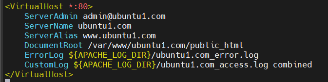
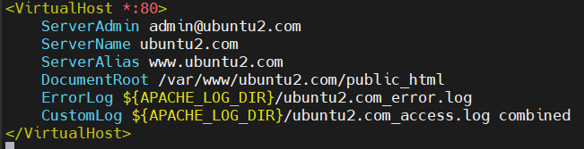
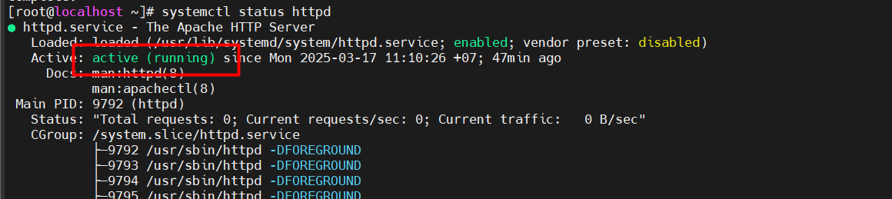

# Virtual host

## Virtual Host trong Apache là gì?

**Virtual Host (VHost)** là một tính năng của Apache cho phép chạy nhiều website trên cùng một máy chủ bằng cách cấu hình nhiều domain hoặc subdomain khác nhau trên một địa chỉ IP.

Có 2 loại Virtual host chính:

- **Name-based Virtual Host:** Dựa trên tên miền (domain) để phân biệt các website.

  Ví dụ: `site1.com`, `site2.com` chạy trên cùng một server với một địa chỉ IP duy nhất.

- **IP-based Virtual Host:** Mỗi website có một địa chỉ IP riêng biệt. (Ít phổ biến hơn)

## Cấu hình Virtual Host trong Apache (Cấu hình nhiều website trên 1 webserver)

### Trên Ubuntu

`Bước 1:` Cài đặt Apache (nếu chưa có)

chạy các lệnh sau để cài đặt:

```plaintext
sudo apt update
sudo apt install apache2 -y
```

`Bước 2:` Tạo thư mục cho từng website

Giả sử có 2 website là ubuntu1.com và ubuntu2.com.

Tạo thư mục chứa từng website trong folder /var/www

```plaintext
sudo mkdir -p /var/www/ubuntu1.com/public_html
sudo mkdir -p /var/www/ubuntu2.com/public_html
```

- `sudo`: Lệnh này cho phép thực thi lệnh với quyền của người dùng root (siêu người dùng), cần thiết để tạo thư mục trong các thư mục hệ thống.
- `mkdir`: Viết tắt của "make directory", lệnh này được sử dụng để tạo thư mục.
- `-p`: Tùy chọn này có nghĩa là "parents". Nó cho phép lệnh tạo các thư mục cha nếu chúng chưa tồn tại. Trong trường hợp này, nếu /var/www/ubuntu1.com chưa tồn tại, nó sẽ được tạo trước khi public_html được tạo.

Cấp quyền cho thư mục:

```plaintext
sudo chown -R $USER:$USER /var/www/ubuntu1.com/public_html
sudo chown -R $USER:$USER /var/www/ubuntu2.com/public_html
sudo chmod -R 755 /var/www
```

- `chown`: Viết tắt của "change owner", lệnh này được sử dụng để thay đổi quyền sở hữu của tệp hoặc thư mục.
- `-R`: Tùy chọn này có nghĩa là "recursive". Nó cho phép lệnh thay đổi quyền sở hữu của tất cả các tệp và thư mục con bên trong thư mục được chỉ định.
- `$USER:$USER`: Biến môi trường $USER chứa tên người dùng hiện tại của bạn. Phần đầu tiên $USER đặt người dùng sở hữu, và phần thứ 2 $USER đặt nhóm sở hữu.
- `chmod`: Viết tắt của "change mode", lệnh này được sử dụng để thay đổi quyền truy cập của tệp hoặc thư mục.
- `755`: Đây là mã quyền truy cập. Nó có nghĩa là:
  - Người dùng sở hữu có quyền đọc (4), ghi (2) và thực thi (1) (4 + 2 + 1 = 7).
  - Nhóm sở hữu có quyền đọc (4) và thực thi (1) (4 + 1 = 5).
  - Những người dùng khác có quyền đọc (4) và thực thi (1) (4 + 1 = 5).

`Bước 3:` Tạo trang index cho từng website

Tạo file `index.html` trong từng thư mục của từng site:

```plaintext
echo "<h1>Welcome to Ubuntu1.com</h1>" | sudo tee /var/www/ubuntu1.com/public_html/index.html
echo "<h1>Welcome to Ubuntu2.com</h1>" | sudo tee /var/www/ubuntu2.com/public_html/index.html
```

- `echo`: lệnh dùng để in ra một chuỗi văn bản.
- `|`: là toán tử ống dẫn (pipe). Nó chuyển đầu ra của lệnh bên trái (echo) làm đầu vào cho lệnh bên phải (sudo tee).
- `tee`: Lệnh này đọc đầu vào tiêu chuẩn (trong trường hợp này là đầu ra từ lệnh echo) và ghi nó vào tệp được chỉ định, đồng thời in nó ra đầu ra tiêu chuẩn.

`Bước 4:` Tạo VirtualHost cho từng  website

Tạo file cấu hình cho từng website trong `/etc/apache2/sites-available/`:

**Cấu hình cho `ubuntu1.com:`**

```plaintext
sudo vi /etc/apache2/sites-available/ubuntu1.com.conf
```

Nội dung cần thêm:



- `<VirtualHost *:80>`: Đây là thẻ cấu hình VirtualHost. `*` đại diện cho tất cả các địa chỉ IP trên máy chủ. `80` chỉ định cổng VirtualHost này lắng nghe.
- `ServerAdmin`:  tên miền chính của VirtualHost. Khi một yêu cầu HTTP đến máy chủ với tiêu đề Host là ubuntu1.com, Apache sẽ sử dụng cấu hình VirtualHost này để xử lý yêu cầu.
- `ServerAlias`: Chỉ định các tên miền phụ (alias) khác mà VirtualHost này cũng sẽ xử lý. Trong trường hợp này, nếu một yêu cầu HTTP đến máy chủ với tiêu đề Host là `www.ubuntu1.com`, Apache cũng sẽ sử dụng cấu hình VirtualHost này. Điều này cho phép người dùng truy cập trang web bằng cả `ubuntu1.com` và `www.ubuntu1.com`.
- `DocumentRoot`: Chỉ định thư mục gốc chứa các tệp trang web của VirtualHost. Khi một yêu cầu HTTP đến, Apache sẽ tìm kiếm các tệp trong thư mục này để phục vụ cho người dùng.
- `ErrorLog ${APACHE_LOG_DIR}/ubuntu1.com_error.log` hỉ định đường dẫn đến tệp nhật ký lỗi của VirtualHost. Tất cả các lỗi gặp phải khi xử lý các yêu cầu cho VirtualHost này sẽ được ghi vào tệp này. `${APACHE_LOG_DIR}` là một biến môi trường của Apache, thường trỏ đến thư mục `/var/log/apache2/`.
- `CustomLog ${APACHE_LOG_DIR}/ubuntu1.com_access.log combined`: Chỉ định đường dẫn đến tệp nhật ký truy cập của VirtualHost. Tất cả các yêu cầu HTTP đến VirtualHost này sẽ được ghi vào tệp này. combined là định dạng nhật ký, cung cấp thông tin chi tiết về các yêu cầu.

**Cấu hình cho `ubuntu2.com:`**

```plaintext
sudo vi /etc/apache2/sites-available/ubuntu2.com.conf
```

Nội dung cần thêm:



`Bước 5:` Kích hoạt VirtualHost

Chạy lệnh để kích hoạt cấu hình:

```plaintext
sudo a2ensite ubuntu1.com.conf
sudo a2ensite ubuntu2.com.conf
```

- `a2ensite`: viết tắt của "Apache 2 enable site".
  - tạo các liên kết tượng trưng (symbolic links) từ các tệp cấu hình Virtual Host trong thư mục `/etc/apache2/sites-available/` đến thư mục `/etc/apache2/sites-enabled/`.
  - Apache chỉ đọc các tệp cấu hình trong thư mục `sites-enabled/`, do đó, việc tạo liên kết tượng trưng này kích hoạt cấu hình Virtual Host.

Tắt site mặc định (Nếu cần):

```plaintext
sudo a2dissite 000-default.conf
```

Kiểm tra lỗi cú pháp:

```plaintext
sudo apachectl configtest
```

- Trả về `Syntax OK` -> Thành công

Khởi động lại Apache:

```plaintext
sudo systemctl restart apache2
```

`Bước 6`: Cấu hình file hosts (Trên máy cục bộ vì truy cập website tại đó)

Trên máy cục bộ:

1. Mở file `C:\Windows\System32\drivers\etc\hosts` trên Notepad với quyền Admin.
2. Thêm vào cuối file:

    ```plaintext
    192.168.133.100 ubuntu1.com
    192.168.133.100 ubuntu2.com
    ```

`Bước 7`: Truy cập trên trình duyệt

- `http://ubuntu1.com`
- `http://ubuntu2.com`


### Trên ContOS 7

`Bước 1`: Cài đặt Apache (Nếu chưa có)

Câu lệnh cài đặt Apache:

```plaintext
sudo yum install httpd -y
```

Khởi động Apache:

```plaintext
sudo systemctl start httpd
sudo systemctl enable httpd
```

- `sudo systemctl start httpd`: Khởi động dịch vụ Apache.
- `sudo systemctl enable httpd`: Kích hoạt Apache khởi động cùng hệ thống.

Kiểm tra trạng thái Apache:



`Bước 2`: Mở cổng tường lửa

Mở cổng 80 (HTTP) để cho phép truy cập:

```plaintext
sudo firewall-cmd --permanent --add-port=80/tcp
sudo firewall-cmd --reload
```

- `permanent`: mở vĩnh viễn.

`Bước 3`: Tạo thư mục cho từng website

Tạo 2 website `site1.com` và `site2.com`:

```plaintext
sudo mkdir -p /var/www/site1.com/public_html
sudo mkdir -p /var/www/site2.com/public_html
```

Cấp quyền cho thư mục:

```plaintext
sudo chown -R apache:apache /var/www/site1.com/public_html
sudo chown -R apache:apache /var/www/site2.com/public_html
sudo chmod -R 755 /var/www
```

`Bước 4:` Tạo trang `index.html` cho từng website

```plaintext
echo "<h1>Welcom to Site1.com</h1>" | sudo tee /var/www/site1.com/public_html/index.html
echo "<h1>Welcom to Site2.com</h1>" | sudo tee /var/www/site2.com/public_html/index.html
```

- `tee`: dùng để ghi nội dung vào file.

`Bước 5`: Cấu hình VirtualHost

Apache trên CentOS 7 lưu cấu hình trong `/etc/httpd/conf.d/`. Ta sẽ tạo file VirtualHost cho từng website.

**Cấu hình cho site1.com:**

```plaintext
sudo vi /etc/httpd/conf.d/site1.conf
```

Nội dung cần thêm:

```plaintext
<VirtualHost *:80>
    ServerName site1.com
    DocumentRoot /var/www/site1.com/public_html
    <Directory /var/www/site1.com/public_html>
        AllowOverride All
        Require all granted
    </Directory>
    ErrorLog /var/log/httpd/site1_error.log
    CustomLog /var/log/httpd/site1_access.log combined
</VirtualHost>
```

**Cấu hình cho site2.com:**

```plaintext
sudo vi /etc/httpd/conf.d/site2.conf
```

Nội dung cần thêm:

```plaintext
<VirtualHost *:80>
    ServerName site2.com
    DocumentRoot /var/www/site2.com/public_html
    <Directory /var/www/site2.com/public_html>
        AllowOverride All
        Require all granted
    </Directory>
    ErrorLog /var/log/httpd/site2_error.log
    CustomLog /var/log/httpd/site2_access.log combined
</VirtualHost>
```

`Bước 6`: Kiểm tra và khởi động lại Apache

Lỗi cú pháp:

```plaintext
sudo apachectl configtest
```

- Nếu kết quả là `Syntax OK`, tiếp tục khởi động lại Apache.

```plaintext
sudo systemctl restart httpd
```

`Bước 7`: Cấu hình file hosts (Trên máy cục bộ vì truy cập website tại đó)

Trên máy cục bộ:

1. Mở file `C:\Windows\System32\drivers\etc\hosts` trên Notepad với quyền Admin.
2. Thêm vào cuối file:

    ```plaintext
    192.168.133.130 site1.com
    192.168.133.130 site2.com
    ```

`Bước 8`: Truy cập trên trình duyệt

- `http://site1.com`
- `http://site2.com`
