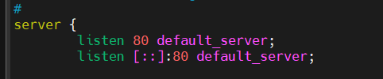

# Nginx

## Nginx là gì?

NGINX là một web server mạnh mẽ và sử dụng kiến trúc đơn luồng, hướng sự kiện vì thế nó hiệu quả hơn Apache server nếu được cấu hình chính xác. Nó cũng có thể làm những thứ quan trọng khác, chẳng hạn như load balancing, HTTP caching, hay sử dụng như một reverse proxy.

### 1. Chức năng chính

**Máy chủ web (Web server):**

- Nginx có khả năng phục vụ các trang web tĩnh (HTML, CSS, JavaScript, hình ảnh,...) và động (PHP, Python,...) một cách hiệu quả.
- Nó nổi tiếng với khả năng xử lý số lượng lớn kết nối đồng thời mà vẫn duy trì hiệu suất cao.

**Reverse proxy:**

- Nginx có thể hoạt động như một reverse proxy, nhận các yêu cầu từ máy khách và chuyển tiếp chúng đến các máy chủ ứng dụng (backend servers).
- Điều này giúp cải thiện hiệu suất, bảo mật và khả năng mở rộng của ứng dụng web.

**Cân bằng tải (Load balancer):**

- Nginx có thể phân phối lưu lượng truy cập đến nhiều máy chủ ứng dụng, giúp cân bằng tải và đảm bảo tính sẵn sàng cao của ứng dụng.

**HTTP cache:**

- Nginx có thể lưu trữ các nội dung web tĩnh trong bộ nhớ cache, giúp giảm tải cho máy chủ ứng dụng và tăng tốc độ tải trang.

### 2. Đặc điểm nổi bật

**Hiệu suất cao:**

- Nginx được thiết kế để xử lý số lượng lớn kết nối đồng thời một cách hiệu quả, đặc biệt là trong các môi trường có lưu lượng truy cập cao.

**Tiêu thụ tài nguyên thấp:**

- Nginx sử dụng ít tài nguyên hệ thống (CPU, RAM) hơn so với một số máy chủ web khác, giúp tiết kiệm chi phí phần cứng.

**Tính ổn định:**

- Nginx được biết đến với tính ổn định và khả năng hoạt động liên tục trong thời gian dài.

**Cấu hình linh hoạt:**

- Nginx cung cấp một hệ thống cấu hình linh hoạt, cho phép người dùng tùy chỉnh để phù hợp với nhu cầu của mình.

### 3. Ứng dụng phổ biến

- Phục vụ các trang web có lưu lượng truy cập lớn.
- Xây dựng các hệ thống microservices.
- Triển khai các ứng dụng web động.
- Cải thiện hiệu suất và bảo mật của ứng dụng web.

## Cài đặt nginx

### Trên Ubuntu

`Bước 1`: Cài đặt nginx

```plaintext
sudo apt install nginx -y
```

- `install nginx`: Cài đặt gói nginx.
- `-y`: Xác nhận cài đặt mà không cần hỏi.

`Bước 2`: Kiểm tra trạng thái dịch vụ

```plaintext
sudo systemctl status nginx
```

Nếu máy chưa chạy sẽ hiển thị:


Lúc này sẽ cần khởi động nginx:

```plaintext
sudo systemctl start nginx
sudo systemctl enable nginx
```

- `start nginx`: Khởi động nginx. Sau khi khởi động thành công, kiểm tra trạng thái nginx. Active: running -> OK


- `enable nginx`: Khởi động nginx khi server chạy. Có thể kiểm tra lệnh có được thực thi không với câu lệnh `sudo systemctl is-enable nginx`. Nếu trả về `enable` -> OK, nếu không có thể thử lại với `sudo systemctl enable --now nginx`.

*lưu ý: Nếu trên máy ảo có webserver khác cùng chạy, hãy đổi port (tại `Bước 3`) trước khi khởi động nginx để tránh xung đột.*

`Bước 3`: Cấu hình port mặc định của nginx

Chỉnh sửa file cấu hình nginx:

```plaintext
sudo vi /etc/nginx/sites-available/default
```

- Tìm dòng: 
- Đổi thành: 

Lưu và khởi động hệ thống với `start nginx` hoặc khởi động lại (nếu nginx đã chạy từ trước) với `restart nginx`

```plaintext
sudo systemctl start nginx
sudo systemctl restart nginx
```

`Bước 4`: Kiểm tra kết quả

Mở trình duyệt truy cập:

```plaintext
http://<IP-server>:8081

hoặc 

http://<IP-server> # Nếu chưa đổi cổng
```

- Nếu trình duyệt hiển thị trang chủ của Apache (vì Apache cùng hoạt động trên máy chủ) thì có thể cấu hình lại nginx như sau:
  - Mở file cấu hình nginx:

    ```plaintext
    sudo vi /etc/nginx/sites-available/default
    ```

  - Tìm dòng:

    ```plaintext
    root /var/www/html;

    đổi thành 

    root /var/www/nginx;
    ```

  - Vì nginx dùng `/var/www/html` để chạy website nhưng bị ghi đè bởi Apache, vậy nên đổi mặc định nginx thành `/var/www/nginx`
  - Tạo ra thư mục và file test:

    ```plaintext
    sudo mkdir /var/www/nginx
    echo "<h1>Welcomw to nginx on port 8081</h1>" | sudo tee /var/www/nginx/index.html
    ```

  - Tiến hành khởi động lại

    ```plaintext
    sudo systemctl restart nginx
    ```

Kết quả thành công:


### Trên CentOS 7

`Bước 1`: Cài đặt EPEL Repository (để lấy gói Nginx)

```plaintext
sudo yum install epel-release -y
```

- `epel-release`: Cung cấp các gói bổ sung, trong đó có nginx.

`Bước 2`: Cài đặt nginx

```plaintext
sudo yum install nginx -y
```

- `yum install nginx`: Cài đặt nginx từ EPEL.

`Bước 3`: Kiểm tra trạng thái dịch vụ

```plaintext
sudo systemctl status nginx
```

- lúc này, sẽ hiển thị `Active: inactive` vì chưa khởi động.
- Nếu cần, cấu hình cổng nginx để tránh xung đột:

    ```plaintext
    sudo yum install nginx -y
    ```

- Tìm dòng:

  

- Đổi thành:

  

`Bước 4`: Khởi động dịch vụ

```plaintext
sudo systemctl start nginx
```

Kết quả:


`Bước 5`: Kiểm tra trên trình duyệt

Nhập URL này lên trình duyệt:

```plaintext
http://<IP-server>

hoặc

http://<IP-server>:8081
```

Kết quả:


