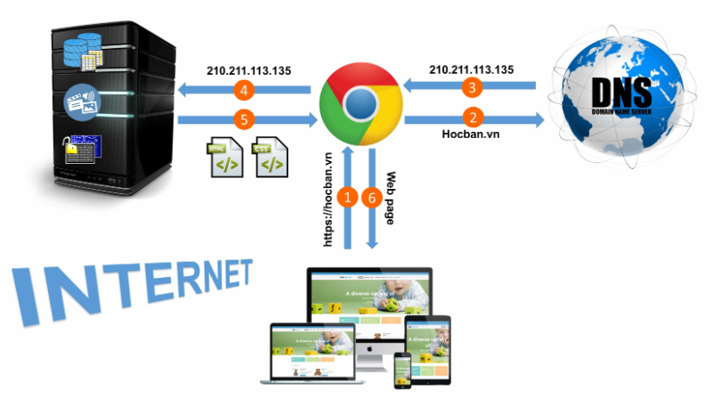
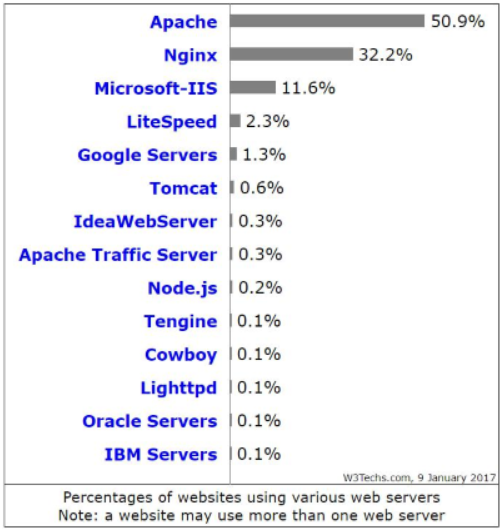

# Webserver

## Webserver là gì?

### Khái niệm

Webserver (máy chủ web) là một hệ thống phần mềm hoặc phần cứng có nhiệm vụ lưu trữ, xử lý và phân phối các nội dung web (như trang HTML, hình ảnh, video, file...) đến trình duyệt của người dùng thông qua giao thức HTTP (Hypertext Transfer Protocol) hoặc HTTPS (HTTP Secure).

### Chức năng chính

- **Lưu trữ nội dung web:** Tài liệu HTML, CSS, JavaScript, hình ảnh, video…
- **Phản hồi yêu cầu HTTP/HTTPS:** Giao tiếp với trình duyệt của người dùng.
- **Xử lý tập lệnh động (Dynamic Content):** Kết hợp với các ngôn ngữ lập trình (PHP, Python, Node.js, Java…) để xử lý nội dung động.
- **Bảo mật thông tin:** Hỗ trợ SSL/TLS để mã hóa dữ liệu truyền tải (HTTPS).
- **Ghi log & giám sát:** Theo dõi truy cập, ghi nhận lỗi và hiệu suất.

## Cách thức hoạt động



**1. Người dùng nhập URL vào trình duyệt:** Ví dụ: <https://example.com/index.html>

**2. Trình duyệt gửi yêu cầu đến DNS để phân giải tên miền thành địa chỉ IP:**

- DNS (Domain Name System) sẽ chuyển đổi tên miền example.com thành địa chỉ IP (ví dụ: 203.0.113.5).

**3. Trình duyệt sử dụng địa chỉ IP để gửi yêu cầu đến Webserver:**

- Trình duyệt thiết lập kết nối với Webserver qua giao thức HTTP (port 80) hoặc HTTPS (port 443).
- Yêu cầu gửi đi sẽ chứa các thông tin chính như:

```plaintext
GET /index.html HTTP/1.1
Host: example.com
```

**4. Webserver xử lý yêu cầu:**

- Nếu là nội dung tĩnh (HTML, CSS, JS, hình ảnh): Webserver tìm kiếm file và gửi phản hồi.
- Nếu là nội dung động (PHP, Python, Node.js…): Webserver gọi trình thông dịch hoặc chương trình phụ trợ để xử lý.

**5. Webserver gửi phản hồi (Response) về trình duyệt:**

- Nếu thành công: Trả về mã `200 OK` cùng nội dung trang web.
- Nếu lỗi: Trả về các mã lỗi như `404 Not Found`, `500 Internal Server Error`…

**6. Trình duyệt hiển thị nội dung cho người dùng:**

- Trình duyệt phân tích HTML, tải thêm tài nguyên (CSS, JS, hình ảnh), và hiển thị trang hoàn chỉnh.

## Các cơ chế tối ưu và bảo mật của Webserver

**1. Caching (Bộ nhớ đệm):** Lưu trữ tạm thời các phản hồi để phục vụ lại nhanh hơn.

**2. Load Balancing (Cân bằng tải):** Phân phối yêu cầu giữa nhiều máy chủ backend để giảm tải.

**3. SSL/TLS Encryption:** Mã hóa thông tin bằng HTTPS để bảo mật dữ liệu.

**4. Access Control (Kiểm soát truy cập):** Xác thực người dùng, giới hạn IP truy cập.

**5. Logging & Monitoring:** Ghi nhật ký yêu cầu (access log, error log) để theo dõi hoạt động.

## Các loại webserver phổ biến



- **Apache HTTP server:** Apache là web server được sử dụng rộng rãi nhất thế giới. Apache được phát triển và duy trì bởi một cộng đồng mã nguồn mở dưới sự bảo trợ của Apache Software Foundation. Apache được phát hành với giấy phép Apache License là được sử dụng tự do, miễn phí.
- **Nginx:** là một web server nhẹ, không chiếm nhiều tài nguyên của hệ thống. Nginx còn là một reserse proxy mã nguồn mở. Nginx khá là ổn định, cấu hình đơn giản và hiệu suất cao.
- **Internet Information Services (IIS):** IIS do Microsoft phát triển, sản phẩm này được tích hợp cùng với hệ điều hành Windows Server. Trong IIS bao gồm nhiều dịch vụ như: dịch vụ Web Server, dịch vụ FTP Server.
- **Apache Tomcat:** là một Java Servlet được phát triển bởi Apache Software Foundation. Tomcat thực thi các ứng dụng Java Servlet và JavaServer Pages (JSP). Tomcat cung cấp một máy chủ HTTP cho ngôn ngữ Java thuần túy.
- **Lighttpd:** là một phần mềm mã nguồn mở, an toàn và linh hoạt, đặc biệt miễn phí và được phân phối theo giấy phép BSD. Lighttpd được viết bởi Jan Kneschke. Lighttpd chiếm ít tài nguyên, memory thấp, CPU nhỏ. Lighttpd được phát triển bằng ngôn ngữ C. chạy trên hệ điều hành Linux, Windows, Mac OS,…

### So sánh nhanh giữa Apache và Nginx

| Tiêu chí | Apache | Nginx |
|-----------|-------------|---------|
| Hiệu suất | Tốt với nội dung động. | Tốt với nội dung tĩnh, tốc độ cao. |
| Cách xử lý | Quy trình (Process-based). | Sự kiện (Event-based). |
| Tính linh hoạt | Hỗ trợ nhiều module. | Ít module hơn, tối ưu hơn. |
| Dễ cấu hình | Cấu hình linh hoạt. | Cấu hình phức tạp hơn. |
| Ứng dụng phổ biến | Hosting PHP, WordPress. | Proxy ngược, CDN, microservices. |

### Phân loại Webserver

**1. Static webserver (Máy chủ tĩnh):**

- Phục vụ các nội dung cố định (HTML, CSS, JS, hình ảnh).
- Ví dụ: Nginx, Apache.

**2. Dynamic webserver (Máy chủ động):**

- Kết hợp máy chủ HTTP với phần mềm ứng dụng (PHP, Python, Node.js…).
- Ví dụ: Apache + PHP, Nginx + FastCGI.

### Một số tính năng mở rộng của Webserver

- **Caching:** Tăng tốc bằng cách lưu trữ nội dung tĩnh.
- **Load Balancing:** Cân bằng tải giữa nhiều máy chủ.
- **Reverse Proxy:** Ẩn thông tin backend, bảo vệ hệ thống chính.
- **Virtual Hosting:** Lưu trữ nhiều trang web trên cùng một máy chủ.
