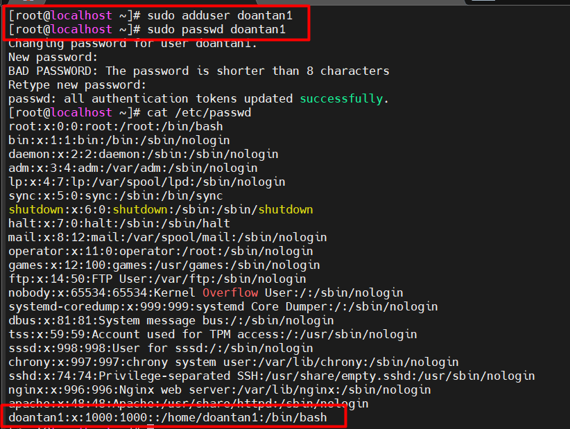

# User và Group trong Linux


## User trong Linux

### 1. User trong Linux là gì?

- **Định nghĩa:** User đại diện cho một thực thể (thường là một người) hoặc một tiến trình có thể tương tác với hệ thống. Mỗi user có một danh tính riêng và được hệ thống xác thực khi đăng nhập hoặc thực hiện các tác vụ.
- **User ID (UID):** Mỗi user được gán một số định danh duy nhất gọi là User ID (UID). UID được sử dụng bởi kernel để xác định user khi thực hiện các hoạt động liên quan đến quyền truy cập.
  - **UID 0:** Thường dành cho root user (superuser).
  - **UID 1-999 (hoặc một khoảng tương tự):** Thường dành cho các system user và service account, được hệ thống hoặc các ứng dụng tạo ra để chạy các dịch vụ.
  - **UID 1000 trở lên (hoặc một khoảng tương tự):** Thường dành cho các regular user (người dùng thông thường).
- **Username:** Đây là tên mà người dùng sử dụng để đăng nhập vào hệ thống. Username thường dễ nhớ và có ý nghĩa hơn so với UID.
- **Home Directory:** Mỗi regular user thường có một thư mục riêng gọi là home directory. Đây là nơi người dùng lưu trữ các tệp và thư mục cá nhân của họ. Đường dẫn thường là `/home/<username>`.
- **Thông tin User** được lưu trữ chủ yếu trong 2 tệp:
  - `/etc/passwd`: Chứa thông tin cơ bản về user như username, UID, GID (Group ID mặc định), home directory, và shell mặc định. Thông tin này có thể đọc được bởi tất cả mọi người.

  

  - `/etc/shadow`: Chứa thông tin nhạy cảm về user như mật khẩu đã được mã hóa và các thông tin liên quan đến quản lý mật khẩu. Tệp này thường chỉ có quyền đọc cho root user.

### 2. Các loại user trong Linux

Trong Linux, cách phân loại phổ biến và cơ bản gồm có **Root User** và **Regular User**. Bên cạnh đó, có các loại user khác thường được nhắc đến là **System User**, **Service Account**, **Guest User**.

- **Root** có quyền cao nhất.
- **Regular User** là tài khoản dùng hằng ngày.
- **System user** và **service account** là các tài khoản **regular user** được tạo ra và quản lý bởi hệ thống hoặc ứng dụng, không dành cho người dùng tương tác trực tiếp.
- **Guest user** cũng là một dạng regular user nhưng mang tính tạm thời và có nhiều hạn chế hơn.

**Root User (Người dùng quản trị - Siêu người dùng):**

- **Root** là người dùng có quyền cao nhất trong hệ thống.
- Có thể làm mọi thứ: cài đặt/xóa phần mềm, thay đổi file hệ thống, tạo và xóa user, thay đổi quyền hạn file, v.v.
- UID (User ID) = 0.
- Chuyển sang root:

    ```plaintext
    sudo -i # hoặc sudo su
    ```

*Lưu ý:* Không nên đăng nhập trực tiếp bằng **root**, thay vào đó hãy dùng `sudo` để chạy lệnh với quyền root.

**Regular User (Người dùng thông thường):**

- Tạo bởi root hoặc trong quá trình cài đặt hệ thống.
- Có UID từ 1000 trở lên trên hầu hết các hệ thống Linux hiện đại.
- Là các tài khoản người dùng có quyền sử dụng hệ thống, tạo file/thư mục trong thư mục home của mình (/home/username).
- Không thể cài đặt phần mềm hoặc sửa đổi file hệ thống mà không có quyền sudo.
- **Ví dụ lệnh quản lý user:**

  ```plaintext
  sudo adduser user1  # Tạo một user mới
  sudo passwd user1   # Đặt mật khẩu cho user
  sudo deluser user1  # Xóa user
  ```

  

**System User (Người dùng hệ thống):**

- Là các tài khoản được tạo tự động khi cài đặt hệ điều hành để chạy các dịch vụ hệ thống (daemon).
- Thường có UID từ 1-999.
- Không đăng nhập trực tiếp vào hệ thống.
- **Kiểm tra danh sách System User:**

    ```plaintext
    cat /etc/passwd | grep nologin
    ```

- Kết quả:

  

**Service Account (Tài khoản dịch vụ - chuyên biệt):**

- Là dạng user được sử dụng để chạy các ứng dụng hoặc dịch vụ cụ thể.
- Ví dụ:
  - **www-data** (Nginx/Apache)
  - **mysql** (MySQL, MariaDB)
  - **docker** (Docker daemon)

**Guest User (Người dùng khách - Tạm thời):**

- Có quyền hạn thấp nhất, thường được dùng trên hệ thống chia sẻ công khai.
- Không thể cài đặt phần mềm hoặc thay đổi cài đặt hệ thống.
- Thư mục /home/guest có thể bị xóa sau khi đăng xuất.
- Tạo một Guest User:

  ```plaintext
  sudo adduser guest --disabled-password
  ```

### 3. Ngữ cảnh phân loại

- Xét về quyền hạn quản trị: **Root User** và **Regular User**.
- Xét theo cách hệ thống quản lý user, cần có thêm **System User**.
- Đi sâu hơn về quản lý tài nguyên, cần thêm **Service Account** và **Guest User**.

## Group trong Linux

### 1. Group là gì?

- **Định nghĩa:** Group là một tập hợp các user. Mục đích chính của việc sử dụng group là để đơn giản hóa việc quản lý quyền truy cập cho nhiều user cùng một lúc. Thay vì phải cấp quyền cho từng user riêng lẻ,chỉ cần cấp quyền cho một group và tất cả các user trong group đó sẽ được hưởng quyền này.
- **Group ID (GID):** Tương tự như user, mỗi group cũng được gán một số định danh duy nhất gọi là Group ID (GID).
- **Group Name:** Đây là tên được sử dụng để tham chiếu đến group.
- **Primary Group:** Khi một user được tạo, họ sẽ được gán một group chính (primary group). Thông thường, primary group có cùng tên với username. Khi user tạo một tệp mới, group sở hữu tệp đó sẽ là primary group của user.
- **Secondary Groups:** Một user có thể thuộc nhiều group khác nhau ngoài primary group. Các group này được gọi là secondary groups.
- **Thông tin Group:** Thông tin về group được lưu trữ trong tệp `/etc/group`. Tệp này chứa thông tin về group name, GID, và danh sách các user là thành viên của group đó.


### 2. Mối quan hệ giữa User và Group trong quản lý quyền


- **Quyền sở hữu tệp và thư mục:** Mỗi tệp và thư mục trong Linux đều có thông tin về **owner (chủ sở hữu)** (là một user) và **group owner (nhóm sở hữu)** (là một group).
- **Quyền truy cập:** Hệ thống Linux sử dụng ba loại quyền truy cập cơ bản cho mỗi tệp và thư mục, áp dụng cho ba đối tượng:
  - **Owner:** User sở hữu tệp/thư mục.
  - **Group:** Group sở hữu tệp/thư mục.
  - **Others:** Tất cả các user khác không phải là owner và không thuộc group sở hữu.
- **Các loai quyền:**
  - **Read (r):** cho phép xem nội dung của tệp hoặc nội dung của thư mục.
  - **Write (w):** Cho phép sửa đổi nội dung của tệp hoặc tạo, xóa, đổi tên tệp trong thư mục.
  - **Execute (x):** Cho phép chạy tệp (nếu là một chương trình) hoặc truy cập vào thư mục (để truy cập các tệp bên trong).

- Lệnh `chmod`: Được sử dụng để thay đổi quyền truy cập của tệp và thư mục.
- Lệnh `chown`: Được sử dụng để thay đổi owner của tệp và thư mục.
- Lệnh `chgrp`: Được sử dụng để thay đổi group owner của tệp và thư mục.

## Quản lý User và Group

**Quản lý User:**

| Chức năng | Câu lệnh |
|-----------|-------------|
| Tạo mới user | `sudo adduser username` |
| Xóa user | `sudo deluser username` |
| Đổi mật khẩu user | `sudo passwd username` |
| Liệt kê User | `cat /etc/passwd` |
| Kiểm tra user hiện tại | `whoami` |

**Quản lý Group:**

| Chức năng | Câu lệnh |
|-----------|-------------|
| Tạo group mới | `sudo groupadd groupname` |
| Xóa group | `sudo groupdel groupname` |
| Thêm user vào group | `sudo usermod -aG groupname username` |
| Liệt kê nhóm của user | `groups username` |
| Xem danh sách group | `cat /etc/group` |
