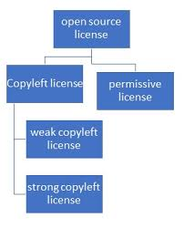
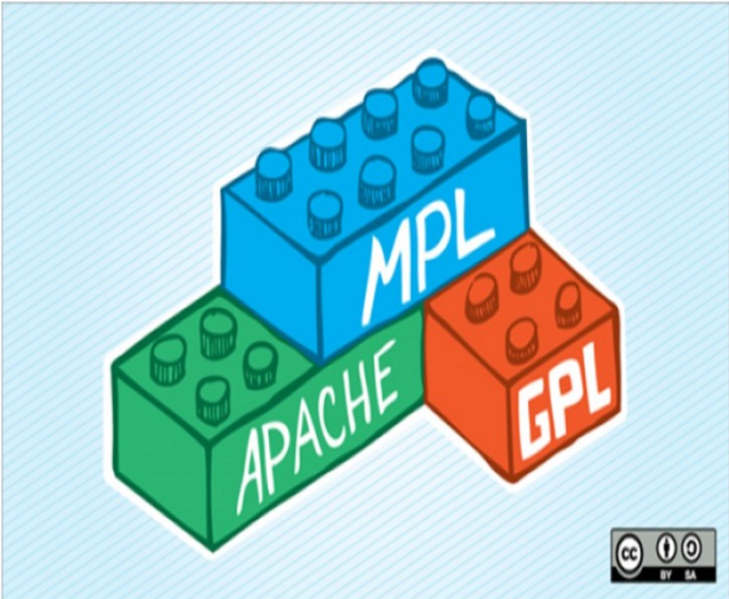
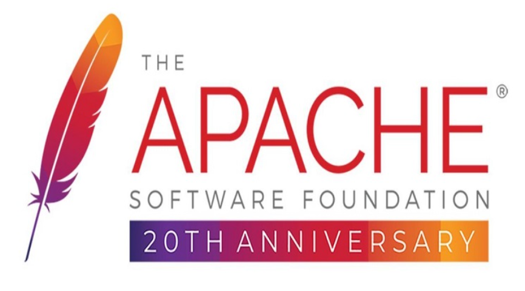
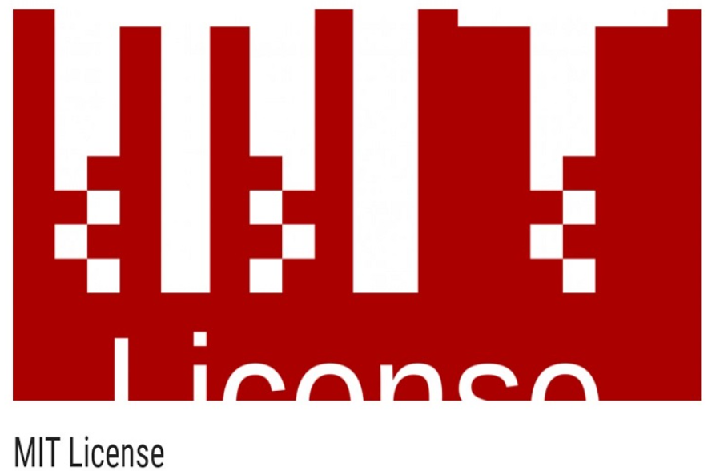

# Giấy phép nguồn mở

## Giấy phép nguồn mở là gì?

### 1. Khái niệm

Giấy phép nguồn mở là một loại giấy phép cho phép người dùng quyền tự do sử dụng, nghiên cứu, sửa đổi và phân phối phần mềm và mã nguồn của nó cho bất kỳ ai và cho bất kỳ mục đích nào. Điều này khác biệt với phần mềm độc quyền, nơi người dùng thường bị giới hạn trong việc sử dụng và sửa đổi phần mềm.

### 2. Định dạng

- Thường là một tệp văn bản thuần túy (text file) với các đuôi phổ biến như .txt, .md (Markdown), hoặc đôi khi không có đuôi.
- Có thể được nhúng trực tiếp vào đầu tệp mã nguồn (thường là dưới dạng comment).

### 3. Nội dung chính

Một giấy phép nguồn mở thường bao gồm các phần sau:

- Thông báo bản quyền (Copyright Notice): Chỉ định chủ sở hữu bản quyền của phần mềm và năm phát hành. Ví dụ: `Copyright (c) [Năm] [Tên chủ sở hữu bản quyền]`.
- **Lời cấp phép (Grant of License):** Đây là phần quan trọng nhất, mô tả những quyền mà người dùng được phép thực hiện với phần mềm. Các quyền này thường bao gồm quyền sử dụng, sao chép, sửa đổi, phân phối và cấp phép lại.
- **Các hạn chế (Limitations):** Một số giấy phép có thể đặt ra các hạn chế nhất định, chẳng hạn như yêu cầu giữ lại thông báo bản quyền gốc khi phân phối lại.
- **Tuyên bố từ chối trách nhiệm (Disclaimer of Warranty):** Thường có một tuyên bố rõ ràng rằng phần mềm được cung cấp "nguyên trạng" (as is) mà không có bất kỳ bảo đảm nào.
- **Giới hạn trách nhiệm (Limitation of Liability):** Giới hạn trách nhiệm của người cấp phép đối với bất kỳ thiệt hại nào phát sinh từ việc sử dụng phần mềm.
- **Các điều khoản khác (Other Terms):** Tùy thuộc vào loại giấy phép, có thể có các điều khoản bổ sung liên quan đến bằng sáng chế, đóng góp, hoặc khả năng tương thích với các giấy phép khác.

Vị trí thường thấy giấy phép này là ở trong thư mục gốc của dự án phần mềm (repository) hoặc trong tệp `README` với tên phổ biến như: `LICENSE` (viết hoa toàn bộ là phổ biến nhất), `LICENSE.txt`, `LICENSE.md`, `COPYING`

## Tại sao giấy phép nguồn mở lại quan trọng?

- **Tính minh bạch:** Mã nguồn mở có thể được xem xét bởi bất kỳ ai, giúp tăng cường tính minh bạch và bảo mật của phần mềm.

- **Tính linh hoạt:** Người dùng có thể tùy chỉnh phần mềm để phù hợp với nhu cầu cụ thể của họ.

- **Tính cộng tác:** Các nhà phát triển trên toàn thế giới có thể cùng nhau đóng góp vào việc phát triển và cải thiện phần mềm.

- **Chi phí:** Phần mềm nguồn mở thường miễn phí hoặc có chi phí thấp hơn so với phần mềm độc quyền.

- **Đổi mới:** Việc chia sẻ mã nguồn thúc đẩy sự đổi mới và phát triển nhanh chóng của phần mềm.

## Phân loại giấy phép nguồn mở

Giấy phép nguồn mở có thể chia thành hai loại chính: **Bản quyền cho dùng (Copyleft)** và **Cấp phép (Permissive)**. Sự phân chia này dựa trên các yêu cầu và hạn chế của giấy phép đối với người dùng.

### 1. Copyleft

**Định nghĩa:**

Giấy phép Copyleft yêu cầu rằng bất kỳ ai phân phối phần mềm có sửa đổi hoặc sử dụng mã nguồn của phần mềm đều phải công khai mã nguồn của họ dưới cùng giấy phép. Điều này đảm bảo rằng phần mềm luôn luôn là nguồn mở và không bị biến thành mã nguồn đóng.

**Cách hoạt động:**

- Nếu bạn sửa đổi hoặc mở rộng một phần mềm có giấy phép Copyleft, bạn phải công khai mã nguồn của phiên bản mới.
- Nếu bạn tích hợp phần mềm vào một sản phẩm lớn hơn, thì sản phẩm đó cũng phải tuân theo giấy phép Copyleft (tùy mức độ Copyleft mạnh hay yếu).

**Ví dụ về giấy phép Copyleft:**

- **GNU General Public License (GPL):** Phần mềm sửa đổi phải được công khai với cùng giấy phép.
- **GNU Lesser General Public License (LGPL):** Nhẹ hơn GPL, cho phép liên kết với phần mềm độc quyền.
- **AGPL (Affero GPL):** Bắt buộc công khai mã nguồn kể cả khi phần mềm chạy trên máy chủ.

### 2. Permissive

**Định nghĩa:**

Giấy phép Permissive không áp đặt yêu cầu khắt khe như Copyleft. Người dùng có thể sử dụng, sửa đổi và tích hợp phần mềm vào phần mềm độc quyền mà không cần công khai mã nguồn.

**Cách hoạt động:**

- Người dùng có thể sửa đổi mã nguồn mà không cần công khai thay đổi.
- Phần mềm có thể được tích hợp vào sản phẩm thương mại hoặc độc quyền.
- Chỉ yêu cầu giữ lại thông tin bản quyền khi phân phối.

**Ví dụ về giấy phép Permissive:**

- **MIT License:** Giấy phép đơn giản, chỉ yêu cầu giữ lại thông tin bản quyền.
- **Apache License 2.0:** Bổ sung điều khoản về bằng sáng chế.
- **BSD License (Berkeley Software Distribution):** Có nhiều biến thể, BSD 3-Clause và BSD 2-Clause là phổ biến nhất.

## Một số giấy phép nguồn mở phổ biến

### 1. GNU General Public License (GPL)

Giấy phép GNU General Public License (GPL) là một loại giấy phép được phát hành vào năm 2007. Đây là một phiên bản sửa đổi của GPL, tuy nhiên giấy phép này thường hạn chế đối với các thư viện phần mềm. Nhưng điều này cho phép các chương trình không phải là Open source có thể truy cập hoặc liên kết tới các thư viện nguồn mở mà không phải công khai mã nguồn như giấy phép GPL.

### 2. Giấy phép Apache license 2.0

Apache License 2.0 được phát hành vào tháng 1 năm 2004 của Quỹ phần mềm Apache (Apache Software Foundation – ASF). Giấy phép này cho người dùng phần mềm nguồn mở, quyền tự do sử dụng phần mềm với bất kỳ mục đích nào, phân phối chỉnh sửa và phân sửa đổi theo các điều khoản của giấy phép mà không lo vấn đề bản quyền.

Các điều kiện của giấy phép Apache License 2.0:

- Apache License 2.0 cho phép người dùng tự do sử dụng phần mềm với bất kỳ mục đích nào, tự do phân phối, sửa đổi.
- Giấy phép không yêu cầu bản sửa đổi của phần mềm phải được phân phối dưới cùng giấy phép với bản gốc và không yêu cầu bản sửa đổi phải được phân phối dưới dạng mã nguồn mở.

### 3. Giấy phép MIT License

Giấy phép mã nguồn mở này được phát hành bởi Massachusetts Institute of Technology (MIT). Đây là một trong những giấy phép cho phép người dùng tự do nhất, nó có thể kết hợp với các mã nguồn khác và đảm bảo tương thích theo điều kiện của mọi loại giấy phép khác.

Với MIT License bạn có thể sử dụng , sao chép , sửa đổi , hợp nhất , xuất bản , phân phối và/hoặc bán các bản sao của phần mềm mà không vi phạm bản quyền. Chỉ cần tuân thủ điều kiện thông báo cho phép của phần mềm gốc sử dụng giấy phép MIT.

### 4. Mozilla Public License 2.0 (MPL)

Mozilla Public License 2.0 (MPL) phát hành vào ngày 03-01-2012 bởi phần mềm tự do của Quỹ Mozilla. Giấy phép này là sự kết hợp giữa giữa giấy phép BSD có chỉnh sửa và giấy phép GNU. MPL cho phép người dùng hoạt động tự do và yêu cầu việc công bố mã nguồn của mọi thay đổi được đưa ra công chúng.
