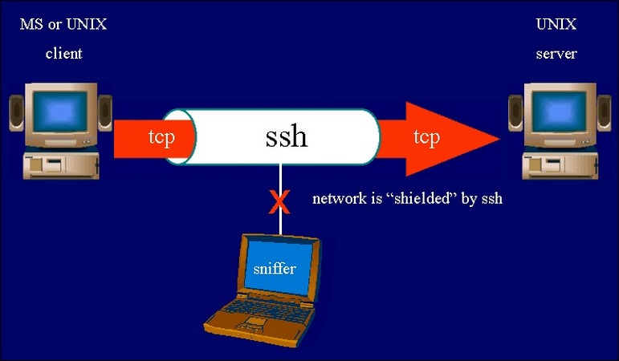
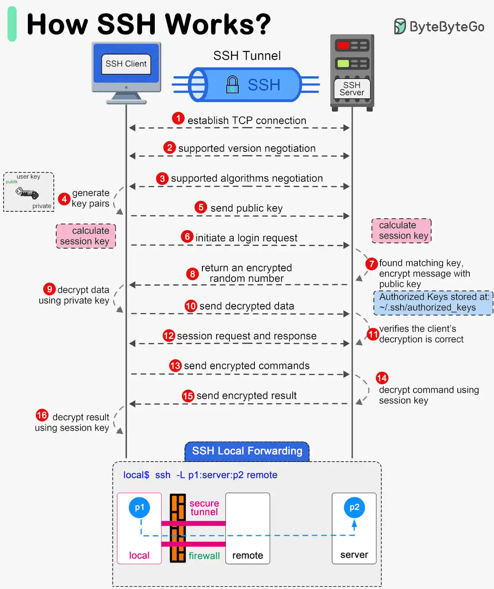

# Tổng quan về SSH

## SSH là gì?

SSH là một giao thức bảo mật phổ biến trong lĩnh vực CNTT. Nhờ được sử dụng rộng rãi trong việc quản lý từ xa và truyền tải dữ liệu một cách an toàn, SSH đặt ra tiêu chuẩn cao về đảm bảo thông tin, ngăn chặn các rủi ro an ninh mạng.

### 1. Khái niệm SSH

**SSH** là viết tắt của Secure Shell, là một giao thức mạng mã hóa cho phép bạn thiết lập một kết nối an toàn giữa hai thiết bị. Nó thường được sử dụng để truy cập và quản lý các máy chủ từ xa một cách an toàn qua mạng không an toàn như **Internet**.

### 2. Tính năng chính

- **Truy cập máy chủ từ xa:** Cho phép quản trị viên kết nối và điều khiển máy chủ Linux/Unix từ xa.
- **Truyền tệp an toàn (Secure File Transfer):** Cho phép truyền dữ liệu an toàn qua các kết nối không an toàn bằng cách bọc dữ liệu trong đường hầm SSH. Có 2 loại:
  - **Local Port Forwarding:** Định tuyến lưu lượng từ máy cục bộ qua máy chủ SSH.
  - **Remote Port Forwarding:** Cho phép máy chủ SSH chuyển tiếp lưu lượng đến một máy khác.
- **SCP & SFTP:**
  - `scp` (Secure Copy): Truyền tệp tin giữa client và server an toàn.
  - `sftp` (SSH File Transfer Protocol): Giao thức truyền tệp an toàn dựa trên SSH.
- **Chạy lệnh từ xa:** Có thể thực thi lệnh trên máy chủ mà không cần mở phiên shell (`ssh user@server "ls -l"`).

## Cách hoạt động của SSH

`Bước 1`: Thiết lập kết nối TCP

- Máy khách (SSH Client) mở kết nối TCP đến máy chủ (SSH Server), thông thường qua cổng 22 (hoặc cổng tùy chỉnh).

`Bước 2`: Đàm phán phiên bản SSH

- Máy khách và máy chủ trao đổi thông tin về phiên bản SSH đang sử dụng.
- Nếu phiên bản không tương thích, kết nối sẽ bị từ chối.

`Bước 3`: Đàm phán thuật toán mã hóa

- Máy khách và máy chủ thương lượng và thống nhất về các thuật toán mã hóa (vd: AES, RSA, ECDSA), xác thực và trao đổi khóa sẽ được sử dụng trong phiên làm việc. Điều này đảm bảo rằng cả hai bên đều có thể giao tiếp một cách an toàn.

`Bước 4`: Tạo cặp khóa SSH (nếu dùng xác thực bằng khóa công khai)

- Máy khách có thể tạo một cặp khóa gồm khóa công khai (public key) và khóa riêng tư (private key).

`Bước 5`: Gửi khóa công khai lên máy chủ

- Máy khách gửi khóa công khai để xác thực (nếu đã thiết lập xác thực bằng SSH key).

`Bước 6`: Gửi yêu cầu đăng nhập

- Máy khách gửi yêu cầu đăng nhập bằng phương thức xác thực (mật khẩu hoặc khóa công khai).

`Bước 7`: Máy chủ kiểm tra khóa công khai

- Nếu dùng khóa công khai, máy chủ kiểm tra xem khóa công khai có nằm trong danh sách `~/.ssh/authorized_keys` hay không.
- Nếu có, máy chủ sẽ tạo một số ngẫu nhiên và mã hóa nó bằng chính khóa công khai mà máy khách đã gửi.

`Bước 8`: Máy chủ gửi số ngẫu nhiên đã mã hóa về máy khách

- Đây là một thử nghiệm xác thực: máy chủ gửi một số ngẫu nhiên đã mã hóa bằng khóa công khai của máy khách.

`Bước 9`: Máy khách giải mã dữ liệu bằng khóa riêng tư

- Nếu máy khách sử dụng khóa riêng tư của mình (được tạo ở bước 4) để giải mã số ngẫu nhiên đã nhận từ máy chủ.

`Bước 10`: Máy khách gửi lại dữ liệu đã giải mã

- Máy khách gửi số ngẫu nhiên đã giải mã lại cho máy chủ.

`Bước 11`: Máy chủ xác thực thông tin giải mã

- Máy chủ kiểm tra xem số ngẫu nhiên đã giải mã có chính xác không.
- Nếu chúng khớp nhau, điều này chứng minh rằng máy khách sở hữu khóa riêng tư tương ứng với khóa công khai đã được gửi, và do đó máy khách được xác thực. Nếu sai, kết nối bị từ chối.

`Bước 12`: Yêu cầu và phản hồi phiên làm việc

- Sau khi xác thực thành công, máy khách và máy chủ thiết lập một phiên làm việc SSH an toàn và mã hóa.
- Cả hai bên sử dụng số ngẫu nhiên được mã hóa và giải mã bằng key pair này để tạo ra session key bằng cách áp dụng thuật toán Diffie-Hellman hoặc ECDH.

`Bước 13`: Máy khách gửi lệnh được mã hóa

- Người dùng có thể nhập lệnh, dữ liệu được mã hóa bằng **session key** được thiết lập trong quá trình thương lượng thuật toán (bước 3) và gửi đến máy chủ.

`Bước 14`: Máy chủ giải mã lệnh bằng khóa phiên

- Máy chủ sử dụng khóa phiên (session key) đã thỏa thuận từ trước để giải mã dữ liệu.

`Bước 15`: Máy chủ gửi kết quả được mã hóa

- Sau khi thực thi lệnh, máy chủ gửi kết quả trở lại máy khách, và kết quả này cũng được mã hóa bằng session key.

`Bước 16`: Máy khách giải mã kết quả bằng khóa phiên

- Máy khách nhận và giải mã kết quả, hiển thị lên terminal.
