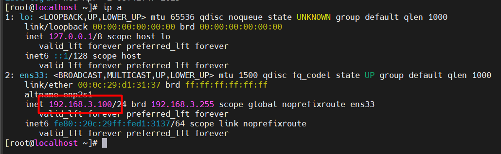
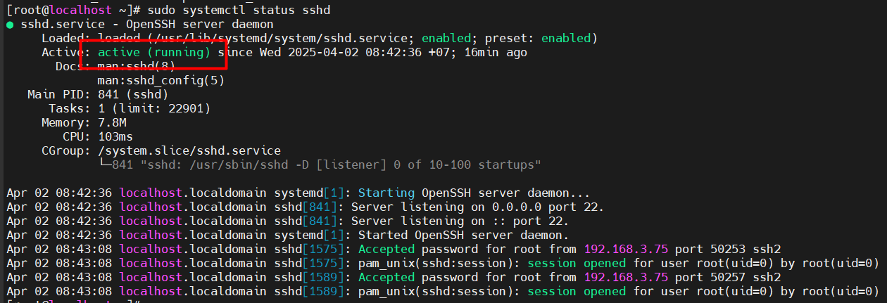
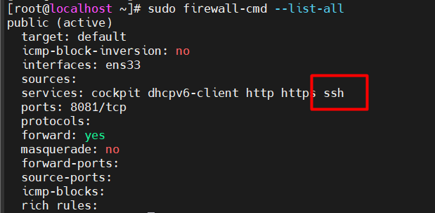
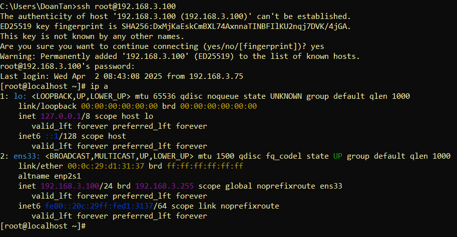
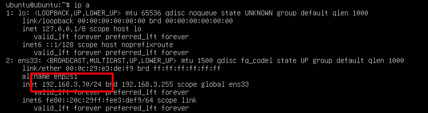
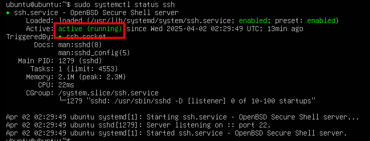
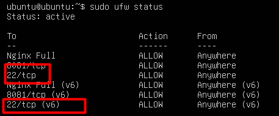
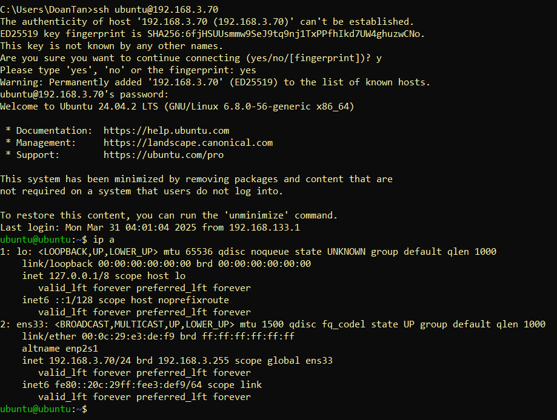
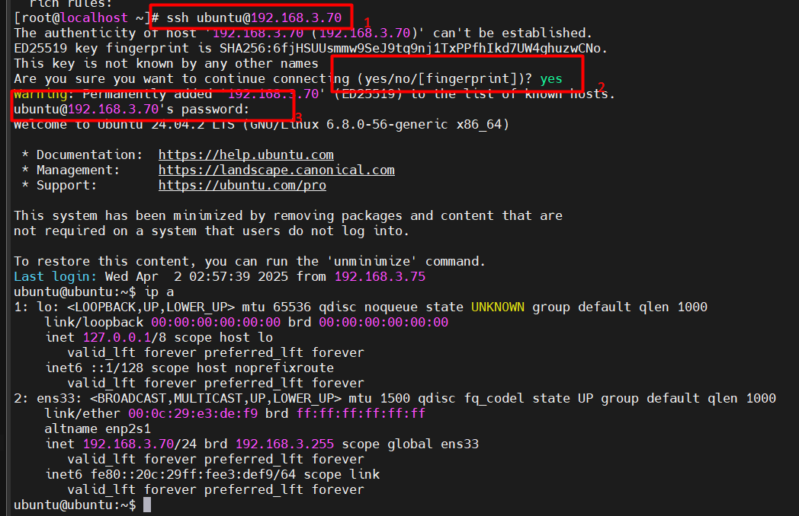

# Lab SSH

## Từ máy chủ (windows) đến webserver

### 1. CentOS Stream 9

`Bước 1`: Kiểm tra IP trên máy ảo

- Nhập lệnh:

```plaintext
ip a
```

- Kết quả:



- IP của máy ảo là `192.168.3.100`.

`Bước 2`: Kiểm tra SSH Server trên máy ảo

- Trên máy ảo CentOS stream 9, kiểm tra dịch vụ OpenSSH có đang chạy không:

```plaintext
sudo systemctl status sshd
```

- Nếu thấy **active (running)** → SSH Server đang chạy:



- Nếu không, khởi động với lệnh:

```plaintext
sudo systemctl start sshd
```

- Nếu muốn SSH Server tự động chạy mỗi khi khởi động máy ảo:

```plaintext
sudo systemctl enable sshd
```

`Bước 3:` Cấu hình tường lửa trên máy ảo

- CentOS dùng firewall, kiểm tra cổng SSH đã mở chưa (mặc định là 22):

```plaintext
sudo firewall-cmd --list-all
```

- Nếu có dòng `ssh` trong danh sách **services** là OK.



- Trường hợp cổng chưa mở, thực hiện các lệnh sau:

```plaintext
# Mở cổng SSH
sudo firewall-cmd --permanent --add-service=ssh

# reload lại firewall
sudo firewall-cmd --reload

# Thực hiện kiểm tra lại danh sách
sudo firewall-cmd --list-all
```

`Bước 4`: SSH từ máy host (windows) vào máy ảo CentOS Stream 9

- Mở terminal trên máy host và chạy lệnh:

    ```plaintext
    ssh root@192.168.3.100
    ```

- `root`: Tài khoản trên máy ảo.
- `192.168.3.100`: IP của máy ảo đã kiểm tra ở `bước 1`.

- Kết quả sau kết nối:



### 2. Ubuntu Server

`Bước 1`: Kiểm tra IP máy ảo ubuntu

- Sử dụng lệnh:

```plaintext
ip a
```



`Bước 2`: Kiểm tra và cài đặt SSH Server

```plaintext
# Kiểm tra SSH đã cài trên máy chưa
sudo systemctl status ssh

# Nếu chưa, cài đặt SSH Server
sudo apt install openssh-server -y

# Khởi động SSH Server
sudo systemctl start ssh

# Để SSH tự động chạy sau mỗi lần bật máy
sudo systemctl enable ssh
```

- Sau đó kiểm tra lại trạng thái SSH, nếu thấy active (running) → SSH Server đang chạy.



`Bước 3`: Mở cổng tường lửa (nếu có) - ufw (ubuntu firewall)

- Nhập lệnh sau:

```plaintext
# Cho phép ssh trên tường lửa
sudo ufw allow ssh

# Cho phép mỗi khi khởi động
sudo ufw enable

# Kiểm tra lại trạng thái
sudo ufw status
```

- Nếu thấy cổng 22 -> OK.



`Bước 4`: SSH từ windows vào ubuntu

- Mở terminal trên máy host và chạy lệnh:

    ```plaintext
    ssh ubuntu@192.168.3.70
    ```

- `ubuntu`: Tài khoản trên máy ảo.
- `192.168.3.70`: IP của máy ảo đã kiểm tra ở `bước 1`.

- Kết quả sau kết nối:



## Từ CentOS Stream 9 đến Ubuntu Server

1. Tương tự như các bước ở trên, kiểm tra IP, OpenSSH, tường lửa trên ubuntu.
2. Thực hiện lệnh ssh trên CentOS Stream 9 với lệnh:

```plaintext
ssh ubuntu@192.168.3.70
```

- Kết quả thành công:


