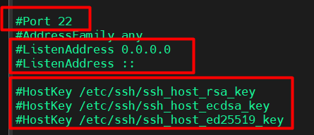
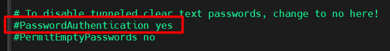
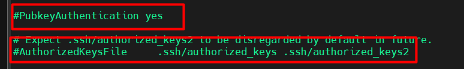
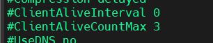
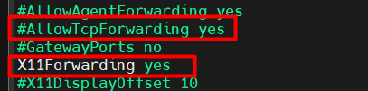
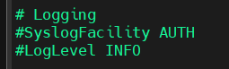

# Thông số cấu hình SSH

File cấu hình SSH có 2 phần chính:

1. Cấu hình SSH Server: `/etc/ssh/sshd_config` (dành cho máy chủ ssh).
2. Cấu hình SSH Client: `~/.ssh/config` (dành cho máy khách SSH).

## Cấu hình SSH Server (`/etc/ssh/sshd_config`)

File này kiểm soát máy chủ SSH hoạt động. Mở file bằng lệnh:

```plaintext
sudo vim /etc/ssh/sshd_config
```

Sau khi sửa, cần restart SSH:

```plaintext
sudo systemctl restart sshd
```

### 1. Port - ListenAddress - Hostkey



- Mặc định, SSh chạy trên cổng 22.
- Chỉ định IP mà SSH server lắng nghe. Mặc định sử dụng 0.0.0.0 (IPv4) hoặc :: (IPv6) để lắng nghe trên tất cả các giao diện mạng.
- Chỉ định đường dẫn đến các tệp chứa khóa riêng tư của máy chủ. Máy chủ thường có nhiều loại khóa (**RSA**, **ECDSA**, **EdDSA**). Nên có ít nhất một khóa được tạo. Các tệp này thường nằm trong thư mục `/etc/ssh/`.

### 2. Cấu hình xác thực

**Cho phép đăng nhập bằng mật khẩu:**

- Mặc định là `yes`, SSH cho phép đăng nhập bằng mật khẩu:



- Tắt đăng nhập bằng mật khẩu, chỉ cho phép dùng SSH Key (xóa dấu # đầu dòng để bỏ comment):

```plaintext
PasswordAuthentication no
```

**Cho phép xác thực bằng SSH Key:**



- Thư mục chứa danh sách khóa công khai của user: `.ssh/authorized_keys`.

### 3. Chỉ cho phép user cụ thể đăng nhập

- Giới hạn user có thể SSH, thêm các dòng sau vào file:

```plaintext
AllowUsers user1 user2
```

- Hoặc chặn một số user:

```plaintext
DenyUsers user3 user4
```

### 4. Giới hạn số lần đăng nhập sai

```plaintext
# Chỉ cho phép nhập sai mật khẩu 6 lần
MaxAuthTries 6

# Số phiên tối đa
MaxSessions 10

# Kiểm soát số lượng SSH chưa xác thực
MaxStartups 10:30:100
```

- MaxStartups <bắt đầu từ số X>:<tỷ lệ từ chối Y>:<giới hạn tối đa Z>: `10:30:100`
  - `10`: Cho phép tối đa 10 kết nối SSH chưa xác thực cùng lúc mà không bị hạn chế.
  - `30`: Nếu vượt quá 10 kết nối, từ kết nối thứ 11 trở đi, máy chủ sẽ từ chối dần với tỷ lệ 30%.
  - `100`: Khi số lượng kết nối chưa xác thực đạt 100, máy chủ sẽ từ chối hoàn toàn các kết nối mới.
- Nếu muốn đặt giới hạn đơn giản (không theo tỷ lệ), chỉ cần:

```plaintext
MaxStartups 10
```



- `ClientAaliveInterval 0`: Máy chủ sẽ không kiểm tra máy khách. Nếu được đặt thành 1 số, ví dụ 300 thì máy chủ SSH sẽ gửi tín hiệu kiểm tra sau 300 giây (5 phút).
- `ClientAaliveCountMax 3`: là số lần kiểm tra tối đa mà máy chủ SSH sẽ gửi đi trước khi ngắt kết nối nếu không nhận được phản hồi từ máy khách. Giá trị 3 có nghĩa là nếu máy khách không phản hồi sau 3 lần kiểm tra, máy chủ SSH sẽ đóng kết nối. Còn nếu giá trị bằng 0 thì nếu không phản hồi, ngắt kết nối ngay.

### 5. Chuyển tiếp kết nối (Forwarding)



- `AllowTcpForwarding yes`: Cho phép chuyển tiếp cổng (Port Forwarding) để tạo SSH Tunnel.
- `X11Forwarding yes`: Cho phép X11 Forwarding (Chayj ứng dụng GUI qua SSH).

### 6. Nhật ký giám sát

Ghi log SSH vào `/var/log/auth.log`:



- `SyslogFacility AUTH`: Cho biết AUTH là facility được định nghĩa trong syslog, thường được sử dụng cho các thông điệp liên quan đến bảo mật và ủy quyền (authorization).
- `LogLevel INFO`:INFO là mức độ chi tiết của thông điệp nhật ký và SSH server ghi lại. Các thông tin cơ bản sẽ được lưu.

## Cấu hình SSH Client (`~/.ssh/config` hoặc `/etc/ssh/ssh_config`)

File này giúp cấu hình SSH Client trên máy khách để kết nối nhanh hơn.

### 1. Host

- **Chức năng:** Định nghĩa một khối cấu hình riêng biệt cho một hoặc nhiều máy chủ. Điều này cho phép bạn thiết lập các tùy chọn khác nhau cho từng máy chủ thường xuyên kết nối đến.

- *Ví dụ:* nếu thường xuyên SSH vào 192.168.1.100 với user ubuntu và cổng 2222, thay vì gõ lệnh dài:

  ```plaintext
  ssh -p 2222 ubuntu@192.168.1.100
  ```

- Có thể cấu hình như sau:

  ```plaintext
  Host myserver
    HostName 192.168.1.100
    User ubuntu
    Port 2222
    IdentityFile ~/.ssh/id_rsa
  ```

  - `IdentityFil`: Xác định đường dẫn đến tệp chứa khóa riêng tư (private key) mà SSH client sẽ sử dụng để xác thực bằng khóa công khai.
- Sau đó chỉ cần gõ lệnh:

  ```plaintext
  ssh myserver
  ```
