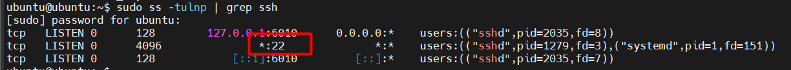
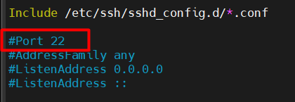
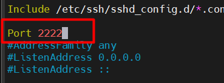
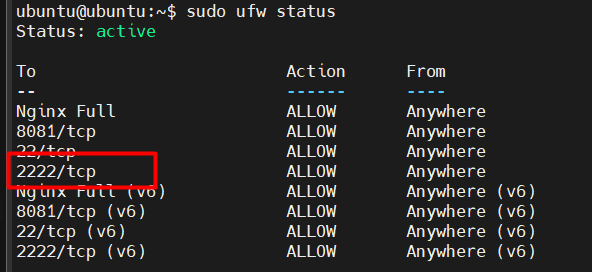
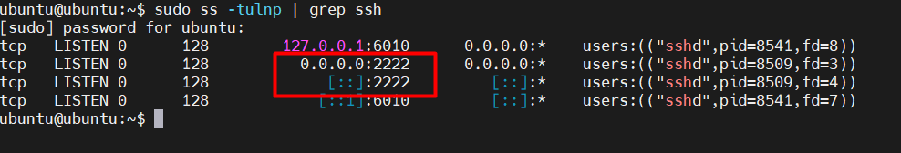
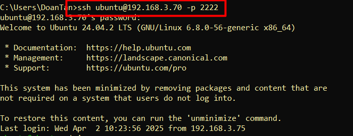

# Đổi port ssh. Sử dụng port khác để ssh vào máy chủ

Mặc định, SSH sử dụng cổng 22. Để tăng bảo mật, bạn có thể thay đổi cổng này thành một số khác, ví dụ 2222.

## Đổi port ssh

### Trên máy ảo ubuntu và CentOS Stream 9

`Bước 1`: Kiểm tra SSH đang chạy trên cổng nào

```plaintext
sudo ss -tulnp | grep ssh
```

- Kết quả



- SSH đang chạy trên cổng 22.

`Bước 2`: Sửa file cấu hình SSH để đổi cổng

- Mở file `/etc/ssh/sshd_config`:

```plaintext
sudo vim /etc/ssh/sshd_config
```

- Tìm dòng:



- Bỏ dấu # và đổi số cổng, ví dụ cổng 2222:



- Có thể chọn một cổng cao hơn, ví dụ 2222, 2223, 50022..., miễn là nó không bị xung đột với dịch vụ khác.
- Tránh các cổng phổ biến như 80, 443, 3306, 8080...

`Bước 3`: Mở cổng mới trên firewall

- Mở cổng 2222 với lệnh sau:

**Trên Ubuntu:**

```plaintext
sudo ufw allow 2222/tcp
```

- Kiểm tra lại trạng thái firewall:

```plaintext
sudo ufw status
```

**Trên CentOS Stream 9:**

```plaintext
sudo firewall-cmd --permanent --add-port=2222/tcp
sudo firewall-cmd --reload
```

- Kiểm tra lại trạng thái firewall:

```plaintext
sudo firewall-cmd --list-ports
```



`Bước 4`: Khởi động lại SSH để áp dụng thay đổi

- Sau khi cấu hình và đổi cổng, restart lại ssh:

```plaintext
sudo systemctl restart sshd
```

- Kiểm tra lại xem ssh đã lắng nghe trên cổng 2222 chưa:

```plaintext
sudo ss -tulnp | grep ssh
```



`Bước 5`: thực hiện ssh

- Sử dụng lệnh để ssh vào máy chủ:

```plaintext
ssh ubuntu@192.168.3.70 -p 2222
```



`Bước 6 - tùy chọn`: chặn cổng 22 để tăng bảo mật

- Sau khi SSH trên cổng mới hoạt động, chặn cổng 22:

```plaintext
sudo firewall-cmd --permanent --remove-port=22/tcp
sudo firewall-cmd --reload
```
