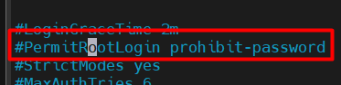
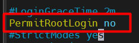
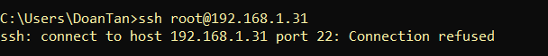
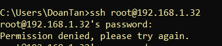

# Cấu hình không cho ssh bằng root

## Trên Ubuntu

*Lưu ý:* Cần dùng tài khoản root để truy cập file cấu hình.

`Bước 1`: Chỉnh sửa file cấu hình SSH

- Mở file cấu hình SSH:

```plaintext
sudo vim /etc/ssh/sshd_config
```

- Tại dòng `PermitRootLogin`, bỏ dấu `#` và chuyển thành `no`



- Kết quả:



`Bước 2`: Restart SSH để áp dụng thay đổi

```plaintext
sudo systemctl restart ssh
```

`Bước 3`: Kiểm tra lại

```plaintext
ssh root@192.168.1.31
```

- Nếu thấy lỗi `Permission denied` hoặc `Connection refused` như ảnh dưới -> OK.



- Thay vào đó, đăng nhập bằng tài khoản thường

```plaintext
ssh ubuntu@192.168.1.31
```

- Khi đăng nhập, nếu cần quyền root, dùng:

```plaintext
su -
```

## Trên CentOS Stream 9

*Lưu ý:* Cần dùng tài khoản root để truy cập file cấu hình.

`Bước 1`: Chỉnh sửa file cấu hình SSH

- Mở file cấu hình SSH:

```plaintext
sudo vim /etc/ssh/sshd_config
```

- Tại dòng `PermitRootLogin`, bỏ dấu `#` và chuyển thành `no`


- Kết quả:


`Bước 2`: Restart SSH để áp dụng thay đổi

```plaintext
sudo systemctl restart sshd
```

`Bước 3`: Kiểm tra lại

```plaintext
ssh root@192.168.1.32
```

- Nếu thấy lỗi `Permission denied` hoặc `Connection refused` như ảnh dưới -> OK.



- Thay vào đó, đăng nhập bằng tài khoản thường

```plaintext
ssh doantan1@192.168.1.32
```

- Khi đăng nhập, nếu cần quyền root, dùng:

```plaintext
su -
```
