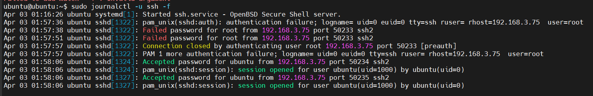

# Tìm hiểu file log SSH và cách đọc file log SSH

## Mục đích của file log SSH

File log SSH ghi lại các sự kiện liên quan đến hoạt động của SSH server, bao gồm:

- Các nỗ lực kết nối đến (thành công và thất bại).
- Thông tin về người dùng đã đăng nhập.
- Các lỗi hoặc cảnh báo liên quan đến dịch vụ SSH.
- Hoạt động của các kênh SSH (ví dụ: chuyển tiếp cổng).

File log này rất hữu ích cho việc giám sát bảo mật, khắc phục sự cố kết nối và kiểm tra các hoạt động bất thường.

## Vị trí file log SSH trên Ubuntu 24.04 và CentOS Stream 9

### 1. Ubuntu 24.04

Ubuntu 24.04 đã thay đổi hệ thống log truyền thống và chuyển sang `journald`.

### 2. CentOS Stream 9

- **Log chính của SSH:** `/var/log/secure`
- **log dịch vụ SSH:** `journalctl -u sshd --no-pager`
- **log chung của hệ thống:** `/var/log/messages`

## Đọc file log SSH

### 1. Kiểm tra log SSH

**Trên ubuntu:**

- Xem log của dịch vụ SSH:

    ```plaintext
    sudo journalctl -u ssh --no-pager
    ```

  - `journalctl`: công cụ dòng lệnh được sử dụng để truy vấn và hiển thị nhật ký được thu thập bởi systemd journal.
  - `-u ssh`: Tùy chọn -u (unit) được sử dụng để lọc nhật ký theo một đơn vị systemd cụ thể. Trong trường hợp này, ssh thường là tên của đơn vị quản lý dịch vụ SSH server (thường là ssh.service). Lệnh này sẽ hiển thị chỉ những nhật ký liên quan đến dịch vụ SSH.
  - `--no-pager`: Tùy chọn --no-pager yêu cầu journalctl hiển thị toàn bộ nhật ký trực tiếp ra terminal mà không cần sử dụng pager.
- Kết quả:


- Lọc log chỉ chứa lỗi SSH

  ```plaintext
  sudo journalctl -u ssh --no-pager -p 3
  ```
  
  - `-p 3`: chỉ lấy log ở mức `error`.
  - **0: emerg** (emergency) - Hệ thống không ổn định.
  - **1: alert** - Cần hành động ngay lập tức.
  - **2: crit** (critical) - Lỗi nghiêm trọng
  - **3: err** (error) - Lỗi.
  - **4: warning** - Cảnh báo.
  - **5: notice** - Thông báo quan trọng nhưng không phải lỗi.
  - **6: info** - Thông tin.
  - **7: debug** - Thông tin gỡ lỗi.

- xem log theo thời gian thực (giống `tail -f`)

```plaintext
sudo journalctl -u ssh -f
```

- Kết quả (xuất hiện log khi có thay đổi. Để thoát khỏi chế độ này, sử dụng `Ctrl + c`):



- Tìm log đăng nhập SSH thành công và thất bại:

```plaintext
sudo journalctl -u ssh --no-pager | grep "Accepted"
sudo journalctl -u ssh --no-pager | grep "Failed"
```

**Trên CentOS Stream 9:** `/var/log/secure`

- Xem log gần đây:

```plaintext
sudo tail -f /var/log/secure
```

- Kết quả:


- Lọc log đăng nhập thành công/thất bại:

```plaintext
sudo grep "Accepted" /var/log/secure
sudo grep "Failed" /var/log/secure
```

### 2. Kiểm tra tấn công SSH (Brute-force, Failed Login)

**Trên ubuntu:**

```plaintex
sudo journalctl -u ssh --no-pager | grep "Failed"
```

**Trên centos:**

```plaintex
sudo grep "Failed" /var/log/secure
```

### 3. Phân tích log đăng nhập

**Log khi đăng nhập thành công:**

```plaintext
Apr 2 14:32:01 ubuntu sshd[1234]: Accepted password for user from 192.168.1.10 port 53422 ssh2
```

- `Accepted password`: Đăng nhập thành công.
- `user`: Tên user.
- `192.168.1.10`: IP của client.
- `port 53422`: Cổng kết nối

**Log khi đăng nhập thất bại:**

```plaintext
Apr 03 01:57:51 ubuntu sshd[1322]: Failed password for root from 192.168.3.75 port 50233 ssh2
```

- `Failed password`: Đăng nhập thất bại
- `for root`: đăng nhập vào root user.
- `192.168.3.75`: IP của thiết bị đang cố đăng nhập.
