# Tổng quan về Wordpress

## Khái niệm về Wordpress

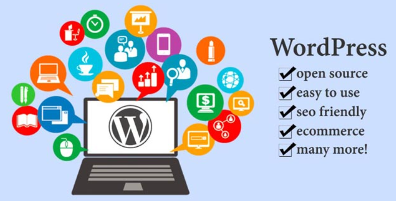

**WordPress** là một hệ quản trị nội dung (CMS - Content Management System) mã nguồn mở. Nó được viết bằng PHP và sử dụng **MySQL** hoặc **MariaDB** làm hệ quản trị cơ sở dữ liệu.

**WordPress** phân phối theo giấy phép GPLv2 nên có thể tự do sử dụng, chỉnh sửa, và phân phối.

Ban đầu, **WordPress** được phát triển chủ yếu cho mục đích tạo blog cá nhân, nhưng theo thời gian, nó đã trở thành một nền tảng mạnh mẽ để xây dựng mọi loại website, từ website doanh nghiệp, trang tin tức, cửa hàng trực tuyến, portfolio cá nhân, đến các diễn đàn và mạng xã hội.

## Phân loại WordPress

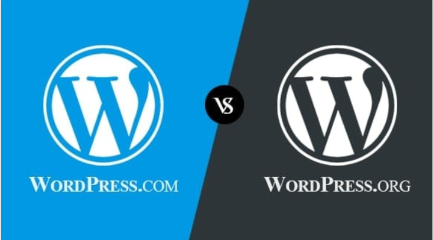

**WordPress** có 2 phiên bản cần phân biệt rõ ràng:

- **WordPress.org (WordPress tự lưu trữ):** Bản mã nguồn mở có thể tải về và tự cài trên hosting riêng. Đây là phiên bản có đầy đủ quyền kiểm soát.
- **WordPress.com (WordPress được lưu trữ):** Nền tảng hosting dạng dịch vụ (SaaS) do Automattic cung cấp, người dùng bị giới hạn tùy chỉnh và cần trả phí để mở rộng.

*Trong quá trình xây dựng website chuyên nghiệp, hầu hết mọi người đều sử dụng WordPress.org.*

### 1. WordPress.org (WordPress tự lưu trữ)

**WordPress.Org** là địa chỉ website của trang chủ cung cấp mã nguồn WordPress, tại đây có thể tải bản cài đặt và tự cài lên Cloud Hosting, từ đó có thể tự do tùy biến và quản trị website WordPress của mình. Phiên bản này thường được gọi là **WordPress Self-Hosted**.

Lý do nên sử dụng **WordPress Self-Hosted** là vì chúng ta có toàn quyền quản trị đồng thời dữ liệu lưu và hoạt động trên Cloud Hosting cá nhân, sử dụng tên miền (domain) riêng mà không mất phụ phí. Có thể tự do cài thêm bất kỳ giao diện hay plugin nào và tùy biến với các kỹ năng nâng cao.

`Ưu điểm`

- Toàn quyền tùy chỉnh (plugin, theme, mã nguồn).
- Tự do kiếm tiền (Adsense, affiliate…).
- Hỗ trợ tất cả loại website: blog, bán hàng, LMS, diễn đàn, API...

`Nhược điểm`

- Cần có kiến thức kỹ thuật cơ bản.
- Tự lo bảo mật, sao lưu, tối ưu tốc độ.
- Tốn thêm chi phí hosting/tên miền.

### 2. WordPress.com (WordPress được lưu trữ)

**WordPress.Com** là địa chỉ website của dịch vụ tạo blog miễn phí trên nền tảng mã nguồn WordPress. Đây cũng là một sản phẩm của Automattic nhưng chuyên phục vụ cho các đối tượng người dùng chỉ muốn có một website nhanh chóng mà không cần cài đặt, không cần thuê Cloud Hosting và chi phí để sử dụng tên miền riêng.

Với **Wordpress.com**, người dùng không có quyền cài giao diện từ bên ngoài mà chỉ phụ thuộc vào có giao diện miễn phí có sẵn, cũng như không thể cài đặt plugin mà chỉ sử dụng các tính năng có sẵn mà WordPress.com cung cấp.

`Ưu điểm`

- Không cần cài đặt gì, chỉ cần đăng ký và bắt đầu.
- Bảo mật, sao lưu, cập nhật tự động.
- Phù hợp cho người mới, blog cá nhân, học sinh/sinh viên.

`Nhược điểm`

- Giới hạn chức năng nếu dùng gói miễn phí.
- Không cài được plugin/theme tùy chỉnh nếu không nâng cấp.
- Không có toàn quyền kiểm soát.

**Ví dụ:**

Truy cập vào trang wordpress.com và thực hiện login, sẽ có giao diện dashboard:

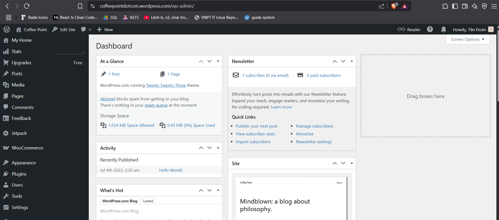

Sau khi hoàn thành bước này và thực hiện một số cài đặt nhỏ như tên website, bài post,... người khác có thể truy cập website của người dùng với địa chỉ:

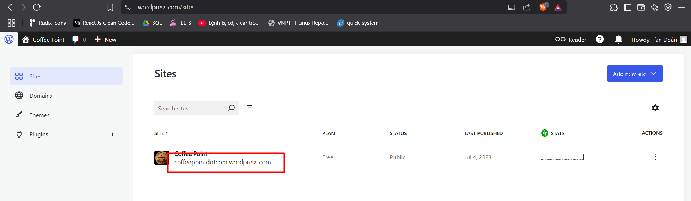

Kết quả sau khi truy cập <https://coffeepointdotcom.wordpress.com/>:

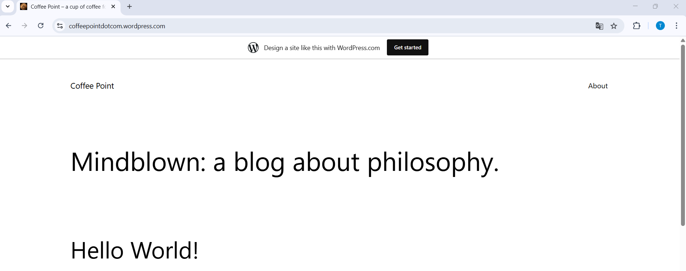

### 3. So sánh chi tiết: WordPress.org và WordPress.com

| Tiêu chí | WordPress.org (Self-hosted) | WordPress.com (Hosted) |
|-----------|-------------|---------|
| **Quyền kiểm soát** | Toàn quyền kiểm soát website, hosting, mã nguồn. | Bị giới hạn tùy chỉnh tùy theo gói đăng ký. |
| **Hosting** | Tự thuê hosting riêng (ví dụ: Hostinger, AZDIGI, DigitalOcean...) | Hosting được cung cấp sẵn bởi WordPress.com. |
| **Chi phí** | Phần mềm WordPress là miễn phí nhưng cần trả phí cho tên miền + hosting. | Có gói miễn phí, nhưng nhiều tính năng bị giới hạn. Muốn mở rộng phải trả phí. |
| **Plugin** | Có thể cài bất cứ plugin nào bạn muốn | Chỉ cài plugin nếu dùng gói Business (trả phí) trở lên. Gói Free không hỗ trợ. |
| **Theme** | Có thể cài, chỉnh sửa, hoặc tự viết theme theo ý muốn. | Gói miễn phí chỉ dùng được theme có sẵn, không sửa mã. Gói cao hơn mới tùy chỉnh được. |
| **Thương mại điện tử (WooCommerce)** | Cài và dùng WooCommerce thoải mái. | Chỉ được dùng WooCommerce từ gói eCommerce (cao cấp). |
| **Quảng cáo** | Tự quyết định hiển thị quảng cáo hay không. Có thể kiếm tiền với Google AdSense. | WordPress.com hiển thị quảng cáo trên gói miễn phí, không kiếm được tiền. Gói trả phí mới bỏ được ads. |
| **Tên miền riêng** | Có thể dùng bất kỳ tên miền nào (ví dụ: `yourdomain.com`). | Gói miễn phí sẽ có định dạng `yourname.wordpress.com`. Muốn tên miền riêng thì phải trả phí. |
| **Bảo trì & cập nhật** | Tự chịu trách nhiệm cập nhật, bảo mật, sao lưu... | WordPress.com lo hết: backup, bảo mật, cập nhật hệ thống. |
| **Khả năng mở rộng** | Cực kỳ linh hoạt. Có thể xây website blog, bán hàng, diễn đàn, LMS, app API... | Bị giới hạn. Phù hợp làm blog cá nhân, website nhỏ nếu không nâng cấp gói. |
| **Phù hợp với ai** | Người có kỹ năng kỹ thuật cơ bản trở lên hoặc muốn toàn quyền kiểm soát. | Người mới bắt đầu, muốn làm blog nhanh, không cần lo về kỹ thuật. |

## Các thành phần chính của WordPress

- **Bảng điều khiển (Dashboard):** là trung tâm quản lý của website WordPress. Từ đây có thể thực hiện mọi thao tác như tạo bài viết, trang, quản lý giao diện, cài đặt plugin, quản lý người dùng,...
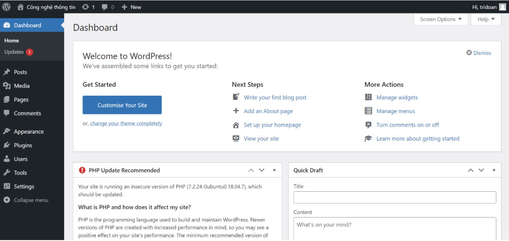

- **Giao diện (Themes):** Giao diện quyết định hình thức bên ngoài và cách hiển thị nội dung của website người dùng. Có hàng ngàn giao diện miễn phí và trả phí có sẵn, cho phép người dùng dễ dàng thay đổi diện mạo website mà không cần kiến thức lập trình sâu.
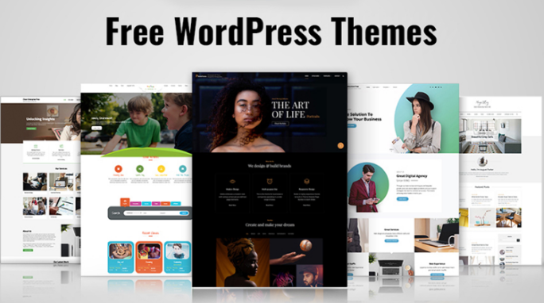

- **Plugin:** là các đoạn mã mở rộng chức năng của WordPress. Chúng cho phép thêm các tính năng mới vào website của, chẳng hạn như tạo biểu mẫu liên hệ, tối ưu hóa SEO, tích hợp mạng xã hội, tạo cửa hàng trực tuyến, v.v. Cũng có vô số plugin miễn phí và trả phí để lựa chọn.
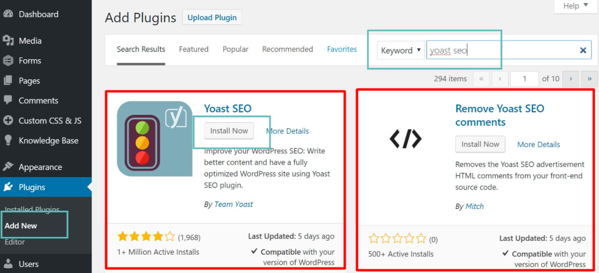

- **Bài viết (Posts):** nơi tạo và quản lý các nội dung theo dạng blog, thường được sắp xếp theo thời gian và có thể gắn thẻ (tags) và danh mục (categories).
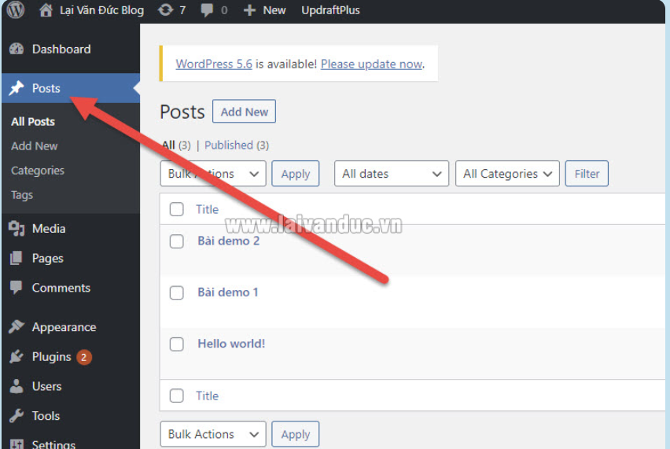

- **Trang (Pages):** nơi tạo và quản lý các nội dung tĩnh, ít thay đổi như trang giới thiệu, trang liên hệ, trang dịch vụ, v.v.
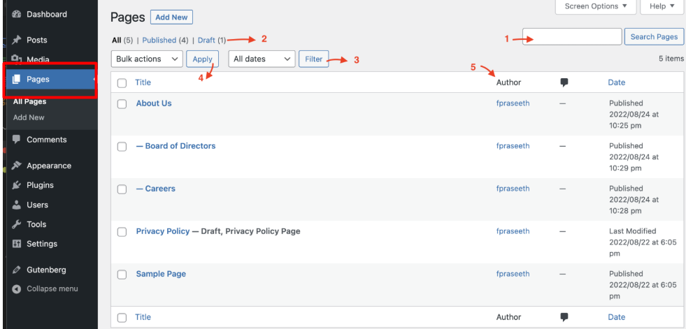

- **Thư viện Media (Media Library):** nơi tải lên và quản lý các tệp đa phương tiện như hình ảnh, video, âm thanh để sử dụng trong bài viết và trang.
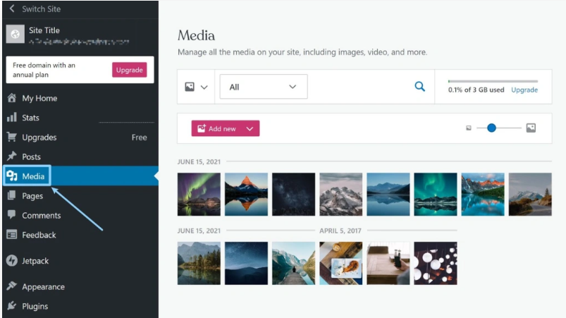

## Các chức năng chính của WordPress

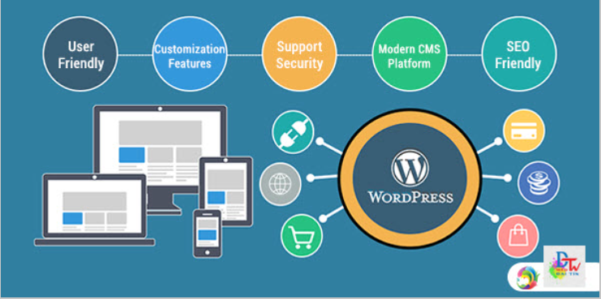

- **Quản lý nội dung:** WordPress giúp người dùng dễ dàng tạo, chỉnh sửa, xóa và sắp xếp nội dung trên website một cách trực quan.
- **Hỗ trợ đa dạng loại nội dung:** Người dùng có thể tạo bài viết văn bản, hình ảnh, video, âm thanh và nhiều loại nội dung khác.
- **Hệ thống phân quyền người dùng:** WordPress cho phép tạo nhiều tài khoản người dùng với các vai trò và quyền hạn khác nhau (ví dụ: quản trị viên, biên tập viên, tác giả, cộng tác viên).
- **Khả năng tùy biến cao:** Với hàng ngàn giao diện và plugin, người dùng có thể tùy chỉnh website của mình theo mọi nhu cầu và phong cách.
- **Thân thiện với SEO:** WordPress được xây dựng với cấu trúc tốt cho công cụ tìm kiếm (SEO), giúp website dễ dàng được tìm thấy trên Google và các công cụ tìm kiếm khác.
- **Cộng đồng hỗ trợ lớn:** WordPress có một cộng đồng người dùng và nhà phát triển rất lớn trên toàn thế giới, sẵn sàng giúp đỡ khi người dùng gặp khó khăn.
- **Khả năng mở rộng:** WordPress có thể được mở rộng để đáp ứng các nhu cầu phức tạp hơn, chẳng hạn như xây dựng website thương mại điện tử, diễn đàn, mạng xã hội, v.v.

## Quy trình hoạt động của WordPress

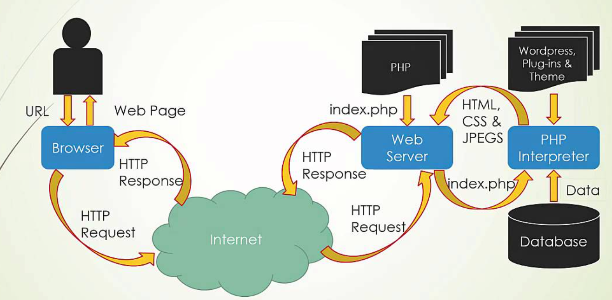

`Bước 1`: **Trình duyệt gửi yêu cầu (HTTP Request)**

- Người dùng nhập URL như <https://example.com/san-pham/may-giat-lg.>
- Trình duyệt gửi một HTTP request đến web server (nơi chứa website WordPress).
- Ví dụ: yêu cầu tới index.php, kèm theo thông tin như cookies, headers, query string...

`Bước 2`: **Web server nhận và chuyển đến `index.php`**

- Web server (Apache hoặc Nginx) định tuyến yêu cầu đến file `index.php` trong thư mục gốc của WordPress.
- Đây là **entry point (điểm vào)** cho mọi request trong WordPress.

`Bước 3`: **Tải `wp-blog-header.php` và `wp-load.php`**

- File `index.php` gọi `wp-blog-header.php`, từ đó gọi `wp-load.php`.
- `wp-load.php` dùng để nạp toàn bộ hệ thống WordPress core.

`Bước 4`: **WordPress khởi động hệ thống (Bootstrap)**

- WordPress sẽ:
  - Nạp **core files** (hàm, class,...).
  - Nạp **theme hiện tại**.
  - Nạp **plugin đã kích hoạt**.
  - Nạp file `functions.php` trong theme.
- Giai đoạn này còn gọi là  **WordPress Initialization**.

`Bước 5`: **Chạy các hooks đầu tiên (Actions & Filters)**

- WordPress sẽ kích hoạt các hook hệ thống như:
  - `plugins_loaded`
  - `init`
  - `wp_loaded`
- Lúc này các plugin hoặc custom code có thể can thiệp vào hệ thống.

`Bước 6`: **Phân tích URL với Rewrite & Routing**

- WordPress sử dụng **Rewrite Rules** để xác định URL đó ứng với nội dung gì:
  - Bài viết?
  - Trang tĩnh?
  - Danh mục?
  - Sản phẩm (Custom Post Type)?
- *Ví dụ:* `/san-pham/may-giat-lg` -> Custom Post Type `product`

`Bước 7`: **Truy vấn CSDL bằng WP_Query**

- WordPress tạo ra một đối tượng `WP_Query` để truy vấn cơ sở dữ liệu.
- Nó tìm kiếm post, page, hoặc CPT phù hợp với URL người dùng đã nhập.
- Dữ liệu được lấy từ các bảng như: `wp_posts`, `wp_postmeta`, `wp_terms`,...

`Bước 8`: **Render nội dung bằng Template Hierarchy**

- WordPress kiểm tra **cấu trúc giao diện (template hierarchy)** để xác định file hiển thị nội dung.
- Ví dụ:
  - Trang sản phẩm → `single-product.php` → nếu không có thì dùng `single.php` → nếu không có nữa thì dùng `index.php`.
- Gọi file như: `header.php`, `content.php`, `footer.php`,...

`Bước 9`: **Kết hợp dữ liệu + giao diện → Xuất HTML**

- Kết quả được "gắn" dữ liệu từ CSDL vào các template HTML.
- WordPress xuất nội dung cuối cùng ra trình duyệt dưới dạng: HTML, CSS, JS, hình ảnh, video,...

`Bước 10`: **Web server gửi HTTP Response về trình duyệt**

- Toàn bộ trang web được gửi lại dưới dạng HTTP Response.
- Trình duyệt nhận HTML/CSS và render ra website hoàn chỉnh cho người dùng xem.

**Những thành phần đóng vai trò quan trọng:**

| Thành phân | Vai trò chính |
|-----------|-------------|
| `index.php` | Entry point, khởi động toàn hệ thống |
| `wp-load.php` | Nạp cấu hình WordPress |
| `functions.php` | Nạp chức năng tùy chỉnh của theme |
| `WP_Query` | Truy vấn dữ liệu |
| Rewrite Rules | Xử lý URL đẹp (Pretty Permalink) |
| Template Hierarchy | Xác định file nào dùng để hiển thị nội dung |

## Ưu điểm và nhược điểm của WordPress

### 1. Ưu điểm

| Ưu điểm | Chi tiết |
|-----------|-------------|
| **Mã nguồn mở (Open Source)** | Miễn phí sử dụng, chỉnh sửa và phát triển mở rộng theo nhu cầu riêng. |
| **Dễ cài đặt và sử dụng** | Chỉ cần vài phút để cài đặt. Giao diện quản trị trực quan, có thể không cần biết code. |
| **Giao diện đa dạng** | Có hàng ngàn theme miễn phí và trả phí, dễ tùy chỉnh. |
| **Hệ sinh thái plugin khổng lồ** | Hơn 60.000 plugin giúp mở rộng tính năng: SEO, bảo mật, bán hàng,... |
| **Responsive / mobile-friendly** | Hầu hết các theme hiện nay đều tối ưu cho điện thoại di động. |
| **Hỗ trợ đa ngôn ngữ** | Có thể dùng plugin như WPML, Polylang để tạo website đa ngôn ngữ. |
| **Cộng đồng hỗ trợ lớn** | Dễ tìm tài liệu, diễn đàn, video hướng dẫn, plugin cập nhật thường xuyên. |
| **SEO-friendly** | Cấu trúc URL thân thiện, hỗ trợ plugin SEO mạnh mẽ như Yoast SEO. |
| **Chi phí xây dựng thấp** | Với hosting + theme miễn phí, bạn có thể tạo website với chi phí tối thiểu. |
| **Hỗ trợ thương mại điện tử** | Có plugin mạnh như WooCommerce để tạo cửa hàng bán hàng online. |

### 2. Nhược điểm

| Nhược điểm | Chi tiết |
|-----------|-------------|
| **Tốc độ có thể chậm** | Nếu cài quá nhiều plugin, dùng hosting yếu hoặc không tối ưu code/theme. |
| **Dễ bị tấn công** | Vì quá phổ biến nên thường là mục tiêu của hacker (nếu không bảo mật tốt). |
| **Phụ thuộc vào plugin nhiều** | Một số chức năng nâng cao đòi hỏi phải cài thêm plugin, có thể gây xung đột. |
| **Cập nhật thường xuyên** | Phải cập nhật plugin, theme, core thường xuyên để tránh lỗi và bảo mật. |
| **Giao diện quá tùy biến = phức tạp** | Một số theme có quá nhiều tùy chọn khiến người mới bị rối. |
| **Khả năng tùy biến giới hạn với người không biết code** | Các tùy chỉnh phức tạp đòi hỏi phải biết HTML, CSS, PHP. |
| **Không tối ưu tốt khi site quá lớn** | Với website hàng triệu truy cập/tháng, WP có thể đuối nếu không tối ưu server. |
| **Plugin kém chất lượng** | Một số plugin miễn phí không được cập nhật thường xuyên, có thể gây lỗi. |
