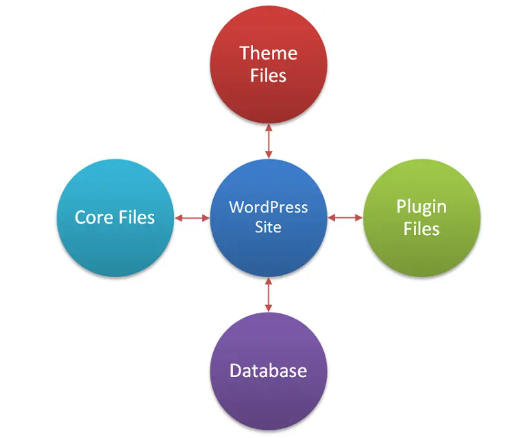

# Xây dựng website bằng wordpress

## Các thành phần

Để xây dựng một website bằng wordpress, cần hiểu rõ các thành phần chính tạo nên và vận hành website đó. các thành phần cần thiết được chia rõ ràng theo từng cấp độ từ hạ tầng cho đến giao diện và tính năng. Các thành phần bao gồm:

### 1. Hạ tầng (Hosting & Server)

| Thành phần | Vai trò |
|-----------|-------------|
| **Webserver** | Là nơi website được lưu trữ và xử lý yêu cầu từ trình duyệt (Apache, Nginx) |
| **PHP** | Ngôn ngữ lập trình để wordpress hoạt động |
| **MySQL/MariaDB** | CSDL lưu trữ nội dung website (bài viết, người dùng, setting,...) |
| **Domain name** | Tên miền để người dùng truy cập (vd: `mysite.com`) |
| **Laragon/XAMPP (nếu local)** | Môi trường phát triển cục bộ để chạy website wordpress trên máy tính cá nhân |

Trường hợp không dùng Laragon/XAMPP, sử dụng website trên môi trường thực tế cần hosting:

**Hosting:** là dịch vụ cung cấp không gian lưu trữ trên máy chủ (server) kết nối với internet, nơi chứa tất cả các tệp tin của website (mã nguồn wordpress, theme, plugin, hình ảnh, video, cơ sở dữ liệu,...).

- **Share Hosting:** nhiều website cùng chia sẻ tài nguyên trên 1 máy chủ. Chi phí thấp nhưng giới hạn tài nguyên.
- **VPS Hosting (Virtual Private Server - Máy chủ riêng ảo):** Một máy chủ vật lý được chia thành nhiều máy chủ ảo riêng biệt.
- **Dedicated Hosting (Máy chủ riêng):** thuê toàn bộ máy chủ vật lý cho riêng website.
- **Managed WordPress Hosting:** dịch vụ hosting được tối ưu hóa đặc biệt cho các website wordpress.
- **Cloud Hosting:** website được lưu trữ trên máy chủ ảo (đám mây), mang lại tính linh hoạt và khả năng mở rộng cao.

### 2. Phần mềm trung tâm: Wordpress Core

| Thành phần | Vai trò |
|-----------|-------------|
| **WordPress Core** | Bộ mã nguồn chính của WordPress gồm hàng ngàn file PHP xử lý nội dung |
| **wp-config.php** | File cấu hình chính: thông tin kết nối database, bảo mật, setting |
| **.htaccess/nginx.conf** | File cấu hình URL, bảo mật, cache (dành cho Apache hoặc Nginx) |
| **wp-content/** | Thư mục chứa các dữ liệu tùy biến: theme, plugin, media... |

### 3. Giao diện (Themes)

| Thành phần | Vai trò |
|-----------|-------------|
| **Theme (Giao diện)** | Kiểm soát bố cục, màu sắc, kiểu hiển thị của website |
| **File trong theme** | Bao gồm `style.css`, `index.php`, `functions.php`, `single.php`,... |
| **Child theme** | Bản phụ của theme để tùy chỉnh mà không làm ảnh hưởng đến theme gốc |

### 4. Chức năng mở rộng (Plugins)

| Thành phần | Vai trò |
|-----------|-------------|
| **Plugins** | Thêm tính năng cho WordPress như SEO, bảo mật, form, thương mại điện tử... |
| **Plugin phổ biến** | Yoast SEO, Contact Form 7, WooCommerce, Elementor, WP Rocket, UpdraftPlus... |
| **Custom plugin** | Tự viết plugin riêng nếu có yêu cầu đặc biệt |

### 5. Cơ sở dữ liệu (Database)

| Thành phần | Vai trò |
|-----------|-------------|
| **MySQL Database** | Lưu trữ bài viết, trang, media, người dùng, setting,... |
| **Bảng dữ liệu quan trọng** | `wp_posts`, `wp_users`, `wp_options`, `wp_terms`,... |
| **phpMyAdmin (quản lý)** | Công cụ trực quan để xem/sửa database |

### 6. Nội dung website

| Thành phần | Vai trò |
|-----------|-------------|
| **Pages (Trang)** | Các trang tĩnh như: Giới thiệu, Liên hệ, Dịch vụ,... |
| **Posts (Bài viết)** | Các bài viết dạng blog, tin tức |
| **Media** | Hình ảnh, video, tài liệu... được tải lên và quản lý trong Media Library |
| **Menu** | Điều hướng website (Trang chủ, Blog, Liên hệ,...) |
| **Widgets** | Các khối nhỏ: thanh bên, footer,... thường thêm ở theme hỗ trợ |

### 7. Cấu hình và cài đặt

| Thành phần | Vai trò |
|-----------|-------------|
| **Cài đặt chung** | Tiêu đề website, mô tả, ngôn ngữ, múi giờ,... |
| **Permalinks** | Cấu trúc đường dẫn URL thân thiện (ví dụ: `mysite.com/bai-viet`) |
| **Thành viên & phân quyền** | Người quản trị, biên tập viên, cộng tác viên,... |
| **Cài đặt plugin/theme** | Qua Dashboard hoặc tải trực tiếp từ .zip |
