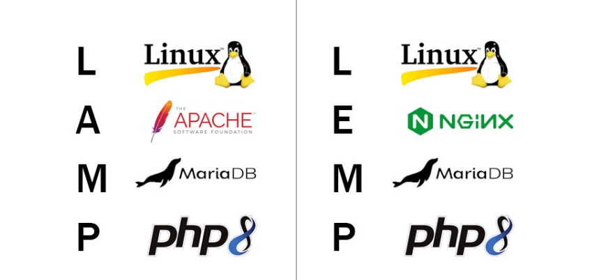
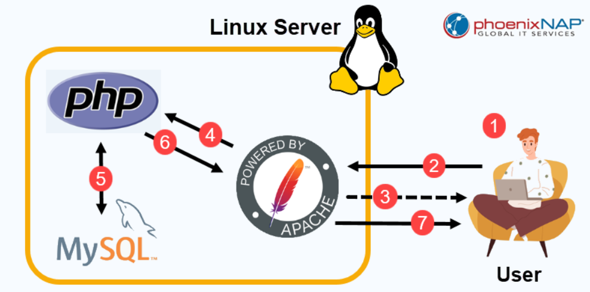
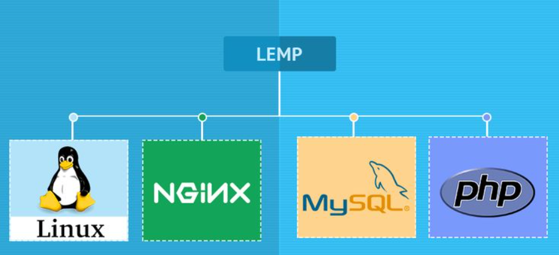
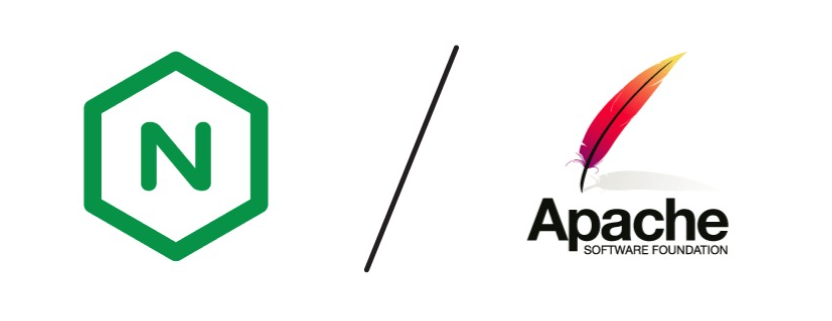

# Tìm hiểu về 2 stack: LAMP, LEMP

**LAMP** và **LEMP** là hai bộ phần mềm mã nguồn mở phổ biến được sử dụng rộng rãi để xây dựng và triển khai các ứng dụng web động, đặc biệt là các website. Chúng được gọi là "stack" vì chúng hoạt động cùng nhau theo lớp, với mỗi thành phần đảm nhận một vai trò cụ thể trong quá trình phục vụ nội dung web cho người dùng.

## LAMP

LAMP là nền tảng của các Hosting website sử dụng chủ yếu Linux. LAMP được xem như là giải pháp linh hoạt cho máy chủ được kết hợp từ 4 giải pháp phần mềm riêng lẻ.

### 1. LAMP stack là gì?

**LAMP** là viết tắt của **L**inux, **A**pache, **M**ySQL và **P**HP (cũng có thể là Python, Perl). Mỗi trong số đó là các gói phần mềm riêng lẻ được kết hợp để tạo thành một giải pháp máy chủ web linh hoạt. Các thành phần này, được sắp xếp theo các lớp hỗ trợ lẫn nhau, tạo thành các stack phần mềm.

- **L** - Linux: lớp đầu tiên trong stack. Hệ điều hành này là cơ sở nền tảng cho các lớp phần mềm khác.
- **A** - Apache: Lớp thứ hai trong stack. Lớp này nằm trên lớp Linux. Web server chịu trách nhiệm chuyển đổi các web browser sang các website chính xác của chúng.
- **M** - MySQL hoặc MariaDB (Lớp thứ ba là nơi cơ sở dữ liệu database được lưu trữ):
  - Là hệ quản trị cơ sở dữ liệu quan hệ (RDBMS). Chúng được sử dụng để lưu trữ và quản lý dữ liệu của website hoặc ứng dụng web.
  - **MariaDB** là bản fork từ **MySQL**, tương thích 100% nhưng nhẹ hơn và nhanh hơn trong nhiều trường hợp.
- **P** - PHP, Perl, hoặc Python (lớp trên cùng của stack):
  - Ngôn ngữ lập trình kịch bản. PHP là ngôn ngữ phổ biến nhất được sử dụng trong stack LAMP để tạo ra nội dung web động. Perl và Python cũng là những lựa chọn khả thi.
  - Xử lý các nhiệm vụ cần thiết hoặc kết nối với CSDL MySQL để lấy thông tin cần thiết sau đó trả về cho Apache. Apache cuối cùng sẽ trả kết quả nhận được về cho máy khách đã gửi yêu cầu tới.

### 2. Cách LAMP stack hoạt động

1. Người dùng nhập địa chỉ website vào trình duyệt của họ.
2. Trình duyệt gửi HTTP Request đến máy chủ Linux, nơi đang chạy Apache Web Server.
3. Nếu là nội dung tĩnh (HTML, CSS, hình ảnh...), Apache sẽ phản hồi ngay cho trình duyệt mà không cần qua PHP hay CSDL.
4. Nếu nội dung là động (như trang WordPress, bài viết...), Apache chuyển yêu cầu sang PHP để xử lý.
5. PHP chạy mã PHP tương ứng (ví dụ: index.php) và truy vấn cơ sở dữ liệu MySQL để lấy thông tin như bài viết, user, v.v.
6. Sau khi xử lý xong, PHP trả về HTML đã kết hợp dữ liệu (kết quả từ MySQL) cho Apache.
7. Apache gửi nội dung HTML cuối cùng về trình duyệt của người dùng, trình duyệt hiển thị nội dung trang web.

### 3. Ưu/Nhược điểm của LAMP

| `Ưu điểm` | Giải thích |
|-----------|-------------|
| Phổ biến rộng rãi | Rất nhiều tài liệu, cộng đồng hỗ trợ lớn |
| Dễ cài đặt và cấu hình | Cài nhanh trên Ubuntu, CentOS, Debian,... |
| Tương thích WordPress/Laravel tốt | WordPress được xây dựng tối ưu cho LAMP |
| Hỗ trợ `.htaccess` linh hoạt | Dễ tùy chỉnh cấu hình URL, redirect, bảo mật |
| Mã nguồn mở, miễn phí | Không tốn chi phí bản quyền |

| `Nhược điểm` | Giải thích |
|-----------|-------------|
| Apache hiệu suất thấp hơn NGINX | Apache xử lý concurrent connections không tốt bằng NGINX |
| Không tối ưu cho static files lớn | Tốc độ xử lý CSS, JS, hình ảnh kém hơn so với NGINX |
| Không scale tốt trong hệ thống lớn | Với traffic cao, cần cấu hình kỹ hoặc chuyển sang NGINX để tối ưu hơn |

## LEMP

### 1. LEMP stack là gì?

Các thành phần cấu thành **LEMP** stack cũng gần tương tự với **LAMP**, chỉ khác là **Apache** sẽ được thay thế bởi **Nginx**. **Nginx** được đọc là “engine-x”, giải thích cho chữ E trong “LEPM”.

### 2. Cách LEMP hoạt động

Quy trình hoạt động của LEMP và LAMP gần giống nhau về mặt tổng thể, nhưng có một vài điểm khác biệt quan trọng trong cách web server xử lý yêu cầu và giao tiếp với PHP.

**LAMP:**

- Nếu là file PHP: Apache dùng `mod_php` hoặc chuyển tới PHP-FPM để xử lý

**LEMP:**

- Nếu là file PHP: NGINX bắt buộc chuyển sang PHP-FPM qua FastCGI

1. Trình duyệt gửi yêu cầu.
2. NGINX nhận request.
3. Nếu file tĩnh -> trả trực tiếp.
4. Nếu là PHP -> chuyển đến PHP-FPM.
5. PHP-FPM xử lý mã PHP: Truy vấn MySQL nếu cần, Sinh ra HTML.
6. PHP-FPM gửi HTML về cho NGINX.
7. NGINX trả HTML về cho trình duyệt.
8. Trình duyệt hiển thị trang web.

**FastCGI:** là một giao thức (protocol) dùng để giao tiếp giữa web server (như NGINX) và ứng dụng xử lý động (như PHP).

- Web server không trực tiếp xử lý PHP, mà chỉ chuyển yêu cầu qua một "bên thứ ba" (ví dụ: PHP-FPM).
- Giao tiếp giữa hai bên dùng FastCGI, rất nhanh và hiệu quả.
- lấy yêu cầu từ NGINX gửi cho PHP-FPM, rồi lấy kết quả trả lại.

**PHP-FPM:** viết tắt của PHP FastCGI Process Manager. Nó là cơ chế xử lý PHP hiện đại, được thiết kế để thay thế cách cũ (`mod_php`) trong Apache hoặc các web server khác.

- Quản lý các tiến trình PHP (process) chạy nền.
- Tăng hiệu năng và khả năng chịu tải cao.
- Cho phép cấu hình linh hoạt số lượng tiến trình, timeout, logging...

**Mối quan hệ giữa PHP-FPM và FastCGI:**

| Thành phần | Vai trò |
|-----------|-------------|
| **FastCGI** | Là giao thức để truyền yêu cầu từ web server (như NGINX) sang PHP-FPM |
| **PHP-FPM** | Là trình quản lý các tiến trình PHP. Nó lắng nghe các yêu cầu đến qua giao thức FastCGI. |

### 3. Ưu/Nhược điểm của LEMP

| `Ưu điểm` | Giải thích |
|-----------|-------------|
| Hiệu suất cao hơn Apache | NGINX dùng kiến trúc non-blocking, event-driven → xử lý nhiều request tốt |
| Tốt cho static file (ảnh, JS, CSS) | Tốc độ truyền file rất nhanh → web frontend nhanh mượt |
| Tiết kiệm tài nguyên RAM/CPU | Nhẹ hơn Apache trong hệ thống lớn hoặc VPS nhỏ |
| Phù hợp microservice và proxy | NGINX rất mạnh trong reverse proxy, load balancing |

| `Nhược điểm` | Giải thích |
|-----------|-------------|
| Cấu hình phức tạp hơn Apache | Không hỗ trợ `.htaccess`, phải cấu hình trực tiếp file NGINX |
| Không tương thích 100% plugin cũ | Một số plugin/ứng dụng viết riêng cho Apache có thể không hoạt động tốt |
| Khó học với người mới | NGINX cần học cú pháp config riêng |

### So sánh giữa LAMP và LEMP

**Tốc độ và hiệu suất:** Nginx tốt hơn trong việc phục vụ nội dung tĩnh một cách hiệu quả và nhanh chóng. Nhưng khi nói đến mở rộng, ví dụ như chạy nhiều trang web trên cùng 1 máy chủ thì apache lại là lựa chọn tốt hơn.

**Dễ sử dụng:** Apache thuận tiện và dễ sử dụng hơn khi thiết lập và cấu hình.

**Cộng đồng và thị phần:** Apache lớn hơn. Tuy nhiên nhờ có hiệu suất tốt nên Nginx cũng thu hút đa số các nhà phát triển.

**Tính năng:**:

- Nginx tốt về tốc độ và hiệu suất. Nó sử dụng công nghệ tiêu tốn bộ nhớ thấp.
- Nginx là single-threaded (đơn luồng), vì vậy CPU và bộ nhớ không bị ảnh hưởng khi tải tăng lên.
- Nginx tốt nhất cho các trang web tĩnh, trong khi Apache hoạt động tốt trong trường hợp của các trang web động.
