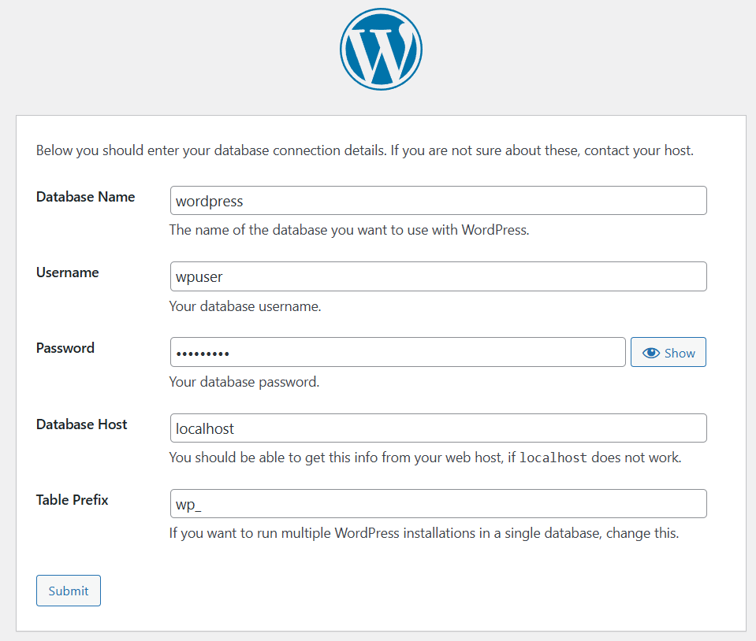

# Triển khai website wordpress với stack LAMP, LEMP

## Mục tiêu

Dựng 2 website wordpress chạy trong máy ảo ubuntu sử dụng LAMP (Linux + Apache + MySQL + PHP) và LEMP (Linux + Nginx + MySQL + PHP).

## Các bước triển khai

### 1. Với LAMP stack

**`Bước 1`: Cập nhật hệ thống ubuntu**

```plaintext
sudo apt update
sudo apt upgrade -y
```

Việc cập nhật và nâng cấp đảm bảo có các gói mới nhất, ổn định và bảo mật.

**`Bước 2`: Cài đặt Apache webserver**

```plaintext
# Tải Apache
sudo apt install apache2 -y

# Khởi động Apache
sudo systemctl start apache2

# Để Apache khởi động cùng hệ thống
sudo systemctl enable apache2

# Kiểm tra trạng thái Apache
sudo systemctl status apache2
```

Sau khi cài đặt apache, kiểm tra trạng thái nếu thành công sẽ có dòng `active (running)`:


**`Bước 3`: Cài MySQL và tạo database**

MySQL dùng để lưu trữ nội dung bài viết, người dùng, cấu hình WordPress.

```plaintext
sudo apt install mysql-server -y
sudo mysql_secure_installation
```

- `mysql-server`: gói phần mềm chứa các tệp tin cần thiết để chạy máy chủ MySQL.
- `mysql_secure_installation`: một script (tập lệnh) được cung cấp bởi các nhà phát triển MySQL. Mục đích của script này là để giúp tăng cường bảo mật cho một máy chủ MySQL mới được cài đặt.

Tạo user và database cho wordpress:

```plaintext
sudo mysql -u root -p
```

- `mysql`: tên chương trình client dòng lệnh của SQL. Sử dụng chương trình này để tương tác với máy chủ MySQL, gửi truy vấn SQL và quản lý cơ sở dữ liệu.
- `-u root`: `-u` (viết tắt của user). Trường hợp này chỉ định người dùng `root`.
- `-p`: tùy chọn (viết tắt của password), yêu cầu MySQL client nhắc nhập mật khẩu cho người dùng đã chỉ định.

Sau khi thực hiện câu lệnh, sẽ xuất hiện dòng SQL và sử dụng các câu lệnh SQL dưới đây:

Tạo cơ sở dữ liệu trống có tên `wordpress`:

```SQL
CREATE DATABASE wordpress;
```

Tạo tài khoản người dùng mới trong hệ thống với tên người dùng `wpuser` và host `localhost` mà người đó có thể kết nối đến:

```SQL
CREATE USER 'wpuser'@'localhost' IDENTIFIED BY 'doantan28';
```

- `localhost`: chỉ định rằng người dùng `wpuser` chỉ có thể kết nối đến máy chủ MySQL từ chính máy chủ nơi MySQL đang chạy (tức là `localhost`).
- `IDENTIFIED BY 'doantan28'`: Cho biết rằng đang thiết lập phương thức xác thực bằng mật khẩu với mật khẩu là 'doantan28'.

Cấp tất cả quyền trên tất cả các bảng và CSDL `wordpress` cho người dùng `wpuser` khi kết nối đến `localhost`:

```SQL
GRANT ALL PRIVILEGES ON wordpress.* TO 'wpuser'@'localhost';
```

Tải lại các bảng quyền sau khi thực hiện thay đổi và thoát:

```SQL
FLUSH PRIVILEGES;
EXIT;
```

**`Bước 4`: Cài PHP và các extension cần thiết**

```plaintext
sudo apt install php libapache2-mod-php php-mysql php-curl php-gd php-mbstring php-xml php-xmlrpc php-soap php-intl php-zip -y
```

- `php`: core PHP, tức là bộ cài đặt PHP cơ bản. Nó cung cấp trình thông dịch PHP và các tệp tin cần thiết để chạy các ứng dụng PHP.
- `libapache2-mod-php`: module PHP cho máy chủ web Apache. Module này cho phép Apache xử lý và thực thi các tệp tin PHP.
- `php-mysql`: Extension MySQL cho PHP. Extension này cho phép PHP giao tiếp với máy chủ cơ sở dữ liệu MySQL.
- `php-curl`: Extension cURL cho PHP. Cho phép PHP thực hiện các yêu cầu HTTP đến các máy chủ khác. Nó hữu ích cho nhiều tác vụ như tích hợp API, tải dữ liệu từ xa, v.v.
- `php-gd`: Thư viện GD cho PHP. Được sử dụng để tạo và thao tác hình ảnh động. Wordpress sử dụng GD cho xử lý hình ảnh.
- `php-mbstring`: Extension xử lý đúng các chuỗi ký tự đa byte, đặc biệt là đối với các ngôn ngữ có ký tự không thuộc bảng mã ASCII cơ bản (ví dụ: tiếng Việt).
- `php-xml`: Extension XML cho PHP, cung cấp hỗ trợ cho việc làm việc với các tài liệu XML.
- `php-xmlrpc`: Extension XML-RPC cho PHP. XML-RPC là một giao thức cho phép các chương trình khác nhau giao tiếp với nhau qua mạng bằng cách sử dụng XML. WordPress sử dụng nó cho các tính năng như trackbacks và pingbacks.
- `php-soap`: SOAP (Simple Object Access Protocol) là một giao thức khác để trao đổi thông tin có cấu trúc trong việc triển khai các dịch vụ web.
- `php-intl`: Internationalization (intl) cho PHP. Extension này cung cấp hỗ trợ cho các tính năng quốc tế hóa như định dạng ngày tháng, số, tiền tệ theo các chuẩn địa phương khác nhau.
- `php-zip`: Extension Zip cho PHP, cho phép PHP tạo và giải nén các tệp tin ZIP. WordPress thường sử dụng nó để cài đặt theme và plugin từ các tệp tin ZIP.

Sau khi cài đặt, kiểm tra xem PHP đã cài thành công chưa với câu lệnh `php -v`. kết quả thành công:


**`Bước 5`: Tải cấu hình Wordpress**

```plaintext
# Di chuyển vào thư mục /tmp
cd /tmp

# Tải tệp nén wordpress mới nhất về thư mục /tmp
wget https://wordpress.org/latest.tar.gz

# Giải nén tệp latest.tar.gz bằng gzip.
tar -xzvf latest.tar.gz

# copy toàn bộ nội dung trong wordpress vào /html
sudp cp -r wordpress/* /var/www/html/
```

- `tar -xzvf latest.tar.gz`: sau khi thực hiện, một thư mục có tên là `wordpress` sẽ được tạo ra trong thư mục `/tmp`, chứa các tệp tin của WordPress.
  - `tar`: một tiện ích dòng lệnh được sử dụng để làm việc với các tệp tin `.tar` (tape archive), thường được dùng để đóng gói nhiều tệp tin và thư mục thành một tệp duy nhất để dễ dàng phân phối hoặc lưu trữ.
  - `-x`: Tùy chọn này yêu cầu `tar` giải nén các tệp tin từ một tệp tin `.tar`.
  - `-z`: Tùy chọn này yêu cầu `tar` giải nén tệp tin bằng gzip.
  - `-v`:  viết tắt của "verbose". `tar` sẽ hiển thị tên của các tệp tin đang được giải nén.
  - `-f latest.tar.gz`: Tùy chọn này chỉ định tên của tệp tin `.tar.gz` muốn xử lý.

**`Bước 6`: Cấp quyền và cấu hình Apache**

Cấp quyền để Apache có thể đọc & ghi nội dung file:

```plaintext
sudo chown -R www-data:www-data /var/www/html/
sudo chmod -R 755 /var/www/html/
```

Sửa file Apache config:

```plaintext
sudo vim /etc/apache2/sites-available/000-default.conf
```

Thêm `AllowOverride All` vào trong `<VirtualHost *:80>`:


- Việc thêm `AllowOverride All` cho phép Apache chấp nhận và áp dụng các lệnh trong file `.htaccess` nằm trong thư mục đó.

Sau đó:

```plaintext
sudo a2enmod rewrite
sudo systemctl restart apache2
```

- `a2enmod`: bật (enable) module cụ thể của Apache
- Module `rewrite` cung cấp khả năng viết lại URL (URL rewriting). Cho phép tạo ra các URL thân thiện hơn với người dùng và công cụ tìm kiếm (ví dụ: chuyển từ `?p=123` thành `/ten-bai-viet`).

**`Bước 7`: Truy cập website wordpress**

1. Trên Windows, mở trình duyệt → nhập IP máy ảo Ubuntu.
2. Giao diện cài đặt WordPress sẽ hiện ra.
3. Nhập thông tin: database `wordpress`, User `wpuser`, Password `doantan28`.
4. Bấm Cài đặt WordPress
5. Tạo tài khoản admin → đăng nhập → xong!

Sau khi nhập IP, sẽ thấy màn hình cài đặt wordpress:


Nhập thông tin database như đã cài đặt:



Nhập thông tin website:


Sau khi đăng nhập thành công:


### 2. Với LEMP stack

Apache và Nginx đều mặc định dùng cổng 80 (HTTP) và 443 (HTTPS). Như ở phần tạo website với LAMP stack đã sử dụng cổng `80` nên với website dùng LEMP stack sẽ sử dụng cổng `8080`.

**`Bước 1`: Đổi cổng của nginx**

Mở file cấu hình nginx:

```plaintext
sudo vim /etc/nginx/sites-available/default
```

Thay đổi cổng nginx port `80`->`8080`:


Khởi động lại nginx sau khi thay đổi cổng:

```plaintext
sudo systemctl restart nginx
```

**`Bước 2`: thay đổi thư mục web**

**Quan trọng:** Không dùng chung thư mục web giữa Apache và Nginx.

| Stack | Root Directory |
|-----------|-------------|
| LAMP | /var/www/html |
| LEMP | /var/www/lempsite |

Tạo thư mục cho website thứ 2:

```plaintext
sudo mkdir /var/www/lempsite

cd /var/www/lempsite

sudo wget https://wordpress.org/latest.tar.gz

sudo tar -xzvf latest.tar.gz --strip-components=1

sudo chown -R www-data:www-data /var/www/lempsite
```

- `--strip-components=1`: thay vì giải nén ra thư mục wordpress chứa các tệp tin wordpress bên trong thì sẽ giải nén trực tiếp các tệp tin ra ngoài mà không cần thư mục wordpress.

**`Bước 3`: Tạo database và user cho wordpress**

```plaintext
sudo mysql -r root -p
```

Thêm mã sql:

```sql
CREATE DATABASE wordpress_lemp_db DEFAULT CHARACTER SET utf8mb4 COLLATE utf8mb4_unicode_ci;
CREATE USER 'wpuser_lemp'@'localhost' IDENTIFIED BY 'DoanTan28!';
GRANT ALL PRIVILEGES ON wordpress_lemp_db.* TO 'wpuser_lemp'@'localhost';
FLUSH PRIVILEGES;
EXIT;
```

**`Bước 4`: Tạo file cấu hình nginx cho site mới**

```plaintext
sudo vim /etc/nginx/sites-available/lempsite
```

Nội dung file `lempsite`:

```plaintext
server {
    listen 8080;
    server_name localhost;

    root /var/www/lempsite;
    index index.php index.html;

    location / {
        try_files $uri $uri/ /index.php?$args;
    }

    location ~ \.php$ {
        include snippets/fastcgi-php.conf;
        fastcgi_pass unix:/run/php/php8.3-fpm.sock;
    }

    location ~ /\.ht {
        deny all;
    }
}
```

Hình ảnh minh họa:


Kích hoạt site và restart nginx:

```plaintext
# Tạo một liên kết tượng trưng -> kích hoạt cấu hình website
sudo ln -s /etc/nginx/sites-available/lempsite /etc/nginx/sites-enabled/

sudo nginx -t

sudo systemctl reload nginx
```

- `ln`: Đây là lệnh dùng để tạo liên kết giữa các tệp tin. Có hai loại liên kết: liên kết cứng (hard link) và liên kết tượng trưng (symbolic link). Tùy chọn `-s` chỉ định rằng muốn tạo một liên kết tượng trưng.

**`Bước 5`: Truy cập trình duyệt để cài WordPress**

Từ máy Windows, mở trình duyệt và nhập:

```plaintext
http://IP-của-ubuntu:8080
```
