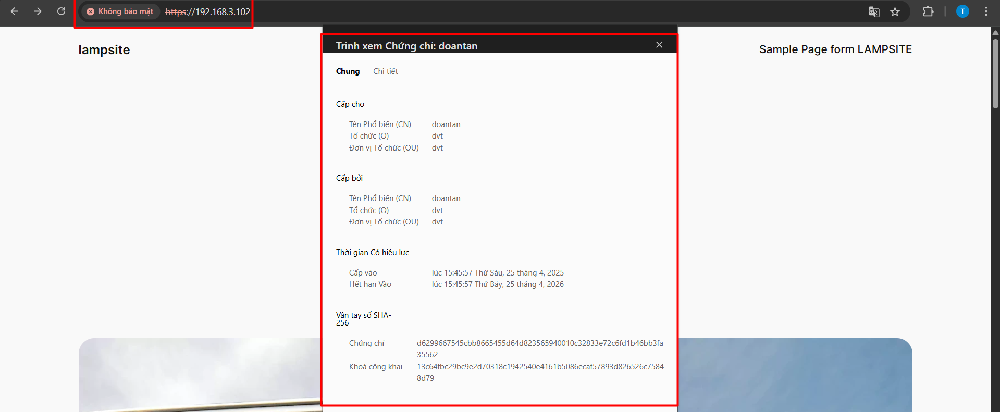

# Chuyển website HTTP sang HTTPS

Để truy cập website qua giao thức HTTPS (tức là `https://<ip-server>`), cần kích hoạt SSL/TLS trên máy chủ web (Apache hoặc Nginx), cài chứng chỉ số SSL, và cấu hình máy chủ sử dụng chứng chỉ đó.

## Mục tiêu

Truy cập được: `https://<ip-server>` (Trình duyệt có thể cảnh báo vì chứng chỉ tự ký, có thể bỏ qua để test cục bộ.)

## Lab trên máy ảo ubuntu với LAMP stack

### Bước 1: Tạo chứng chỉ SSL self-signed (dùng cho nội bộ, không cần mua)

Cài đặt module SSL cho Apache:

```cmd
sudo apt update
sudo apt install openssl
sudo a2enmod ssl
```

### Bước 2: Tạo chứng chỉ SSL tự ký

```cmd
sudo mkdir /etc/apache2/ssl-selfsigned

sudo openssl req -x509 -nodes -days 365 -newkey rsa:2048 -keyout /etc/apache2/ssl-selfsigned/apache-selfsigned.key -out /etc/apache2/ssl-selfsigned/apache-selfsigned.crt
```

- `-x509`: Tạo chứng chỉ X.509 (chuẩn SSL).
- `-nodes`: Không mã hóa file key.
- `-days 365`: Chứng chỉ có hiệu lực 1 năm.
- `rsa:2048`: Sử dụng khóa RSA 2048-bit
- Trong quá trình tạo, có thể thêm thông tin như quốc gia, tỉnh, tổ chức,... hoặc  bỏ trống.
- `-keyout`: Chỉ định đường dẫn lưu tệp tin khóa riêng.
- `-out`: Chỉ định đường dẫn lưu tệp tin chứng chỉ.

### Bước 3: Tạo file cấu hình VirtualHost cho HTTPS

Tạo file mới:

```cmd
sudo vim /etc/apache2/sites-available/lampsite-ssl.conf
```

Gán nội dung:

```file
<VirtualHost *:443>
    ServerAdmin webmaster@localhost
    ServerName localhost

    DocumentRoot /var/www/lampsite

    SSLEngine on
    SSLCertificateFile /etc/apache2/ssl-selfsigned/apache-selfsigned.crt
    SSLCertificateKeyFile /etc/apache2/ssl-selfsigned/apache-selfsigned.key

    <Directory /var/www/lampsite>
        AllowOverride All
        Require all granted
    </Directory>

    ErrorLog ${APACHE_LOG_DIR}/error.log
    CustomLog ${APACHE_LOG_DIR}/access.log combined
</VirtualHost>
```

### Bước 4: Kích hoạt site HTTPS và khởi động lại Apache

```cmd
sudo a2ensite lampsite-ssl.conf
sudo systemctl restart apache2
```

### Bước 5: Cho phép cổng HTTPS (443) trên firewall

```cmd
sudo ufw allow 443
```

### Bước 6: Truy cập vào website

```http
https://<ip-server>
```

Nếu thành công, sẽ có cảnh báo không an toàn, bỏ qua và tiếp tục truy cập. sau đó có thể kiểm tra chứng chỉ của website.


