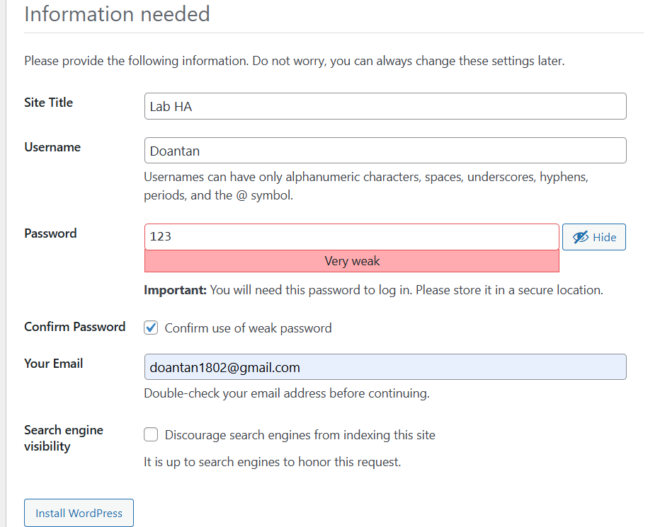

# Lab wordpress HA

## I. Mục tiêu

- 1 load balancer
- 2 web server
- Shared folder: 1 máy dùng NFS
- Database dùng chung trên 1 máy tạm thời.

### 1. NFS là gì?

**NFS (Network File System) - Hệ thống tệp qua mạng** cho phép một máy tính (client) truy cập thư mục hoặc tệp nằm trên máy khác (server) như thể chúng đang nằm trên ổ cứng cục bộ.

### 2. Mục đích của NFS

- Chia sẻ tệp/thư mục giữa nhiều máy trong cùng hệ thống mạng.
- Trong môi trường WordPress HA, NFS giúp các Web Server sử dụng chung thư mục `wp-content` để đảm bảo hình ảnh, theme, plugin... luôn giống nhau giữa các node.

### 3. Các thành phần của NFS

| Thành phần | Vai trò |
| --- | --- |
| **NFS Server** | Chứa thư mục chia sẻ, cung cấp dịch vụ NFS cho các máy khác |
| **NFS Client** | Máy truy cập thư mục chia sẻ từ NFS Server |
| **Export File** | `/etc/exports` – nơi cấu hình chia sẻ thư mục |
| **Mount Point** | Thư mục trên NFS Client để truy cập thư mục chia sẻ |

## II. Môi trường

**Mô hình hệ thống:**

| Máy ảo | OS | IP | Vai trò |
| ------ | ---- | --- | ------------------ |
| web-server1 | CentOS Stream 9 | 192.168.133.135 | Web + NFS Server  |
| web-server2 | Ubuntu 24.04 | 192.168.133.133 | Web + NFS Client |
| lb-server | Ubuntu 24.04 | 192.168.133.137 | Load Balancer |

**Phần mềm sử dụng:**

| Vai trò | Phần mềm |
| --- | --- |
| Web Server | Nginx + PHP + WordPress |
| Load Balancer | Nginx (Reverse Proxy + Load Balancer) |
| Database | MariaDB hoặc MySQL (đặt trên web1) |
| Shared Storage | NFS (chia sẻ thư mục WordPress từ web1 cho web2) |

## III. Các bước triển khai

### Bước 1: Cấu hình NFS Server trên web1 (CentOS)

**1.1 Cài đặt NFS server:**

```bash
sudo dnf install nfs-utils -y
```

**1.2 Tạo thư mục Wordpress và phân quyền:**

```bash
sudo mkdir -p /var/www/wordpress
sudo chown -R nobody:nobody /var/www/wordpress
sudo chmod -R 755 /var/www/wordpress
```

**1.3 Cấu hình `/etc/exports`:**

```bash
echo "/var/www/wordpress 192.168.133.0/24(rw,sync,no_root_squash)" | sudo tee -a /etc/exports
```

**1.4 Khởi động dịch vụ NFS:**

```bash
sudo systemctl enable --now nfs-server
```

### Bước 2: Cấu hình NFS Client trên web2 (Ubuntu)

**2.1 Cài đặt NFS client:**

```bash
sudo apt update
sudo apt install nfs-common -y
```

**2.2 Mở cổng tường lửa trên web1 (nếu firewalld đang chạy):**

```bash
sudo firewall-cmd --permanent --add-service=nfs
sudo firewall-cmd --permanent --add-service=mountd
sudo firewall-cmd --permanent --add-service=rpc-bind
sudo firewall-cmd --reload
```

**2.3 Mount thư mục từ `web1`:**

```bash
sudo mkdir -p /var/www/wordpress
sudo mount 192.168.133.135:/var/www/wordpress /var/www/wordpress
```

Để mount tự động khi khởi động:

```bash
echo "192.168.133.135:/var/www/wordpress /var/www/wordpress nfs defaults 0 0" | sudo tee -a /etc/fstab
```

### Bước 3: Cài đặt MariaDB trên web1 (DB dùng chung)

**3.1 Cài MariaDB:**

```bash
sudo dnf install mariadb-server -y
sudo systemctl enable --now mariadb
```

**3.2 Tạo database WordPress:**

```bash
sudo mysql -u root -e "
CREATE DATABASE wordpress;
CREATE USER 'wpuser'@'%' IDENTIFIED BY 'wppassword';
GRANT ALL PRIVILEGES ON wordpress.* TO 'wpuser'@'%';
FLUSH PRIVILEGES;
Exit"
```

**3.3 Mở cổng 3306 nếu cần:**

```bash
sudo firewall-cmd --add-port=3306/tcp --permanent
sudo firewall-cmd --reload
```

### Bước 4: Cài đặt PHP + Nginx + WordPress trên web1 và web2

**4.1 Trên web-server1 (CentOS):**

```bash
sudo dnf install nginx php php-fpm php-mysqlnd -y
```

**4.2 Trên web-server2 (ubuntu):**

```bash
sudo apt install nginx php-fpm php-mysql -y
```

**4.3 Tải WordPress (thực hiện chỉ trên `web1`):**

```bash
cd /var/www/wordpress
sudo curl -O https://wordpress.org/latest.tar.gz
sudo tar -xzf latest.tar.gz --strip-components=1
sudo chown -R www-data:www-data /var/www/wordpress
```

- `web2` sẽ thấy nội dung vì đã mount NFS rồi.

**4.4 Cấu hình Nginx trên cả web1 và web2:**

File `/etc/nginx/conf.d/wordpress.conf`:

```nginx
# web1 (CentOS)
server {
    listen 80;
    server_name 192.168.133.135;

    root /var/www/wordpress;
    index index.php index.html;

    location / {
        try_files $uri $uri/ /index.php?$args;
    }

    location ~ \.php$ {
        include fastcgi_params;
        fastcgi_pass unix:/run/php-fpm/www.sock;
        fastcgi_param SCRIPT_FILENAME $document_root$fastcgi_script_name;
    }
}

# web2 (Ubuntu)
server {
    listen 80;
    server_name 192.168.133.133;

    root /var/www/wordpress;
    index index.php index.html;

    location / {
        try_files $uri $uri/ /index.php?$args;
    }

    location ~ \.php$ {
        include fastcgi_params;
        fastcgi_pass unix:/run/php/php8.3-fpm.sock;
        fastcgi_param SCRIPT_FILENAME $document_root$fastcgi_script_name;
    }
}

```

- Tùy OS mà socket PHP khác nhau, kiểm tra bằng:

  ```bash
  sudo find /run -name "*.sock"
  ```

### Bước 5: Cài đặt Load Balancer trên lb-server (Ubuntu)

**5.1 Cài đặt Nginx:**

```bash
sudo apt install nginx -y
```

**5.2 Cấu hình `/etc/nginx/sites-available/wordpress-lb`:**

```nginx
upstream wordpress_backend {
    server 192.168.133.135;  # web1
    server 192.168.133.133;  # web2
}

server {
    listen 80;
    server_name _;

    location / {
        proxy_pass http://wordpress_backend;
        proxy_set_header Host $host;
        proxy_set_header X-Real-IP $remote_addr;
    }
}
```

```bash
sudo ln -s /etc/nginx/sites-available/wordpress-lb /etc/nginx/sites-enabled/
sudo nginx -t && sudo systemctl reload nginx
```

### Bước 6: KIỂM TRA HỆ THỐNG

**6.1 Mở trình duyệt truy cập:**

```bash
http://192.168.133.137
```

Wordpress sẽ chuyển tới setup-config.php -> Điền DB, user, password:

- DB: `wordpress`
- User: `wpuser`
- Pass: `wppassword`
- DB host: `192.168.133.135`


