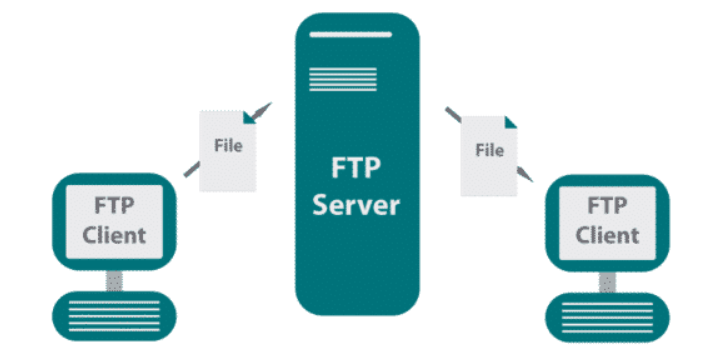
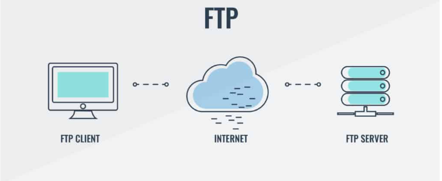
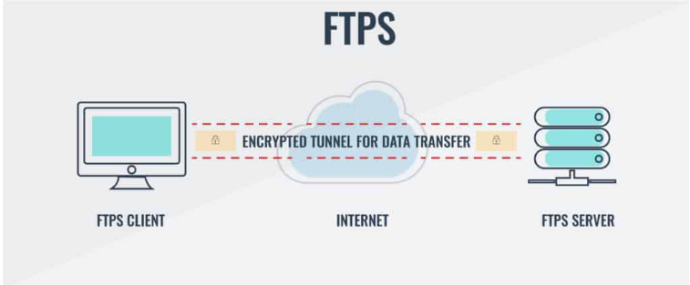
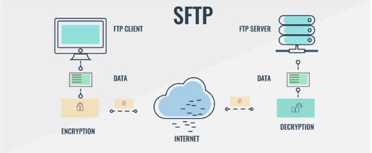
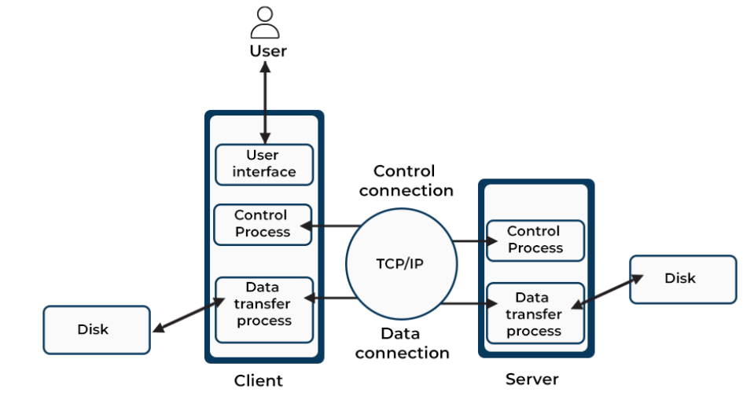
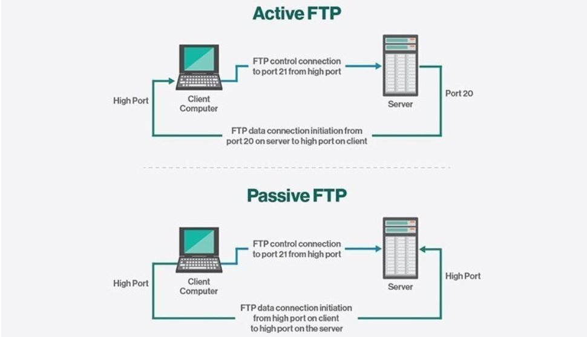
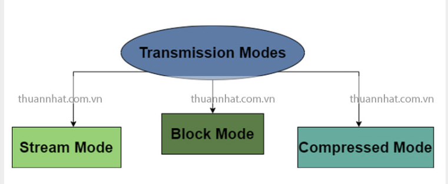

# Tìm hiểu về FTP

## FTP là gì?

### 1. Khái niệm



FTP (File Transfer Protocol) là một giao thức mạng tiêu chuẩn được sử dụng để truyền tệp giữa máy khách (client) và máy chủ (server) trên mạng TCP/IP, như Internet hoặc mạng nội bộ (LAN).

FTP cho phép người dùng tải lên (upload) hoặc tải xuống (download) các tệp từ một máy chủ (server) FTP.

### 2. FTP được dùng để làm gì?

**Tải tệp lên máy chủ (Upload):**

- **web developers:** Sử dụng FTP để tải các tệp tạo nên 1 trang web (HTML, CSS, JS, hình ảnh, video,...) từ máy tính cá nhân lên web server.
- **Cập nhật nội dung website:** Khi cần update website, admin thường sử dụng FTP để tâir các tệp đã cập nhật lên máy chủ.

**Tải tệp xuống từ máy chủ (Download):**

- Lấy về các bản sao lưu (backup).
- Tải phần mềm từ nhà cung cấp (Nhiều nhà cung cấp phần mềm sử dụng máy chủ FTP để phân phối các bản cài đặt phần mềm, bản cập nhật hoặc các tệp liên quan khác cho người dùng.)

**Quản lý tệp tin từ xa:**

- Tạo, xóa, đổi tên thư mục hoặc tập tin.
- Thay đổi phân quyền (permission) cho các file, thư mục.

**Chia sẻ file trong internet hoặc mạng nội bộ:**

- Chia sẻ tệp lớn: FTP hiệu quả hơn so với gửi qua email hoặc các phương tiện khác khi truyền tệp lớn.
- Doanh nghiệp sử dụng FTP server để chia sẻ tài liệu nội bộ.
- Một số hệ thống lưu trữ tài liệu kỹ thuật hoặc tài nguyên số cũng dùng FTP để phân phối.

**Sao lưu dữ liệu (data backup):**

- Sao lưu dữ liệu từ máy chủ này sang máy chủ khác.

**Truyền tệp tự động (Automated Files Transfer):**

- Ứng dụng hoặc hệ thống được cấu hình để tự động truyền tệp qua FTP theo lịch hoặc một số sự kiện cụ thể xảy ra.

### 3. Ưu/Nhược điểm FTP

`Ưu điểm`:

- **Upload/Download nhiều file cùng 1 lúc.**
- **Khả năng truyền tệp tin khi mất kết nối:** Trường hợp mất kết nối khi truyền tệp tin, FTP cho phép tiếp tục quá trình truyền từ nơi đã bị gián đoạn mà không cần phải bắt đầu lại từ đầu.
- **Tự động chuyển tập tin bằng các Script:**

  ```plaintext
  ftp -inv 192.168.3.97 <<EOF
  user ftpuser yourpassword
  lcd /home/ftptan/upload
  cd /upload
  put daily_report.txt
  bye
  EOF
  ```

  - `-i`: Bỏ qua xác nhận thủ công khi dùng `mput`/`mget`
  - `-n`: Không tự đăng nhập (để mình chủ động dùng `user`)
  - `-v`: Hiện chi tiết tiến trình

- **Quản lý khung chờ và lên lịch truyền:**

  ```plaintext
  lftp -u ftpuser,ftp_password ftp://192.168.3.97 <<EOF
  queue
  cd /upload
  lcd /home/ftptan/files
  put file1.txt
  put file2.txt
  put file3.txt
  wait
  bye
  EOF
  ```

- **Khả năng đồng bộ hóa tệp tin:**
  - Đồng bộ thư mục `/home/ftptan/project/` (local) với thư mục `/backup/project/` trên FTP server.

  ```plaintext
  lftp -u ftpuser,ftppass ftp://192.168.3.97 <<EOF
  mirror -R /home/ftptan/project /backup/project
  bye
  EOF
  ```

`Nhược điểm`:

- Khả năng bảo mật kém.
- Không phù hợp cho các tổ chức yêu cầu kết nối an toàn.
- các máy chủ FTP có thể bị qua mặt và dẫn đến việc gửi thông tin đến các cổng ngẫu nhiên, gây ra sự mất an toàn và không tin cậy.

### 4. Các loại FTP phổ biến

**FTP (Plain FTP):**



- Không mã hóa bất kỳ thông tin nào, bao gồm cả tên đăng nhập và mật khẩu.
- Sử dụng cổng 21 cho điều khiển, 20 cho dữ liệu (ở chế độ active).
- Không an toàn khi dùng trên mạng công cộng (vì có thể bị nghe lén).
- Dùng trong mạng nội bộ, cần đơn giản và nhanh.

**FTPS (FTP Secure/FTP-SSL):**



- Là FTP thông thường nhưng có thêm lớp mã hóa SSL/TLS.
- Có 2 kiểu FTPS:
  - **Explicit FTPS:** client yêu cầu bắt đầu mã hóa sau khi kết nối.
  - **Implicit FTPS:** mã hóa bắt buộc ngay từ đầu (dùng cổng 990).

**SFTP (SSH File Transfer Protocol):**



- Hoàn toàn khác với FTP/FTPS – không dùng cổng 21.
- Là một phần của SSH, chạy qua port 22.
- Toàn bộ phiên làm việc được mã hóa.
- Ưu điểm:
  - Phổ biến nhất hiện nay.
  - Không cần tải FTP server riêng nếu server đã có OpenSSH.

**TFTP (Trivial FTP):**

- Phiên bản rút gọn của FTP – không có xác thực người dùng, không mã hóa.
- Dùng giao thức UDP (port 69).
- Dùng trong các thiết bị mạng như router, switch để cập nhật firmware.
- Dùng khi cần truyền file cực đơn giản, không cần bảo mật. Phổ biến trong môi trường nhúng, mạng nội bộ.

## Cấu trúc thành phần



### 1. Thành phần chính

**Máy chủ FTP (FTP server):**

- Là máy chứa tệp cần chia sẻ.
- Lắng nghe trên **cổng 21**, xử lý yêu cầu từ client:
  - Xác thực tài khoản.
  - Cấp quyền truy cập.
  - gửi/nhận file.
  - Trả về danh sách thư mục.

**Máy khách FTP (FTP client):**

- Là máy của người dùng kết nối đến server để upload/download file.
- Có thể là:
  - **Giao diện dòng lệnh** (ftp, lftp, sftp…)
  - **Phần mềm giao diện đồ họa:** FileZilla, WinSCP, Cyberduck…
- Gửi lệnh FTP (get, put, ls, cd…) qua kênh điều khiển đến server.

### 2. Kết nối trong FTP

**Bảng điều khiển (Control Connection):**

- Sử dụng **cổng 21** (TCP).
- Dùng để gửi lệnh và phản hồi (như USER, PASS, LIST, STOR, RETR…)
- Luôn giữ mở suốt phiên làm việc

**Kênh dữ liệu (Data Connection):**

- Dùng để truyền file hoặc danh sách thư mục.
- Cổng dùng tùy thuộc vào chế độ FTP:
  - **Active mode:** Server dùng **cổng 20**, client mở cổng ngẫu nhiên.
  - **Passive mode:** Client mở cổng dữ liệu, server dùng cổng ngẫu nhiên.

### 3. Các lệnh và mã phản hồi FTP

FTP sử dụng mã phẩn hồi dạng ASCII và mã phản hồi dạng số.

- Một số lệnh FTP phổ biến:

| Lệnh | Mô tả |
|-----------|-------------|
| `USER` | Gửi tên đăng nhập |
| `PASS` | gửi mật khẩu |
| `LIST` | Liệt kê thư mục |
| `RETR` | Tải file |
| `STOR` | Gửi file |
| `QUIT` | Đóng kết nối |

- Một số mã phản hồi phổ biến:

| Lệnh | Mô tả |
|-----------|-------------|
| `220` | Server sẵn sàng |
| `230` | Đăng nhập thành công |
| `226` | Truyền file thành công |
| `331` | Cần mật khẩu |
| `550` | Không tìm thấy file hoặc bị từ chối |

## Nguyên lý hoạt động

FTP được thiết kế theo mô hình **client-server**, sử dụng hai kết nối song song:

- **Kết nối điều khiển (Control Connection - Cổng 21)**.
- **Kết nối dữ liệu (Data Connection - Cổng 20 hoặc ngẫu nhiên)**.

**`Bước 1`: Thiết lập kết nối điều khiển**

- Client mở kết nối TCP đến **cổng 21** của server.
- Đây là kênh giao tiếp lệnh (command) như:
  - `USER` – gửi tên đăng nhập.
  - `PASS` – gửi mật khẩu.
  - `LIST` – yêu cầu liệt kê thư mục.
  - `STOR`, `RETR` – yêu cầu upload hoặc download file.
- Kết nối này giữ mở trong suốt phiên làm việc.

**`Bước 2`: Xác thực người dùng**

- Server yêu cầu client nhập **username/password**.
- Có thể dùng tài khoản thật, hoặc cho phép đăng nhập **ẩn danh (anonymous)**.

**`Bước 3`: Thiết lập dữ liệu (Data Connection)**



Dùng để truyền dữ liệu (file hoặc danh sách thư mục). Có 2 chế độ:

**Active Mode:**

- Client khởi tạo kết nối điều khiển đến server cổng 21.
- Khi cần truyền dữ liệu:
  - Client mở một cổng ngẫu nhiên và gửi IP + cổng đó cho server qua lệnh `PORT`.
  - Server dùng cổng 20 để kết nối đến IP và cổng client đã cung cấp.
  - Sau đó dữ liệu được truyền từ server sang client.
- Minh họa:

```plaintext
Client: mở cổng 1025 → gửi PORT 192.168.1.2,1025 → Server

Server: từ cổng 20 → kết nối đến client:1025
```

**Passive Mode:**

- Client mở kết nối điều khiển đến server cổng 21.
- Khi cần truyền dữ liệu:
  - Client gửi lệnh `PASV` yêu cầu server chuyển sang chế độ bị động.
  - Server mở một cổng ngẫu nhiên, gửi lại IP + cổng đó cho client.
  - Client kết nối đến cổng đó để truyền dữ liệu.
- Minh họa:

```plaintext
Client → gửi PASV → Server mở cổng 55000 và phản hồi IP,55000

Client → kết nối đến Server:55000 để truyền dữ liệu
```

*Passive mode thường dùng hơn hiện nay vì dễ vượt qua firewall/NAT.*

**`Bước 4:` Truyền dữ liệu**

- Sau khi kênh dữ liệu được thiết lập, client có thể **upload** (`STOR`), **download** (`RETR`) file hoặc **liệt kê** (`LIST`) thư mục.
- Dữ liệu truyền qua kệnh dữ liệu, không đi qua kênh điều khiển.

**`Bước 5:` Đóng kết nối**

- Khi hoàn tất truyền dữ liệu hoặc lệnh QUIT được gửi, server và client sẽ:
  - Đóng kênh dữ liệu (sau mỗi lần truyền).
  - Đóng kênh điều khiển (khi kết thúc phiên).

## Các phương thức truyền dữ liệu trong FTP



### 1. Stream Mode (Chế độ luồng)

**Đặc điểm:**

- Mặc định trong hầu hết các FTP client và server.
- Dữ liệu được gửi liên tục dưới dạng dòng byte, không chia khối.
- Khi truyền xong, đóng kết nối để đánh dấu kết thúc.

**Ứng dụng:** Phù hợp khi truyền file đơn giản, không cần kiểm soát khối dữ liệu.

### 2. Block Mode (Chế độ khối)

**Đặc điểm:** Dữ liệu được chia thành các khối (block), mỗi khối có:

- **Header** chứa loại khối và độ dài.
- **Dữ liệu** thật sự cần truyền.

**Ưu điểm:**

- Linh hoạt hơn: có thể chèn thêm thông tin điều khiển hoặc metadata.
- Phù hợp cho hệ thống truyền dữ liệu phức tạp, có yêu cầu kiểm soát cao hơn.

**Ứng dụng:** Các ứng dụng FTP tự phát triển, hoặc môi trường yêu cầu bảo trì/chẩn đoán dữ liệu.

### 3. Compressed Mode (Chế độ nén)

**Đặc điểm:**

- Dữ liệu được nén trước khi truyền để giảm kích thước.
- FTP thường dùng thuật toán nén **Run-Length Encoding (RLE)**.

**Ưu điểm:**

- Tiết kiệm băng thông.
- Truyền file lớn nhanh hơn nếu nội dung có tính lặp lại cao (vd: log, văn bản…).

**Nhược điểm:**

- Tăng thời gian xử lý (nén/giải nén).
- Ít được hỗ trợ bởi các FTP client phổ biến hiện nay.
