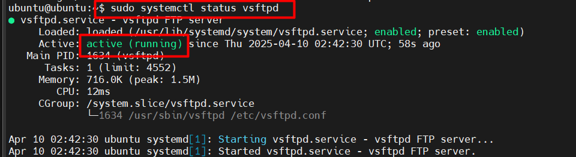

# Dựng FTP server

Triển khai một FTP server bằng phần mềm **vsftpd (Very Secure FTP Daemon)** - một FTP server phổ biến, bảo mật và nhẹ, chạy được trên hầu hết các bản phân phối Linux (Ubuntu, CentOS, Debian, ...).

## Ubuntu 24.04

### Bước 1: Cài đặt FTP Server (vsftpd)

Cài đặt FTP server **vsftpd**.

```plaintext
sudo apt install vsftpd -y
```

### Bước 2: Khởi động và bật dịch vụ vsftpd

Khởi động dịch vụ FTP:

```plaintext
sudo systemctl start vsftpd
```

Cho phép FTP server tự động chạy khi khởi động hệ thống:

```plaintext
sudo systemctl enable vsftpd
```

Kiểm tra trạng thái dịch vụ (chưa chạy, đang chạy, lỗi,...):

```plaintext
sudo systemctl status vsftpd
```

Nếu đang chạy, hiển thị:



### Bước 3: Tạo người dùng FTP và thiết lập thư mục

Tạo user có tên là `ftptan`. Hệ thống sẽ yêu cầu nhập mật khẩu và thông tin.

```plaintext
sudo adduser ftptan
```


Tạo thư mục riêng để chứa file FTP:

```plaintext
# Tạo thư mục riêng để chứa file FTP (ftp_files)
sudo mkdir -p /home/ftptan/ftp_files

# Gán quyền sở hữu thư mục cho user
sudo chown nobody:nogroup /home/ftpuser/ftp_files

# Gỡ quyền ghi của user
sudo chmod a-w /home/ftpuser/ftp_files
```

- `nobody` (vô danh) – đảm bảo user FTP không thể ghi trực tiếp vào thư mục này (an toàn hơn).
- Gỡ quyền ghi để user không thể sửa/xóa trực tiếp trong thư mục chính.

Tạo thư mục `upload` bên trong để user có thể ghi file vào. Gán quyền sở hữu cho user `ftpuser`:

```plaintext
sudo mkdir /home/ftpuser/ftp_files/upload
sudo chown ftpuser:ftpuser /home/ftpuser/ftp_files/upload
```

### Bước 4: Cấu hình vsftpd

Mở file cấu hình chính của vsftpd để chỉnh sửa:

```plaintext
sudo vim /etc/vsftpd.conf
```

Các dòng lệnh cần chỉnh sửa hoặc thêm vào cuối file

```plaintext
# Cho phép user hệ thống đăng nhập
local_enable=YES

# Cho phép ghi file (upload, xóa,...)
write_enable=YES 

# Giới hạn user chỉ truy cập trong thư mục của họ
chroot_local_user=YES

# Cho phép upload khi dùng chroot
allow_writeable_chroot=YES

# Bật chế độ passive (hỗ trợ qua NAT/firewall)
pasv_enable=YES              
pasv_min_port=10000
pasv_max_port=10100

# Cho phép dùng biến $USER trong đường dẫn
user_sub_token=$USER

# Thư mục gốc FTP khi đăng nhập
local_root=/home/$USER/ftp_files

# Vô hiệu hóa IPv6 nếu không cần
listen=YES
listen_ipv6=NO
```

### Bước 5: Khởi động lại dịch vụ vsftpd

```plaintext
sudo systemctl restart vsftpd
```

### Bước 6: Mở tường lửa (UFW)

```plaintext
sudo ufw allow 20/tcp
sudo ufw allow 21/tcp
sudo ufw allow 10000:10100/tcp
sudo ufw reload
```

- `20`: Dữ liệu FTP (active mode).
- `21`: Điều khiển FTP.
- `10000-10100`: passive mode

### Bước 7: Kiểm tra FTP

Kiểm tra trên FTP server

- Dùng FTP Client dòng lệnh có sẵn.
- Đăng nhập với dòng lệnh đã tạo.
- Dùng lệnh kiểm tra kết nối.

```plaintext
ftp localhost
```

Kết quả thành công:


## CentOS Stream 9

### Bước 1: Cài đặt và kiểm tra  phần mềm

```plaintext
# Cài đặt
sudo dnf update -y
sudo dnf install vsftpd -y

# Khởi động phần mềm
sudo systemctl start vsftpd

# Tự khởi động khi máy bật
sudo systemctl enable vsftpd

# Kiểm tra trạng thái
sudo systemctl status vsftpd
```

Kết quả khi khởi chạy `vsftpd` thành công:


### Bước 2: Mở cổng tường lửa

FTP sử dụng cổng 21:

```plaintext
sudo firewall-cmd --permanent --add-service=ftp
sudo firewall-cmd --reload
```

### Bước 3: Tạo user FTP

```plaintext
sudo useradd ftptan
sudo passwd ftptan
```

- Gõ mật khẩu mới khi được hỏi.

### Bước 4: Tạo thư mục lưu trữ file

Giả sử thư mục làm việc FTP là `/home/ftptan/ftp_files`:

```plaintext
sudo mkdir -p /home/ftptan/ftp_files/upload
sudo chown -R ftptan:ftptan /home/ftpft/ftp_files
```

### Bước 5: Cấu hình `vsftpd`

Mở file cấu hình:

```plaintext
sudo vim /etc/vsftpd/vsftpd.conf
```

Tìm và chỉnh (hoặc thêm) các dòng sau:

```plaintext
anonymous_enable=NO            # Không cho phép anonymous login
local_enable=YES               # Cho phép user hệ thống đăng nhập
write_enable=YES               # Cho phép ghi file
local_umask=022
chroot_local_user=YES          # Giới hạn user trong thư mục home
allow_writeable_chroot=YES     # Cho phép ghi trong chroot

user_sub_token=$USER
local_root=/home/$USER/ftp_files

pasv_enable=YES                # Bật chế độ passive
pasv_min_port=40000
pasv_max_port=40100

listen=YES
listen_ipv6=NO
```

### Bước 6: Khởi động lại `vsftpd`

```plaintext
sudo systemctl restart vsftpd
```

### Bước 7: SELinux (Nếu đang bật)

Kiểm tra SELinux có đang chạy hay không:

```plaintext
getenforce
```

- Nếu kết quả là `Enforcing` tức SELinux đang chạy, nếu kết quả khác thì bỏ qua bước 7.

### Bước 8: Kiểm tra FTP server

Từ máy CentOS:

```plaintext
ftp localhost
```

- Đăng nhập bằng user: `ftptan`
- Dùng các lệnh FTP: `ls`, `cd`, `put`, `get`, `bye`
