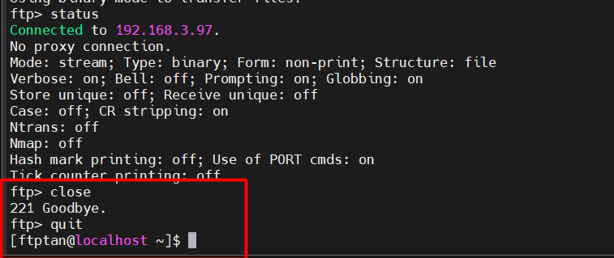

# Sử dụng các lệnh cơ bản của FTP

## Vai trò

Client: CentOS

Server: Ubuntu (cài FTP server vsftpd)

## Thực hiện lệnh

### 1. Các lệnh về thư mục

`pwd`: Hiển thị thư mục hiện tại

`ls`: Liệt kê file

`cd`: di chuyển vào thư mục `/upload`

`mkdir`: tạo thư mục/tệp `file_centos.txt`

`rmdir`: xóa thư mục `newdir`

`lcd`: chuyển thư mục làm việc trên client

`rename`: đổi tên file_ubuntu.txt thành file_rename.txt

`delete`: xóa file `file_rename.txt`. Hoặc có thể dùng lệnh `mdelete *.txt` để xóa tất cả file có đuôi `.txt`.

### 2. Các lệnh về tệp tin

`binary`: chuyển sang chế độ truyền file nhị phân (truyền dạng nguyên gốc, không bị thay đổi nội dung).

`ascii`: chuyển sâng chế độ văn bản (ascii) - ASCII có thể thay đổi dấu xuống dòng (\n vs \r\n) khi truyền file → chỉ nên dùng với file văn bản.

`put`: upload file lên FTP server

`get`: download file_ubuntu.txt từ FTP server

### 3. Các lệnh khác

`help`: hiển thị danh sách các lệnh FTP có sẵn hoặc hướng dẫn sử dụng lệnh.

`status`: Xem trạng thái phiên hiện tại

`system`: Xem hệ điều hành của FTP server

`!`: Thực thi lệnh shell trên máy client (không thoát FTP)

- Chạy lệnh Linux như ls, cd, pwd ngay trong phiên FTP mà không cần thoát.

`open`: Kết nối đến FTP server

`close`: Ngắt kết nối với FTP server nhưng vẫn ở trong shell FTP

`quit` và `bye`:Thoát hoàn toàn khỏi FTP

- `quit` và `bye` là giống nhau
