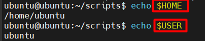

# Biến trong Shell

## 1. Biến do người dùng tự định nghĩa

```bash
name="Tan"
echo "Hi, $name"
```

Kết quả:

```bash
Hi, Tan
```

## 2. Biến với lệnh lồng bên trong

```bash
today=$(date +%Y-%m-%d)
echo "Today is $today"
```

Kết quả:

```bash
Today is 2025-05-05
```

## 3. Biến đặc biệt trong shell script

Nội dung file `info.sh`:

```bash
#!/bin/bash
echo "Script name: $0"
echo "First arg: $1"
echo "Total args: $#"
echo "All args: $@"
```

- `$0`: Tên script
- `$1`: Tham số đầu tiên
- `$#`: Số lượng tham số
- `$@`: Tất cả tham số, từng phần

Chạy thử:

```bash
bash info.sh one two three
```

Kết quả:

```bash
Script name: info.sh
First arg: one
Total args: 3
All args: one two three
```

## 4. Dùng biến môi trường

Dùng biến có sẵn:



## 5. Biến mảng

```bash
fruits=("apple" "banana" "orange")
echo "First fruit: ${fruits[0]}"
echo "All fruits: ${fruits[@]}"
echo "Total: ${#fruits[@]}"
```

Kết quả:

```bash
First fruit: apple
All fruits: apple banana orange
Total: 3
```

## 6. Biến không thay đổi (readonly)

```bash
readonly PI=3.14
PI=3.15  # Sẽ gây lỗi!
```

## 7. Xóa biến

```bash
x="delete me"
unset x
echo $x  # Trống
```
