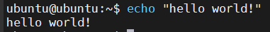
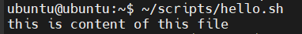
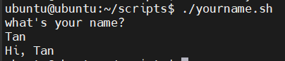
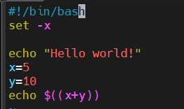
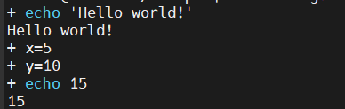

# Tổng quan Bash Shell

## Bash Shell là gì?


### 1. Khái niệm

**Bash Shell** là một chương trình giao tiếp giữa người dùng và hệ điều hành, chủ yếu dùng trong các hệ thống Unix/Linux. Cụ thể:

- **Bash (Bourne Again SHell)** được phát triển như một bản cải tiến của sh (Bourne shell) truyền thống.
- **Shell** là chương trình đọc lệnh người dùng gõ vào, thực thi lệnh đó, rồi trả kết quả lại.
- **Bash** vừa là **trình thông dịch lệnh (command interpreter)**, vừa hỗ trợ **ngôn ngữ lập trình script**, cho phép bạn viết file script để tự động hóa công việc.

Ví dụ:

```bash
$ echo "Hello world!"

Hello world!
```

### 2. Đặc điểm

**Các đặc điểm và công dụng chính của Bash bao gồm:**

- **Giao diện dòng lệnh tương tác:** Cho phép người dùng nhập và thực thi các lệnh trực tiếp để quản lý file, chạy chương trình, và thực hiện các tác vụ khác trên hệ thống.
- **Ngôn ngữ Scripting:** Bash là một ngôn ngữ lập trình đầy đủ, hỗ trợ biến, vòng lặp, câu lệnh điều kiện và các cấu trúc điều khiển khác. Điều này cho phép người dùng viết các script (tập tin chứa chuỗi các lệnh) để tự động hóa các tác vụ lặp đi lặp lại hoặc phức tạp.
- **Tự động hóa:** Bash scripting được sử dụng rộng rãi để tự động hóa các công việc như sao lưu dữ liệu, cài đặt phần mềm, quản lý hệ thống và thực hiện các chuỗi lệnh.
- **Quản lý tiến trình:** Bash cung cấp các tính năng để quản lý các tiến trình đang chạy trên hệ thống.
- **Biên tập dòng lệnh:** Hỗ trợ chỉnh sửa dòng lệnh hiệu quả với các phím tắt và lịch sử lệnh.

## Sử dụng Bash Shell

### 1. Chế độ Shell

**Chế độ Shell tương tác (Interactive Shell):** là dạng sử dụng câu lệnh trực tiếp trên môi trường Unix.

Ví dụ: sử dụng Bash để in ra **Hello world!**



**Chế độ Shell không tương tác (Non-Interactive Shell):** Thay vì thực hiện từng câu lệnh Bash, tổ hợp chúng vào một file script và có thể sử dụng lại nhiều lần.

Ví dụ:

```bash
# Tạo thư mục /scripts và file thực thi hello.sh 
sudo mkdir ~/scripts && sudo vim ~/scripts/hello.sh

# Thêm quyền thực thi cho thư mục
sudo chmod +x ~/scripts/hello.sh
```

Thêm nội dung file:

```bash
#!/bin/bash
echo "this is content of this file"
```

Thực thi file:



- "This is content of the file" là nội dung muốn in ra nằm bên trong file `hello.sh`.

**Có thể thực thi file với 3 cách sau:**

```bash
# Chạy trực tiếp, hệ thống đọc shebang để quyết định trình thông dịch
# Có thể thực hiện khi file script đã có dòng #!/bin/bash và quyền +x
./hello.sh

# Bỏ qua shebang trong file, chắc chắn dùng đúng /bin/bash
/bin/bash hello.sh

# Tương tự /bin/bash, nhưng gọi trình thông dịch bash theo $PATH.
bash hello.sh
```

### 2. Sử dụng biến trong Linux

Tạo file `tan.sh` với nội dung bên dưới và cấp quyền thực thi `chmod +x`:

```bash
#!/bin/bash
name="Tan"
echo "Hi $name"
```

hoặc:

```bash
#!/bin/bash
name="Tan"
printf "Hi %s\n" "$name"
```

Output:

```plaintext
Hi Tan
```

### 3. Truyền tham số vào biến với User Input

Các biến có thể được truyền trực tiếp từ người dùng như sau:

```bash
#!/bin/bash
echo "what's your name?"
read name
echo "Hi, $name."
```

Khi script chạy tới dòng thứ 2, câu lệnh `read` sẽ đọc dữ liệu truyền vào từ người dùng, sau đó gán dữ liệu đó vào biến `name`.

Kết quả:



### 4. Tầm quan trọng của các dấu nháy

Có 2 dạng dấu nháy:

- Weak quoting: nháy kép
- Strong quoting: Nháy đơn

**Weak quoting:** Sử dụng nháy kép khi muốn bash thực thi các biến được truyền vào.

```bash
#!/bin/bash
animal="cat"
echo "black $animal"
```

Output:

```yaml
black cat
```

**Strong quoting:** Sử dụng nháy đơn khi muốn giữ nguyên nội dung trong nháy.

```bash
#!/bin/bash
animal="cat"
echo 'black $animal'
```

Output:

```yaml
black $animal
```

### 5. Chế độ Debug trong Shell

**Sử dụng `-x` với `bash` để chạy script trong chế độ debug:**

Ví dụ:

```bash
bash -x script.sh
```

- Khi chạy script này, shell sẽ hiển thị tất cả các lệnh thực thi và giá trị các biến trong quá trình thực thi.

**Bật chế độ debug trong một script Bash, có thể thêm dòng sau vào đầu script:**

```bash
#!/bin/bash
set -x
```

- Lệnh `set -x` sẽ kích hoạt chế độ debug, và tất cả các lệnh trong script sau đó sẽ được in ra khi script chạy.



Kết quả sau khi chạy:



**Tắt chế độ Debug:** sử dụng `+x`

```bash
#!/bin/bash
set -x

# Các lệnh debug
echo "Debugging..."
x=5
y=10

set +x   # Tắt chế độ debug

# Các lệnh sau không in ra
echo "This won't be debugged."
```

**Sử dụng `set -v` (verbose mode):** in ra từng dòng lệnh trước khi thực thi.

```bash
#!/bin/bash
set -v

echo "Hello world!"
x=5
y=10
echo $((x+y))

```

Kết quả:

```bash
echo "Hello world!"
Hello world!
x=5
y=10
echo $((x+y))
15
```

**Sử dụng `trap` để Debug tín hiệu lỗi (signal traps):** theo dõi các tín hiệu lỗi, xác định được lỗi ở đâu trong quá trình thực thi.

```bash
#!/bin/bash
trap 'echo "An error occurred at line $LINENO"' ERR

# Lệnh lỗi sẽ được bắt
echo "Start of script"
non_existing_command   # Lệnh này sẽ gây lỗi
echo "End of script"
```

Kết quả:

```nginx
Start of script
An error occurred at line 6
```

So sánh nhanh:

| Lệnh | Mục đích | Hiển thị | Khi nào dùng? |
|-|-|-|-|
| `set -x` | Debug chi tiết | Hiển thị lệnh sau khi biến được xử lý và thực thi | Khi muốn biết script đang thực hiện lệnh với biến cụ thể nào |
| `set -v` | Verbose mode | Hiển thị dòng lệnh đúng như file, trước khi được thực thi | Khi muốn xem chính xác nội dung script |
| `trap` | Xử lý lỗi/tín hiệu | Không hiển thị lệnh; Thực hiện hành động khi có lỗi, tín hiệu xảy ra | Khi muốn xử lý lỗi (báo lỗi, dọn dẹp file tạm,  thoát an toàn) |
