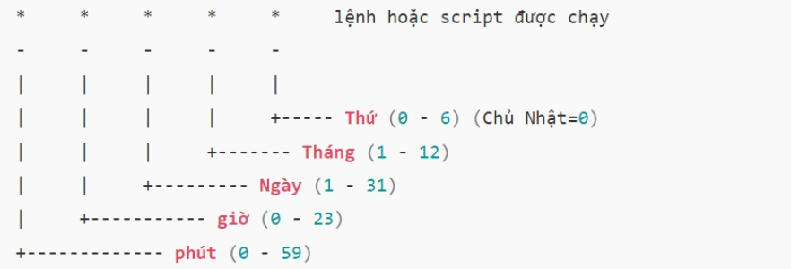
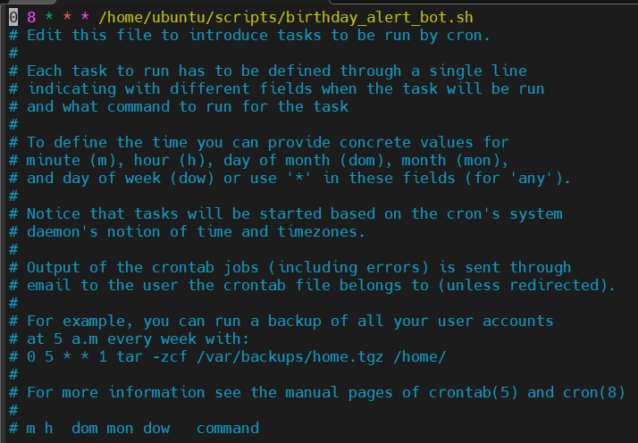
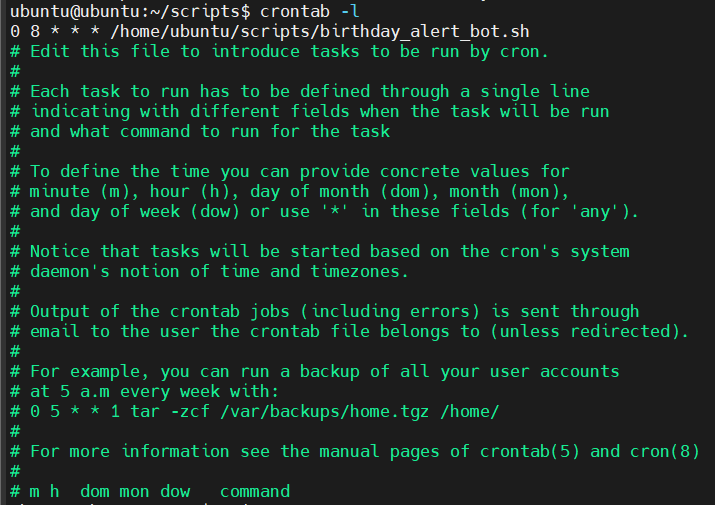

# Tìm hiểu về Crontab

## Crontab là gì?

### 1. Khái niệm

**Crontab** - viết tắt của **cron table (Bảng định kỳ)**, là một công cụ giúp tạo và thực thi các lệnh theo chu kỳ nhất định. Nó cho phép người dùng lập lịch để thực hiện các tác vụ trên máy chủ, chạy một hoặc nhiều lệnh theo thời gian được xác định trước.

**cron** là daemon (nền) hoạt động liên tục và kiểm tra file crontab để chạy các lệnh đúng thời điểm.

### 2. Cấu trúc Crontab



Bên cạnh đó:

- `@yearly /script/script.sh`: Mỗi năm (lúc 00:00 ngày 1/1).
- `@monthly /script/script.sh`: Mỗi tháng (lúc 00:00 ngày 1).
- `@weekly /script/script.sh`: Mỗi tuần (lúc 00:00 Chủ Nhật).
- `@daily /script/script.sh`: Mỗi ngày (lúc 00:00).
- `@hourly /script/script.sh`: Mỗi giờ (lúc phút 0).
- `@reboot /home/ubuntu/scripts/start_service.sh`: Khởi động dịch vụ sau khi boot.

**Ví dụ:**

Chạy script lúc 7:00 sáng mỗi ngày:

```bash
0 7 * * * /home/ubuntu/scripts/birthday_alert_bot.sh
```

Chạy vào 7h, 12h và 17h mỗi ngày:

```bash
0 7,12,17 * * * /path/to/command.sh
```

- Dấu phẩy `,` dùng để liệt kê nhiều thời điểm.

Backup dữ liệu mỗi 15 phút:

```bash
*/15 * * * * /home/ubuntu/scripts/backup.sh
```

- Dấu gạch chéo `/` chỉ khoảng thời gian lặp lại.

Chạy từ 9h đến 17h mỗi ngày:

```bash
0 9-17 * * * /path/to/command.sh
```

- Dấu gạch ngang `-` dùng cho khoảng thời gian.

### 3. Cách hoạt động của Crontab

**Crontab** hoạt động thông qua các file cấu hình (**cron schedule**) để quản lý các tác vụ tự động trên hệ thống Linux. Mỗi người dùng có một file Crontab riêng, được lưu trữ trong thư mục `/var/spool/cron`. Người dùng không thể chỉnh sửa file này trực tiếp mà phải sử dụng lệnh `crontab -e` để mở tệp trong trình soạn thảo, thêm hoặc sửa các lệnh cần thực thi theo lịch trình và lưu lại.

- `crontab -e`: Tùy chọn cho phép tạo hoặc chỉnh sửa file Crontab.
- `crontab -l`: Giúp hiển thị file crontab.
- `crontab -r`: Cho phép xóa file crontab.

Hầu hết VPS đều đã cài sẵn Crontab, nhưng nếu thấy lỗi `command not found` khi sử dụng lệnh `crontab -l`, nghĩa là công cụ này chưa được cài. Bạn cần cài đặt Crontab thủ công bằng cách sử dụng package phần mềm của hệ điều hành Linux đang dùng.

## Cài đặt

### 1. Cách cài đặt

`Bước 1`: Cài đặt cron (nếu chưa có)

```bash
sudo apt update
sudo apt install cron
```

`Bước 2`: Khởi động và bật cron chạy cùng hệ thống

```bash
sudo systemctl start cron
sudo systemctl enable cron
```

`Bước 3`: Kiểm tra trạng thái cron

```bash
sudo systemctl status cron
```

- Nếu thấy dòng `Active: active (running)` nghĩa là cron đang chạy.

`Bước 4`: Thêm tác vụ vào crontab

Mở trình chỉnh sửa crontab cho người dùng hiện tại:

```bash
crontab -e
```

Sau đó có thể thêm vào dòng như dưới đây để chạy script thông báo sinh nhật mỗi 8h sáng hàng ngày:

```bash
0 8 * * * /home/ubuntu/scripts/birthday_alert_bot.sh
```

- Đảm bảo file `.sh` được cấp quyền thực thi `+x`



`Bước 5`: Xem lại danh sách các tác vụ con

```bash
crontab -l
```


