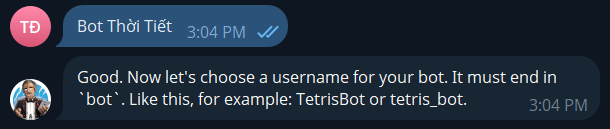

# Telegram Bot

## Khái niệm?

### 1. Telegram Bot là gì?

**Telegram Bot** là một loại tài khoản đặc biệt trên nền tảng Telegram được điều khiển bởi phần mềm (thay vì con người), có thể tương tác với người dùng hoặc nhóm, gửi thông báo, trả lời câu hỏi, điều khiển thiết bị, và nhiều hơn thế nữa thông qua **Telegram Bot API**.

Bot API hoạt động thông qua các HTTP request (gửi đến địa chỉ `https://api.telegram.org/bot<token>/<method>`), trong đó:

- `<token>` là mã token bot  nhận từ **@BotFather**.`
- `<method>` là tên phương thức API  muốn gọi, ví dụ: `sendMessage`, `getUpdates`, `sendPhoto`,...

### 2. Các tính năng của Telegram Bot

- **Tự động trả lời:** Phản hồi tin nhắn theo kịch bản hoặc AI.
- **Gửi/nhận file:** Hỗ trợ gửi ảnh, video, tài liệu, sticker…
- **Gửi vị trí, nút bấm:** Gửi định vị, nút inline hoặc reply keyboard.
- **Thông báo:** Tự động gửi cảnh báo/thông báo (ví dụ: hệ thống server, IoT).
- **Tích hợp API:** Kết nối với hệ thống khác như website, ứng dụng.
- **Quản lý nhóm:** Hỗ trợ làm bot quản trị nhóm, lọc tin nhắn, kick user...

## Cách hoạt động

- Người dùng gửi tin nhắn, lệnh, hoặc nhấp vào nút tương tác với bot thông qua ứng dụng Telegram.
- Tin nhắn được Telegram gửi đến server bot (qua webhook hoặc long polling)
  - **Long Polling:** Bot liên tục gửi yêu cầu đến máy chủ Telegram để hỏi xem có cập nhật mới nào không. Nếu có, máy chủ sẽ trả về các cập nhật đó.
  - **Webhooks:** Người tạo bot cung cấp một địa chỉ URL (webhook) cho Telegram. Khi có cập nhật mới cho bot, máy chủ Telegram sẽ tự động gửi (push) cập nhật đó đến địa chỉ URL này. Phương pháp này thường hiệu quả hơn cho các bot có lượng truy cập lớn vì nó giúp giảm tải cho máy chủ bot và cung cấp phản hồi thời gian thực nhanh hơn.
- **Bot xử lý logic:** Bot xử lý yêu cầu (dựa vào mã code do lập trình viên viết).
- **Bot gửi phản hồi:** Bot gửi lại phản hồi cho người dùng thông qua Telegram Bot API.

## Cách tạo Telegram Bot

### Bước 1: Mở @BotFather

Trên Telegram, tìm kiếm: `@BotFather`. Chọn bot có dấu tích xanh chính thức.

Nhấn “Start” hoặc gửi /start nếu chưa từng sử dụng.

### Bước 2: Tạo bot mới bằng lệnh `/newbot`

BotFather sẽ hỏi bạn các thông tin:

**Tên bot (hiển thị cho người dùng):**

- VD: Bot Thời Tiết

**Username bot (phải kết thúc bằng bot):**

- VD: dvtWeather_bot

### Bước 3: Nhận Token API

Sau khi hoàn tất, BotFather sẽ trả về:

- `t.me/dvtWeather_bot`: link liên kết để chuyển sang tương tác với bot vừa tạo.
- `8002836179:AAGCCjbWp9hbM2rj0xTEFykYQNa0vlxaBoE`: token

*Lưu ý:* Token này rất quan trọng, giống như “mật khẩu API”, không chia sẻ công khai.

### Bước 4: Cấu hình bot (tùy chọn)

Gửi các lệnh tới **BotFather** để cấu hình thêm cho bot:

| Lệnh | Tác dụng |
|-|-|
| `\setdedscription` | Thêm mô tả cho bot |
| `\setabouttext` | Thêm mô tả ngắn cho bot |
| `\setuserpic` | Đặt ảnh đại diện cho bot |
| `\setcommands` | Đặt danh sách lệnh cho bot (hiện khi người dùng gõ `/`) |

