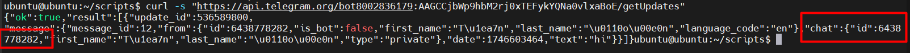

# Viết script “Hello world!!!” để Bot gửi qua Telegram

## 1. Điều kiện cần

- Đã tạo bot qua **@BotFather**.
- Có **Token API** của bot (`8002836179:AAGCCjbWp9hbM2rj0xTEFykYQNa0vlxaBoE`).
- Biết chat_id của người nhận (có thể là user hoặc group)

## 2. Cách lấy chat_id

```bash
curl -s "https://api.telegram.org/bot<YOUR_BOT_TOKEN>/getUpdates"
```

- Gửi tin nhắn cho bot trước để nó có dữ liệu.
- Trong kết quả JSON, tìm dòng `"chat":{"id":<YOUR_CHAT_ID>`, đó là chat_id.



- `YOUR_CHAT_ID`: 6438778282

## 3. Script Bash: Gửi "Hello world!!!"

Tạo file `helloworld_bot.sh`, thêm nội dung:

```bash
#!/bin/bash

TOKEN="8002836179:AAGCCjbWp9hbM2rj0xTEFykYQNa0vlxaBoE"
CHAT_ID="6438778282"
MESSAGE="Hello world!!!"

curl -s -X POST "https://api.telegram.org/bot$TOKEN/sendMessage" \
    -d chat_id="$CHAT_ID" \
    -d text="$MESSAGE"
```

Thực thi file:

```bash
sudo chmod +x helloworld_bot.sh
./helloworld_bot.sh
```

Kết quả trên shell:


Kết quả trên Telegram:


