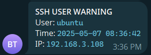

# Viết script cảnh báo khi có người SSH vào máy ảo

## 1. Mục tiêu

Khi có người SSH vào hệ thống, bot sẽ gửi cảnh báo đến Telegram như sau:

SSH ALERT
User: ubuntu
Time: 2025-05-05 14:03:21

## 2. Tạo script

Tạo file:

```bash
sudo vim ssh_alert_bot.sh
```

Nội dung file:

```bash
#!/bin/bash

# Bot information
BOT_TOKEN="8002836179:AAGCCjbWp9hbM2rj0xTEFykYQNa0vlxaBoE"
CHAT_ID="6438778282"

# Alert content
USER_NAME=$(whoami)
LOGIN_TIME=$(date "+%Y-%m-%d %H:%M:%S")
IP=$(who | grep $USER | awk '{print $5}' | tr -d '()' | xargs)

MESSAGE=$(cat <<EOF
*SSH ALERT*
User: \`$USER_NAME\`
Time: \`$LOGIN_TIME\`
IP: \`$IP\`
EOF
)

# send alert to Telegram
curl -s -X POST "https://api.telegram.org/bot$BOT_TOKEN/sendMessage" \
  -d chat_id="$CHAT_ID" \
  -d text="$MESSAGE" \
  -d parse_mode="Markdown"
```

## 3. Cấp quyền thực thi

```bash
sudo chmod +x ssh_alert_bot.sh
```

## 4. Kích hoạt script khi đăng nhập SSH

Mở file `/etc/profile` hoặc `/etc/bash.bashrc` (áp dụng cho toàn hệ thống):

```bash
sudo vim /etc/profile
```

Thêm vào dòng cuối cùng:

```bash
if [ -n "$SSH_CONNECTION" ]; then
  /home/ubuntu/scripts/ssh_alert_bot.sh
fi
```

Lưu và khởi động lại SSH session để kiểm tra.

Kết quả trên shell:


Kết quả trên tele:


