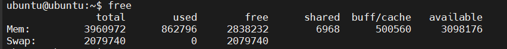
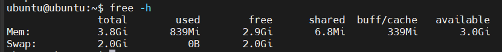
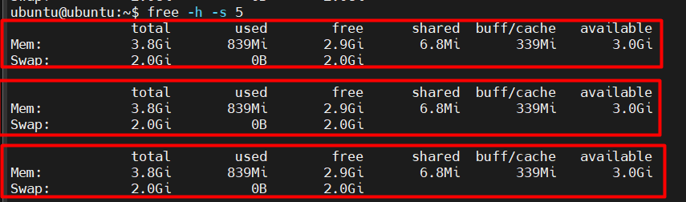
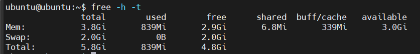

# Lệnh `free`

## 1. Lệnh `free` là gì? Dùng để làm gì?

Lệnh `free` dùng để:

- Hiển thị thông tin về bộ nhớ: bao gồm RAM và SWAP.
- Giúp kiểm tra mức độ sử dụng, còn trống, và cache.
- Là công cụ quan trọng để giám sát hiệu suất hệ thống trong thời gian thực.

Lệnh `free` hữu ích để:

- Kiểm tra hệ thống có thiếu RAM không.
- Phát hiện hệ thống dùng nhiều SWAP (dấu hiệu quá tải bộ nhớ).

## 2. Cách sử dụng lệnh `free`

```bash
free
```

Kết quả:



## 3. Ý nghĩa các cột và dòng trong kết quả

**Dòng Mem - RAM thực tế:**

| Cột | Ý nghĩa |
|-----|---------|
| `total` | Tổng dung lượng RAM |
| `used` | Dung lượng RAM đã dùng (`total` - `free` - `buff/cache`) |
| `free` | RAM chưa được dùng đến |
| `shared` | RAM dùng cho chia sẻ giữa các tiến trình |
| `buff/cache` | RAM dùng làm bộ đệm (buff) và bộ nhớ cache |
| `available` | RAM có thể dùng cho ứng dụng (bao gồm cả RAM cache có thể thu hồi) |

**Dòng Swap - Bộ nhớ ảo (trên ổ cứng):**

| Cột | Ý nghĩa |
|-----|---------|
| `total` | Tổng dung lượng SWAP |
| `used` | SWAP đã sử dụng |
| `free` | SWAP chưa dùng |

## 4. Các options dòng lệnh

| Option | Mô tả |
|---------|-------|
| `-h` | Hiển thị đơn vị dễ đọc (Human-readable): MB, GB,... |
| `-b`, `-k`, `-m`, `-g` | Hiển thị đơn vị theo byte, KB, MB, GB tương ứng |
| `-s <seconds>` | Lặp lại hiển thị theo mỗi giây (theo dõi liên lạc) |
| `-t` | Thêm dòng tổng (`total`) cho RAM + SWAP |
| `-c <count>` | Kết hợp với `-s` để lặp lại một lần cụ thể |

## 5. Ví dụ sử dụng thực tế

### 5.1. Hiển thị dễ đọc

```bash
free -h
```



### 5.2. Cập nhật liên tục mỗi 5s

```bash
free -h -s 5
```



### 5.3. Cập nhật liên tục mỗi 2s và dừng sau 3 lần

```bash
free -h -s 2 -c 3
```

### 5.4. Hiển thị tổng cho RAM + SWAP

```bash
free -h -t
```



## 6. Buff/Cache và Available

**`buff/cache`:** RAM được linux dùng để tăng hiệu suất hệ thống (bằng cách cache file và buffer I/O). Tuy nhiên, nó có thể được giải phóng nếu ứng dụng cần RAM.

**`available`:** là ước lượng chính xác hơn dung lượng RAM thực sự sẵn sàng để ứng dụng sử dụng, tính cả phần RAM đang cache mà có thể thu hồi.
