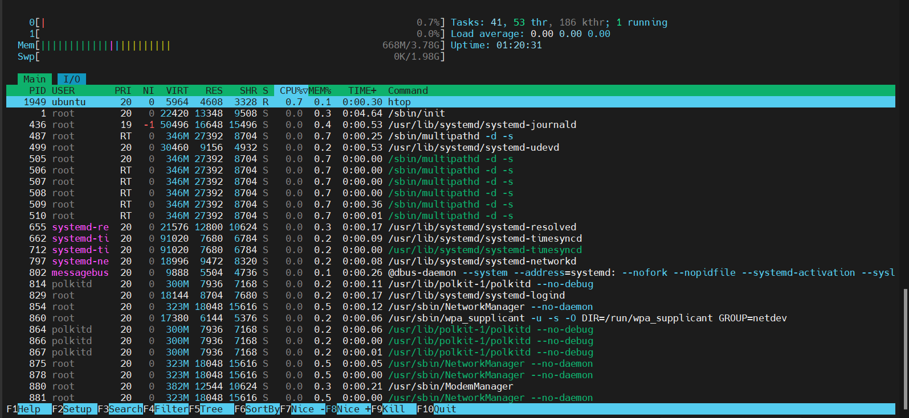
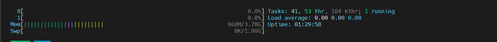

# Lệnh `htop`

## 1. Lệnh `htop` là gì? Dùng để làm gì?

htop là công cụ giám sát hệ thống nâng cao so với htop, cung cấp giao diện tương tác, màu sắc và dễ sử dụng hơn. Cho phép:

- Giám sát CPU, RAM, swap, tiến trình.
- Sắp xếp/sort theo cột bằng phím tắt.
- Chọn và thao tác tiến trình bằng bàn phím.

Là thay thế trực quan và mạnh mẽ hơn cho lệnh `top`.

**Cách cài lệnh top:**

Trên Ubuntu/Debian:

```bash
sudo apt install htop
```

Trên CentOS/RHEL:

```bash
sudo dnf install htop
```

## 2. Cách sử dụng lệnh `htop`

```bash
htop
```



- Giao diện màu sắc, dễ nhìn hơn so với `top`.
- Cung cấp nhiều thông tin hơn về CPU, RAM, swap, tiến trình.
- Có thể dùng phím mũi tên, F-keys để điều hướng và thao tác với tiến trình.

## 3. Cấu trúc giao diện `htop`

### Thanh trạng thái (phía trên)



**CPU Usage (0[ ], 1[ ]):**

- Hiển thị mức sử dụng CPU của từng core (0, 1, 2, 3...). Hiện tại có 2 core/
- Mỗi thanh thể hiện:
  - Màu đỏ: %CPU dừng bởi user (ứng dụng).
  - Màu xanh lam: phần kernel (system).
  - Màu tím: nice (ưu tiên thấp).
  - Màu vàng: %CPU đang chờ vào/ra (I/O wait).
- Ở bên phải thanh là mức dùng CPU `0.0%`.

**Mem (RAM):** trên ảnh đang sử dụng 668 MB trên tổng 3.78 GB

- Màu xanh lá: bộ nhớ đang sử dụng.
- Màu xanh dương: bộ đệm (buffers).
- Màu tím/vàng: cache.

**Swap:**

- Màu xanh lá: bộ nhớ đang sử dụng.
- Màu xanh dương: bộ đệm (buffers).
- Màu tím/vàng: cache.
- Ở bên phải thanh là mức dùng swap `0.0%`. Không có swap nào đang sử dụng -> OK.

**Ngoài ra còn có:**

- **Tasks:** tổng số tiến trình đang chạy.
- **Load average:** tải trung bình trong 1, 5 và 15 phút qua.
- **Uptime:** thời gian hệ thống đã chạy liên tục.**

### Danh sách các tiến trình (phần dưới)

| Cột | Ý nghĩa |
|-------|---------|
| **PID** | ID của tiến trình |
| **USER** | Tên người dùng sở hữu tiến trình |
| **PRI** | Priority (độ ưu tiên) |
| **NI** | Giá trị nice của tiến trình (giá trị ưu tiên) |
| **VIRT** | Dung lượng bộ nhớ ảo mà tiến trình đang sử dụng |
| **RES** | Dung lượng bộ nhớ vật lý mà tiến trình đang sử dụng |
| **SHR** | Dung lượng bộ nhớ chia sẻ mà tiến trình đang sử dụng |
| **S** | Trạng thái của tiến trình (R: đang chạy, S: đang ngủ, Z: zombie, T: dừng lại) |
| **%CPU** | Tỷ lệ phần trăm CPU mà tiến trình đang sử dụng |
| **%MEM** | Tỷ lệ phần trăm bộ nhớ mà tiến trình đang sử dụng |
| **TIME+** | Thời gian CPU mà tiến trình đã sử dụng |
| **COMMAND** | Tên lệnh hoặc tiến trình đang chạy |

## 4. Thanh lệnh (F1 – F10)

| Phím tắt | Chức năng |
|---------|----------|
| `F1` | Help |
| `F2` | SETUP (Cấu hình hiển thị) |
| `F3` | Search tiến trình |
| `F4` | Filter (lọc tiến trình) |
| `F5` | Tree view (dạng cây tiến trình) |
| `F6` | sort theo cột |
| `F7/F8` | Thay đổi nice value |
| `F9` | Kill tiến trình |
| `F10` | Thoát khỏi htop |

## 5. Các options dòng lệnh

| Option | Mô tả |
|---------|-------|
| `-d N` | Đặt tốc độ làm mới (N = phần mười giây) |
| `-u <username>` | Hiển thị tiến trình của người dùng cụ thể |
| `-p PID[,PID...]` | Chỉ hiển thị tiến trình với PID cụ thể |
| `-s COLUMN` | Sắp xếp theo cột mặc định |
| `--tree` | Bật chế độ cây tiến trình |

```bash
htop -u www-data         # Xem tiến trình của user www-data
htop -p 1234,5678        # Xem PID cụ thể
htop --tree              # Hiển thị dạng cây
```

## 6. Lưu ý khi dùng `htop` trong monitoring

- Xác định tiến trình tiêu tốn tài nguyên.
- Theo dõi realtime khi hệ thống lag, nghẽn.
- Kiểm tra số lượng process theo user.
- Hữu ích khi kiểm tra web server, app server đang bị ngốn CPU/RAM.
