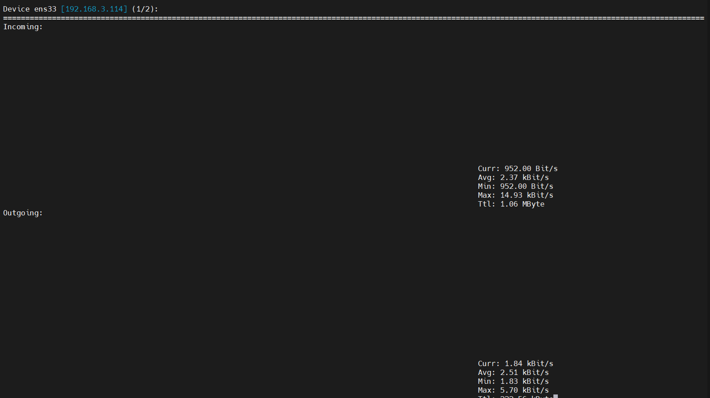
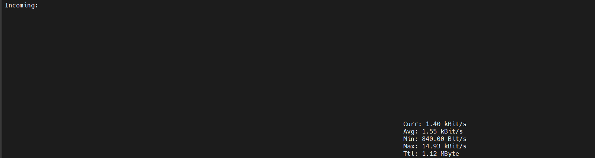
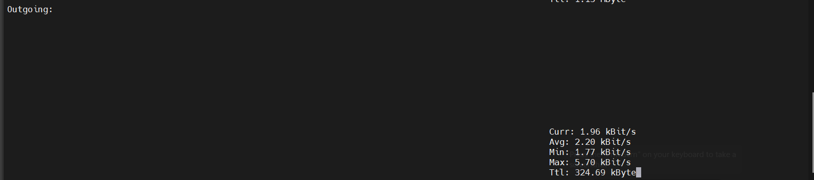

# Lệnh `nload`

## 1. Lệnh `nload` là gì? Dùng để làm gì?

- `nload` nload là công cụ dòng lệnh dùng để giám sát lưu lượng mạng (network traffic) theo thời gian thực.
- Nó hiển thị băng thông tải vào (inbound) và băng thông tải ra (outbound) trên mỗi interface mạng.
- Có biểu đồ trực quan (ASCII), dễ nhìn hơn so với nhiều lệnh khác như `ifstat`, `vnstat`, `ip -s`.

Thích hợp để theo dõi lưu lượng mạng khi upload/download dữ liệu, server web, proxy,...

**Cách cài lệnh top:**

Trên Ubuntu/Debian:

```bash
sudo apt install nload
```

Trên CentOS/RHEL:

```bash
sudo dnf install nload
```

## 2. Cách sử dụng lệnh `nload`

```bash
nload
```



- Mặc định sẽ giám sát interface mạng chính (như eth0, enp0s3, v.v.)

## 3. Kết quả hiển thị của `nload` bao gồm

Giao diện chia làm 2 phần:

### Incoming - dữ liệu tải về (download)



- **Current:** Tốc độ hiện tại.
- **Average:** Tốc độ trung bình.
- **Total:** Tổng dung lượng đã tải về.
- **Minimum/Maximum:** Tốc độ tối thiểu/tối đa.
- **Ttl:** Thời gian đã chạy.

### Outgoing - Dữ liệu gửi đi (upload)



- tương tự Incoming.

## 4. Các options dòng lệnh

| Option | Mô tả |
|---------|-------|
| `-u H` | Hiển thị đơn vị ở dạng dễ đọc (Human-readable), ví dụ: Kbit/s, Mbit/s, Gbit/s |
| `-u b` | Hiển thị đơn vị là bit/s |
| `-u k` | Hiển thị đơn vị là kbit/s |
| `-u m` | Hiển thị đơn vị là Mbit/s |
| `-i <interface>` | Chỉ định interface mạng để theo dõi, ví dụ: `nload -i eth0` |
| `-m` | Bật chế độ chọn interface từ menu danh sách (multi-interface menu) |
| `-t <milliseconds>` | Thiết lập khoảng thời gian cập nhật (refresh rate), đơn vị mili giây (mặc định: 500ms) |
| `-a <seconds>` | Thiết lập khoảng thời gian (tính bằng giây) dùng để tính tốc độ trung bình |
| `-o` | Ẩn phần Outgoing (lưu lượng gửi đi) |
| `-I` | Ẩn phần Incoming (Lưu lượng nhận vào) |
| `-h` hoặc `--help` | Hiển thị trợ giúp |

Ví dụ kết hợp:

```bash
nload -u m -t 1000 -a 30 -i eth0
```

- Đơn vị là Mbit/s.
- refresh mỗi giây (1000ms).
- Tính trung bình trên 30 giây.
- Giám sát `interface eth0`.

## 5. Ví dụ sử dụng thực tế

Giám sát với đơn vị Mbit/s:

```bash
nload -u m
```

Chọn interface từ danh sách:

```bash
nload -m
```

Giám sát interface cụ thể `eth0`:

```bash
nload eth0
```

### 6. Thoát khỏi nload

- Nhấn `Ctrl + C` để thoát khỏi nload.
- Hoặc nhấn `q` để thoát khỏi giao diện nload.
