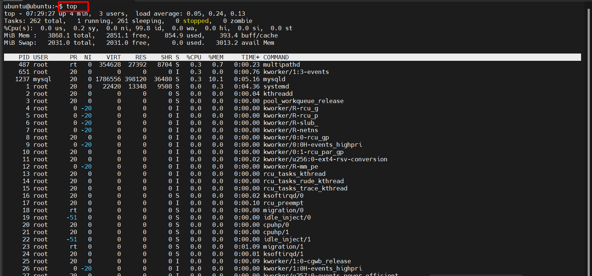

# Lệnh `top`

## 1. Lệnh `top` là gì? Dùng để làm gì?

`top` là một công cụ dòng lệnh dùng để giám sát hiệu suất hệ thống theo thời gian thực. Nó hiển thị các thông tin về:

- CPU, RAM, swap.
- Số tiến trình đang chạy.
- Các tiến trình đang tiêu tốn nhiều tài nguyên nhất.

Giúp quản trị viên nhanh chóng phát hiện quá tải, treo tiến trình hoặc sự cố hệ thống.

## 2. Cách sử dụng lệnh `top`

```bash
top
```

Sau khi chạy, lệnh hiển thị thông tin thời gian thực, cập nhật liên lục (mặc định là 3 giây). Bạn có thể thay đổi thời gian cập nhật bằng cách nhấn phím `d` và nhập số giây mong muốn.



## 3. Ý nghĩa các thông số trong lệnh `top`

### Thông tin hệ thống (phần đầu)

```yaml
top - 14:22:57 up 2 days,  4:37,  2 users,  load average: 0.10, 0.11, 0.12
Tasks: 142 total,   1 running, 141 sleeping,   0 stopped,   0 zombie
%Cpu(s):  2.5 us,  1.3 sy,  0.0 ni, 96.0 id,  0.1 wa,  0.0 hi,  0.1 si,  0.0 st
MiB Mem :   7895.8 total,   1287.3 free,   2456.8 used,   4151.6 buff/cache
MiB Swap:   2048.0 total,   2048.0 free,      0.0 used.   4876.2 avail Mem
```

Thời gian hệ thống:

- `up 2 days, 4:37`: máy chạy liên tục 2 ngày 4 giờ 37 phút.
- `2 users`: có 2 người dùng đang đăng nhập vào hệ thống.
- `load average: 0.10, 0.11, 0.12`: tải trung bình trong 1, 5 và 15 phút qua.

Task:

- `142 total`: tổng số tiến trình đang chạy là 142.
- `1 running`: có 1 tiến trình đang chạy.
- `141 sleeping`: có 141 tiến trình đang ngủ (không hoạt động).
- `0 stopped`: không có tiến trình nào bị dừng lại.
- `0 zombie`: không có tiến trình zombie (tiến trình đã kết thúc nhưng vẫn còn tồn tại trong bảng tiến trình).

%CPU(s):

- `2.5 us`: 2.5% CPU đang được sử dụng cho các tiến trình người dùng.
- `1.3 sy`: 1.3% CPU đang được sử dụng cho các tiến trình hệ thống (kernel).
- `0.0 ni`: 0.0% CPU đang được sử dụng cho các tiến trình ưu tiên thấp (nice).
- `96.0 id`: 96.0% CPU đang nhàn rỗi (idle (rảnh)).
- `0.1 wa`: 0.1% CPU đang chờ vào/ra (I/O wait).
- `0.0 hi`: 0.0% CPU đang xử lý ngắt phần cứng (hardware interrupts).
- `0.1 si`: 0.1% CPU đang xử lý ngắt phần mềm (software interrupts).
- `0.0 st`: 0.0% CPU đang bị đánh cắp bởi máy ảo (steal time - stolen).

MiB Mem - Memory (RAM):

- `7895.8 total`: tổng dung lượng RAM là 7895.8 MiB.
- `1287.3 free`: dung lượng RAM còn trống là 1287.3 MiB.
- `2456.8 used`: dung lượng RAM đang được sử dụng là 2456.8 MiB.
- `4151.6 buff/cache`: dung lượng RAM đang được sử dụng cho bộ đệm và cache là 4151.6 MiB.

MiB Swap:

- `4876.2 avail Mem`: dung lượng RAM khả dụng cho các tiến trình là 4876.2 MiB.
- Khi dùng RAM đầy, truy xuất chậm hơn

### Danh sách các tiến trình (phần dưới)

| Cột | Ý nghĩa |
|-------|---------|
| **PID** | ID của tiến trình |
| **USER** | Tên người dùng sở hữu tiến trình |
| **PR** | Độ ưu tiên của tiến trình |
| **NI** | Giá trị nice của tiến trình (giá trị ưu tiên) |
| **VIRT** | Dung lượng bộ nhớ ảo mà tiến trình đang sử dụng |
| **RES** | Dung lượng bộ nhớ vật lý mà tiến trình đang sử dụng |
| **SHR** | Dung lượng bộ nhớ chia sẻ mà tiến trình đang sử dụng |
| **S** | Trạng thái của tiến trình (R: đang chạy, S: đang ngủ, Z: zombie, T: dừng lại) |
| **%CPU** | Tỷ lệ phần trăm CPU mà tiến trình đang sử dụng |
| **%MEM** | Tỷ lệ phần trăm bộ nhớ mà tiến trình đang sử dụng |
| **TIME+** | Thời gian CPU mà tiến trình đã sử dụng |
| **COMMAND** | Tên lệnh hoặc tiến trình đang chạy |

## 4. Các phím tắt trong lệnh `top`

| Phím tắt | Chức năng |
|---------|----------|
| `P` | Sắp xếp theo %CPU (mặc định) |
| `M` | Sắp xếp theo %MEM |
| `T` | Sắp xếp theo thời gian CPU (TIME+) |
| `h` | Trợ giúp |
| `k` | kill tiến trình (nhập PID của tiến trình) |
| `r` | renice - Thay đổi độ ưu tiên của một tiến trình (nhập PID và giá trị ưu tiên mới) |
| `d` | Thay đổi thời gian cập nhật (nhập số giây) |
| `q` | Thoát khỏi lệnh `top` |

## 5. Các options dòng lệnh của lệnh `top`

```bash
top -d 5          # Refresh mỗi 5 giây
top -u username   # Hiển thị tiến trình của user
top -p <PID>      # Chỉ xem tiến trình có PID cụ thể
```

| Option | Mô tả |
|---------|-------|
| `-d <seconds>` | Đặt thời gian refresh (mặc định là 3 giây) |
| `-u <username>` | Hiển thị tiến trình của người dùng cụ thể |
| `-p <PID>` | Chỉ hiển thị tiến trình với PID cụ thể |
| `-n <number>` | Số lần refresh trước khi thoát |
| `-b` | Chạy trong chế độ batch (không tương tác) |

## 6. Một số lưu ý

- Khi thấy `%wa` (wait I/O) cao, có thể do đĩa cứng chậm hoặc quá tải hoặc tắc nghẽn.
- `%id` (idle) thấp liên tục -> Hệ thống quá tải.
- `zombie` nhiều -> Có thể do ứng dụng không xử lý đúng các tiến trình con.
