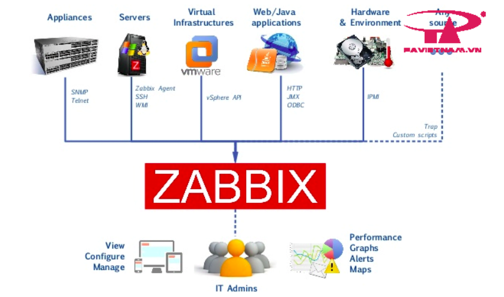
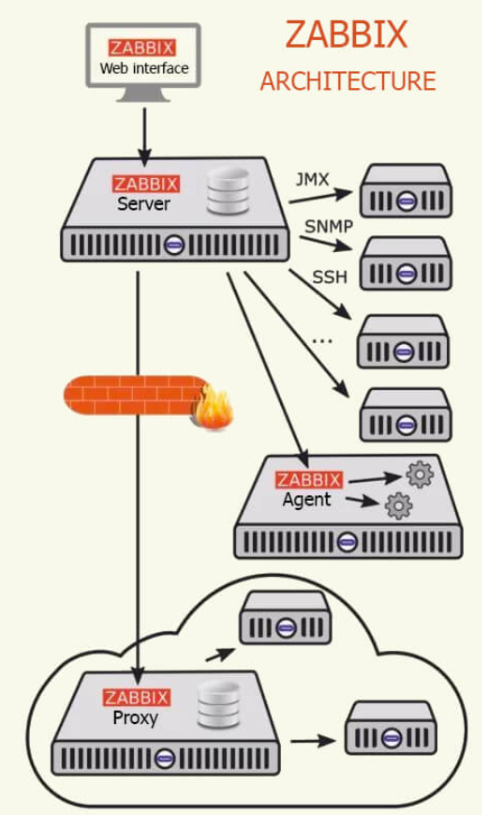
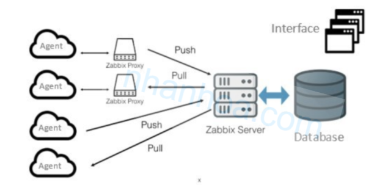
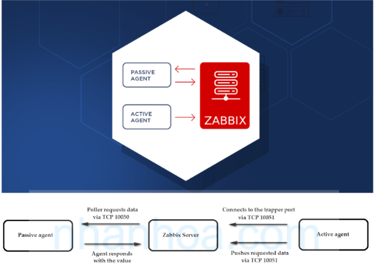
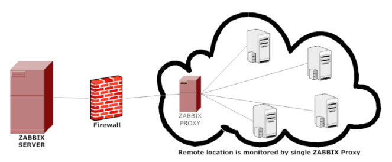
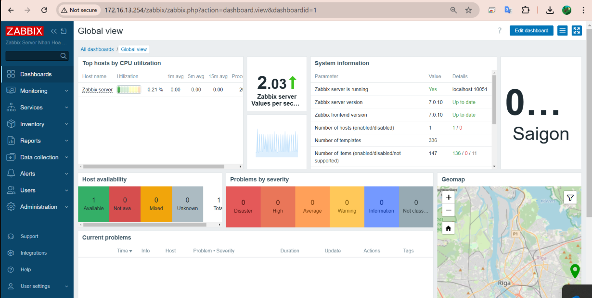
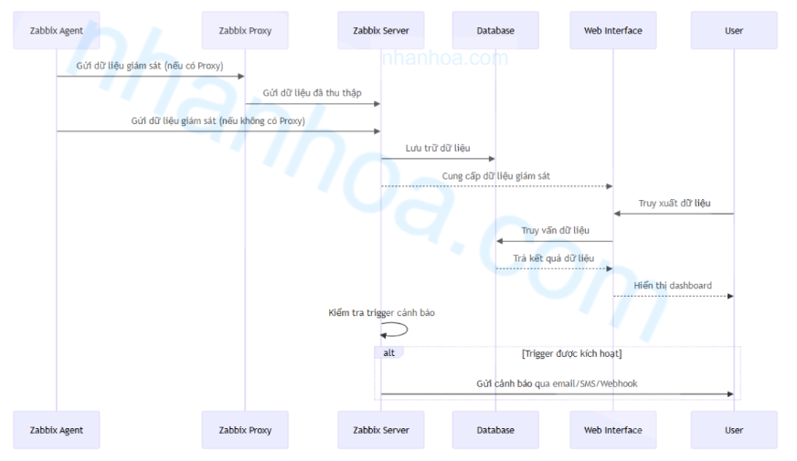

# Tổng quan về Zabbix

## Giới thiệu về Zabbix

### 1. Zabbix là gì?

**Zabbix** là một phần mềm mã nguồn mở dùng để giám sát hệ thống mạng, máy chủ, ứng dụng, dịch vụ và thiết bị trong thời gian thực. Nó là giải pháp giám sát toàn diện hỗ trợ nhiều loại dữ liệu: CPU, RAM, Disk, Network, dịch vụ web, database, log,...

Hoạt động theo mô hình **client-server**:

- **Zabbix Server**: Trung tâm thu thập, xử lý và lưu trữ dữ liệu.
- **Zabbix Agent**: Chạy trên máy cần giám sát để gửi dữ liệu về server.
- **Zabbix Web Interface**: Giao diện web quản lý Zabbix (viết bằng PHP).

Hỗ trợ các cơ chế giám sát: **Pull (Agent-based)**, **Push (Passive/Active checks)**, **SNMP**, **IPMI**, **SSH**, **HTTP**, và **JMX**.

### 2. Thành phần chính của Zabbix

**2.1 Zabbix Server:**

Zabbix Server là thành phần trung tâm trong kiến trúc Zabbix, chịu trách nhiệm quản lý toàn bộ hệ thống giám sát. Các chức năng chính của Zabbix Server bao gồm:

- **Thu thập dữ liệu:** Nhận dữ liệu từ Zabbix Agent, Zabbix Proxy hoặc thu thập trực tiếp từ các nguồn khác.
- **Xử lý dữ liệu:** Phân tích thông tin giám sát, xác định trạng thái của các thiết bị, kiểm tra điều kiện kích hoạt cảnh báo (triggers).
- **Lưu trữ dữ liệu:** Ghi nhận dữ liệu vào cơ sở dữ liệu để phục vụ phân tích và hiển thị.
- **Gửi cảnh báo:** Kích hoạt thông báo qua email, SMS, webhook hoặc tích hợp với hệ thống cảnh báo khác.
- **Tương tác với giao diện Web:** Cung cấp dữ liệu cho người dùng thông qua hệ thống dashboard và báo cáo.
- Zabbix Server có thể được triển khai trên nền tảng Linux, với các dịch vụ nền như Apache/Nginx và PHP hỗ trợ giao diện Web.

**2.2 Zabbix Agent:**

Zabbix Agent là một dịch vụ chạy trên máy chủ hoặc thiết bị cần giám sát, có nhiệm vụ thu thập dữ liệu và gửi về Zabbix Server hoặc Proxy. Agent hoạt động theo hai chế độ:

- **Passive mode:**  Zabbix Server gửi yêu cầu, Agent phản hồi dữ liệu..
- **Active mode:** Agent tự động thu thập dữ liệu và gửi lên Server theo lịch trình định sẵn.

**2.3 Zabbix Proxy:**

Zabbix Proxy là một thành phần trung gian giúp mở rộng và giảm tải cho Zabbix Server. Proxy hoạt động theo cơ chế sau:

- Thu thập dữ liều từ Agent và các nguồn giám sát khác.
- Lưu trữ tạm thời dữ liệu vào cơ sở dữ liệu cục bộ.
- Định kỳ gửi dữ liệu về Zabbix Server để xử lý.

**2.4 Cơ sở dữ liệu (Database):**

Hệ thống Zabbix yêu cầu một cơ sở dữ liệu để lưu trữ thông tin về cấu hình, dữ liệu giám sát và logs. Các hệ quản trị cơ sở dữ liệu được hỗ trợ bao gồm:

- **MySQL/MariaDB**: thông dụng nhất.
- **PostgreSQL**: hỗ trợ nhiều tính năng nâng cao.
- **Oracle** và **IBM DB2**: dành cho doanh nghiệp lớn.

Cơ sở dữ liệu của Zabbix có thể phát triển rất lớn theo thời gian, do đó cần có các phương pháp tối ưu như partitioning, indexing, và housekeeping để đảm bảo hiệu suất.

**2.5 Zabbix Web Interface:**

Giao diện Web của Zabbix cung cấp công cụ quản lý và giám sát trực quan, cho phép người dùng:

- Cấu hình hệ thống, thêm thiết bị giám sát.
- Theo dõi dữ liệu qua đồ thị, bảng biểu, bản đồ mạng.
- Tạo cảnh báo và chính sách phản ứng tự động.
- Quản lý người dùng và phân quyền truy cập.

### 3. Cơ chế hoạt động của Zabbix

1. **Zabbix Agent** thu thập dữ liệu từ máy chủ, thiết bị.
2. **Zabbix Proxy** (nếu có) nhận dữ liệu từ Agent, xử lý sơ bộ và gửi về Zabbix Server.
3. **Zabbix Server** kiểm tra dữ liệu, xác định trạng thái, kiểm tra triggers và database.
4. **Zabbix Web Interface:** truy xuất dữ liệu từ Database để hiển thị cho người dùng.
5. Nếu có điều kiện cảnh báo, Zabbix Server sẽ kích hoạt action như gửi email, SMS.
